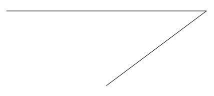
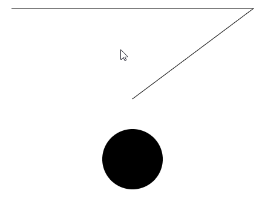

isPointInPath(x,y) 是canvas 2d中的内置方法，它可以判断一个点位是否在路径中。
isPointInPath(x,y) 面向的对象是路径，所以对文字、fillRect()、strokeRect()不好使。
首先，咱们先回顾一下路径的基本概念：
在我们使用canvas 的getContext('2d') 方法获取canvas 上下文对象ctx 的时候， ctx上便挂载了一个空的路径集合。
在ctx.beginPath() 之后，所绘制的所有路径都会被添加到这个路径集合里，isPointInPath(x,y) 方法判断的就是x、y 点是否在这个路径集合的所有路径里。这个路径可以不用画出来，只要路径集合里有路径即可。
注意，在下一次ctx.beginPath() 时，路径集合会被置空。

接下来我们看一下isPointInPath 的使用方法。
我用三个点画了一条折线，没有将其闭合：



```js
const ctx=canvas.getContext('2d');
ctx.beginPath();
ctx.moveTo(50,50);
ctx.lineTo(450,50);
ctx.lineTo(250,200);
console.log(ctx.isPointInPath(250,100)); //true
ctx.stroke();
```

ctx.isPointInPath(250,100) 返回了true，就是点(250,100) 在刚才的3个点围成的闭合路径之中。

简单总结一下：
1.网路径集合中绘制了一条由3 个点组成的折线，未将其闭合（是否闭合无所谓）。
2.检测点(250,100) 是在上面的3 个点围成的图形中的，所以ctx.isPointInPath(250,100) 为true。
3.ctx.isPointInPath(250,100) 方法是在绘图之前执行的，这说明isPointInPath(x,y) 方法的使用并不需要把路径实际画出来。

这时候，大家可能会想，如果我把鼠标点作为检测点，鼠标每次移动都要判断其是否在图形中，是不是每次鼠标移动都要把路径再画一遍？
这个答案要视情况而定：

- 路径集合没有被清空，那鼠标移动时都可以正常检测：

```js
/*绘制图形*/
ctx.beginPath();
ctx.moveTo(50,50);
ctx.lineTo(450,50);
ctx.lineTo(250,200);
ctx.stroke();
/*鼠标移动*/
canvas.addEventListener('mousemove',mousemoveFn);
function mousemoveFn(event){
    const {x,y}=getMousePos(event);
    const bool=ctx.isPointInPath(x,y);
    console.log(bool);
}
/*获取鼠标位置*/
function getMousePos(event){
    const {clientX,clientY}=event;
    const {top,left}=canvas.getBoundingClientRect();
    const x=clientX-left;
    const y=clientY-top;
    return {x,y};
}
```

  可是当我在画完路径后再画点东西时，用beginPath()方法把以前的路径给清空了，画出了一个圆，那我们就无法再对以前的路径进行isPointInPath() 判断了。如：   



```js
/*绘制图形*/
ctx.beginPath();
ctx.moveTo(50,50);
ctx.lineTo(450,50);
ctx.lineTo(250,200);
ctx.stroke();


/*绘制新图形*/
ctx.beginPath();
ctx.arc(250,300,50,0,Math.PI*2);
ctx.fill();

/*鼠标移动*/
canvas.addEventListener('mousemove',mousemoveFn);
function mousemoveFn(event){
    const {x,y}=getMousePos(event);
    const bool=ctx.isPointInPath(x,y);
    console.log(bool);
}
```

这就是后一种情况：
路径集合被清空时，可以把绘制路径的步骤封装到一个方法里，在鼠标移动时，执行此方法，把路径集合先清空，再放入我们需要检测的路径：

```js
/*封装路径的绘制方法：*/
function crtPath(){
    ctx.beginPath();
    ctx.moveTo(50,50);
    ctx.lineTo(450,50);
    ctx.lineTo(250,200);
}
/*绘图*/
crtPath();
ctx.stroke();
/*鼠标移动*/
canvas.addEventListener('mousemove',mousemoveFn);
function mousemoveFn(event){
    const mousePos=getMousePos(event);
    crtPath();
    const bool=ctx.isPointInPath(mousePos.x,mousePos.y);
    console.log(bool);
}
```
到这里，我们就可以做一些简单的图形选择的项目了，但是在面对大一点的项目是，还是建议大家用模块的思想将上面功能模块化。

请看下一章：图形模块化
[源码地址](https://github.com/buglas/interview-01)


