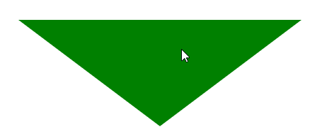
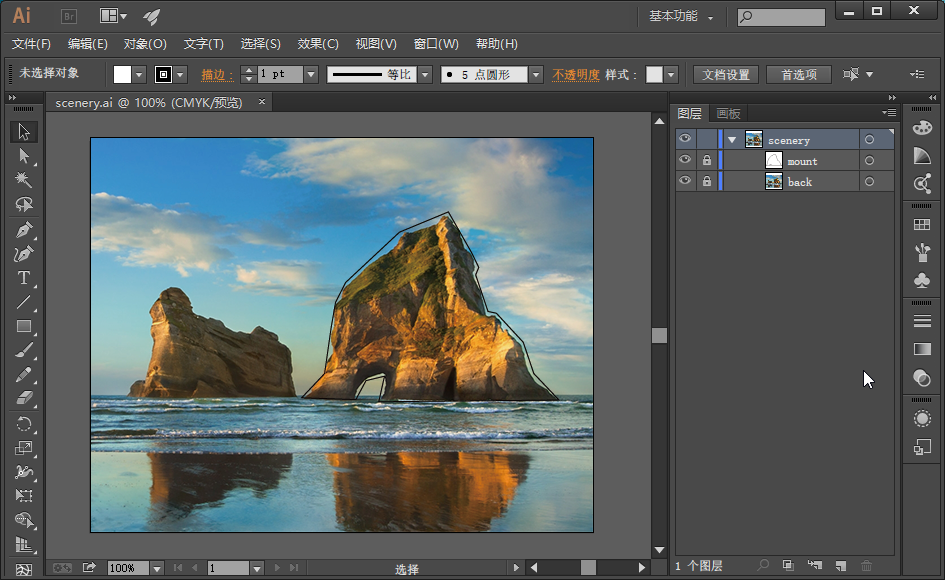
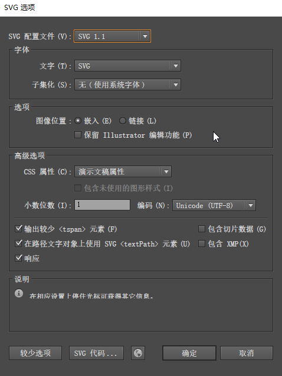
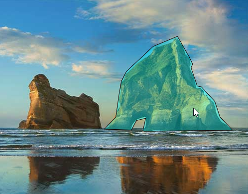

图形选择，是可视化交互中必然会遇到的，它在可视化方面的面试中出现概率是最高的。
我在这里会从两个方向来说，分别是svg和canvas。至于普通DOM 的选择，我就不消多说了。
因为svg 的选择是最简单的，所以咱们先说svg。
svg 的选择方式和普通DOM 的选择方式是一样的。比如画一个三角形，然后为其正常添加鼠标划入划出事件：



```javascript
<svg version="1.1"
     baseProfile="full"
     width="700" height="700"
     xmlns="http://www.w3.org/2000/svg">
    <polygon points="50 50, 450 50, 250 200"/>
</svg>
<script>
    const poly=document.querySelector('polygon');
    poly.addEventListener('mouseover',function(){
        console.log('over');
        poly.setAttribute('fill','green');
    });
    poly.addEventListener('mouseout',function(){
        console.log('out');
        poly.setAttribute('fill','black');
    })
</script>
```


在实际的工作中，我们可能会对复杂图形做出交互选择。就比如图片里有一座酷似大象的山，我们把鼠标划到山上的时候，要做出一些相应的提示。

这个时候，我们可以用Illustrator 来绘制山体轮廓。




在绘制完成后，ctrl+shift+S 另存为svg 文件即可。在另存为的时候，还会弹出svg 配置窗口：




  在上面的窗口里面，我们可以点击“SVG 代码”按钮，查看相应的SVG代码：   

```xml
<?xml version="1.0" encoding="utf-8"?>
<!-- Generator: Adobe Illustrator 18.1.1, SVG Export Plug-In . SVG Version: 6.00 Build 0)  -->
<svg version="1.1" id="scenery" xmlns="http://www.w3.org/2000/svg" xmlns:xlink="http://www.w3.org/1999/xlink" x="0px" y="0px"
     viewBox="0 0 503 395" enable-background="new 0 0 503 395" xml:space="preserve">
<polygon id="mount" fill-rule="evenodd" clip-rule="evenodd" fill="none" stroke="#080102" stroke-miterlimit="10" points="
    211.7,260.8 234.6,236.6 241.2,190.3 245.6,165.2 255.7,145.4 309.5,95.2 358.4,74.9 381.7,115.9 388.8,130.4 385.7,137.9
    398,174.5 406.4,176.2 433.3,205.3 443.8,236.6 468.9,263 288.8,264.8 294.5,239.2 276,243.6 265.9,262.6 "/>
</svg>
```


从SVG代码中可以看出，图层的名称就是SVG 元素的id。

有了SVG 文件之后，我们就需要将其导入HTML 页面里。因为这个文件是用Adobe 的Illustrator 软件生成的，所咱们就用Adobe 官方推荐的方式导入svg 文件：

```xml
<embed id="svg"
       src="./images/scenery.svg"
       width="503"
       height="395"
       type="image/svg+xml"
       pluginspage="http://www.adobe.com/svg/viewer/install/"/>
```


使用<embed> 标签的src 属性引入了svg 文件后，我们就需要为svg 中的元素添加鼠标事件了，这个过程需要考虑两个问题：
1.svg 文件的引入是个异步事件，我们需要将在svg 文件引入成功后在获取svg 中的元素。
2.svg 中的元素中的元素无法直接用当前页面的document 获取，svg 文件有自己的document 对象。

第1个问题，可用为window 或embed 添加onload 事件来解决，如：

```javascript
const embed = document.querySelector('embed');
/*当页面内容加载成功*/
window.onload = function() {
    const dom = embed.getSVGDocument();
    const mount = dom.querySelector('#mount');
    mount.setAttribute('fill','rgba(0,0,0,0)');
    mount.addEventListener('mouseover',function(){
        console.log('over');
        mount.setAttribute('fill','rgba(0,255,255,0.4)')
    });
    mount.addEventListener('mouseout',function(){
        console.log('out');
        mount.setAttribute('fill','rgba(0,0,0,0)')
    })
};
```


第2个问题，要先用embed.getSVGDocument() 方法获取svg 自己的document 对象，然后再使用此document对象获取SVG 中的元素。

完整代码：

```js
<embed id="svg"
       src="./images/scenery.svg"
       width="503"
       height="395"
       type="image/svg+xml"
       pluginspage="http://www.adobe.com/svg/viewer/install/"/>


<script type="module">
    const embed = document.querySelector('embed');
    /*当页面内容加载成功*/
    window.onload = function() {
        const dom = embed.getSVGDocument();
        const mount = dom.querySelector('#mount');
        mount.setAttribute('fill','rgba(0,0,0,0)');
        mount.addEventListener('mouseover',function(){
            console.log('over');
            mount.setAttribute('fill','rgba(0,255,255,0.4)')
        });
        mount.addEventListener('mouseout',function(){
            console.log('out');
            mount.setAttribute('fill','rgba(0,0,0,0)')
        })
    };
</script>
```


页面效果：




svg 绘图时，如果图形数量非常大，其渲染速度就会非常慢，而且它还不适合做图像处理。这时，就需要选择canvas 了。
既然选择canvas，那我们就必须考虑如何选择canvas 中的图形了。
接下来，我具体给大家说两个方法：
- canvas 内置的isPointInPath(x,y) 方法。
- 多边形网格化方法。

[源码地址](https://github.com/buglas/interview-01)


