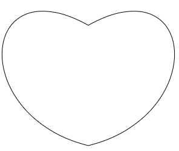

这一章，咱们来说鼠标如何选择变换后的图形。

首先给大家举个栗子：
在2029年末世之战的时候，终结者想干掉人类领袖大壮，可是大壮太强，而且其实力需要复杂运算才能知晓。所以终结者就想回到1997年，在大壮实力弱小、且已知的情况下将其干掉。这样，2029年末世之战中的人类领袖大壮也就不会存在。
接下来给大家解密终结者穿梭时间的方法。
终结者需要知道数据：
1997年大壮的初始属性，比如构成大壮轮廓的顶点集合；
大壮从1997到2029的变换信息，比如其大壮移动了多少、旋转了多少、长大了多少。
根据物质不易法则：物质不变，空间不变；空间不变，时间不变。
将物质不易法则逆推，依旧成立：物质改变，空间改变；空间改变，时间改变。
所以终结者想要回到1997 年，只要根据大壮的变换规则逆向变换自己的位置即可。
比如：
从1997年到2029年，大壮沿x 轴移动了100，沿y 轴移动了200，旋转了90度，变大了2倍。
终结者就要沿x 轴移动了-100，沿y 轴移动-200，旋转-90度，点位到圆心点的距离缩小2倍。
注意：终结者的变换顺序要和大壮的变换顺序一致；终结者改变的只是点位，点没有尺寸，其点位变换本质是基于坐标原点的位移。
当终结者穿梭到1997年的时候，就可以精准定位大壮。


接下来我们就在代码里走一下这个原理：
先画了一颗爱心，其所在的canvas 画布坐标系在x、y方向分别位移了(300,400)

```js
const poly=new Poly({
    position:new Vector2(300,400),
    stroke:true,
    close:true,
    crtPath:function(ctx){
        ctx.beginPath();
        ctx.moveTo(0,0);
        ctx.bezierCurveTo(-200,-50,-180,-300,0,-200);
        ctx.bezierCurveTo(180,-300,200,-50,0,0);
    }
});
poly.draw(ctx);
```



若我的鼠标想要选择这颗爱心，那它的位置就要基于爱心的变换信息反向变换：x、y方向分别位移(-300,-400)。代码如下：

```js
const mousePos=getMousePos(event);
poly.crtPath(ctx);
const [nx,ny]=[
    mousePos.x-poly.position.x,
    mousePos.y-poly.position.y
];
const bool=ctx.isPointInPath(nx,ny);
```

图形变换中的位移说完了，那它的旋转、缩放也是同样道理，就是让鼠标位置基于图形的变换信息反向变换。
下面我直接将所有变换的方法封装到了获取鼠标点位的方法里，即getMousePos(event,poly) ，event是事件，poly 是图形。
代码如下：

```js
const getMousePos=function(event,obj=null){
    //获取鼠标位置
    const {clientX,clientY}=event;
    //获取canvas 边界位置
    const {top,left}=canvas.getBoundingClientRect();
    //计算鼠标在canvas 中的位置
    const x=clientX-left;
    const y=clientY-top;
    const mousePos=new Vector2(x,y);
    if(obj){
        const {position,scale,rotation}=obj;
        mousePos.sub(position);
        mousePos.rotate(-rotation);
        mousePos.divide(scale);
    }
    return mousePos;
};
```

mousePos 是一个Vector2 对象，其中封装了关于向量的常用方法。如：

```js
export default class Vector2{
    constructor(x=0,y=0){
        this.x=x;
        this.y=y;
    }
    //减法
    sub(v){
        this.x -= v.x;
        this.y -= v.y;
        return this;
    }
    //基于原点旋转
    rotate(angle){
        const c = Math.cos( angle ), s = Math.sin( angle );
        const {x,y}=this;
        this.x = x * c - y * s;
        this.y = x * s + y * c;
        return this;
    }
    //向量除法
    divide ( v ) {
       this.x /= v.x;
       this.y /= v.y;
       return this;
    }
    //...
}
```


好啦，关于变换后的图形选择我们就说到这。
其实图形图形选择的方法是有很多的，下一章我再跟大家说一个图形选择的方法：图形选择-网格选择


注：物质不易是我从修仙小说上课看的，没有科学依据，只为辅助大家理解代码。

[源码地址](https://github.com/buglas/interview-01)


