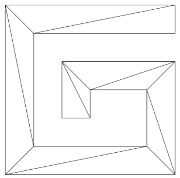
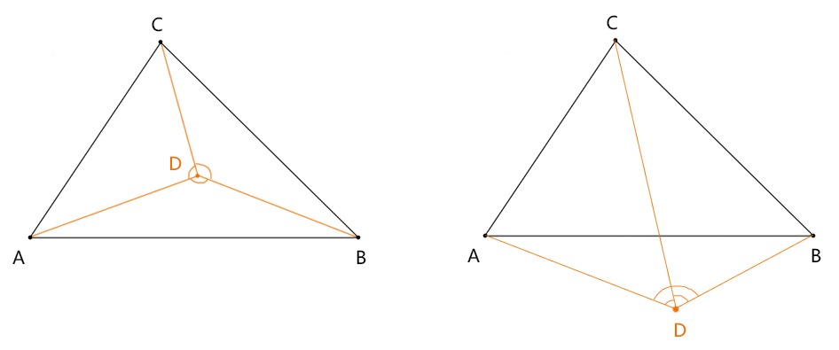
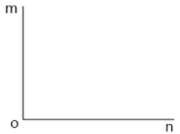
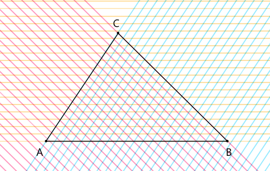

## 网格选择的基本概念

网格选择，顾名思义，就是把多边形变成网格后选择（此方法只适用于多边形，若是曲线，我们就得将其分段）。



这样，网格选择就分成了两步：
1.将多边形分解为多个三角形。
2.判断鼠标点是否在三角形中。

我们先从最基础的判断鼠标点是否在三角形中开始说。


## 判断点在三角形中的方法

判断坐标点在三角形中的方法，我在这里给大家说两种：

1. 用三角形的内角和等于360°判断。
2. 用二元一次不等式组判断。

咱们先说第一种：

### 一，用三角形的内角和等于360°，判断坐标点是否在三角形中




1.思路

已知▲ABC 和坐标点D

- 点D 在▲ABC 中时：∠ADB+∠BDC+∠CDA=360°
- 点D 不在▲ABC 中时：∠ADB+∠BDC+∠CDA<360°

2.求夹角

例：已知三个点m、o、n，求∠mon 的弧度




先用三个点画出一个夹角

```js
const [m,o,n]=[
    new Vector2(300,50),
    new Vector2(500,200),
    new Vector2(300,200),
];

const poly=new Poly({
    stroke:true,
    vertices:[m,o,n]
});
poly.draw(ctx);
```

把∠mon 的顶点o 归零：

```js
m.x-=o.x;
m.y-=o.y;
n.x-=o.x;
n.y-=o.y;
```

根据点积公式，计算∠mon 的余弦值   

```js
const dot=(m.x*n.x+m.y*n.y);
const len=Math.sqrt(m.x*m.x+m.y*m.y)*Math.sqrt(n.x*n.x+n.y*n.y);
const cosTheta=dot/len;
```

根据反余弦方法acos() 求∠mon

```js
const theta=Math.acos(cosTheta);
```

Math.acos() 可以自动把根据余弦取得的弧度限制在[0,Math.PI]之内。

如果我们使用Math.atan2(y,x)，会得到基于x 轴正方向的弧度，而且y 值为负的时候，atan2(y,x) 的值也是负数，这是不适合夹角求和的。

至于这里面涉及的点积公式，这是个纯数学的知识，大家先知道其用法即可，我们后面得为它再起一章：图形选择-点积公式。

我们知道了一个夹角的求法之后，那就可以去求∠ADB+∠BDC+∠CDA 的夹角和了。其和若小于360°，那就在三角之外，否则在三角之中。

我把这样的方法封装在了Vector2d 类里：

```js
inTriangle([p0,p1,p2]){
    const [a0,a1,a2]=[
        p0.includedAngleTo(this,p1),
        p1.includedAngleTo(this,p2),
        p2.includedAngleTo(this,p0),
    ];
    const sum=a0+a1+a2;
    return Math.PI*2-sum<=0.01;
}
```

注：0.01 是一个用于容差的数。电脑对浮点数的运算不是绝对精确的，所以我没有直接用Math.PI*2===sum来做判断，而且是让鼠标点只要靠近了三角形一定范围，就算选择上了。

p1.includedAngleTo(p2,p3) 是求∠p1p2p3 的方法：

```js
includedAngleTo(v1,v2){
    const [s1,s2]=[
        this.clone().sub(v1),
        v2.clone().sub(v1),
    ];
    return s1.includedAngle(s2);
}
```

p1.includedAngle(p2) 求的是角的顶点归零后夹角

```js
includedAngle(v){
    return  Math.acos(this.clone().dot(v) / (this.length() * v.length()));
}
```

dot() 就是点积方法

```js
dot( v ) {
    return this.x * v.x + this.y * v.y ;
}
```

length() 是求向量长度的方法

```js
length() {
    return Math.sqrt( this.x * this.x + this.y * this.y );
}
```

inTriangle() 的使用方法：

```js
const poly=new Poly({
    stroke:true,
    close:true,
    vertices:[
        new Vector2(50,50),
        new Vector2(250,200),
        new Vector2(450,50),
    ]
});
poly.draw(ctx);


const p=new Vector2(150,100);
ctx.beginPath();
ctx.arc(p.x,p.y,3,0,Math.PI*2);
ctx.fill();
const bool=inTriangle(poly.vertices);
console.log(bool);
```

若上面的bool为true，那就说明点在三角形中。


### 二，用二元一次不等式，判断坐标点是否在三角形中

由二元一次不等式组的性质可知：

- 三角形的每条边就是一条二元一次不等式的基线。

- 三角形是其所有边所对应的二元一次不等式图像的交集。

- 若三角形是顺时针绘制的，其每条边在三角形一侧的开半图像的符号为负。

- 若三角形是逆时针绘制的，其每条边在三角形一侧的开半图像的符号为正。

由此原理，我们可以判断一个坐标点是否在三角形中。

只要这个坐标点在三角形所有边所对应的开半平面的交集中即可。如下图：




比如，我在Vector2 类里写入了一个inTriangle2() 方法，用于判断当前点是否在三角形中。

```js
inTriangle2(points){
    let inPoly=true;
    for(let i=0;i<3;i++){
        const i2=(i+1)%3;
        const [pointStart,pointEnd]=[
            points[i],
            points[i2],
        ];
        const vector=pointEnd.clone().sub(pointStart);
        const pr=this.clone().sub(pointStart);
        const num=vector.y*pr.x-vector.x*pr.y;
        if(num>0){
            inPoly=false;
            break
        }
        const {x,y}=vector;
    }
    return inPoly;
}
```

1. points 形参是三角形三个Vector2 类型的顶点的集合。
2. 依次判断坐标点是否在三角形的每条边所对应的不等式图像中。
3. vector 是获取每条边的向量，其目的是获取直线一般式中的a和b，同时约去截距c。

直线的一般式是：

```js
ax+by+c=0 
```

其中的a、b和向量的对应关系是：

```js
a=vector.y
b=-vector.x
```

所以，当前边所对应的直线的一般式就是：

```js
vector.y*x-vector.x*y+c=0 
```

4. pr 是获取当前坐标点相对于三角边的起点的位置，这其实也是一个约去截距c 的向量，如此方可将其代入直线一般式的x、y中做运算。
5. 将pr中的坐标点代入直线的一般式的x、y中做计算，对计算结果的符号做判断：
   - 小于0：坐标点在当前边对应的不等式图像中
   - 等于0：坐标点正好再边上
   - 大于0：坐标带在不等式图像外


关于判断判断点位是否在三角形中的方法我们就说到这，下一章我们来说如何将多边形网格化。

[源码地址](https://github.com/buglas/interview-01)

