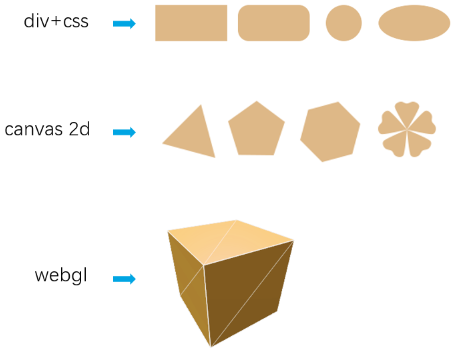
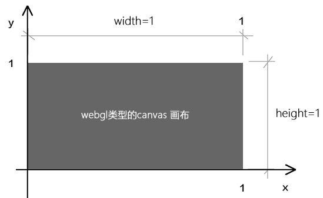

## 前言


### 课前准备  

1. 安装webstorm 或vscode 开发工具。
2. 安装live-server，用于启服务，安装方法 npm i -g live-server
3. 需掌握es6、html、css 的基础知识。
4. 数学基础，要熟悉高数中的三角函数和向量。


### 课堂目标  

1. 对webgl 的概念有一个整体认知
2. 掌握webgl 基本绘图原理和流程


### 知识点  

1. webgl 概述
2. webgl 最短教程 - 在画布上刷底色
3. webgl 最简单图形 - 画一个点


## 第一章 webgl概述


### 1-webgl是什么？

webgl 是在网页上绘制和渲染三维图形的技术，可以让用户与其进行交互。

我们之前学过的div+css、canvas 2d 都是专注于二维图形的，它们虽然也能模拟一部分三维效果，但它们和webgl 比起来，那就是玩具枪和AK47的差别。




### 2-为什么要学习webgl ?

从市场需求而言，webgl的需求量会越来越大的。比如：5G的出现，加速了图像和模型数据的传输；webRTC 技术让canvas 的图像处理功能拥有了更广阔的应用空间。

webgl 的市场应用范围也是很广的，比如：数据可视化、h5 游戏开发、智慧城市、线上家居定制和展示、工业模型720度展示和交互、VR……


## 第二章 webgl 最短教程

接下来咱们说一个在webgl 画布上刷底色的简单栗子。


### 1-刷底色的基本步骤

1.在html中建立canvas 画布

```html
<canvas id="canvas"></canvas>
```

2.在js中获取canvas画布

```js
const canvas=document.getElementById('canvas’);
```

3.使用canvas 获取webgl 绘图上下文

```js
const gl=canvas.getContext('webgl’);
```

4.指定将要用来清空绘图区的颜色

```js
gl.clearColor(0.0,0.0,0.0,1.0);
```

5.使用之前指定的颜色，清空绘图区

```js
gl.clear(gl.COLOR_BUFFER_BIT);
```

整体代码

```html
<canvas id="canvas"></canvas>
<script>
    const canvas=document.getElementById('canvas');
    canvas.width=window.innerWidth;
    canvas.height=window.innerHeight;
    const gl=canvas.getContext('webgl');
    gl.clearColor(0,0,0,1);
    gl.clear(gl.COLOR_BUFFER_BIT);
</script>
```


canvas 画布的建立和获取，和canvas 2d是一样的，只不过，一旦我们使用canvas.getContext()方法获取了webgl 类型的上下文对象，那这张画布就不再是以前的canvas 2d 画布，当然它也不会变成三维的，因为我们的电脑屏幕始终是平的。那这张画布有什么不一样了呢？它的坐标系变了。


### 2-webgl 画布的坐标系

canvas 2d 画布和webgl 画布使用的坐标系都是二维直角坐标系，只不过它们y 轴的坐标方向不一样了，坐标基底也不一样了。

canvas 2d 的坐标方向是x轴

canvas 2d 的画布坐标基底中的两个分量分别是一个像素的宽和一个像素的高，即1个单位的宽便是1个像素的宽，1个单位的高便是一个像素的高。

如下图，下图两个方块表示两个像素：


webgl类型的画布的坐标基底中的两个分量分别是canvas的宽和canvas的高，即1个单位的宽便是1个canvas的宽，1个单位的高便是一个canvas的高。如下图：




关于画布的知识我们就说到这，接下来咱们再说一下之前填充给画布的颜色。


### 3-webgl中的颜色

gl.clearColor(0.0,0.0,0.0,1.0) 中的四个参数分别代表r、g、b、a，其取值范围都是(0,1)，其类型是浮点数。

webgl 中rgba 颜色的比值，就是一个十进制颜色和255的比值，也是一个16进制颜色和0xff的比值。

举个栗子：不透明的红色在css里的写法是'rgba(255,0,0,1)'，那么在webgl里若要使用这种颜色，就得换算一下：

```js
const r=255/255;
const g=0/255;
const b=0/255;
const a=1/1;
gl.clearColor(r,g,b,a);
```


关于webgl 最短的教程我们就说到这，接下来咱们开始画一个最简单的图形。


## 第三章 webgl 最简单的图形 

点是最简单的形状，是几何图形最基本的组成部分。接下来咱们就说一下在webgl 画布上如何画一个点。

首先咱们先说一下绘图的基本步骤。


### 1-绘图的基本步骤  

1. 找一张画布。

2. 找一支画笔。

3. 开始画画。

   

   

   

这三步是从现实生活中抽离出来的普遍规律，这在哪里都是适用的。

canvas 2d 的绘图逻辑就是这样的。首先要有canvas 画布，然后通过canvas 画布的getContext('2d') 方法获取一支二维画笔，然后直接在画布上画画。就像这样：

```js
//canvas画布
const canvas=document.getElementById('canvas');
//二维画笔
const ctx=canvas.getContext('2d');
//设置画笔的颜色
ctx.fillStyle='red';
//用画笔画一个矩形
ctx.fillRect(20,20,300,200);
```

webgl 的绘图逻辑亦是如此，只不过它更像电脑绘画，其绘画的步骤里还多了一层介质。

这层介质就是手绘板，就像这样：

1. 找一台电脑。
2. 找一块手绘板。
3. 找一支触控笔。
4. 开始画画。


接下来，咱们就详细说一下canvas 2d 画图和webgl 画图的差异。


### 2-canvas 2d和webgl绘图的差异

在webgl里绘图，或许你会觉得也可以像canvas 2d那样，就像下面这样写：

```js
//canvas画布
const canvas=document.getElementById('canvas');
//三维画笔
const ctx=canvas.getContext('webgl');
//设置画笔的颜色
ctx.fillStyle='red';
//用画笔画一个立方体
ctx.fillBox(20,20,300,200);
```

然而，实际上，webgl 的绘图逻辑和canvas 2d 的绘图逻辑还有一个本质的差别。

大家在学习html 的时候应该知道，浏览器有三大线程： js 引擎线程、GUI 渲染线程、浏览器事件触发线程。

其中GUI 渲染线程就是用于渲图的，在这个渲染线程里，有负责不同渲染工作的工人。比如有负责渲染HTML+css的工人，有负责渲染二维图形的工人，有负责渲染三维图形的工人。

渲染二维图形的工人和渲染三维图形的工人不是一个国家的，他们说的语言不一样。

渲染二维图形的工人说的是js语言。

渲染三维图形的工人说的是GLSL ES 语言。

而我们在做web项目时，业务逻辑、交互操作都是用js 写的。

我们在用js 绘制canvas 2d 图形的时候，渲染二维图形的工人认识js 语言，所以它可以正常渲图。

但我们在用js 绘制webgl图形时，渲染三维图形的工人就不认识这个js 语言了，因为它只认识GLSL ES 语言。

因此，这个时候我们就需要找人翻译翻译什么叫惊喜。

这个做翻译的人是谁呢，它就是我们之前提到过的手绘板，它在webgl 里叫“着色程序对象”。

接下来咱们从手绘板的绘图步骤中捋一下webgl 的绘图思路。


### 3-webgl 的绘图思路

1. 找一台电脑 - 浏览器里内置的webgl 渲染引擎，负责渲染webgl 图形，只认GLSL ES语言。
2. 找一块手绘板 - 着色程序对象，承载GLSL ES语言，翻译GLSL ES语言和js语言，使两者可以相互通信。
3. 找一支触控笔 - 通过canvas 获取的webgl 类型的上下文对象，可以向手绘板传递绘图命令，并接收手绘板的状态信息。
4. 开始画画 - 通过webgl 类型的上下文对象，用js 画画。

在上面的思路中，大家对其中的一些名词可能还没有太深的概念，比如着色程序对象。接下来咱们就详细说一下webgl 实际的绘图步骤。


### 4-webgl 的绘图步骤

1.在html中建立canvas 画布

```js
<canvas id="canvas"></canvas>
```

2.在js中获取canvas画布

```js
const canvas=document.getElementById('canvas');
```

3.使用canvas 获取webgl 绘图上下文

```js
const gl=canvas.getContext('webgl');
```

4.在script中建立顶点着色器和片元着色器

```java
<script id="vertexShader" type="x-shader/x-vertex">
    void main() {
        gl_Position = vec4(0.0, 0.0, 0.0, 1.0);
        gl_PointSize = 100.0;
    }
</script>
<script id="fragmentShader" type="x-shader/x-fragment">
    void main() {
        gl_FragColor = vec4(1.0, 1.0, 0.0, 1.0);
    }
</script>
```

5.在js中获取顶点着色器和片元着色器

```js
const VSHADER_SOURCE = document.getElementById('vertexShader').innerText;
const FSHADER_SOURCE = document.getElementById('fragmentShader').innerText;
```

6.初始化着色器

```js
initShaders(gl, VSHADER_SOURCE, FSHADER_SOURCE);
```

7.指定将要用来清空绘图区的颜色

```js
gl.clearColor(0,0,0,1);
```

8.使用之前指定的颜色，清空绘图区

```js
gl.clear(gl.COLOR_BUFFER_BIT);
```

9.绘制顶点

```js
gl.drawArrays(gl.POINTS, 0, 1);
```

整体代码

```js
<canvas id="canvas"></canvas>
<!-- 顶点着色器 -->
<script id="vertexShader" type="x-shader/x-vertex">
    void main() {
        gl_Position = vec4(0.0, 0.0, 0.0, 1.0);
        gl_PointSize = 100.0;
    }
</script>
<!-- 片元着色器 -->
<script id="fragmentShader" type="x-shader/x-fragment">
    void main() {
        gl_FragColor = vec4(1.0, 1.0, 0.0, 1.0);
    }
</script>
<script>
    // canvas 画布
    const canvas = document.getElementById('canvas');
    canvas.width=window.innerWidth;
    canvas.height=window.innerHeight;
    // webgl画笔
    const gl = canvas.getContext('webgl');
    // 顶点着色器
    const VSHADER_SOURCE = document.getElementById('vertexShader').innerText;
    // 片元着色器
    const FSHADER_SOURCE = document.getElementById('fragmentShader').innerText;
    // 初始化着色器
    initShaders(gl, VSHADER_SOURCE, FSHADER_SOURCE);
    // 指定将要用来清理绘图区的颜色
    gl.clearColor(0.0, 0.0, 0.0, 1.0);
    // 清理绘图区
    gl.clear(gl.COLOR_BUFFER_BIT);
    // 绘制顶点
    gl.drawArrays(gl.POINTS, 0, 1);


    function initShaders(gl, vshader, fshader) {
        //获取着色程序对象
        const program = createProgram(gl, vshader, fshader);
        //让上下文对象连接着色器程序对象
        gl.linkProgram(shaderProgram);
        //让上下文对象使用着色程序对象
        gl.useProgram(program);
        //将着色程序对象挂到上下文对象上
        gl.program = program;
        return true;
    }
    function createProgram(gl, vsSource, fsSource) {
        //建立着色对象
        const vertexShader = loadShader(gl, gl.VERTEX_SHADER, vsSource);
        const fragmentShader = loadShader(gl, gl.FRAGMENT_SHADER, fsSource);
        //创建着色器程序对象
        const shaderProgram = gl.createProgram();
        //把顶点着色对象装进着色程序对象中
        gl.attachShader(shaderProgram, vertexShader);
        //把片元着色对象装进着色程序对象中
        gl.attachShader(shaderProgram, fragmentShader);
        //返回着色器程序对象
        return shaderProgram;
    }

    function loadShader(gl, type, source) {
        //根据着色类型，建立着色对象
        const shader = gl.createShader(type);
        //将着色器的函数体传入着色对象中
        gl.shaderSource(shader, source);
        //编译着色对象
        gl.compileShader(shader);
        //返回着色对象
        return shader;
    }
</script>
```


对于上面的步骤1、2、3，大家应该都比较好理解，接下来咱们详细说一下第4 步，在script 里用GLSL ES语言写着色器。


### 5-着色器

#### 5-1-着色器的概念

webgl 绘图需要两种着色器：

- 顶点着色器（Vertex shader）：描述顶点的特征，如位置、颜色等。
- 片元着色器（Fragment shader）：进行逐片元处理，如光照。

看了这两个名词的解释，我想很多初学者会是懵逼的。

我给大家翻译翻译：

补间动画大家知道不？顶点着色器里的顶点就是补间动画里的关键帧，片元着色器里的片元就是关键帧之间以某种算法算出的插值。当然，咱们webgl里的片元是像素的意思。

再给大家举一个更简单、更贴切的例子：

两点决定一条直线大家知道不？顶点着色器里的顶点就是决定这一条直线的两个点，片元着色器里的片元就是把直线画到画布上后，这两个点之间构成直线的每个像素。

关于概念咱们就说到这，接下来咱们说程序。

#### 5-2-着色器程序

webgl 有两种着色程序，都要用GLSL ES语言来写：

- 顶点着色程序，要写在type=“x-shader/x-vertex” 的script中。

```js
<script id="vertexShader" type="x-shader/x-vertex">
    void main() {
        gl_Position = vec4(0.0, 0.0, 0.0, 1.0);
        gl_PointSize = 100.0;
    }
</script>
```

- 片元着色程序，要写在type=“x-shader/x-fragment” 的script中。

```js
<script id="fragmentShader" type="x-shader/x-fragment">
    void main() {
        gl_FragColor = vec4(1.0, 1.0, 0.0, 1.0);
    }
</script>
```


void main() {…… } 是主数体。

在顶点着色器中，gl_Position 是顶点的位置，gl_PointSize 是顶点的尺寸。

在片元着色器中，gl_FragColor 是片元的颜色。

至于GLSL ES语言的其它知识，咱们会在后面另开一篇详解，这里先以入门为主。

在第6步中，我们使用了一个自定义的方法initShaders() ，这是用于初始化着色器的，接下来咱们详细说一下。


### 6-着色器初始化  

初始化着色器的步骤：

1. 建立着色器程序对象，目前这只是一个手绘板的外壳。

   ```js
   const shaderProgram = gl.createProgram();
   ```

   

2. 建立顶点着色器对象和片元着色器对象，这是手绘板里用于接收触控笔信号的零部件，二者可以分工合作，把触控笔的压感（js信号）解析为计算机语言(GLSL ES)，然后让计算机(浏览器的webgl 渲染引擎)识别显示。

   ```js
   const vertexShader = loadShader(gl, gl.VERTEX_SHADER, vsSource);
   const fragmentShader = loadShader(gl, gl.FRAGMENT_SHADER, fsSource);
   ```

   

3. 将顶点着色器对象和片元着色器对象装进着色程序对象中，这就完成的手绘板的拼装。

   ```js
   gl.attachShader(shaderProgram, vertexShader);
   gl.attachShader(shaderProgram, fragmentShader);
   ```

   

4. 连接webgl 上下文对象和着色器程序对象，就像连接触控笔和手绘板一样（触控笔里有传感器，可以向手绘板发送信号）。

   ```
   gl.linkProgram(shaderProgram);
   ```

   

5. 启动着色程序对象，就像按下了手绘板的启动按钮，使其开始工作。

   ```
   gl.useProgram(program);
   ```

   

上面第二步中的建立着色对象方法loadShader()，是一个自定义的方法，其参数是(webgl上下文对象，着色器类型，着色器源文件)，gl.VERTEX_SHADER 是顶点着色器类型，gl.FRAGMENT_SHADER是片元着色器类型。

```js
function loadShader(gl, type, source) {
    const shader = gl.createShader(type);
    gl.shaderSource(shader, source);
    gl.compileShader(shader);
    return shader;
}
```

- gl.createShader(type) ：根据着色器类型建立着色器对象的方法。
- gl.shaderSource(shader, source)：将着色器源文件传入着色器对象中，这里的着色器源文件就是我们之前在script 里用GLSL ES写的着色程序。
- gl.compileShader(shader)：编译着色器对象。


## 总结

综上所述，webgl 绘图好麻烦啊！

麻烦不是不学的理由，因为后面还有three.js 为你排忧解难。

那我们为啥不直接学习three.js 呢？

那是因为three.js 若是只想画个旋转的立方体还好，若是要深入学习，实现复杂的模型交互逻辑，就必须要有webgl 基础了。

这一篇，我们讲了webgl 的基本概念，走了一遍webgl 绘图的基本过程，让大家对webgl 的绘图原理有了一个基本认知。

下一篇，我们将说一下js 如何向着色器发号施令，实现一个鼠标控制顶点位置的案例。


