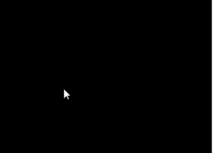
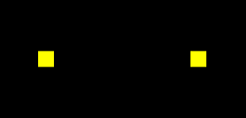
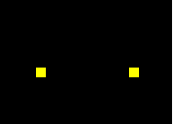
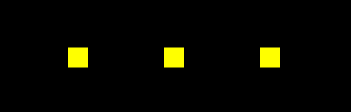

## 前言


### 课堂目标  

1. 使用js向着色器传递数据
2. 获取鼠标在canvas 中的webgl 坐标系位置


### 知识点  

1. attribute 变量
2. gl.vertextAttribute3f() 的同族函数
3. 鼠标在canvas 中的css 位置转webgl 坐标位
4. uniform 变量
5. gl.uniform4f() 的同族函数


## 第一章 用js控制一个点的位置


### 1-attribute 变量的概念。

回顾一下我们上一篇中点的定位：

```js
gl_Position = vec4(0.0, 0.0, 0.0, 1.0);
```

这是一种将数据写死了的硬编码，缺乏可扩展性。

我们要让这个点位可以动态改变，那就得把它变成attribute变量，就像js 里那样。

attribute 变量是一种GLSL ES 变量，只有顶点着色器才能使用它。

js 可以通过attribute 变量向顶点着色器传递与顶点相关的数据。


### 2-js向attribute 变量传参的步骤

1. 在顶点着色器中声明attribute 变量。

```js
<script id="vertexShader" type="x-shader/x-vertex">
    attribute vec4 a_Position;
    void main(){
        gl_Position = a_Position;
        gl_PointSize = 50.0;
    }
</script>
```


2. 在js中获取attribute 变量

```js
const a_Position=gl.getAttribLocation(gl.program,'a_Position');
```


3.   修改attribute 变量  

```js
gl.vertexAttrib3f(a_Position,0.0,0.5,0.0);
```


整体代码

```js
<canvas id="canvas"></canvas>
<script id="vertexShader" type="x-shader/x-vertex">
    attribute vec4 a_Position;
    void main(){
        gl_Position = a_Position;
        gl_PointSize = 50.0;
    }
</script>
<script id="fragmentShader" type="x-shader/x-fragment">
    void main() {
        gl_FragColor = vec4(1.0, 1.0, 0.0, 1.0);
    }
</script>
<script type="module">
    import {initShaders} from '../jsm/Utils.js';

    const canvas = document.getElementById('canvas');
    canvas.width=window.innerWidth;
    canvas.height=window.innerHeight;
    const gl = canvas.getContext('webgl');
    const vsSource = document.getElementById('vertexShader').innerText;
    const fsSource = document.getElementById('fragmentShader').innerText;
    initShaders(gl, vsSource, fsSource);
    const a_Position=gl.getAttribLocation(gl.program,'a_Position');
    gl.vertexAttrib3f(a_Position,0.0,0.0,0.0);
    gl.clearColor(0.0, 0.0, 0.0, 1.0);
    gl.clear(gl.COLOR_BUFFER_BIT);
    gl.drawArrays(gl.POINTS, 0, 1);
</script>
```


上面的代码大家看了应该是懵的，这里我是先给大家亮一下剑，接下来再做详细解释。


### 3-js向attribute 变量传参的原理

#### 3-1-着色器中的attribute 变量

我们上面第一步中用GLSL ES写的顶点着色器源文件，是直接面浏览器里的webgl 渲染引擎的。

```js
attribute vec4 a_Position;
void main(){
    gl_Position = a_Position;
    gl_PointSize = 50.0;
}
```

- attribute 是存储限定符，是专门用于向外部暴露全局变量，这类似于我们在js 的闭包里用window 暴露全局变量。
- vec4 是变量类型，vec4是4维矢量对象。
- a_Position 是变量名，是着色器向外面暴露的对象，这就像echarts.js 向全局暴露出 echarts对象一样。

a_Position 是一个attribute 变量，它是着色器向外面暴露的对象，这就像echarts.js 向全局暴露出 echarts对象一样。

attribute 变量就像我们js 里的Object 对象一样，其变量名是一个指针，这个指针指向实际数据的存储位置。

也是说，我们如果在着色器外部改变了a_Position所指向的实际数据，那么在用着色器绘图时，其读取的a_Position 数据就是刚才修改过的数据

接下来，咱们说一下在js 里如何获取attribute 变量。


#### 3-2-在js中获取attribute 变量

我们在js 里不能直接写a_Position 来获取着色器中的变量。

因为着色器和js 是两个不同的语种，着色器无法通过window.a_Position 原理向全局暴露变量。

那我们要向在js 里获取着色器暴露的变量，就需要找人来翻译，这个人就是程序对象。

```js
const a_Position=gl.getAttribLocation(gl.program,'a_Position');
```

- gl 是webgl 的上下文对象。
- gl.getAttribLocation() 是获取着色器中attribute 变量的方法。
- getAttribLocation() 方法的参数中：
  - gl.program 是初始化着色器时，在上下文对象上挂载的程序对象。
  - 'a_Position' 是着色器暴露出的变量名。

这个过程翻译过来就是：gl 上下文对象对program 程序对象说，你去顶点着色器里找一个名叫'a_Position'  的attribute变量。

现在a_Position变量有了，接下来就可以对它赋值了。


#### 3-3-在js中修改attribute 变量

attribute 变量即使在js中获取了，他也是一个外国人，他不认识js 语言，所以我们不能用js 的语法来修改attribute 变量的值：

```js
a_Position.a=1.0
```

们得用特定的方法改变a_Position的值：

```js
gl.vertexAttrib3f(a_Position,0.0,0.5,0.0);
```

- gl.vertexAttrib3f() 是改变变量值的方法。

- gl.vertexAttrib3f() 方法的参数中：

  - a_Position 就是咱们之前获取的着色器变量。

  - 后面的3个参数时顶点的x、y、z位置

    

a_Position被修改后，我们就可以使用上下文对象绘制最新的点位了。

```js
gl.clearColor(0.0, 0.0, 0.0, 1.0);
gl.clear(gl.COLOR_BUFFER_BIT);
gl.drawArrays(gl.POINTS, 0, 1);
```


### 4-扩展

#### 4-1-vertexAttrib3f()的同族函数

gl.vertexAttrib3f(location,v0,v1,v2) 方法是一系列修改着色器中的attribute 变量的方法之一，它还有许多同族方法，如：

```js
gl.vertexAttrib1f(location,v0) 
gl.vertexAttrib2f(location,v0,v1)
gl.vertexAttrib3f(location,v0,v1,v2,v3)
```

它们都可以改变attribute 变量的前n 个值。

比如 vertexAttrib1f() 方法自定一个矢量对象的v0值，v1、v2 则默认为0.0，v3默认为1.0，其数值类型为float 浮点型。


#### 4-2-GLSL ES 函数的命名规律

GLSL ES里函数的命名结构是：<基础函数名><参数个数><参数类型>

以vertexAttrib3f(location,v0,v1,v2,v3) 为例：

- vertexAttrib：基础函数名
- 3：参数个数，这里的参数个数是要传给变量的参数个数，而不是当前函数的参数个数
- f：参数类型，f 代表float 浮点类型，除此之外还有i 代表整型，v代表数字……


关于用js 控制点位的方法咱们就说到这，接下咱们说一个用鼠标控制点位的例子。


## 第二章 用鼠标控制点位

我们要用鼠标控制一个点的位置，首先要知道鼠标点在webgl 坐标系中的位置，这样才能让一个点出现在我们鼠标点击的位置。

接下来咱们就说一下如何获取鼠标点在webgl 坐标系中的位置。

### 1-获取鼠标点在webgl 坐标系中的位置

对于鼠标点在webgl 坐标系中的位置，我们是无法直接获取的。所以我们得先获取鼠标在canvas 这个DOM元素中的位置。

#### 1-1-获取鼠标在canvas 画布中的css 位置

```js
canvas.addEventListener('click',function(event){
    const {clientX,clientY}=event;
    const {left,top,width,height}=canvas.getBoundingClientRect();
    const [cssX,cssY]=[
        clientX-left,
        clientY-top
    ];
})
```

对于cssX,cssY 的获取，大家应该都不陌生，这在canvas 2d 也会用到。

我们可以用高数里的向量减法来求解。


已知：向量a(clientX,clientY)，向量c(left,top)

求：向量c

解：

由向量的减法得：向量a减向量c，等于以向量c 的终点为起点，以向量a的终点为终点的向量c

所以：向量c=a-c=(clientX-left,clientY-top)

将向量c 视之为坐标点c，那点c 就是鼠标在canvas 画布中的css 位。

因为html 坐标系中的坐标原点和轴向与canvas 2d是一致的，所以在我们没有用css 改变画布大小，也没有对其坐标系做变换的情况下，鼠标点在canvas 画布中的css 位就是鼠标点在canvas 2d坐标系中的位置。

在上一篇中，我们讲过canvas 2d坐标系和webgl 坐标系的差异，接下来咱们就将canvas 2d 坐标系中的点位转入webgl 坐标系。


#### 2-2-canvas 2d 坐标系转webgl 坐标系

咱们这里的变换思路就是解决差异，接着上面的代码来写。

1.解决坐标原点位置的点差异。

```js
const [halfWidth,halfHeight]=[width/2,height/2];
const [xBaseCenter,yBaseCenter]=[cssX-halfWidth,-(cssY-halfHeight)];
```

上面的[halfWidth,halfHeight]是canvas 画布中心的位置。

[xBaseCenter,yBaseCenter] 是用鼠标位减去canvas 画布的中心位，得到的就是鼠标基于画布中心的位置。

2.解决y 方向的差异。

```js
const yBaseCenterTop=-yBaseCenter;
```

因为webgl 里的y 轴和canvas 2d 里的y轴相反，所以咱们对yBaseCenter 值取一下反即可。

3.解决坐标基底的差异。

```js
const [x,y]=[xBaseCenter/halfWidth,yBaseCenterTop/halfHeight]
```

由于canvas 2d 的坐标基底中的两个分量分别是一个像素的宽高，而webgl的坐标基底的两个分量是画布的宽高，所以咱们得求个比值。

整体代码：

```js
canvas.addEventListener('click',function(event){
  const {clientX,clientY}=event;
  const {left,top,width,height}=canvas.getBoundingClientRect();
  const [cssX,cssY]=[
    clientX-left,
    clientY-top
  ];
  const [halfWidth,halfHeight]=[width/2,height/2];
  const [xBaseCenter,yBaseCenter]=[cssX-halfWidth,cssY-halfHeight];
  const yBaseCenterTop=-yBaseCenter;
  const [x,y]=[xBaseCenter/halfWidth,yBaseCenterTop/halfHeight];
})
```


关于获取鼠标点在webgl 坐标系中的位置的方法，我们就说到这，接下来咱们基于这个位置，修改着色器暴露出来的位置变量即可。


### 2-修改attribute 变量 

这个步骤和第一章的内容是差不多的：

1. 获取attribute 变量
2. 在获取鼠标在webgl 画布中的位置的时候，修改attribute 变量
3. 清理画布
4. 绘图

```js
import {initShaders} from '../jsm/Utils.js';

const canvas = document.getElementById('canvas');
canvas.width=window.innerWidth;
canvas.height=window.innerHeight;
const gl = canvas.getContext('webgl');
const vsSource = document.getElementById('vertexShader').innerText;
const fsSource = document.getElementById('fragmentShader').innerText;
initShaders(gl, vsSource, fsSource);
const a_Position=gl.getAttribLocation(gl.program,'a_Position');
gl.clearColor(0.0, 0.0, 0.0, 1.0);
gl.clear(gl.COLOR_BUFFER_BIT);

canvas.addEventListener('click',function(event){
  const {clientX,clientY}=event;
  const {left,top,width,height}=canvas.getBoundingClientRect();
  const [cssX,cssY]=[
    clientX-left,
    clientY-top
  ];
  const [halfWidth,halfHeight]=[width/2,height/2];
  const [xBaseCenter,yBaseCenter]=[cssX-halfWidth,cssY-halfHeight];
  const yBaseCenterTop=-yBaseCenter;
  const [x,y]=[xBaseCenter/halfWidth,yBaseCenterTop/halfHeight];
  gl.vertexAttrib2f(a_Position,x,y);
  gl.clear(gl.COLOR_BUFFER_BIT);
  gl.drawArrays(gl.POINTS, 0, 1);
})
```


在上面的例子中，大家每点击一次canvas 画布，都会画出一个点，而上一次画的点就会消失，我们无法连续画出多个点。


为何会如此呢？我们分析一下。


### 3-webgl 的同步绘图原理

大家可能以为是gl.clear(gl.COLOR_BUFFER_BIT) 清理画布的原因，因为我们在用canvas 2d 做动画时，其中就有一个ctx.clearRect() 清理画布的方法。

那咱们将其去掉：

```js
gl.vertexAttrib2f(a_Position,x,y);
//gl.clear(gl.COLOR_BUFFER_BIT);
gl.drawArrays(gl.POINTS, 0, 1);
```





当我们鼠标点击画布时，画布中原本的黑色已经没有了，而且我们每次也只能画一个点。

我们分析一下。

gl.drawArrays(gl.POINTS, 0, 1) 方法和canvas 2d 里的ctx.draw() 方法是不一样的，ctx.draw() 真的像画画一样，一层一层的覆盖图像。

gl.drawArrays() 方法只会同步绘图，走完了这段js 后，再走异步就会从头再来。也就说，下一次异步执行的drawArrays() 方法时，会把画布上的图像都刷掉。

举个栗子：

我先画两个点

```js
const a_Position=gl.getAttribLocation(gl.program,'a_Position');
gl.clearColor(0.0, 0.0, 0.0, 1.0);
gl.clear(gl.COLOR_BUFFER_BIT);
gl.vertexAttrib2f(a_Position,0.1,0);
gl.drawArrays(gl.POINTS, 0, 1);
gl.vertexAttrib2f(a_Position,-0.1,0);
gl.drawArrays(gl.POINTS, 0, 1);
```





好的，没问题。

我想一秒后，再画一个点。

```js
const a_Position=gl.getAttribLocation(gl.program,'a_Position');
gl.clearColor(0.0, 0.0, 0.0, 1.0);
gl.clear(gl.COLOR_BUFFER_BIT);
gl.vertexAttrib2f(a_Position,0.1,0);
gl.drawArrays(gl.POINTS, 0, 1);
gl.vertexAttrib2f(a_Position,-0.1,0);
gl.drawArrays(gl.POINTS, 0, 1);
setTimeout(()=>{
  gl.vertexAttrib2f(a_Position,0,0);
  gl.drawArrays(gl.POINTS, 0, 1);
},1000)
```





以前画好的两个点没了，黑色背景也没了。这就是咱们之前说过的webgl 同步绘图原理。

那这个问题如何解决呢？这就是一个简单的逻辑问题了。

我们可以用数组把一开始的那两个顶点存起来，在异步绘制第3个顶点的时候，把那两个顶点也一起画上。

```js
const a_Position=gl.getAttribLocation(gl.program,'a_Position');
gl.clearColor(0.0, 0.0, 0.0, 1.0);
gl.clear(gl.COLOR_BUFFER_BIT);
const g_points=[
  {x:0.1,y:0},
  {x:-0.1,y:0},
];
render();
setTimeout(()=>{
  g_points.push({x:0,y:0});
  render();
},1000)
function render(){
  gl.clear(gl.COLOR_BUFFER_BIT);
  g_points.forEach(({x,y})=>{
    gl.vertexAttrib2f(a_Position,x,y);
    gl.drawArrays(gl.POINTS, 0, 1);
  })
}    
```





这样就可以以叠加覆盖的方式画出第三个点了。

理解了这个原理，那我们接下来就可以用鼠标绘制多个点了。

```js
const a_Position=gl.getAttribLocation(gl.program,'a_Position');
gl.clearColor(0.0, 0.0, 0.0, 1.0);
gl.clear(gl.COLOR_BUFFER_BIT);

const g_points=[];
canvas.addEventListener('click',function(event){
  const {clientX,clientY}=event;
  const {left,top,width,height}=canvas.getBoundingClientRect();
  const [cssX,cssY]=[
    clientX-left,
    clientY-top
  ];
  const [halfWidth,halfHeight]=[width/2,height/2];
  const [xBaseCenter,yBaseCenter]=[cssX-halfWidth,cssY-halfHeight];
  const yBaseCenterTop=-yBaseCenter;
  const [x,y]=[xBaseCenter/halfWidth,yBaseCenterTop/halfHeight];
  g_points.push({x,y});
  gl.clear(gl.COLOR_BUFFER_BIT);
  g_points.forEach(({x,y})=>{
    gl.vertexAttrib2f(a_Position,x,y);
    gl.drawArrays(gl.POINTS, 0, 1);
  })

})
```


关于用鼠标控制点位，并绘制多点的方法我们就说到这。有点写吐了，我先歇歇。后面咱们说给顶点传尺寸。


### 4-用js控制顶点尺寸

用js 控制顶点尺寸的方法和控制顶点位置的方法是一样的，所以咱们这里就不再另起一章了。


未完待续，明晚一更-2020-9-19


