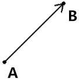
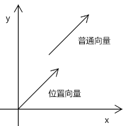
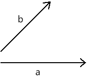
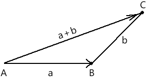
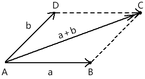

## 第一章 向量的基本概念

向量是有大小和方向的量。

向量就像一种阵法，古有九宫八卦，而此有矩阵，领悟其中的法则，便可以主宰八荒六合 。

在图形的世界中，无论物体如何变换，都是对顶点的一种位移。其位移有量有方向，此量此向即为向量。

接下来，咱们就先从基础说起，  说一下向量的直观形象。

已知点A，点A 要位移到点B，那么这种行为就产生了两种点位：

- 始点：位移起始的位置，即点A。

- 终点：位移结束的位置，即点B。

点A和点B可以构成一条线段，这条线段还是有方向的，那么这样的线段就叫有向线段。

有向线段就是向量的直观形象。

- 有向线段的方向就是向量的方向。

- 有向线段的长度就是向量的长度。

向量和向量之间存在一种向量相等的关系。

向量相等的条件：两个向量同向、等长。

向量中还存在两个特殊的向量：

- 零向量：长度为零的向量  。

- 位置向量：向量终点相对于始点的位置，其直观表现就是向量的长度和方向不变，始点归零。

这里我们要简单强调一下位置向量。

因为位置向量的始点为零，所以这样的向量也可以表示一个坐标点位，这便是位置向量名字的由来。

在做多向量运算的时候，为了方便运算，常常会把所有向量统一为位置向量。如下图：

关于向量的基本概念，我们就说到这。

接下来，咱们说一下向量的运算。

## 第二章 向量的运算

在实际的项目开发中，我们还会遇到这样的问题：

- 点A向着点B的方向移动100 后的位置是什么？
- 点A向着点B的方向移动一半的距离后的位置是什么？
- 点A绕着点B旋转30°后的位置在哪里？

……

要解决上面的问题，就需要用到向量的运算了，向量也是可以加、减、乘、除的，只有对这些运算有了透彻的领悟，你才能更好的操控图形。

### 1-向量求和

接下来咱们直接拿例子说事。

#### 1-1-三角形解法

已知：向量a、b

求：向量a、b的和

解：在平面上任取一点A，做向量AB=a，向量BC=b

则向量a、b的和，就等于点A移动到点B，再移动到点C 后的向量AC。

我们除了可以用三角形求向量之和，也可以用平行四边形来求解。

#### 1-2-平行四边形解法

我们可以在平面上任取一点A，做向量AB=a，向量AD=b。

则向量a、b之和将等于以AB、AC 为临边的平行四边形的对角线AD。 

上面的两种解法是数学中的解法，接下来咱们说一下向量求和在实际坐标点位中的解法。

#### 1-3-坐标点位解法

已知：向量a、b

a 的始点是aS(100,200)

a 的终点是aE(200,300)

b 的始点是aS(100,300)

b 的终点是aE(400,300)

求：向量a、b的和

解：先将向量a、b 简化为位置向量

位置向量a=aE-aS=(200-100,300-200)=(100,100)

位置向量b=bE-bS=(400-100,300-300)=(300,0)

a+b=(100+300,100+0)=(400,300)

我们之前运算都是对2个向量做求和运算，那么如果是多个向量求和呢？这里就需要探索向量求和中的结合律了。

#### 1-4-结合律   

未完待续，备课中……

