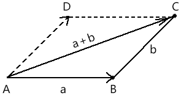

向量是有大小和方向的量。

向量是架构阵法的基础元素，吾之所在，即为阵心，世间万物，入我阵来。古有九宫八卦，而今有矩阵。

在图形的世界中，无论物体如何变换，都是对顶点的一种位移。其位移有量有方向，此量此向即为向量。

接下来，咱们就先从基础说起，  说一下向量的直观形象。

已知点A，点A 要位移到点B。   

始点：位移起始的位置，即点A。

终点：位移结束的位置，即点B

有向线段就是就是向量的直观形象，即线段AB。

有向线段的方向就是向量的方向。

有向线段的长度就是向量的长度。

向量的相等：满足向量同向等长的条件即可。

零向量：长度为零的向量  。

位置向量：向量终点相对于始点的位置。如向量AB 中，点B相对于点A 的位置。   

关于向量的基本概念，我们就说到这。

在实际的项目开发中，我们还会遇到这样的问题：

- 让点A 移动到点B，再移动到点C，求现在点A在哪里？
- 点A向着点B的方向移动100 后的位置是什么？
- 点A向着点B的方向移动AB长度的一半的位置是什么？
- 点A绕着点B旋转30°后的位置在哪里？

……

要解决上面的问题就需要用到向量的运算了，向量也是可以加、减、乘、除的，只有对这些运算有了透彻的领悟，你才能在矩阵中执掌乾坤，呼风唤雨，撒豆成兵，缩地成寸，逆转阴阳……

上述词语不是完全扯淡哦，我以前在京东就是靠着这点长处，站在了一个仓储可视化项目的阵心，建立了自己的技术壁垒，拥有了一定的话语权和自由。

言归正传，咱们先从最简单的向量求和说起。

已知：向量a、b

求：向量a、b的和

解：

在平面上任取一点A，做向量AB=a，向量BC=b

将a、b作为平行四边形的两个临边，做 ▱ABCD

则向量AC就是向量a与向量b的和，即和向量，记做AC=a+b

上面的解法，其实是数学中的解法，接下来咱们说一下实际坐标点位中的解法。

已知：

向量a、b

a 的始点是aS(100,200)

a 的终点是aS(200,300)

b 的始点是aS(100,300)

a 的终点是aS(400,300)

未完待续，备课中……

