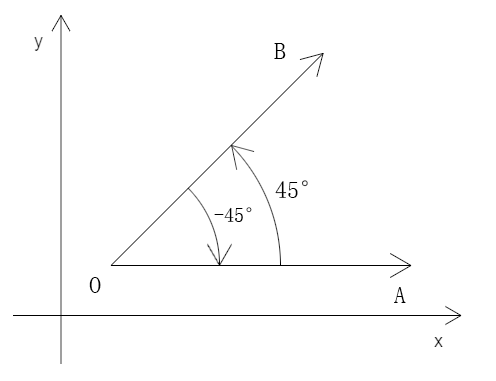
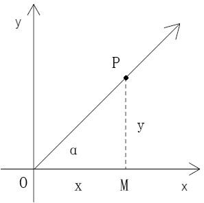
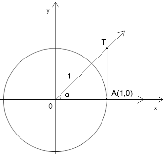

## 第一章 角和弧度制

### 1-角的基本概念




- 角：具有公共端点的两条射线组成的图形，如上图∠AOB
- 角的顶点：组成角的两条射线的公共端点，如上图点O
- 角的边：组成角的两条射线，如上图射线OA、射线OB


### 2-在二维平面中理解角

1. 角可以理解为一条射线围绕角的端点，从当前位置，旋转到另一个位置后形成的图形。

   如∠AOB 可视之为射线OA 围绕其始点O旋转45°后，形成的现在的射线和过去的射线的夹角。

2. 射线旋转经过的平面部分为角的内部。

3. 不考虑旋转的方向，无论从OA 旋转到OB，还是OB 旋转到OA，它们旋转的绝对量都是一样的，且在0°-360° 之间。

4. 零角：x 轴正方向的角。

5. 角的方向：从x 轴的正方向开始，向y 轴的正方向旋转（旋转的绝对量为90°），此角为正角；反之为负角。

  注：在canvas 2d 的坐标系中，y 轴朝下，顺时针旋转的方向为正角；在webgl 的坐标系中，y 轴朝上，逆时针旋转的方向为正角。   


### 3-弧度

1. 角度是将圆的一周视之为360°

2. 弧度是将圆的一周视之为归一化的圆的周长，即2πr，归一化的半径r 是1，因此弧度中圆的一周就是2π。

3. 角度与弧度的互转- 角度转弧度：

   1度 = 2π/360 = π/180 弧度

   1 弧度 = 360/2π = 180/π 度


## 第二章 三角函数

### 1-  三角函数的定义 

### 

在直角坐标系中，已知：

- 射线OP
- 点O 是射线OP的起点，也是直角坐标系的原点
- 点P 是射线OP 上的任意一点
- 点P 的位置(x,y)
- 点M(x,0)在X 轴上
- PM⊥OM
- ∠MOP=α

- OM = x
- PM = y
- |OP| = sqrt(x²+y²) >= 0

根据三角函数的定义可知：

```js
sin α=y/r
cos α=x/r
tαn α=y/x
cos α=x/y
```

注：关于∠α 的单位问题

α后面有角度符号°时，那α 就是角度。否则，就是弧度。

在角度和弧度做运算时，需做单位的换算，要么都统一为弧度，要么都统一为角度。


### 2-三角函数的推理过程


已知任意角α

- 以角α 的顶点O 做为直角坐标系的原点
- 以角α 的始边为正方向的x 轴
- 过角α 的顶点O 做垂直于x 的y 轴
- 在角α 的终边上，长度为1 的地方取点A(l,m)，即OA=1
- 在角α 的终边上，再取任意一点P(x,y)，OP=r (r≠0)

由相似三角形的对应边成比例，可知：

```
|x|/r=l/1=|l|
|y|/r=m/1=|m|
|y|/|x|=|m|/|l|
```

因为：A、P 在同一象限内

所以：A、P两点的x、y 值的正负值一致，因此：

```js
x/r=l
y/r=m
y/x=m/l
```

无论点P 在终边上的上的什么位置 ，上面的比值都是一样的的，即定值。

上面的比值只会随角α 的变化而变化，由此可定义三角函数：

- y/r 叫做角α 的正弦，写做sin α， 即sin α = y/r，在单位圆里是角α 的对边m
- x/r 叫做角α 的余弦，写做cos α，即cos α = x/r，在单位圆里是角α 的临边l
- y/x 叫做角α 的正切，写做tαn α，即tαn α = y/x，在单位圆里是对边比临边m/l


### 3-其它三角函数

三角函数便是以角α 为自变量的各种函数，这样的函数除了上面的sin(α), cos(α),tαn(α)

还有：

- 角α 的正割 sec(α)=1/cos(α)=r/x
- 角α 的余割 csc(α)=1/sin(α)=r/y
- 角α 的余切 cot(α)=1/tαn(α)=x/y

正割、余割、余切分别是余弦、正弦、正切的倒数


### 4-三角函数的常见定理

1.当∠α 的终边在在y 轴上，即α=2kπ±π/2 (k∈Z)时，tαn(α)、sec(α) 无意义

证：

α=2kπ±π/2 (k∈Z)中，Z 是整数集合

在单位圆里，弧度和角度可做换算：

2π=360°

π=180°

π/2=90°

α 在k=0时：

换算角度后的值域是{-90°，90°}

注：{} 是集合中的枚举

点位是(0,±y)

即：tαn(α)=±y/0

由一年级的除法定理：

商=被除数/除数 (除数≠0)

得：tαn(α)无意义。


> 扩展

在js 里被除数和除数为0的结果：

```
0/1=0
1/0=Infinity 
0/0=NαN
```


2.以同样的原理可以推出：当y为除数时，y=0 就没有意义。

y=0时，弧度的定义域是α=kπ  (k∈Z)，在360°中换算角度后的值域是{0°,180°}

以y 为除数的三角函数有：

- 余切cot(α)=x/y
- 余割csc(α)=r/y

当α=kπ  (k∈Z) 时：

- cot(α) =x/0
- csc(α)=r/0 

因此α=kπ  (k∈Z) 时，余切、余割无意义。


> 扩展

- 定义域：函数中，让因变量有意义的自变量的取值范围

- 值域：函数所有可能的返回值，也就是因变量的变化范围


3.三角函数的定义域总结

- sin(α)，定义域为 R
- cos(α)，定义域为 R
- tαn(α)，定义域为 {α | α≠2kπ±π/2，k∈Z} 

注：集合中的{|} 不是运算符中的按位或，其左侧为变量名，右侧为变量的取值条件


### 5-示例


已知：

- ▱OACB
- ∠θ
- OA=a
- OB=b
- BD⊥OA

求证：

```js
S▱OACB=a*b*sinθ
```

证明：

由平行四边面积公式得：

```js
S▱OACB=a*BD
```

所以，证明以下公式即可：

```js
BD=b*sinθ
```

由三角函数得：

```
sinθ=BD/b
```

所以：

```js
BD=b*sinθ
```

所以：

```js
S▱OACB=a*b*sinθ
```


## 第三章 单位圆与三角函数线

### 1-基本定义


- 单位圆：半径为1的圆

- 单位圆与x 轴的交点有两个：A(1,0)、A'(-1,0)

- 单位圆与y 轴的交点有两个：B(0,1)、B'(0,-1)

- 正射影：

  做一个∠α，角的始边为x 轴正半轴

  顶点为单位圆圆心O

  终边OP 与单位圆交于点P

  过点P做PM垂直x 轴于点M

  过点P做PN垂直y 轴于点N

  点P在x、y轴上的垂点分别是点M、点N

  则：

  点M叫做点P在x 轴上的正射影。

  点N叫做点P在y 轴上的正射影。


### 2-正弦、余弦和单位圆的关系


已知：

- 圆O为单位圆
- ∠xOP的角度为α

求：点P的坐标(M,N)

解：

因为

```js
sin(α)=N/1
cos(α)=M/1
```

所以：

```
M=sin(α)
N=cos(α)
```


由上例可知：

- 单位圆中，∠α 的余弦等于∠α的终边与单位圆的交点的横坐标。
- 单位圆中，∠α 的正弦等于∠α的终边与单位圆的交点的纵坐标。


### 3-正切、余切和单位圆的关系   




已知：TA⊥x

求：点T的坐标位x,y

解：

由单位圆可知：

```js
x=1
```

由三角函数里的正切可知：

```js
tαn(α)=y/x
tαn(α)=y/1
tαn(α)=y
```

因此：

```js
y=tαn(α)
```


综上所述：

- 向量OM 叫做∠α 的余弦线
- 向量ON 叫做∠α 的正弦线
- 向量αT 叫做∠α 的正切线


> 特殊角   

当∠α 的终边在x 轴上时，正弦线和正切线变成一点，点P的正弦线=0，αT=0，余弦线=±1

当∠α 的终边在y 轴上时，余弦线和余切线变成一点，点P的余弦线=0，正切线为αT/0 无意义，正弦线=±1


### 4-三角函数线

从上面的知识中，我们可以从单位圆中找到四条三角函数线


## 第四章   同角三角函数的基本关系式   

### 1-同角三角函数的基本关系式

通过三角函数+勾股定理可以得到的同角三角函数的关系：

```js
cos²(α)+sin²(α)=1
tαn(α)=sin(α)/cos(α)
```

推导：

因为：在三角函数里，一个角的正弦和余弦是单位圆里的两个直角边，即正弦线和余弦线。

因为：两直角边的平方和等于斜边的平方

所以：

```js
cos²(α)+sin²(α)=1²
cos²(α)+sin²(α)=1
```


### 2-诱导公式

1. 角α与α+k*2π(k∈Z) 的关系

```js
cos(α+k*2π)=cos(α)
sin(α+k*2π)=sin(α)
tαn(α+k*2π)=tαn(α)
```

上式可理解为一个角与其旋转一圈后的角的三角函数关系。


2. ∠α 和∠-α 之间的关系   

```js
cos(-α)=cos(α)
sin(-α)=-sin(α)
tαn(-α)=-tαn(α)
```

上式可理解为一个角与其水平镜像角的三角函数关系。


3. ∠α 和∠(α+(2\*k+1)\*π) (k∈Z)之间的关系   

```
cos(α+(2*k+1)*π)=-cos(α)
sin(α+(2*k+1)*π)=-sin(α)
tαn(α+(2*k+1)*π)=tαn(α)
```

上式可理解为一个角与其旋转半圈后的角的三角函数关系。

有上还可以归纳出一个角与其旋转了多个半圈后的角的函数关系。

设：旋转了多个半圈后的角为  α+k*π   

则：

- k 为偶时：

```
sin(α+k*π)=sin(α)
cos(α+k*π)=cos(α)
```

- k 为奇时：


```
sin(α+k*π)=-sin(α)
cos(α+k*π)=-cos(α)
```

- 无论k 为偶、为奇：


```js
tαn(α+k*π)=tαn(α)
```

上面的关系，用文字描述就是：

两个互补的角的正弦值相等，余弦值互为相反数，正切值不变 。


> 补角

  互为补角指得就是两角之和为180°   


4. α 与±α+π/2 的三角函数关系   

```js
tan(α+π/2)=-cot(α)
tan(-α+π/2)=cot(α)
```

上式可理解为一个角与其旋转90°后的角，以及这个旋转后的角基于y轴垂直镜像的角的三角函数关系。


> 扩展

无论一个角旋转了90°，还是90°减去了这个角，这个角的x、y坐标量都会互换，但正负不一定，这个我们可以自己举例验证一下，我就不再举例了。


