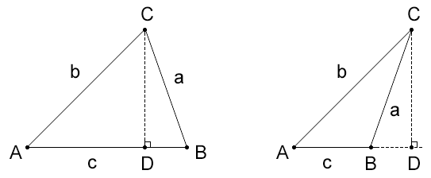
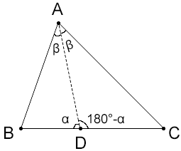

## 第一章 正弦定理

### 1- 定理 



正弦定理：在三角形中，各边与其对角的正弦比相等。即：

```js
a/sina=b/sinb=c/sinc
```


接下来，我们证明一下上面的定理：

由三角函数得：

```js
sinA=CD/b
CD=b*sinA

sinB=CD/a
CD=a*sinB
```

所以：

```js
b*sinA=a*sinB
```

将等号两侧都除以sinA\*sinB得：

```js
b/sinB=a/sinA
```

同理可得：

```js
a/sinA=c/sinC
```

所以：

```js
a/sina=b/sinb=c/sinc
```


### 2-示例



已知：  线段AD 是∠A 的平分线

求证：BD/DC=AB/AC   

证：

由正弦定理得：

```js
BD/sinβ=AB/sinα
DC/sinβ=AC/sin(π-α)
```

因为：

```js
sinα=sin(π-α)
```

所以：

```js
DC/sinβ=AC/sinα
```

观察上面的两个公式：

```
BD/sinβ=AB/sinα
DC/sinβ=AC/sinα
```

将上面第1个公式的等号两侧分别除以第2个公式的等号两侧，可得：

```js
BD/DC=AB/AC
```


## 第二章 余弦定理

### 1- 定理 


```js
c²=b²-a²-2a*b*cosC
b²=a²+c²-2a*c*cosB
a²=b²+c²-2b*c*cosA
```


接下来，我们证明一下上面的定理：

已知：三角形的一个角和两条边

求证：可以确定这个三角形。

要解这个三角形的其它未知条件，使用正弦定理是不行的，因为它需要角和对边已知，所以这里就用到了余弦定理。


未完待续……


