直线的斜截式和一般式，在图像学中都发挥着非常重要的作用。

这一章咱们就说一下这两种方程式的含义、作用和相互转换的方法。

我们先从最基础的斜截式说起。


## 第一章 直线的斜截式

### 1-基本概念

一，直线是一条具有斜率和截距的线。

- 斜率是直线倾斜大小的量。
- 截距是直线和y 轴交点的y值，也可以理解为直线在y轴上的高度。

二，我们可以用直线的斜截式表示直线：

y=kx+b，(k≠0)

- k：斜率
- b：截距
- x：自变量，其定义域为组成直线的所有坐标点的x值
- y：因变量，其值域为为组成直线的所有坐标点的y值

直线的斜截式，实际上就是一次函数的一般式。

直线的斜截式一般用于已知直线上一点的x 值，求y值的情况，比如以下示例。

三，示例

路边有一根电线杆，电线杆顶端有一根铁条连接到地面。

铁条上方绑着一个铃铛A1，我们是够不到的。

现在太阳正好在我们的头顶的正上方，可以将铁条和铃铛垂直投射到地面。铃铛的投影是B1，位置是(40,0)。

请问我们在不接触铃铛的前提下，如何获取铃铛A1的高度？

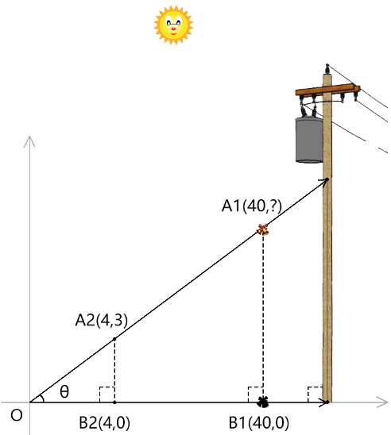


根据铃铛的投影位置，我们知道A1的x值为40.

因为我们把铁条的落点放在了坐标原点上，所以铁条的截距为0.

接下来只要知道铁条的斜率k 就能求出A1的y值。

我们够不到A1，但我们可以在铁条下方取一个我们能够得着的点，如A2(4,3)

因为：斜率=△y/△x

所以：铁条斜率=3/4

由直线的斜截式得：

```js
A1.y=(3/4)*40+0=30
```

所以铃铛的高度就是30

由此可见，通过直线的斜截式，可以求直线上，某个只有一个分量已知的点的另一个分量。

除此之外，上面的例子还演示了通过直线上两点(点A2、点O)，求斜率的方法。

接下来咱们就详细说一下，已知两点求斜率和截距的方法。


### 2-两点转点斜式

一，先举个栗子

已知两点A1(x1,y1)，A2(x2,y2)，求斜率k和截距b。

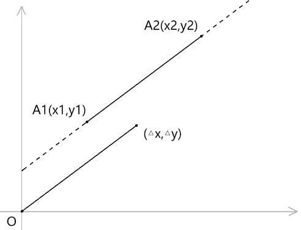


我们要求斜率，首先就要获取△x,△y，这两个分量既是坐标点，也是向量，可以理解为对两个点同时进行平移，把其中一个点放在了零点上。

在这里，我们将A1点归零：

```js
△x=x2-x1
△y=y2-y1
```

接下来求斜率k，根据点斜式方程得：

```js
y2-y1=k*(x2-x1)
k=(y2-y1)/(x2-x1)
k=△y/△x
```

接下来，咱们求截距：

```js
b=y1-(x1*k)
```

求截距d 原理就是在同一个x值的基础上，让有截距的y值减去没有截距的y值，其结果就是截距。

接下来，咱们再说一个点斜式在其它领域应用的栗子。因为上一个电线杆加铃铛的栗子实在太老旧了，适合80年代。

二，用点斜式表示匀速运动和加速运动

之前咱们说过，点斜式式也是一元一次函数，所以它就具备了的函数式的一般功能，比如插值计算。

说到插值，那就必须要说补间动画了。

补间动画在动画的开始，便写下了动画的结尾，只是动画的中间会各自有各自的精彩。

比如我们把点斜式中的因变量和自变量换一个概念：因变量为速度v，自变量为时间t。

那么点斜式就变成了这样：

v=kt+b，(k≠0)

从这里面，我们可以看见物体的匀速运动和加速运动，它们由斜率k 来决定

- 匀速：k=1


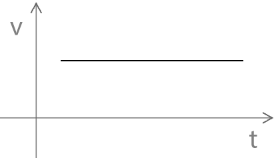

- 加速：k≠1


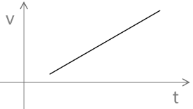


动画还有两个方向：

- 正向：v>0

- 反向：v<0


关于直线的斜截式的概念、应用，以及由两点转直线斜截式的方法，我们就说到这。

接下来咱们整体说一下直线的作用。


### 3-直线的作用

直线可以度量世间百态，可以指引方向，也可以分割阴阳。

- 直线作为度量单位时，它就是一条只有长度的线段，是坐标基底中的分量。
- 直线用于指引方向时，它就是向量，它既有长度，也有方向。
- 直线用于分割阴阳时，它是二元一次不等式，坐标基底中的两个分量各占一元，它是二维世界的主宰，坐标点为阴为阳，一线裁决。

由此可见，直线的作用是很强大的。有时候关于直线的一些运算，并不适合使用点斜式，而是要用直线的一般式，才能进行高效的运算。


## 第二章 直线的一般式

### 1-基本概念

一，直线的一般式：  Ax+By+C=0，(A≠0，B≠0)   

二，直线的一般式一般式的作用和直线函的数式的作用是不一样的。

- 直线函的数式的斜截式，是用于在已知斜率、截距和坐标点x 分量的情况下，计算坐标点的y 值。
- 直线的一般式是为了方便计算点与直线的关系，或者对点位进行变换等。

在实际项目中，直线的一般式往往不是凭空诞生的，它是用两个点位演化而来的。

接下来咱们就说一下两点是如何演化直线的一般式。


### 2-两点转直线一般式

咱们还是拿上一个图说事：


已知：两点A1(x1,y1)，A2(x2,y2)

求直线A1A2的一般方程式：Ax+By+C=0 

一，解：这里所说的求直线的一般式，实际上只要求出A、B、C 的值就可以了。

首先还是要先求出△x、△y

```
△x=x2-x1
△y=y2-y1
```

然后根据△x、△y 就可以得到A、B

```
A=△y=y2-y1
B=-△x=-(x2-x1)
```

接下来求C

```js
C=-(Ax+By)
=△x*y-△y*x
=(x2-x1)*y-(y2-y1)*x
```

将直线上任意一点代入上式，便可得到C，我在这里将A1(x1,y1) 点代入

```js
C=△x*y1-△y*x1
C=(x2-x1)x*y1-(y2-y1)*x1
```

综上所述，由两点获取的直线一般式就是：

```
(y2-y1)*x-(x2-x1)*y+(x2-x1)x*y1-(y2-y1)*x1=0
```

也可以用△x、△y简化一下

```
△y*x-△x*y+△x*y1-△y*x1=0
```

来两个例子，验证一下：

二，直线一般式验证1

已知：A1(0,0)，A2(4,3)，求直线A1A2的一般方程式：Ax+By+C=0 

解：

```js
△x=4
△y=3
C=4*0-3*0=0
```

所以直线的一般式就是：

```js
3*x-4*y=0
```

我们把A1点代入上式，结果一目了然，等于0.

我们把A2点代入上式

```
3*4-4*3=0
```

都没问题，其实上例只是对一般式中的A、B做了验证，因为A1 是零点，所C 没用上。

接下来，我们把A1(0,0)，A2(4,3)点偏移(2,5) 的距离，然后验证一下C。

三，直线一般式验证2

已知：A1(2,5)，A2(6,8)，求直线A1A2的一般方程式：Ax+By+C=0 

```js
△x=4
△y=3
```

用A1点计算C值

```js
C=△x*y-△y*x
C=4*5-3*2
=20-6
=14
```

从而得到直线一般式：

```js
3*x-4*y+14=0
```

把A2(6,8) 点代入一般式，验证一下：

```js
3*6-4*8+14
=18-32+14
=0
```

由此可见，直线的一般式没问题。

到这里，由两点转直线的斜截式和一般式的方法，我们都说了。

接下来，咱们就说一下直线一般式的实际应用。


## 第三章 两条直线间的关系

利用直线的一般式，可以快速判断两条直线间的关系。

首先我们要知道直线的三种关系：重合、平行和相交。

比如，已知两条直线l1和l2：

```js
l1：A1x+B1y+C1=0 
l2：A2x+B2y+C2=0
```

### 1-重合条件

```js
A1=λA2
B1=λB2
C1=λC2 
(λ≠0)
```

或者：

```js
A1/A2=B1/B2=C1/C2
```

### 2-平行条件

```js
A1B2-A2B1=0 
B1C2-C1B2≠0
```

或者：

```js
A1/A2=B1/B2≠C1/C2
```

### 3-相交条件

```js
A1B2-A2B1≠0
```

或者：

```js
A1/A2≠B1/B2
```

由此可见，用直线的一般式中的常量A、B、C 去表示图形的关系，是很方便的。

接下来，我们再趁热打铁，深耕一下。


## 第四章 两条直线之间的交点

### 1-基本概念

当我们知道了两条线相交后，便可以求交点。其交点，也可以用A、B、C 表示。

一，两条直线之间的交点公式

```js
x=(B1C2-C1B2)/(A1B2-A2B1)
y=(A2C1-A1C2)/(A1B2-A2B1)
```

至于上面的公式是怎么来的，咱们简单说一下：

1. 将l1、l2分别乘以B2、B1，然后合在一起，便可以约去y，如：

```js
A1B2x+B1B2y+C1B2=A2B1x+B2B1y+B1C2
A1B2x+C1B2=A2B1x+B1C2
A1B2x-A2B1x=B1C2-C1B2
(A1B2-A2B1)x=B1C2-C1B2
x=(B1C2-C1B2)/(A1B2-A2B1)
```

2. 用同样的原理，将l1、l2分别乘以A2、A1，然后合在一起，便可以约去x，如：

```js
A1A2x+A2B1y+A2C1=A1A2x+A1B2y+A1C2
A2B1y+A2C1=A1B2y+A1C2
A2B1y-A1B2y=A1C2-A2C1
(A2B1-A1B2)y=A1C2-A2C1
y=(A1C2-A2C1)/(A2B1-A1B2)
y=(A2C1-A1C2)/(A1B2-A2B1)
```

我们知道了直线的交点后，还要活学活用，我在这里给大家举两个栗子，具体的代码的实现我就不说了，因为这得花不少时间，我之后得在canvas 里再单开几章出来。


### 2-示例：网格平滑

我们对三角形进行路径圆滑的时候，便会用到直线交点的计算。

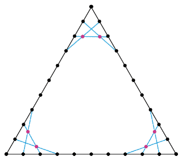


上面红色的点便是路径平滑后的顶点，最终效果是这样的：

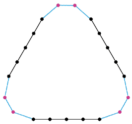

若是你觉得这个图形太丑，我们还可以这样：

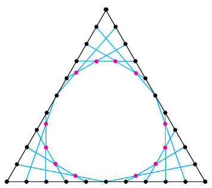


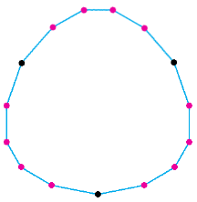


数学加艺术，总是如此迷人。

接下来，咱们再举个栗子。


### 3-示例：直线图+标记线

有的时候，我们在用echarts 做折线图时，还会遇到奇葩需求。

比如，标记线下方的折线是一个颜色，标记线上方的折线是另一个颜色。


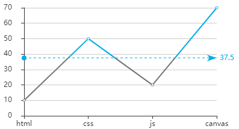


这种效果，在echarts 配置项里是没有的，需要我们自己去计算交点，绘制折线。

关于两条直线求交点的栗子，我们就说到这。

接下来，咱们说一个直线相交的特殊情况。


## 第五章 两条直线的垂直

### 1-基本概念

当两条直线相交后的夹角为90°时，这两条直线就是相互垂直的。

那么，两条直线的垂直关系可以用一般式表示吗？这个答案是肯定的。

还是拿之前的l1，l2举例子，当l1，l2相互垂直时：

```js
A1A2+B1B2=0
```

其实，上式中的A1A2+B1B2 就是向量的点积公式，而之前的A1B2-A2B1 是向量的叉乘公式，这个咱们稍后详解。

接下来，咱们说一下直线垂直公式的推导。


### 2-用直线的一般式推导直线垂直

已知：两条直线l1和l2

```js
l1：A1x+B1y+C1=0 
l2：A2x+B2y+C2=0
```

一，简化直线

l1、l2若相互垂直，其坐标图像就是这样的：

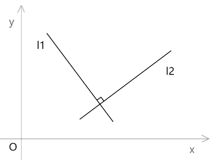


因为C1、C2 跟直线的斜率无关，所以我们可以把两条直线简化：   

```
l1：A1x+B1y=0 
l2：A2x+B2y=0 
```

这样l1、l2的交点就会归0：

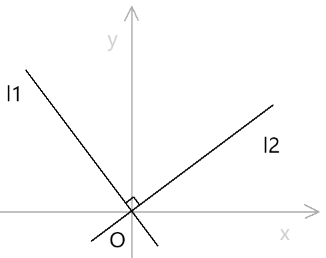


二，做辅助点，寻找垂直的一般式规律

1. 由马克思的实践出真知得：我需要分别在两条直线上做两个点，作为观察物质规律的依据。

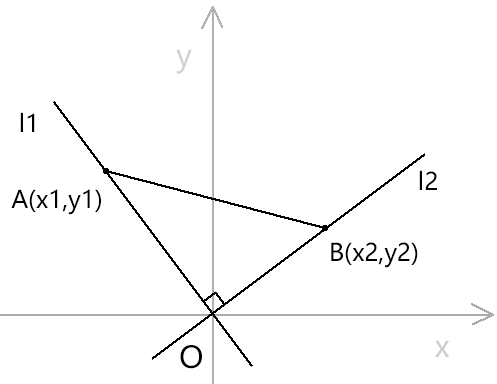


2. 利用勾股定理很容易看出OA、OB的关系

   ```js
   AB²=OA²+OB²
   AB²=(A-B).x²+(A-B).y²
   
   OA²=x1²+y1²
   OB²=x2²+y2²
   
   A-B=(x1-x2,y1-y2)
   (A-B).x²=(x1-x2)²
   (A-B).y²=(y1-y2)²
   
   AB²=x1²+y1²+x2²+y2²
   AB²=(x1-x2)²+(y1-y2)²
   
   x1²+y1²+x2²+y2²=(x1-x2)²+(y1-y2)²
   x1x2+y1y2=0
   ```

   

3. 从两条直线的一般式中取统一的元，代入关系式，推导消元。

   由l1 的一般式得：

   ```
   A1x+B1y=0 
   y=-A1x/B1
   ```

   将A 点代入上式后得到y1 的值

   ```
   y1=-A1/B1*x1
   ```

   同理，可得B 点的y2 值

   ```js
   y2=-A2/B2*x2
   ```


4. 将y1、y2 代入A版两点的关系式中便可发现规律

   ```js
   x1x2(1+A1A2/B1B2)=0
   ```

   因为A、B不是原点，所以x1、x2 不可能等于0，因此：

   ```js
   1+A1A2/B1B2=0
   A1A2+B1B2=0
   ```

   

关于用一般式判断两条直线是否垂直的方法，我们就说到这。

其实，关于两条直线是否垂直，我们用点斜式也可以判断。


### 3-用直线的点式推导直线垂直

已知：有两条直线l1、l2

```
l1: y=k1x+b1
l2: y=k2x+b2
```

首先我们要知道点斜式中的斜率k 和直线一般式中的A、B 之间的关系：

```js
k=-A/B
```

所以：

```js
k1=-A1/B1
k2=-A2/B2
```

j将k1、k2代入一般式的垂直关系式中得：

```js
k1k2=-1
```

关于用一般式判断直线关系的方法我们就说到这，接下来咱们再说一下用一般式计算点到直线距离的方法。


### 4-示例：点与直线的距离

已知 ：

- 点 P(x1,y1) 

- 直线 l 的一般式： Ax+By+C=0  (A、B 不全为0)   


求：  求点P(x1,y1) 到直线 l 的距离   

过点P 作直线m 垂直于直线 l，垂足为点P0(x0,y0)   

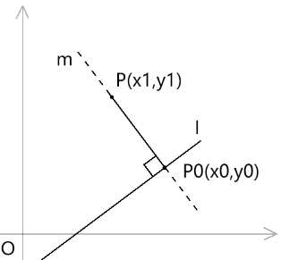


设直线m 的一般式为：A2x+B2y+C2=0

通过点P、点P0，我们可以得到A2、B2 的值

A2=△y=y0-y1

B2=-△x=-(x0-x1)

由两条直线的在一般式中的垂直条件得

```js
A*A2+B*B2=0
A(y0-y1)-B(x0-x1)=0 ①
```

因为P0 在直线l 上，所以：

```js
A*x0+B*y0+C1=0
C=-A*x0-B*y0
```

把C 代入直线的一般式中消元

```js
A*x1+B*y1+C=A*x1+B*y1+A*x0-B*y0
A(x1-x0)+B(y1-y0)=A*x1+B*y1+C1 ②
```

① ②两侧平方后相加得：

```
(x1-x0)²+(y1-y0)²=(A1*x1+B1*y1+C)²/(A1²+B1²)
```

因此，点到直线的距离就是：

```
d=|A*x1+B*y1+C|/sqrt(A²+B²)
```

其实求点到点到直线距离的方法有很多，尤其是我们不仅要知道距离，还要知道垂点点位的时候。

接下来，我再给大家说一个直接获取点到直线的垂点的方法。


### 5-扩展：点在直线上的垂足

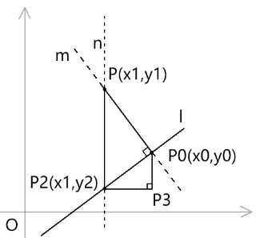


先过点P(x1,y1) 做一条辅助线n，n 与x 轴垂直，与直线l 相较于点P2(x1,y2)

将直线l 的一般式变换一下

```
Ax+By+C=0
y=(-C-Ax)/B
```

将P2 的x 值代入上式，便可以求出P2的y 位置

```js
y2=(-C-A*x1)/B
```

有了P2 的点位，我们便可以计算PP2 的长度

```
PP2=y1-y2
```

用反正切计算直线PP2 的弧度

```
∠P3PP2=atan2(y1,0)
```

在直线l 上取了两点S(xs,ys)，E(xe,ye)，计算△y,△x

```js
△y=ye-ys
△x=xe-xs
```

用反正切计算直线l 的弧度。

```js
∠P3P0P2=atan2(△y,△x)
```

用刚才算出的∠P3PP2 和∠P3P0P2得出∠P0P2P

```js
∠P0P2P=∠PP2P3-∠P3P0P2
```

接下来，我们利用▲P0P2P 中的勾股定理，便可以求出P0P2 的长度

```js
P0P2=cos(P0P2P)*PP2
```

接下来，我们利用▲P3P0P2 中的勾股定理，便可以求出垂足P0 的位置。

```js
x0=cos(∠P3P0P2)*P0P2+x1
y0=sin(∠P3P0P2)*P0P2+y1
```

现在点P 和点P0 都有了，我们就可以做一条围绕直线l 旋转的垂线m

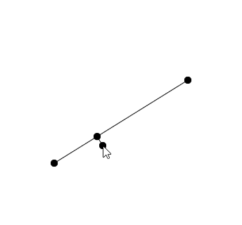


好啦，关于点在直线上的垂点，咱们就说到这。其实当我们知道到直线上的垂线的长度和方向后，也可以对这条直线进行偏移。


## 第六章-从直线的偏移到边界偏移

首先咱们先说最基础的直线的法线偏移

### 1-直线的法线偏移

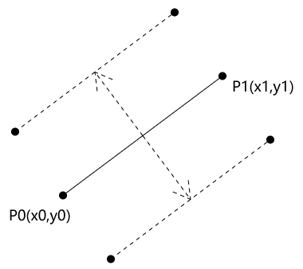


已知：两点P0(x0,y0)、P1(x1,y1)，P0、P1构成直线P0P1，P0P1要基于其垂线方向平移d

求：P0P1偏移后的一般式

整体思路：因为直线的偏移与其一般式中的A、B值无关，只会改变其一般式中的C 值，所以我们求C即可

设：

P0P1的一般式为：A1x+B1y+C1=0

P0P1的垂线的一般式为：A2x+B2y+C2=0

P0P1偏移后的一般式为：A1x+B1y+C3=0

具体思路：

向从P0P1偏移后的一般式中求一下C3，C3=Δxyn-Δyxn，Δx和-Δy 可由P1-P0 得出；xn、yn是P0P1偏移后的直线上的一点，接下来就将目标锁定在如何获取这个点位上。

从P0P1的垂线的一般式中我们可以求出两组A2、B2，这两组A2、B2便是P0P1偏移的方向。

方向已知，长度是d，P0P1偏移后的直线上的一点(xn、yn)。接下来，求C3 即可。

解：

通过P0、P1点，求出A1、B1的值

```js
△x=x1-x0
△y=y1-y0
A1=△y
B1=-△x
```

接下来求直线P0P1的偏移方向

由直线的垂直公式：

A1A2+B1B2=0

得：

向量(A1,B1) 和向量(-A1,-B1) 所指向的方向，就是P0P1的偏移方向（这两个向量的基线实际上就是P0P1的垂线，两个垂直的向量相乘结果为0）。

方向加上偏移距离d 便可得到P0P1偏移后的直线上的一点P3(x3,y3)

将P3的点位代入 C3=-(Ax1+By1) 中即可得到C3的值

从而得到P0P1偏移后的一般式：A1x+B1y+C3=0

其实，刚才直线的那种平移方式叫做法线平移。法线就是直线度的垂线，它只是一个方向的概念，与向量长度无关。在直线的一般式中，A、B合成的向量就是直线的法线方向。

在我们学会了直线的法线偏移后，还能做些什么呢？还可以做图形边界的偏移。


### 2-边界偏移之法线方向

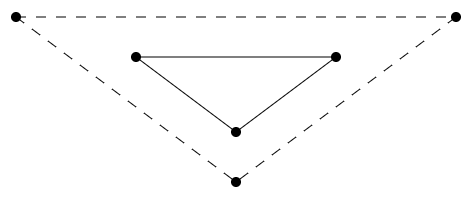

上图中，外侧的虚线三角形就是根据内部的实线三角形偏移而来。

实现思路：

1. 对实线三角的每条边进行等距偏移，得到虚线三角形每条边的一般式。
2. 根据直线的交点公式求三条虚线的交点即可，如：

```js
x=(B1C2-C1B2)/(A1B2-A2B1)
y=(A2C1-A1C2)/(A1B2-A2B1)
```


关于基于法线的边界偏移我们就说到这。

其实，数学的乐趣，在外人看来，会觉得很乏味。甚至许多读了高中三年，以致大学的人都觉得自己只学了个球，而他们实则不知，这样的比喻是在侮辱球了，球的知识量要比我们在直角坐标系里学的知识大很多。

这个又扯远了，数学就像一个潘多拉的盒子，里面乱七八糟，五花八门；数学像一个拧得很紧的水龙头，要花大力气才能宁可，可一旦宁开，你会发现里面蕴含了一场风暴，喷涌的洪流关都关不住，甚至你压根就不想去管，因为你会被其中的法则所迷醉。

就比如，我们说到了边界的偏移，你可能会发现其它的偏移的玩法，比如图形边界之基于夹角方向偏移


### 3-扩展：边界偏移之夹角方向

首先咱们先看个效果。

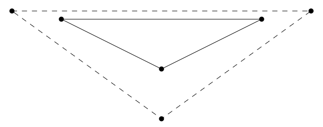

上图中，从实线三角形的夹角中取中间向量，然后给这个向量一个固定的长度，那就可以偏移出虚线三角形。

简单说一下实现思路。

已知：向量a、b，a的终点始b的始点

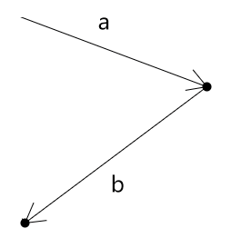

求：向量a、b夹角中线的外侧方向

解：利用向量求和中的三角形法则，对向量b取反并偏移


如果将向量a、-b 使之为平行四边形的两个临边，那么向量c 就是这个平行四边形的对角线。

然而，大家要知道，平行四边形的对角线并不一定是角平分线，只有平行四边形的四条边临边相等时，其对角线才是角平分线。

因此，我们要将向量a、-b归一化，在将其相加，这样得到的向量才是向量a、-b的夹角的角平分线

接下来，利用此理，求出多边形每个夹角的中线，再给个固定长度，便可以对顶点进行位移，从而得到新的偏移图形。


好啦，关于直线的点斜式和一般式，我们就说到这。

之前我们在偏移直线的时候，还提到了向量的概念，这个东东可是很牛皮的，下一章咱们就聊一下向量。


