## 第一章 向量的基本概念

向量是有大小和方向的量。

向量就像一种阵法，古有九宫八卦，而此有矩阵，领悟其中的法则，便可以主宰八荒六合 。

在图形的世界中，无论物体如何变换，都是对顶点的一种位移。其位移有量有方向，此量此向即为向量。

接下来，咱们就先从基础说起，  说一下向量的直观形象。

已知点A，点A 要位移到点B，那么这种行为就产生了两种点位：

- 始点：位移起始的位置，即点A。

- 终点：位移结束的位置，即点B。

点A和点B可以构成一条线段，这条线段还是有方向的，那么这样的线段就叫有向线段。

有向线段就是向量的直观形象。

- 有向线段的方向就是向量的方向。

- 有向线段的长度就是向量的长度。

向量和向量之间存在一种向量相等的关系。

向量相等的条件：两个向量同向、等长。

向量中还存在两个特殊的向量：

- 零向量：长度为零的向量  。

- 位置向量：向量终点相对于始点的位置，其直观表现就是向量的长度和方向不变，始点归零。

这里我们要简单强调一下位置向量。

因为位置向量的始点为零，所以这样的向量也可以表示一个坐标点位，这便是位置向量名字的由来。

在做多向量运算的时候，为了方便运算，常常会把所有向量统一为位置向量。如下图：

关于向量的基本概念，我们就说到这。

接下来，咱们说一下向量的运算。

## 第二章 向量的运算

在实际的项目开发中，我们还会遇到这样的问题：

- 点A向着点B的方向移动100 后的位置是什么？
- 点A向着点B的方向移动一半的距离后的位置是什么？
- 点A绕着点B旋转30°后的位置在哪里？

要解决上面的问题，就需要用到向量的运算了，向量也是可以加、减、乘、除的，只有对这些运算有了透彻的领悟，你才能更好的操控图形。

### 1-向量求和

接下来咱们直接拿例子说事。

#### 1-1-三角形解法

已知：向量a、b

求：向量a、b的和

解：在平面上任取一点A，做向量AB=a，向量BC=b

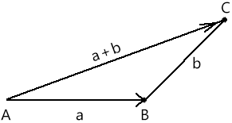

则向量a、b的和，就等于点A移动到点B，再移动到点C 后的向量AC。

我们除了可以用三角形求向量之和，也可以用平行四边形来求解。

#### 1-2-平行四边形解法

我们可以在平面上任取一点A，做向量AB=a，向量AD=b。

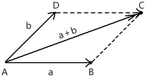

则向量a、b之和将等于以AB、AC 为临边的平行四边形的对角线AD。 

上面的两种解法是数学中的解法，接下来咱们说一下向量求和在实际坐标点位中的解法。

#### 1-3-坐标点位解法

已知：向量a、b

a 的始点是aS(100,200)

a 的终点是aE(200,300)

b 的始点是aS(100,300)

b 的终点是aE(400,300)

求：向量a、b的和

解：先将向量a、b 简化为位置向量

位置向量a=aE-aS=(200-100,300-200)=(100,100)

位置向量b=bE-bS=(400-100,300-300)=(300,0)

a+b=(100+300,100+0)=(400,300)

我们之前运算都是对两个向量做求和运算，那么如果是多个向量求和呢？这里就需要探索向量求和中的结合律了。

#### 1-4-结合律   

咱们先举个加法的例子。

已知：a=1，b=2，c=3

则：

a+b+c=1+2+3=6

b+a+c=2+1+3=0

a+b=b+a

上面的算法就是加法的结合律。

那么，如果我们把a、b、c 看成向量，那么是不是也可以这么算呢？其返回结果又是什么？

首先，咱们先给出答案，后面再去论证。

向量的加法也遵循加法的结合律，其返回结果是向量。

举个例子：

已知：向量a、b、c

求：a+b+c

解：

将向量a、b、c 首尾相连。

则：a+b+c 的结果就是以a 的起点为起点，以c的终点为终点的向量。

向量加法的结合律可以通过向量求和的三角解法来论证。

如下图：

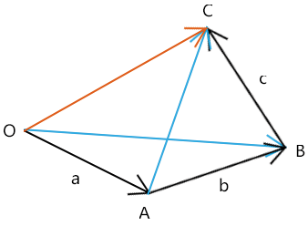

由图可知：

a+b=OB

OB+c=OC

所以：

a+b+c=OC

关于向量求和，我们就说到这，接下来咱们说一下向量减法。

### 2-向量减法

在数字的运算中减法是加法的逆运算，向量也是同样原理。

#### 2-1-向量减法求解

用栗子说事。

已知：向量a，b

求：a-b

解：先将这两个向量的起点拼在一起

a-b 等于以减向量b 的终点为起点，以被减向量a 的终点为终点的向量BA。

b-a 等于以减向量a 的终点为起点，以被减向量b 的终点为终点的向量AB。

向量的减法就是这么简单，接下来咱们说几个特殊的向量减法。

#### 2-2-特殊的向量减法

- 位置向量：向量终点减向量起点。比如，一个向量BA 等于它的终点相对于原点O 的位置向量OA，减去它的起点相对应原点O 的向量OB
- 反向量：向量方向相反的向量，其直观表现就是坐标分量互为相反数。如向量(x,y)的反向量就是(-x,-y)。
- 垂直向量：向量方向垂直的向量，与某一向量垂直的向量有两个，这两个向量在一条基线上，它们互为相反数。如向量(x,y) 的垂直向量有(y,x)和(-y,-x)。

对于向量的减法，咱们就说到这。

我们先对向量的加减简单总结一下。

向量的加减和图形全等、平行有有着密切联系。

比如：方向相同或相反的两条向量的基线平行；方向相同或相反，且长度一样的两条线段相等。

接下来咱们说一下，向量的乘法。

向量的乘法有两玩法，一种是让向量乘以一个数字，名曰数乘；还有一种是两个向量相乘，名曰点积、内积或向量乘积。

咱们先说数乘。

### 3-数乘

数乘和图形的相似性、缩放有着密切关联。

还是先拿栗子说事。

#### 3-1-数乘的概念

已知：向量AB，AB被3等分，分割点位P、Q

则：

AP=1/3*AB 

AQ=2/3*AB  

由此可以引出数乘的定义：

实数λ和向量a 的乘积是一个向量，记做λa

#### 3-2-数乘的特性

向量λa 的长度：|λa|=|λ|*|a|

如果|λa|=1，则λa 叫做单位向量。

a≠0 时，λa 会出现的几种情况：

- λ>0 时，λa 与a 同方向

- λ<0 时，λa 与a 反方向

- λ=0 时，λa 为零向量

向量数乘的常见规律：

- (λ+μ)a=λa+μa
- λ(μa)=(λμ)a
- λ(a+b)=λa+λb

向量的基线：向量所在的直线。

平行向量基本定理：如果a=λb，则a、b平行；反之，若a、b平行(b≠0)，则必然存在一个实数λ，使a=λb

设向量a 的单位向量为a0，由向量的数乘可知：

a=|a|*a0

a0=a/|a|

其实直角坐标系里的坐标轴也是向量，接下来咱们就用向量解释一下直角坐标系，这有助于我们将向量运算分解为坐标运算。

### 4-坐标轴上向量坐标运算

轴：规定了方向和向量长度单位的直线。

在轴l 上，给定一个向量e，在轴上取任意向量a，那必然纯在唯一实数x，使a=xe，用e 可以生成与其平行的所有向量的集合{xe|e∈R }

e：轴l 的基向量

x：a在l 上的坐标，或数量

x 的绝对值等于|a|

a与e 同向时，x 为正；反之，x 为负。

轴上两个向量相等的条件是它们的坐标相等。

两个向量和的坐标等于两个向量坐标的和。

轴上向量的坐标等于向量终点的坐标减去向量起点的坐标。

我们之前说了那么多，都是基础，挺枯燥的，接下咱们说个好玩的栗子。

## 第三章 视图变换

百度地图，大家应该都不陌生吧。我们可以对地图进行缩放、平移，并对不同区域进行选择。接下来，咱们用向量说一下这个的实现原理。

### 1-缩放

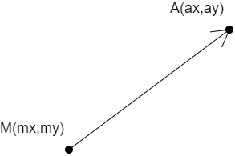

已知：

- 视图中一点 A(ax,ay)

- 鼠标在视图中的位置 M(mx,my)

- 项目需求：当鼠标滑动滑动滚轮时，对视图进行缩放

解：

将向量均分成3段

当缩小视图时，就让向量a 的长度缩小1/3，这样点P1 就会移动到点Q 的位置。

因此，我们求出点Q 的位置，然后将点P1 放到这里，就可以实现视图的缩放了。

由向量数乘公式得：

MQ=2/3*MA

将向量分解为坐标点：

MQ=(2/3\*(mx-ax),2/3\*(my-ay))

当视图放大时也是同理，我们将乘数变成4/3 即可。

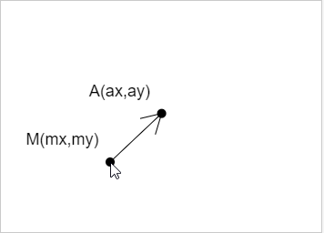

关于只有一个点的视图缩放我们就说到这，如果是多点的缩放，也是同样的道理，我就不再多说了。

我们说完缩放，大家应该还会想到平移，平移的实现，那就是向量加减了，这要比向量的缩放容易，咱们在这里还是说一下。

### 2-平移

已知：同上

项目需求：当鼠标按住滚轮移动时，对视图进行平移

设：

鼠标移动之前的点位为M1

鼠标移动之后的点位为M2

解：

鼠标每次移动时：

记录鼠标的位移向量：M1M2=M2-M1

让点A 加上鼠标的位移向量：A=A+M1M2

这时的点A 就是视图平移后的结果。

现在，我们演示了变换的缩放和位移。其实，我们还可以对视图进行旋转。

### 3-旋转

已知：点A，视口中心点O，视图旋转弧度α

项目需求：点A基于点O旋转α 弧度后的位置A2

解：

向量OA=A-O

利用反正切可得：

向量OA 的弧度β=atan(OA.y/OA.x)                                                                                                                                                                                                                                                                                                                                                                                                                                                                                                                                                                                                                                                                                                                                                                                                                                                                                                                                                                                                                                                                                                                                                                                                                                                                                                                                                                                                                                                                                                                                                                                                                                                                                                                                                                                                                                                                                                                                                                                                                                                                                                                                                                                                                                                                                                                                                                                                                                                                                                                                                                                                                                                                                                                                                                                                                                                                                                                                                                                                                                                                                                                                                                                                                                                                                          

利用勾股定理可得向量OA的长度|OA|=sqrt(OA.x\*OA.x+OA.y\*OA.y)

因此，旋转后：

向量OA  的弧度 θ=β+α

利用三角函数可得，旋转后:

向量OA 的终点A3=(cosβ\*|OA|,sinsβ\*|OA|)

A3 还得再加上一个偏移量，才是A2的位置：

A2=A3+O

最终效果如下：

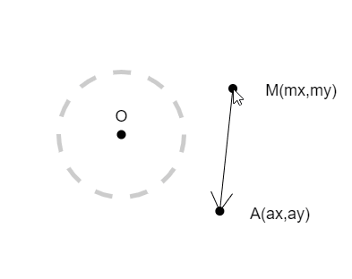

注：利用这个原理，我们可以变换canvas 视图。

关于向量在变换中的用法咱们就说到这。

实际上，具备变换特性的图形是可以嵌套的，就像俄罗斯套娃一样，这就是图形树。

## 第四章 图形树的基本概念

### 1-楔子

举个例子：

我把点A 装进了一个盒子里，我只知道点A在这个盒子box里的位置，那么我在盒子外面用鼠标变换视图时，点A 相对于鼠标M的位置是什么？

我在问这个问题的时候，应该很多人都是懵的，因为我这个问题本身就有问题。

我们要计算一个点位，首先要有一个前提条件，那就是坐标系。

而我们在计算图形树中两个节点里的顶点关系时，节点所对应的坐标系本身也是未知的、可变的。

就像上面，我在问视图scene 内的鼠标点M和盒子box内的点A 的相对关系时，我首先要知道这个这个相对关系要用哪种坐标系来计算，我们需要统一坐标系。

### 2-统一坐标系

统一坐标系的方案有以下几种：

- 方案1：统一为盒子box 的坐标系：鼠标点需要进行坐标转换，从盒子外部转入盒子内部
- 方案2：统一为鼠标所在的视图坐标系：点A需要进行坐标转换，从盒子内部转入盒子外部
- 方案3：统一为根节点坐标系：将所有子节点转换入根节点

至于我们要使用哪一种方案，这需要用实践来检验和推理。

比如：把盒子box里的点A换成三角形ABC，我们要用盒子外的鼠标选择这个三角形。

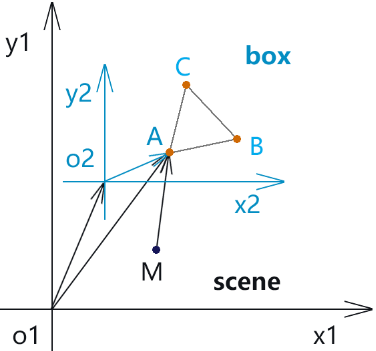

对于上面的情况，方案1 就比较合适，因为方案1 只需要对鼠标点进行坐标转换；

方案2 会对三角形的三个顶点进行转换；

方案3 会对所有子节点进行转换。

然而，有的时候，我们还考虑操作的便捷性。

比如：

方案1和方案2 里的坐标系都是变量，而且还是两个，分别是起始坐标系和结束坐标系。

方案1和方案2 里的坐标系的转换还是有方向的，比如是方案1是将鼠标向下转换，方案2是将子节点点位向上转换。

这时，我们可以建立一个图形树的概念：

上面的box还可以有多个，但根节点只有一个：

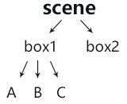

综上所述，方案1和方案2一共需要四个已知条件：

- 目标点位
- 起始坐标系
- 结束坐标系
- 转换方向

而方案3只需要知道要把一个点位从哪个坐标系移到顶层即可。

因此，方案3只需要知道两个条件：

- 目标点位
- 起始坐标系

方案3无疑是操作最便捷的，性能也是最差的。

至于我们是选择操作的便捷性，还是选择性能，这还得看我们自己的取舍，要考虑具体情况，具体对待。

整理一下上面的内容，我们详细说一下图形树变换的具体方法。

## 第五章 图形树中的变换

### 1- 浅析图形树中父子节点的坐标转换

已知：

- 视图scene 为最外层坐标系

- 鼠标点M 在视图scene 中

- 盒子box 在视图scene 中

- 点A(ax,ay) 在box 中

求：

- 在box 中，与鼠标点M的视觉位置重合的点MInBox
- 在scene中，与点A的视觉位置重合的点AInScene

解：

坐标系变换的形态有三种：位移、旋转、缩放。

暂且不考虑旋转和缩放，假设box 只进行了位移变换。

因为向量也可以理解为点位，所以我们用向量求解。

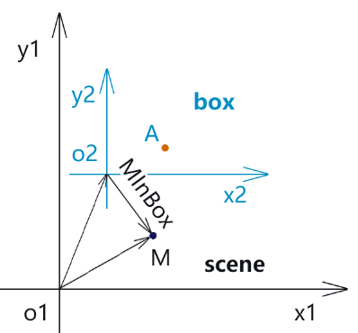

由向量减法得：MInBox=o1M-o1o2

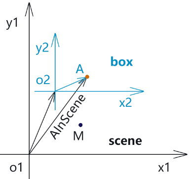

由向量加法得：AInScene=o1o2+o2A

上面的box只是进行了位移，如果box 还进行了旋转和缩放，我们应该如何求解呢？

首先咱们先认识一下变换的三个状态

### 2-变换的三个状态

以下图为例：

已知：

- 点A在盒子box里
- 盒子box在场景scene 中。
- 设盒子box在scene 中的点位为o2。
- 场景scene 的原点为o1。

我们对box 的不同变换，会改变box坐标系的不同状态：

- 位移：会改变box 坐标系在scene坐标系中的位置。
- 旋转：会改变box 坐标系在scene坐标系中的弧度。
- 缩放：会改变box 坐标系在scene坐标系中的大小。

接下来咱们就通过图形变换定理，具体认识一下图形变换顺序对图形的影响。

## 第六章 变换顺序

首先咱们先认识两个图形变换的基本概念：

1. 顶点变换：当图形所在的坐标系不变，基于图形中一基点，同步变换图形的所有顶点时，变换顺序不会影响图形的最终效果。

2. 坐标系变换：当变换图形所在坐标系时，其变换顺序会影响图形的最终显示效果。

   

### 1-顶点变换

顶点变换的本质就是点的位移。

以下图为例，box 有四个顶点，将左上角点作为所有顶点变换的基点。

其所有的变换都没有改变其所在坐标系，都是对其所有顶点的变换。

图1、图2、图3的变换顺序依次是：

- 位移 > 旋转 > 缩放
- 旋转 > 位移 > 缩放
- 缩放 > 位移 > 旋转 

由上图可知，其变换顺序虽然不同，但其结果都是一样的。

接下来咱们说一下坐标系变换。

### 2-坐标系变换

我们用嘴直观的图像来展示坐标系变换的效果。

#### 2-1-位移+旋转

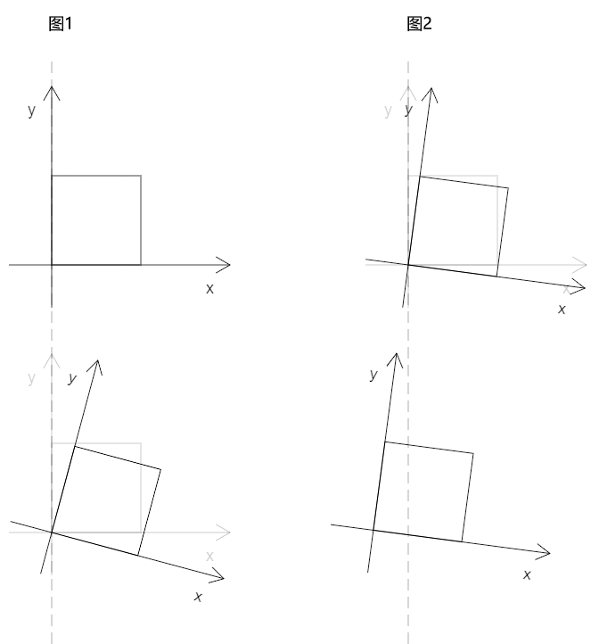

图1、图2的变换顺序依次是：

- 位移 > 旋转
- 旋转 > 位移

从图2中我们可以看到，其旋转后的位移明显发生了方向上的改变，这和图1的结果明显是不一样是。

所以，坐标系的位移和旋转顺序不同，图形最终效果不同。

#### 2-2-旋转+缩放

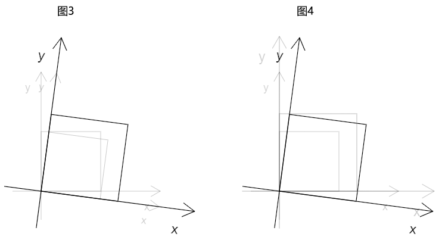

图3、图4的变换顺序依次是：

- 旋转 > 缩放
- 缩放 > 旋转

由上图可看出：坐标系的缩放和旋转顺序不同，图形最终效果相同。

#### 2-3-位移+缩放

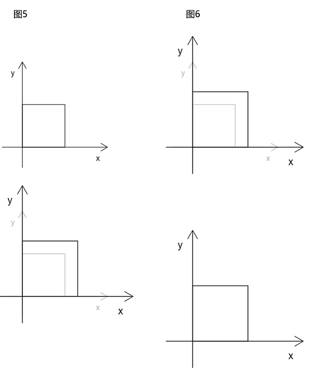

图3、图4的变换顺序依次是：

- 位移 > 缩放
- 缩放 > 位移

由上图可看出：坐标系的位移和缩放顺序不同，图形最终效果不同。

知道了坐标系变换顺序的原理，我们就可以对变换了坐标系进行还原。

### 3-示例

1. 我们对box 进行变换：位移+a > 旋转+b > 大小*c

   如下图：

2. 我若想将box 还原，就需要按照之前的变换顺序逆推：大小/c > 旋转-b > 位移-a

   如下图：

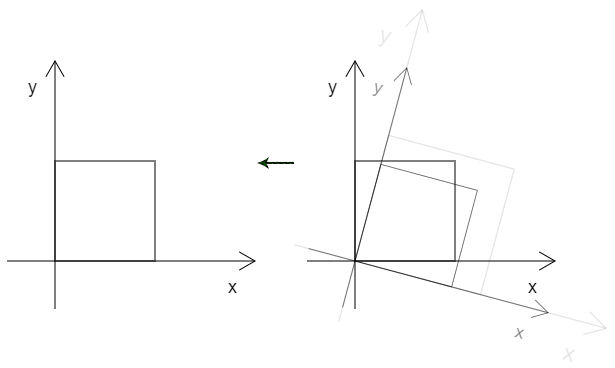

注：上面的“大小”就是向量的长度。

上例中，大小和旋转谁先执行都不会影响最终结果。

## 第七章 图形树中父子节点的坐标转换

我们先通过示例说一下解题方法。

### 1-示例

已知：

- 视图scene 为最外层坐标系
- 鼠标点M 在视图scene 中
- 盒子box 在视图scene 中
- 点A(ax,ay) 在box 中
- 盒子box 的变换信息为：位移+a > 旋转+b > 大小*c

求：

- 在box 中，与鼠标点M的视觉位置重合的点MInBox
- 在scene中，与点A的视觉位置重合的点AInScene

解：

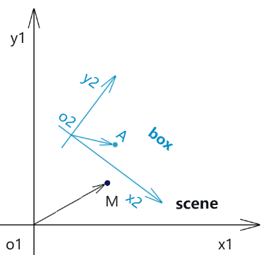

- 将点M下沉：MInBox=点M位移-a > 旋转-b > 大小/c

- 将点A上浮：AInScene=点A 缩放*c > 旋转+b > 位移+a

### 2-总结

把父级中的点M 装进子级中，同时保持视觉效果不变时，我们要先让点M 减去上子级坐标系的位移量，即位移-a。然后再让点A基于子级坐标系的旋转和缩放信息逆向变换，即上例中的旋转-b > 大小/c。

把子级中的点A 拿到父级中，同时保持视觉效果不变时，我们要先把子级坐标系的旋转和缩放信息传递给点A，即上例中的向量o2A 缩放*c > 旋转+b ，然后再让点A 加上子级坐标系的位移量，即位移+a。

### 3-扩展

上面的原理对于多层级节点依旧适用的。比如已知：

- 上例中的box 中还包含了一个smallBox
- smallBox中有一个点B
- smallBox 的变换信息为：位移+as > 旋转+bs > 大小*cs

求：

- 在box 中，与鼠标点M的视觉位置重合的点MInSmalBox
- 在scene中，与点A的视觉位置重合的点BInScene

解：

- 将点M下沉：MInSmalBox=将点M下沉到box中 (点M位移-a > 旋转-b > 大小/c) > 将点M下沉到smallBox 中 (点M位移-as > 旋转-bs > 大小/cs) 
- 将点B上浮：AInScene=将点B上浮到smallBox 中(点B 缩放\*cs > 旋转+bs > 位移+as) > 将点B上浮到box中(点B 缩放*c > 旋转+b > 位移+a)

向量说到这里，也只是处于远看是山的境界。接下来，咱们去看那冰山一角-向量之坐标运算。
