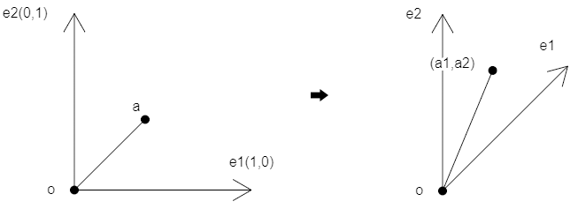
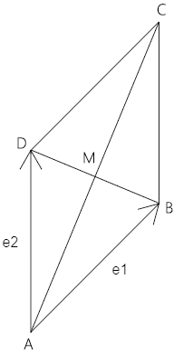
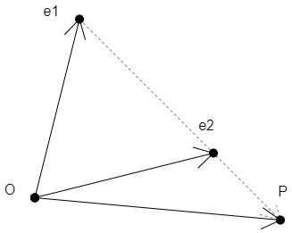
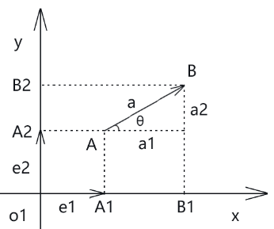

## 第一章 向量在二维坐标系里的姿态

### 1-平面向量基本定理

平面内任何向量都能用两个不平行向量表示。

设：

- 平面内存在一个向量a
- 平面内存在e1、e2 两个不平行的向量

那么：

- 该平面内存在唯一一对实数a1、a2，使：a=a1e1+a2e2


### 2-平面向量的特性

在a=a1e1+a2e2 中：

 e1,e2 ：二维坐标系里的两个基底，记做{e1,e2}。 

a1e1+a2e2 ：向量a关于基底{e1,e2} 的分解式。

当e1,e2垂直时，如e1(0,1)、e2(1,0) ，其对应的坐标系就是直角坐标系。

以此原理，我们可以建立两个坐标系的概念。

- 点a在二维直角坐标系中。

- (a1,a2) 可以视之为一个点位，它处于以{e1,e2} 为基底的坐标系中。

  




我们可以举个例子，加深一下理解。


### 3-示例



已知：

- 平行四边形ABCD
- 向量AB=e1
- 向量AD=e2

求：向量AM

解：

```js
AC=AB+AD=e1+e2
DB=AB-AD
AM=AC/2
AM=(e1+e2)/2
AM=e1/2+e2/2
```

利用向量的基本定理我们还可以推导出一个向量的参数表达式。


### 4-向量的参数方程式

向量的参数方程式：

```js
OP=(1-t)*OA+t*OB
```

上式中，t 叫做参变量，简称参数。

由 ① 变换可得：

```js
OP=OA-t*OA+t*OB
OP=OA+(OB-OA)*t 
```

这个方程式，实际上就是二分法，我们用它可以做缓动跟随。

比如，求e1点向e2点移动e1e2长度的t 倍后的点位P，P 就等于 (1-t)*OA+t*OB



我们可以论证一下上例：

```js
e1P=t*(e1e2)=t*(e2-e1)
OP=e1+e1P
  =e1+t*(e2-e1)
  =e1+t*e2-t*e1
  =(1-t)*e1+t*e2
```

向量的参数方程式可以用大白话来解释：点e1向着e2的方向移动，每次移动e1e2距离的t倍。


## 第二章 向量的正交分解

### 1-直角坐标系的基本概念

向量垂直：向量所在基线相互垂直，在平面向量基本定理里的直观表现就是e1、e2相互垂直。

正交基底：e1、e2相互垂直的基底。

正交分解：在正交基底下分解向量。

直角坐标的基底的两个分量分别是x轴、y轴上的单位向量{e1,e2}，这样的基底也叫做直角坐标系xOy的基底。


### 2- 用向量的观点认识直角坐标系 



在直角坐标系xOy 内，分别取与x、y 方向相同的两个单位向量e1、e2。

这时，坐标平面内的正交基底就是{e1,e2}，这个基底也叫直角坐标系xOy的基底。

坐标平面xOy 中，作任何一向量a。

由平面向量基本定理可知，存在唯一有序实数对(a1,a2) 使得：

```js
a=a1*e1+a2*e2
```

a1、a2就是向量a 在基底{e1,e2}下的坐标，即：

```js
a=(a1,a2)
```

- a1：向量a 在x 轴上的坐标分量
- a2：向量a 在y 轴上的坐标分量

分别通过a 的始点和终点做x、y 轴的垂线，设垂足分别为A1、B1、A2、B2

- 坐标分量a1 为向量A1B1 在x 轴上的坐标投影
- 坐标分量a2 为向量A2B2 在y 轴上的坐标投影

因为：O 为原点，{e1,e2}为正交基底

所以O、e1、e2在正交基底{e1,e2} 中的坐标分别为：

```js
O =(0,0)
e1=(1,0)
e2=(0,1)
```

设：向量a=(a1,a2)，a 的方向相对应x 轴正方向的转角为θ

由三角函数的定义可知：

```
a1=|a|*cosθ
a2=|a|*sinθ
```


### 3-(x,y)的双重意义

在canvas 画布的坐标系里我们应该知道，其坐标基底{e1,e2} 中：

- e1=一个像素的宽
- e2=负的一个像素的高

至于一个像素的宽高到底是多少毫米，得使用屏幕的物理尺寸去换算，这里我就不再扩展了。

假如canvas 坐标系里有一点A，点A坐标位是(x,y)

那么点A的坐标位(x,y)是个什么概念呢？

我们从坐标原点O 向点A做一个向量OA，则：

```js
OA=x*e1+y*e2
OA=(x,y)
```

由上式可知，坐标符号(x,y) 具有两重意义，它可以是一个固定的点(x,y)，也可以是向量(x,y)   

我们可以举个例子论证一下：

  已知：

- e1=(1,0)
- e2=(0,1)
- a1=3
- a2=2

求：a   

解：

```js
a=3*(1,0)+2*(0,1)
 =(3,0)+(0,2)
 =(3,2)
```


接下来咱们说一下向量的坐标运算。


## 第三章 向量的坐标运算

### 1-向量运算的基本概念

- 两个向量和与差的坐标等于两个向量相应坐标分量的和与差。
- 向量的数乘等于此数乘以向量的坐标分量。
- 一个向量的坐标等于向量终点的坐标减去向量始点的坐标。

接下来咱们举一个论证两个向量是否共线的例子。


### 2-两个向量平行的条件

两个向量平行的条件是：相应坐标成比例

若a//b (b≠0)，则存在唯一实数λ，使a=λb

逆推，若存在唯一实数λ，使a=λb (b≠0)，则a//b

设：

- 基底为{e1,e2}
- a=(a1,a2)
- b=(b1,b2)

解：

a=λb 可分解为：

```js
(a1,a2)=λ(b1,b2)=(λb1,λb2)
```

即：

```js
a1=λb1
a2=λb2
```


