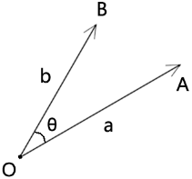
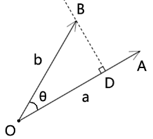
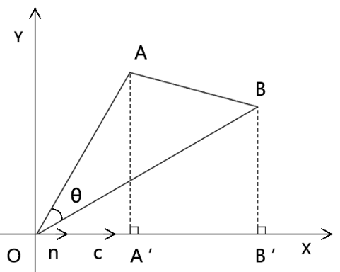
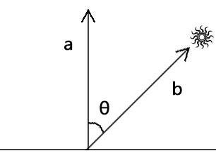

## 前言

点积也叫內积，在我们的高中数学里叫做向量的数量积。

点积是两个向量的相乘，其返回值是一个数字，而不是向量。

使用点积可以计算力做的功、平面的受光强度、一个点位是否在三角形中等。

我们之前说过，向量可以用坐标点位表示，也可以用方向和长度表示。

所以点积的求值方式也有两种：

- 基于向量的长度和夹角求点积
- 基于向量的坐标点求点积

接下来咱们就详细说一下这两个求点积的方式。


## 第一章 基于向量的长度和夹角求点积

### 1-基本公式



已知：

- 向量a的长度是|a|
- 向量b的长度是|b|
- 向量a和向量b的夹角是θ

则向量a和向量b的点积为：

```js
a*b=|a|*|b|*cosθ
```

上面的公式就是基于向量的长度和夹角求点积的公式。

注：在数学里，向量a和向量b的夹角可记做<a,b>

这时，有的同学可能会疑惑，为什么这么写就是点积的公式了？这么做有什么意义吗？还是它暗合了图形的某种规律？

言归正传，为了解开这个谜团，接下来咱们说一下向量的正投影。


### 2-向量在轴上的正射投影

我们先分析一下向量的点积公式：

```js
a*b=|a|*|b|*cosθ
```

在这里面我们看见了|b|*cosθ，而在三角函数里有这么一个公式：

```js
cosθ=x/r
x=r*cosθ
```

对比上面的公式，我们可以猜测：

- |b|是不是可以作为斜边？
- |b|*cosθ 是不是一条临边？

那咱们画个图看一下：



过点B 做OA的垂线BD，则：

```js
OD=|b|*cosθ
```

向量OD就叫做向量OB在向量OA上的正射投影。

因此，点积可以看成向量b在向量a上的正射投影和向量a的长度的乘积。

接下来，咱们根据上图分析一下点积的性质：

- 正射投影的值是个实数，可正可负。
- 两个向量的夹角的值域是[0°,180°]
- 两个向量的夹角和点积的关系：
  - 当θ=90° 时，b⊥a ，正射投影=0，点积=0
  - 当θ=0° 时，b与a同向，正射投影=|b|，点积=|a|*|b|
  - 当θ=180° 时，b与a共线，正射投影=-|b|，点积=-|a|*|b|
  - 当θ∈[0°,90°) 时，正射投影>0，点积>0
  - 当θ∈(90°,180°] 时，正射投影<0，点积<0
- a\*b≤|a|\*|b|，因为点积可正、可负、可零，|a|*|b|≥0

关于点积的由来我就说到这，接下来咱们说一下点积的运算规律。


### 3-点积的运算律

#### 3-1-交换律

```js
a*b=b*a
```

简单论证一下：

由向量数量积的定义得：

```js
a*b=|a|*|b|*cos<a,b>
b*a=|b|*|a|*cos<a,b>
```

所以：向量的数量积满足交换律


#### 3-2-分配率

```js
(a+b)*c=a*c+b*c
```

简单论证一下：



已知：

- 向量OA
- 向量AB
- 向量OB
- 向量c
- 单位向量n
- 轴向量l
- 轴l、向量n和向量c共线
- 向量a和向量l的夹角为α
- AA'⊥l
- BB'⊥l

求证：

```js
(OA+AB)*c=OA*c+AB*c
```

证：

由向量的点积得：

```js
AB*n=|OA|*|n|*cosα
```

因为：向量n是单位向量

所以：

```js
|n|=1
```

所以：

```
OA*n=|OA|*|n|*cosα
OA*n=|OA|*1*cosα
OA*n=|OA|*cosα
OA*n=OA'
```

同理：

```
OB*n=OB'
AB*n=A'B'
```

由向量和角公式可得：

```js
OB=OA+AB
```

  将OA'、OB'、A'B' 带入其中得：  

```js
(OA+AB)*n=OA*n+AB*n
```

  让等号两边都乘以向量c 的长度|c|，得：

```js
(OA+AB)*n*|c|=OA*n*|c|+AB*n*|c|
```

由向量的数乘公式可得：

```js
c=n*|c|
```

所以：

```js
(OA+AB)*n*|c|=OA*n*|c|+AB*n*|c|
(OA+AB)*c=OA*c+AB*c
```


#### 3-3-其它公式

将向量的交换律和分配率结合起来，还可以推出其它公式。

```js
(a+b)²=a²+2ab+b²
(a+b)*(a-b)=a²-b²
```


## 第二章 基于向量的坐标点求点积

### 1-基本公式

已知：

- 向量a和向量b所在的坐标系为二维直角坐标系
- 向量a的坐标点位是(a1,a2)
- 向量b的坐标点位是(b1,b2)

则向量a和向量b的点积为：

```js
a*b=a1*b1+a2*b2
```

上面的公式就是基于向量的坐标点求点积的公式。

至于这个公式是怎么来的，咱们可以用基于上一章总结出的向量规律论证一下。

设：二维直角坐标系的正交基底为 {e1(0,1),e2(1,0)}   

则：

由平面向量基本定理可知：

```js
a=a1*e1+a2*e2
b=b1*e1+b2*e2
```

注：

- a1,a2,b1,b2 都是实数
- e1,e2都是向量
- 实数乘以向量结果还是向量
- 向量和向量相加的结果还是向量

所以：

```js
a*b=(a1*e1+a2*e2)*(b1*e1+b2*e2)
a*b=a1*b1*e1*e1+a1*b2*e1*e2+a2*b1*e1*e2+a2*b2*e2*e2
```

由同向向量的点积规律可知：

```js
e1*e1=|e1|*|e1|=1
e2*e2=|e2|*|e2|=1
```

由垂直向量的点积规律可知：

```js
e1*e2=0
e2*e1=0
```

将上面的四组公式代替a\*b的公式，得：

```
a*b=a1*b1+a2*b2
```

上面的证明原理就是现有单位向量将分解坐标点积，然后再利用之前得出的点积规律将单位向量约去。

关于点积的两个基本公式我就说到这。

接下来咱们说一个非常重要的知识点，那就是应用。

因为数学若不学以致用，就会失去前进的动力，要么让人变成书呆子，要么越学越迷茫，反正我是这样感觉的。

对于如何学以致用，最好是以自己的爱好为驱动。

数学是本源法，它可以应用于多种领域，比如物理、财经、人工智能、艺术等。

而我是用艺术来驱动自己对数学的学习的，所以我接下来用点积计算一下物体表面的受光强度。


## 第三章 向量的应用

### 1-平行光下地面的受光强度



已知：

- 地面的法线为单位向量a(ax,ay)
- 平行光的方向为单位向量b(bx,by)

求：地面的受光强度cosθ

注：使用单位向量的目的是为了方便运算，我们只关心向量的方向，不关心向量的长度

解：

由向量的点积公式可知：

```js
a*b=|a|*|b|*cosθ
```

所以：

```js
cosθ=(a*b)/(|a|*|b|)
```

根据勾股定理，我们可以求出向量a、b 的长度

```js
|a|=sqrt(ax*ax+ay*ay)
|b|=sqrt(bx*bx+by*by)
```

接下来，在求a*b的值即可。

由向量的点积公式可知：

```js
a*b=ax*bx+ay*by
```

所以：

```js
cosθ=(ax*bx+ay*by)/(sqrt(ax*ax+ay*ay)*sqrt(bx*bx+by*by))
```

至于为什么我们要用cosθ表示地面的受光强度，我们可以想象一个场景：


中午的太阳直射地面时：

```js
θ=0°
```

地面的受光强度为：

```js
cosθ=1
```

这时的光照是最强的。


黄昏的太阳下山时：

```js
θ=±90°
```

地面的受光强度为：

```js
cosθ=0
```

这时的光照是最弱的。


### 2-图形选择

利用点积可以求两个向量之间的夹角的原理，我们判断一个点是否在三角形中。

其原理我在另一篇文章里有说，大家可以[点击链接](http://yxyy.name/blog/md.html?ossName=16075685641633894815546119812.md&title=%E5%9B%BE%E5%BD%A2%E9%80%89%E6%8B%A9-%E7%BD%91%E6%A0%BC%E9%80%89%E6%8B%A9)进入。


关于点积的应用，我们就说到这，其实它还有一个兄弟方法，那就是叉乘。

点积和叉乘的关系，就像余弦与正弦的关系，咱们下一篇详解。