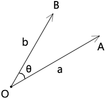
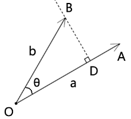
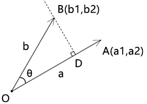

## 前言

叉乘又叫叉积、外积。

回顾点积的名字，它还叫內积。

那么叉积和点积，外积和內积，是不是如其名字样有所关联呢？

这个答案是肯定的。

叉乘是两个向量的交叉相乘，所以叫叉乘。

叉乘的返回值如点积一般，是一个实数，此数有正负。

使用叉乘可以计算计算以两个向量为临边的平行四边形和三角形的面积，以此原理便可以计算户型图的面积。

我们之前说过，向量可以用坐标点位表示，也可以用方向和长度表示。

所以叉乘的求值方式也有两种：

- 基于向量的长度和夹角求叉乘
- 基于向量的坐标点求叉乘

接下来咱们就详细说一下这两个求叉乘的方式。


## 第一章 基于向量的长度和夹角求叉乘

### 1-基本公式



已知：

- 向量a的长度是|a|
- 向量b的长度是|b|
- 向量a和向量b的夹角是θ

则向量a和向量b的叉乘为：

```js
a^b=|a|*|b|*sinθ
```

上面的公式就是基于向量的长度和夹角求叉乘的公式。

这时，有的同学可能会疑惑，为什么这么写就是叉乘的公式了？这么做有什么意义吗？还是它暗合了图形的某种规律？

为了解开这个谜团，接下来咱们说一下向量的正投影。


### 2-向量在轴上的正射投影

我们先分析一下向量的叉乘公式：

```js
a^b=|a|*|b|*sinθ
```

在这里面我们看见了|b|*sinθ，而在三角函数里有这么一个公式：

```js
sinθ=y/r
y=r*sinθ
```

对比上面的公式，我们可以猜测：

- |b|是不是可以作为斜边？
- |b|*cosθ 是不是一条对边？

那咱们画个图看一下：



过点B 做OA的垂线BD，则：

```js
BD=|b|*sinθ
```

向量BD就叫做向量OB在向量OA的垂线上的正射投影。

因此，叉乘可以看成向量b在向量a的垂线上的正射投影和向量a的长度的乘积。

接下来，咱们根据上图分析一下叉乘的性质：

- 正射投影的值是个实数，可正可负。
- 两个向量的夹角的值域是[-180°,180°]
- 两个向量的夹角和叉乘的关系：
  - 当θ=90° 时，b⊥a ，正射投影=|b|，叉乘=|a|*|b|
  - 当θ=-90° 时，b⊥a ，正射投影=-|b|，叉乘=-|a|*|b|
  - 当θ=0°或180° 时，正射投影=0，叉乘=0
  - 当θ∈(0°,180°) 时，正射投影>0，叉乘>0
  - 当θ∈(-180°,0°) 时，正射投影<0，叉乘<0
- a^b≤|a|\*|b|，因为叉乘可正、可负、可零，|a|*|b|≥0

关于叉乘的由来我就说到这，接下来咱们说一下叉乘的运算规律。


### 3-叉乘的运算律

#### 3-1-交换律

```js
a^b=-b^a
```

简单论证一下：

由叉乘的定义得：

```js
a^b=|a|*|b|*sin<a,b>
b^a=|b|*|a|*sin<b,a>
```

因为：<a,b>和<b,a>互为相反数

所以：sin<a,b>和sin<b,a>互为相反数

所以：a^b和b^a互为相反数

所以：

```
a^b=-b^a
```

注：

如果我们将点积理解为加法，那叉乘就像减法，如;

```js
a+b=b+a
A*b=b*a

a-b=-(b-a)
a^b=-b^a
```


#### 3-2-分配率

```js
(a+b)^c=a^c+b^c
```

这里我就不再论证了，可参考点积的论证思路。


#### 3-3-其它公式

将向量的交换律和分配率结合起来，还可以推出其它公式。

```js
(a+b)²=a²+2ab+b²
(a+b)*(a-b)=a²-b²
```


## 第二章 基于向量的坐标点求叉乘

### 1-基本公式



已知：

- 向量a和向量b所在的坐标系为二维直角坐标系
- 向量a的坐标点位是(a1,a2)
- 向量b的坐标点位是(b1,b2)

则向量a和向量b的叉乘为：

```js
a^b=a1*b2-a2*b1
```

上面的公式就是基于向量的坐标点求叉乘的公式。

至于这个公式是怎么来的，咱们可以用图形来论证一下。


已知：

- 向量OA=a=(a1,a2)
- 向量OB=b=(b1,b2)
- ∠<a,b>=θ

求证：

```
a^b=a1*b2-a2*b1
```

证：

因为：

叉乘是向量b在另一个向量a的垂线上的正射影与向量a的长度的乘积。

所以：

叉乘可视之为以向量a、b为临边的平行四边形的面积。

所以：

```
S▱OACB=|a|*|b|*sinθ
```

接下来我们用坐标点求一下S▱OACB

由图可知：

S▱OACB等于包含了▱OACB的矩形OC1CC1的面积，减去除▱OACB 之外的部分。

所以：

```js
S▱OACB=(a1+b1)*(b2+a2)-b1*a2-a1*a2/2-b1*b2/2-b1*a2-b2*b1/2-a2*a1/2
S▱OACB=a1*b2+b1*b2+a1*a2+b1*a2-b1*a2-a1*a2/2-b1*b2/2-b1*a2-b2*b1/2-a2*a1/2
S▱OACB=a1*b2+b1*b2+a1*a2+b1*a2-2*b1*a2-a1*a2-b1*b2
S▱OACB=a1*b2-b1*a2
```

所以：

```js
a^b=a1*b2-b1*a2
```


## 第三章 用叉乘计算多边形的面积

之前我们用叉乘计算出了以向量a、b为邻边的平行四边形的面积。

那么以向量a、b为邻边的三角形面积也可以迎刃而解，即平行四边形的面积的一半。

利用这个原理我们便可以去求多边形的面积，无论这个多边形是凸多边形还是凹多边形。


### 实例

  

已知：点A、点B、点C、点D的坐标位

求：多边形ABCD的面积

解：

多边形ABCD的面积可以理解为：

```
S△ACD-S△ABC
```

所以我们可以将其拆成两个三角形来分析：

由叉乘公式可知:

```js
S△ABC=AB^AC/2
S△ACD=AC^AD/2
```

在此我们还要知道叉乘的结果是有正负的，因为一个向量在另一个向量的垂线上的正射影是有正负的。

因此，我在我在计算两个三角的面积的时候是按照多边形从x轴正方向到y轴正方向的绘制顺序排列向量的。

所以，通过坐标系不难看出：

```js
-90°<∠BAC<0
90°>∠CAB>0
```

所以：

```js
sin∠BAC<0
sin∠CAB>0
```

因为：

```js
AB^AC=|AB|*|AC|*∠BAC
AC^AD=|AC|*|AD|*∠CAD
```

所以：

```js
AB^AC<0
AC^AD>0
```

所以多边形ABCD的面积就是：

```js
(AB^AC+AC^AD)/2
```


### 总结

此理适用于更多边数的多边形，其公式为：

```js
多边形面积 = (a^b + b^c + ... + f^g)/2
```

