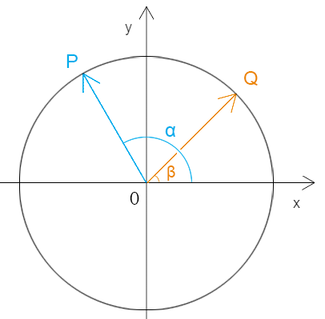
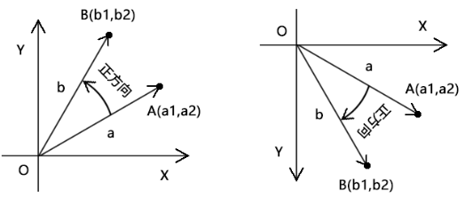
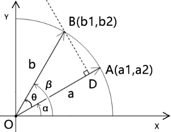

## 前言

通过这么长的标题，大家必然会想到这4个名词之间是有联系的，不然我也就没法将他们共治一炉画个你看了。

我们先回顾一下这四个公式。


## 第一章 基本公式

### 1-三角函数和角公式



- 余弦的两角差与和

```js
cos(α-β)=cosα*cosb+sinα*sinb
cos(α+β)=cosα*cosb-sinα*sinb
```

- 正弦的两角差与和


```js
sin(α-β)=cosβ*sinα-cosα*sinβ
cos(α+β)=cosβ*sinα+cosα*sinβ
```


### 2-向量的点积与叉乘


- 点积公式和性质

```js
a*b=|a|*|b|*cos<a,b>
a*b=a1*a2+b1*b2
a*b=b*a
```


- 叉乘公式和性质

```js
a^b=|a|*|b|*sin<a,b>
a^b=a1*b2-a2*b1
a^b=-b^a
```

叉乘是有点特别的，因为在a^b时，我们得给它定一个叉乘顺序。

无论在计算机图形中，还是在数学中，都有一个规则：

- 按照最小夹角，x轴正半轴转向y轴正半轴的方向为正方向，其旋转夹角大于0，如下图：

  

  可记做：

```
∠xoy>0
```

- 按照最小夹角，y轴正半轴转向x轴正半轴的方向为负方向，其旋转夹角小于0，如下图：

  

  可记做：

```js
∠yox<0
```

注：∠xoy也可以省略原点，写做<x,y>

我们在读角的时候亦是此理：

∠aob可理解为以向量a上一点为起点，以点o为顶点，以向量b上一点为结束点，画一条折线，若绘制方向为正方向，则∠aob>0，如下图：




否则∠aob<0，如下图：


综上所述，我们可以得到如下性质：

- <a,b>和<b,a>互为相反数
- sin<a,b>和sin<b,a>互为相反数
- a^b和b^a互为相反数


## 第二章 规律总结

### 1-余弦两角之差和点积的关系

我们先从简单的单位圆说起。

#### 1-1-在单位圆中余弦的两角之差和点积的关系

在单位圆里，向量a、b 的点积和它们的弧度之差的余弦值是一样的。即：

```js
a*b=cos(β-α)
```

因为：余弦中cosθ=cos(-θ)

所以，下式也成立：

```js
a*b=cos(α-β)
```

接下来咱们证明一下：




已知：

- 点A(a1,a2)
- 点B(b1,b2)
- 点A、点B 是单位圆上的两点
- ∠xOA=α
- ∠xOB=β
- ∠AOB=θ

则：

```js
cos(β-α)=cosθ
|a|=1
|b|=1
a1=cosα
a2=sinα
b1=cosβ
b2=sinβ
```

因为：

```js
a*b=a1*b1+a2*b2
a*b=|a|*|b|*cosθ
```

所以：

```js
a*b=cosα*cosβ+sinα*sinβ
a*b=cosθ
```

因为：

```js

cos(β-α)=cosα*cosβ+sinα*sinβ
```

所以：

```js
cos(β-α)=a*b
```

由此可见：

在单位圆里，向量a、b 的点积和它们的弧度之差的余弦值是一样的。即：

```js
a*b=cos(β-α)
```

变换思维，还可以扩展出其它公式：

```js
a*b=b*a
cos(β-α)=cos(α-β)
a*b=cos(α-β)
```


上面便是单位圆中余弦两角之差和和点积的关系。

那么如果是非单位圆呢？您且细听分说。


#### 1-2-非单位圆中余弦两角之差和点积的关系

将上面的点A、点B改成半径为r的圆上的两点。

则：

```js
|a|=r
|b|=r
a1=cosα*r
a2=sinα*r
b1=cosβ*r
b2=sinβ*r
```

因为：

```js
a*b=a1*b1+a2*b2
a*b=|a|*|b|*cosθ
```

所以：

```
a*b=(cosα*cosβ+sinα*sinβ)*r²
a*b=cosθ*r²
```

所以：

```js
a*b=cos(β-α)*r²
a*b=cos(α-β)*r²
```

上面便是非单位圆中余弦两角之差和点积的关系。


#### 1-3-余弦和角的应用思考

单位圆中两角之差的余弦可以理解为以两角之差为夹角，长度为1的两个向量的点积。

半径为r的圆中两角之差的余弦可以理解为以两角之差为夹角，长度为r的两个向量的点积除以r²。

那么两角之和的余弦可以理解为什么呢？

单位圆中两角之和的余弦可理解为一个点位旋转θ度后的x位置。

举个例子。


已知：

- 点A(a1,a2) 
- |a|=1
- 点A要旋转θ度，旋转到点B

求：点B的x位置b1

解：

由余弦和角定理得：

```js
cos(α+θ)=cosα*cosθ-sinα*sinθ
```

因为：

```js
β=α+θ
```

所以：

```js
cosβ=cosα*cosθ-sinα*sinθ
```

因为：

```js
|a|=1
```

所以：

```js
|b|=1
```

所以：

```js
b1=|b|*cosβ
b1=cosα*cosθ-sinα*sinθ
```

接下来，简单延伸一下。

如果这个圆不是单位圆，而是半径为r的圆，那b1 可以这么求：

```js
b1=r*cosβ
b1=r*(cosα*cosθ-sinα*sinθ)
```


### 2-正弦两角之差和叉乘的关系

我们先从简单的单位圆说起。

#### 1-1-在单位圆中正弦的两角之差和叉乘的关系

在单位圆里，向量a叉乘向量b 和向量b的弧度减向量a的弧度的正弦值是一样的。即：

```js
a^b=sin(β-α)
```

因为：余弦中sinθ=-sin(-θ)

所以，下式也成立：

```js
a^b=-sin(α-β)
```

接下来咱们证明一下：


已知：

- 点A(a1,a2)
- 点B(b1,b2)
- 点A、点B 是单位圆上的两点
- ∠xOA=α
- ∠xOB=β
- ∠AOB=θ

则：

```js
sin(β-α)=sinθ
|a|=1
|b|=1
a1=cosα
a2=sinα
b1=cosβ
b2=sinβ
```

因为：

```js
a^b=a1*b2-a2*b1
a^b=|a|*|b|*sinθ
```

所以：

```js
a^b=cosα*sinβ+sinα*cosβ
```

因为：

```
sin(β-α)=cosα*sinβ+sinα*cosβ
```

所以：

```js
sinθ(β-α)=a^b
```

由此可见：

在单位圆里，向量a叉乘向量b 和向量b的弧度减向量a的弧度的正弦值是一样的。即：

```js
a^b=sin(β-α)
```

变换思维，还可以扩展出其它公式：

```js
a^b=-b^a
a^b=-sin(α-β)
b^a=sin(α-β)
b^a=cosβ*sinα-cosα*sinβ
sin(α-β)=cosβ*sinα-cosα*sinβ
sin(α+β)=cosβ*sinα+cosα*sinβ
```

上面便是单位圆中正弦两角之差和叉乘的关系。

那么如果是非单位圆呢？您且细听分说。


#### 1-2-非单位圆中正弦两角之差和叉乘的关系

将上面的点A、点B改成半径为r的圆上的两点。

则：

```js
|a|=r
|b|=r
a1=cosα*r
a2=sinα*r
b1=cosβ*r
b2=sinβ*r
```

因为：

```js
a^b=a1*b2-a2*b1
a^b=|a|*|b|*sin(β-α)
```

所以：

```
a^b=(cosα*sinβ-sinα*cosβ)*r²
a^b=sin(β-α)*r²
```

所以：

```js
a^b=sin(β-α)*r²
```

上面便是非单位圆中余弦两角之差和点积的关系。


#### 1-3-正弦和角的应用思考

之前我们可通过余弦的和角公式求出点A旋转θ度后的x位置，即点B中的b1。

那么通过正弦的和角公式，我们就可以求出点A旋转θ度后的y位置，即点B中的b2。

举个例子。


已知：

- 点A(a1,a2) 
- |a|=r
- 点A要旋转θ度，旋转到点B

求：点B的y位置b2

解：

由余弦和角定理得：

```js
sin(α+θ)=cosθ*sinα-sinθ*cosθ
```

因为：

```js
β=α+θ
```

所以：

```js
sinβ=cosθ*sinα-sinθ*cosθ
```

所以：

```js
b2=r*sinβ
b2=r*(cosθ*sinα-sinθ*cosθ)
```

### 

### 3-点积和叉乘的关系


对比点积和叉乘的公式：

```js
a*b=|a|*|b|*cosθ
a^b=|a|*|b|*sinθ
```

可知：

点积是向量b在向量a上的正射影乘以向量a的长度。

如果向量a 是x轴，那么点积的结果就是一种x轴数据。

这就是为什么我们可以通过点积求得一点旋转后的x值。

叉乘是向量b在向量a的垂线上的正射影乘以向量a的长度。

如果向量a 是x轴，那么叉乘的结果就是一种x轴数据。

这就是为什么我们可以通过叉乘求得一点旋转后的y值。