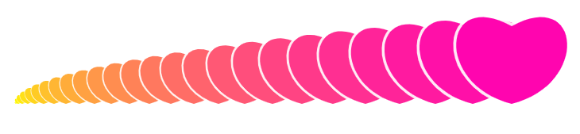

## 第一章 基本概念回顾

### 1-点斜式

点斜式的公式是：

```js
y=kx+b, (k≠0)
```

- k：斜率
- b：截距
- x：自变量，其定义域为组成直线的所有坐标点的x值
- y：因变量，其值域为为组成直线的所有坐标点的y值

由上式还可以知道：

- 直线没有长度的概念；
- 直线只有斜率和截距的概念。

那向量和点斜式有什么关系呢？

我们再回顾一下向量。


### 2-向量

确定一条向量的方式有两种：

- 基于方向、长度定向量
- 基于坐标点位定向量

向量的基线就是一条直线，这就向量和直线的一种关系。

接下来咱们就寻找一下这条直线。


### 3-求一个向量所在基线的点斜式

设：向量OA(ax,ay)

求：向量a的基线l的点斜式

解：

先计算直线l截距b

因为：

向量的始点在原点上

所以：

```
b=0
```

再求一下斜率k。

由点斜式的概念可知：

```js
k=ay/ax
```

所以向量a的点斜式就是：

```
y=(ay/ax)*x
```

这就是通过一个向量获取其基线的方法。

然而，通过上面的论证，我们可以发现一个问题：

通过一个始点在零点的向量，只能得到截距为0的直线。

那通过两个向量，能否确定所有直线的斜截式呢？

这是必须的，因为向量既是点位，两点确定一条直线，这是小学的知识。

那我们如何通过两点得到一条直线的点斜式呢？

咱们算一下。


### 4-求量两个向量所在基线的点斜式

设:

- 向量OA(ax,ay)
- 向量OB(bx,by)

求：由向量OA、OB的终点连而成的直线l 的点斜式

解：

先算截距b

计算以点A为始点，以点B为终点的向量AB 

```js
AB=(bx-ax,by-ay)
```

计算向量AB所对应的直线的斜率：

```js
k=(by-ay)/(bx-ax)
```

向量AB所对应的直线的点斜式就是：

```js
y=k*x
```

将向量OA中的ax代入上式，可得一个y值

```js
y1=k*ax
```

将向量OA中的ay减去此y1，便可得直线l 的截距

```js
b=ay-y1
```

因此，直线l 的点斜式就是：

```js
y=k*x+b
```

关于通过两个向量获取其所连接而成的直线的点斜式的方法，我就说到这。

那我费劲吧啦的说了这么多，有啥用呢？

我学数学的目的，是要让数学为艺术提供无限的可能性。

那接下来，就让数学回归艺术。

做前端的，应该都知道echarts。

echarts 里面有一个颜色映射的功能，可以将数据映射到图形样式中。

接下来，咱们就用刚才说活的知识推一下其实现思路。


## 第二章 视觉映射

接下来我们将一排散点的半径和颜色做映射。

我们将半径、颜色分别视之为一个向量的两个分量。

已知:

- 向量OA(1,0)
- 向量OB(50,255)

求：由向量OA、OB的终点连而成的直线l 的点斜式

解：

先算截距b

计算以点A为始点，以点B为终点的向量AB 

```js
AB=(50-1,255-0)
AB=(49,255)
```

计算向量AB所对应的直线的斜率：

```js
k=255/49
```

向量AB所对应的直线的点斜式就是：

```js
y=k*x
```

将向量OA中的ax代入上式，可得一个y值

```js
y1=255/49*1
y1=255/49
```

将向量OA中的ay减去此y1，便可得直线l 的截距

```js
b=1-255/49
```

因此，直线l 的点斜式就是：

```js
y=k*x+b
```

以此原理，我们可以来段canvas 代码：

```js
const canvas=document.getElementById('canvas');
const [w,h]=[window.innerWidth,window.innerHeight];
canvas.width=w;
canvas.height=h;
const ctx=canvas.getContext('2d');
const scene=new Group({
    position:new Vector2(100,h/2),
});

const OA=new Vector2(1,0);
const OB=new Vector2(50,255);

const AB=OB.clone().sub(OA);
const k=AB.y/AB.x;

const b=OA.y-k*OA.x;

function scaler(x){
    return k*x+b;
}

let px=0;
for(let i=1;i<50;i+=2){
    px+=i;
    const n=scaler(i);

    const obj=new Ball({
        fill:true,
        fillStyle:`rgb(${n},${n},${n})`,
        r:i,
        orign:new Vector2(px,0)
    })
    scene.add(obj);
}

scene.draw(ctx);
```

以此原理，我们可以实现这样的效果：


上图中，小球的大小和颜色是相映射的。

换个形状，换个颜色，还可以这样：



以原理，我们还可以制作比例尺，让不同坐标基底的数据轴形成映射关系，比如echarts 中图表坐标系和画布坐标系的映射。这里我就不再一一举例啦。

[源码地址](https://github.com/buglas/interview-01/blob/master/test/12-%E5%90%91%E9%87%8F%E5%92%8C%E7%9B%B4%E7%BA%BF%E7%9A%84%E5%90%88%E4%BD%93/01-%E8%A7%86%E8%A7%89%E6%98%A0%E5%B0%84.html)


