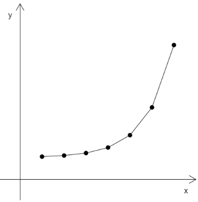
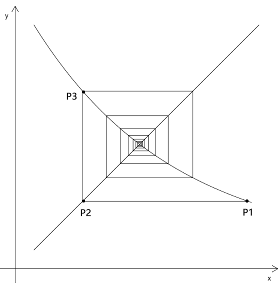

## 前言

前段时间在研究四元数，公式用法一看就懂，但推导原理有些复杂，卡复数上了。

所以，回头再补下基础，把没看完的那几本高中数学看完。


## 第一章 数列

### 1-数列概念

1. 数列：按照一定顺序排列起来的一列数。

   比如：{2,4,8,16……}

2. 数量中还包含了以下概念：

- 项：数列中的每一个数
- 通项：数列的第n 项，如an
- 一般形式数列的简写：{an}

- 通项公式：将an 和n 的关系用函数式来表示的公式，如an=f(n)

3. 数列an中每一项的序号n 与此项an 值的关系，可以视之为序号集合到另一个数的集合的映射。

   如上例中：序号1映射2，序号2映射4，序号3映射8，……

4. 数列的通项公式也可以理解为以数列的项为因变量，以序号为自变量的函数。

   如上例：an=f(n)=pow(2,n)


### 2-数列的表示方法

数列作为一种特殊的函数，可以用列表法和图像法表示。

如上例可以如下表示：

列表法：

```js
n =[1,2,3,……]
an =[2,4,8,……]
```

图像法：




数列的定义域n 是正整数N+，或N+ 的有限子集

将n 视之为二维直角坐标系中的x 轴刻度值，那么an 就是直线或曲线图像上的孤立点

根据数列的项数是否有限，数列可以分为两种：

- 有穷数列：项数有限的数列
- 无穷数列：项数无限的数列

基于数列的增减，数列分为：

- 递增数列
- 递减数列
- 常数列


### 3-数列的递推公式

已知数列第1项，或前几项，从其第2项，或某一项，开始的任一项an 和前一项an-1，或前几项间的关系，可以用递推公式表示。

如，an=pow(2,n) 的递推公式为：

```js
a1=2
an=2*an-1
```

接下来我们举个例子：




已知：

- 直线l：y=x
- 曲线c:  y=pow(0.2,x)
- p1 在c 上
- 过p1 点做x轴的平行线交l 于点p2，在从p2点做y 轴的平行线，交c于点p3，以此论推，形成螺旋线

求：用递推公式绘制螺旋线

解：

在这里我直接写js解了

建立l和c的函数

```js
/*定义域*/
const domain=[0,600]
/*直线函数*/
function lf(x){
    return x
}
/*曲线函数*/
function cf(x){
    return Math.pow(0.2,x/domain[1])*600
}
```

建立数列的第一项

```js
const x1=domain[1]-30
const p1=new Vector2(x1,cf(x1))
const sps=[p1]
```

从第一项开始结算后面的点

```js
const len=sps.length
for (let i=len;i<30;i++){
    const pn=new Vector2()
    if(i%2){
        pn.y=sps[i-1].y
        pn.x=lf(pn.y)
    }else{
        pn.x=sps[i-1].x
        pn.y=cf(pn.x)
    }
    sps.push(pn)
}
```

上面的n.y=sps[i-1].y 和pn.x=sps[i-1].x 便是对递推公式的运用

[源码地址](https://github.com/buglas/interview-01/blob/master/test/14-%E6%95%B0%E5%88%97/02-%E8%9E%BA%E6%97%8B%E7%BA%BF.html)


## 第二章 等差数列

### 1-等差数列的概念

等差数列an：数列中，从第二项起，前一项减后一项的差都等于同一个常数的数列

公差d：等差数列的差

等差数列的通项公式：

```
an=a1+(n-1)*d
```

由上式，可得：

```js
a1=an-(n-1)*d
```


### 2-等差数列的前n项和

#### 2-1-已知a1、an、n求等差数列的前n项和

等差数列{an}的前n项和的公式：

```js
Sn=n(a1+an)/2
```

等差数列前n项和的推导：

```js
Sn=a1+a2+a3+……+an
```

由等差数列的通项公式可得：

```js
Sn=a1+(a1+d)+(a1+2d)+……+(a1+(n-1)*d)
Sn=an+(an-d)+(an-2d)+……+(an-(n-1)*d)
```

将上上面的两个公式相加，可以消掉公差d

```js
2Sn=n(a1+an)
Sn=n(a1+an)/2
```


#### 2-2-已知a1、公差、n求等差数列的前n项和

将下式的an替换成等差数列的通项公式

```
Sn=n(a1+an)/2
```

得：

```js
Sn=n(a1+a1+(n-1)*d)/2
Sn=n*a1+n*(n-1)*d/2
```


#### 2-3-等差数列的扩展

等差数列反应在动画中，就是匀速运动。

比如一个小球第1秒跑了a1米，其速度是d米/秒，则n秒后，小球跑了多少米？

```
an=a1+(n-1)*d
```

等差数列的坐标图像是一条直线，所以可以用点斜式思考等差数列：

```js
y=kx+b
```

其对应关系如下：

- an：y
- n：x
- a1：b，b是截距，即x=0时y的值，a1是x=1对应的y值
- d：k，k和d都斜率，斜率可以理解为前后两个单位的x所对应的y值的差


### 第三章 等比数列

### 1-等比数列的概念

等比数列：从第2项起，每一项与其前一项的比值等于同一个常数的数列

公比：等比数列每一项间的比值，通常用字母q(q≠0)表示

通项公式：

```
an=a1*pow(q,n-1)，(a1≠0,q≠0)
```

通项公式的推导方法有2种：

推导一：

```
a1=a1
a2=a1*q=a1*pow(q,1)
a3=a2*q=a1*q*q=a1*pow(q,2)
a4=a3*q=a1*q*q*q=a1*pow(q,3)
……
an=a1*pow(q,n-1)
```

推导二：

```js
a2/a1=q=pow(q,1)
a3/a1=q*q=pow(q,2)
a4/a1=q*q*q=pow(q,3)
a5/a1=q*q*q*q=pow(q,4)
……
an/a1=pow(q,n-1)
```

所以：

```js
an= a1*pow(q,n-1)
```


### 2-等比中项

等比中项：等比数列{x、G、y} 中的G

等比中项的方程式：

```js
G/x=y/G
G²=x*y (x*y>0)
```

由上式可知：

- x、y 的正负值要相同，不可一正一负
- G 有两个，一正一负，互为相反数


### 3-等比数列的前n项和

#### 3-1-求和公式

设等比数列的前n项和为Sn，则：

- 当公比q=1 时：

```js
Sn=n*a1
```

- 当公比q≠1 时：
  已知a1，an、公差q，则：

```js
Sn=(a1-an*q)/(1-q)
```

​		已知a1，n、公差q，则：

```
Sn=a1*(1-pow(q,n))/(1-q)
```


#### 3-2-推导公式

设等比数列{an}的公比为q，由等比数列的定义得：

```
a2=a1*q
a3=a2*q
a4=a3*q
……
an=a(n-1)*q
```

将上式的等号两侧依次相加，得：

(a2+a3+……+an)=(a1+a2+……+a(n-1))*q

设等比数列的前n 项和为Sn，由上式得：

```js
Sn-a1=(Sn-an)*q
Sn-a1=Sn*q-an*q
Sn-Sn*q=a1-an*q
(1-q)*Sn=a1-an*q
Sn=(a1-an*q)/(1-q)
```

因为：

```
an=a1*pow(q,n-1)
```

所以：

```js
a1-an*q=a1-a1*pow(q,n-1)*q
a1-an*q=a1(1-pow(q,n))
```

所以：

```
Sn=a1(1-pow(q,n))/(1-q)
```


#### 3-3-扩展

等比数列的通项式是一个指数函数，在实际项目中可以用于制作缓动动画，如鼠标跟随。


