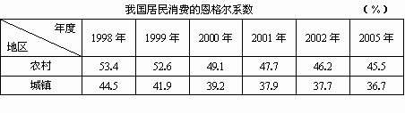
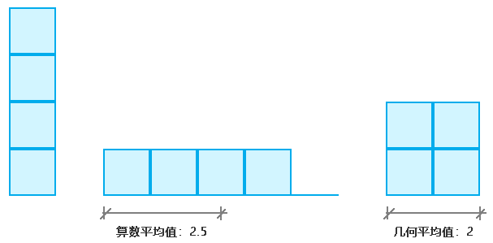
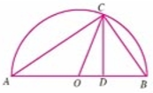

## 前言

不等式从字面意义上来看，是比较简单的，就是a不等b的概念。

然而，不等式在实际生活中，可以延伸出很多非常实用、非常重要的功能。

比如：

- 分段集合中的恩格尔系数：

  

- 用二元一次不等式将生产收益最大化。


## 第一章 不等关系与不等式

### 1-不等式的概念

不等式：量和量之间不相等的关系式，比如a≠b，a≥b

我们可以通过坐标轴来比较两个量的大小。

比如方向朝右的x轴上任意两点，那么右边的永远比左边的大。

设这两点分别为a、b。

那么a、b 之间必然存在以下三种关系中的一种：

- a<b
- a=b
- a>b

我们也可以用数学算法比较两个量的大小，判断其关系：

- 当a-b>0，则a>b
- 当a-b<0，则a<b
- 当a-b=0，则a=b

我们可以用命题来表示这种推导关系。

“如果p，则q” 为真命题，可记做：

```
p⇒q
```

“p⇒q” 并且“q⇒p”，可记做：

```js
p⇔q
```

上式可读作：p等价于q，或q等价于p

因此，上述结论可写做：

```js
a-b>0⇔a>b
a-b<0⇔a<b
a-b=0⇔a=b
```


### 2-不等式的性质

1. 对称性：若a>b，则b<a，反之亦然。

2. 传递性：若a>b，b>c，则a>c

3. 若a>b，则a+c>b+c

4. 移项法则：不等式中的任意一项，都可以把它的符号变成相反符号后，移到不等式的另一边

   如：a>b，可变换为 a-b>0

5. 同向不等式：不等号的方向相同的不等式。

   多个同向不等式两边相加，所得到的不等式与原不等式同向。

   如：a>b,c>d, 则a+c>b+d

6. 不等式的乘法
   - 若a>b，c>0，则
   - 若a>b，c<0，则a*c<b*c
   - 若a>b>0，c>d>0，则a*c>b*d

7. 不等式的指数算法
   - 若a>b>0，n>1，则pow(a,n)>pow(b,n)
   - 若a>b>0，n>1，则sqrt(a,n)>sqrt(b,n)


## 第二章 均值不等式

### 1-均值不等式的概念

均值定理：

```js
(a+b)/2>=sqrt(a*b)，a,b∈R+
```

均值不等式的性质:

- 仅且仅当a=b时，等号成立。
- 当a*b的值不变时，则a+b有最小值
- 当a+b的值不变时，则a*b有最大值

从均值不等式中我们还可以提取以下概念：

- 算数平均值：

```js
(a+b)/2，a,b∈R+
```

- 几何平均值：

```js
sqrt(a*b)，a,b∈R+
```

两个正实数的算数平均值，大于等于它们的几何平均值。

我们可以用几何图形理解算数平均值和几何平均值的概念。

比如：有四个边长1正方向，他们可以任意组合成边长为a、b的矩形

当四个正方形排成一排时：

- 算数平均值为：

```
(a+b)/2=(1+4)/2
(a+b)/2=2.5
```

- 几何平均值：

```
sqrt(a*b)=sqrt(1*4)
sqrt(a*b)=2
```

此时的算数平均值大于几何平均值。

那什么时候两者相等呢？a=b的时候，也就是四个正方向拼成的矩形为正方形的时候。

当a=2，b=2时：

```js
(2+2)/2=sqrt(2*2)
```

如下图：




### 2-用数学算法证明均值不等式

对均值不等式进行移项：

```js
(a+b)/2-sqrt(a*b)>=0
(a-2*sqrt(a*b)+b)/2>=0
a-2*sqrt(a*b)+b>=0
```

用解一元二次方程式的原理，解一下上面的不等式。

因为：

```js
a=sqrt(a)²
b=sqrt(b)²
```

所以：

```js
a-2*sqrt(a*b)+b=sqrt(a)²-2*sqrt(a*b)+sqrt(b)²
a-2*sqrt(a*b)+b=(sqrt(a)-sqrt(b))²
```

所以：

```
(sqrt(a)-sqrt(b))²>=0
```

因为：

```js
a²>=0
```

所以均值定理成立


### 3-用直角三角形证明均值不等式



在圆O上取一点C，过点C做线段CD垂直于圆O的半径AB，点D为垂足。

设：AD=a，DB=b，AB=a+b

求证：(a+b)/2>=sqrt(a*b)

因为：

OC是圆O的半径

所以：

```js
OC=(a+b)/2
```

所以：

OC 是a、b的算数平均值。

因为：

```
tanA=CD/AD
```

所以：

```
CD=AD*tanA
```

同理：

```
CD=b*tanB
```

由矩形对角线相互等分且相等，得：

∠ACB=90°

因为：

```js
∠A=180°-90°-∠B
∠BCD=180°-90°-∠B
```

所以：

```js
∠A=∠BCD
```

所以：

```js
CD=b*cot∠BCD
CD=b*cotA
```

所以：

```js
CD²=a*tanA*b*cotA
```

因为：

```
tanA*cotA=1
```

所以：

```js
CD²=a*b
CD=sqrt(a*b)
```

所以：

当a≠b时，a、b的算数平均值OC大于其几何平均值CD。

当且仅当a=b时，a、b的算数平均值OC与几何平均值CD重合，即相等。


## 第三章 一元二次不等式及其解法


## 


## 第四章 二元一次不等式组

### 1-二元一次不等式的概念

二元一次不等式：含有两个未知数，未知数的最高次为1的不等式。

如以下不等式组：

```js
x+y>700
10x+12y<=8000
x>=0
y>=0
```

不等式是值域是一个集合，因此二元一次不等式和不等式组的坐标图都可以理解为平面，借助此平面区域，我们可以更好的理解线性规划问题。


### 2-二元一次不等式(组)所表示的平面区域

二元一次不等式的一般形式：

```
Ax+By+C<0
```

或：

```
Ax+By+C>0
```

当我们将二元一次不等式变成等式的时候，便可以找到这个二元一次不等式对应的平面区域。

比如，已知直线l：Ax+By+C=0

我们可以得到以下概念：

- 开半平面：直线l 将坐标平面分成的每一部分。
- 闭半平面：开半平面与直线l 的并集。
- 不等式表示的区域：以不等式的解(x,y) 为坐标构成的集合，也叫不等式的图像。

直线两侧的点的坐标条件:

- 开半平面中的坐标点对应的Ax+By+C的值都具有相同的符号
- 两个开板平面中的坐标点对应的Ax+By+C的值的符号相反

通过此原理，可以用三条直线围成三角形，从而判断点和三角形的关系，我以前写过相关文章[《图形选择-网格选择》](http://yxyy.name/blog/md.html?ossName=16109600591458520245147085026.md&title=%E5%9B%BE%E5%BD%A2%E9%80%89%E6%8B%A9-%E7%BD%91%E6%A0%BC%E9%80%89%E6%8B%A9)。


### 3-简单线性规划   


