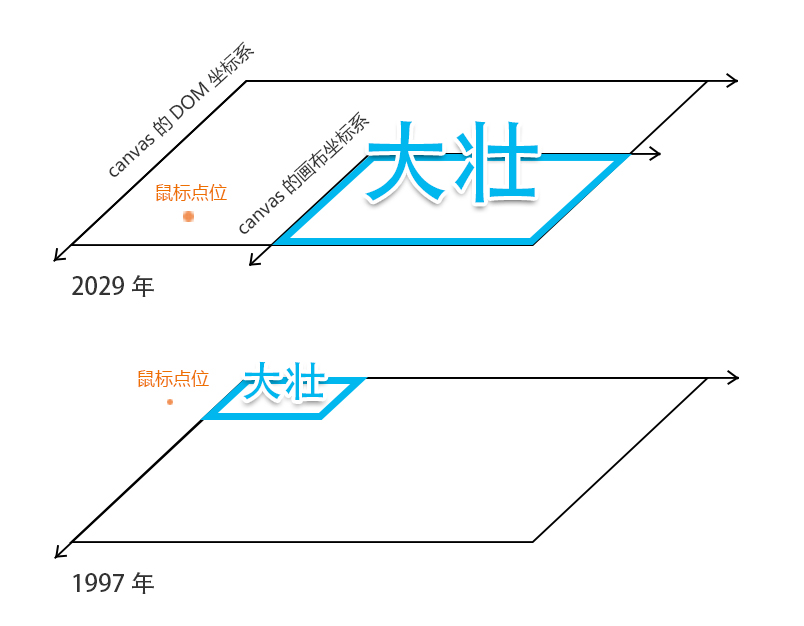
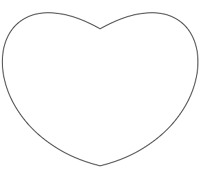
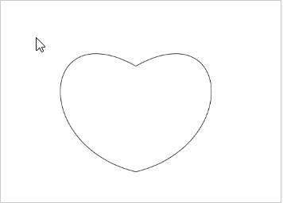
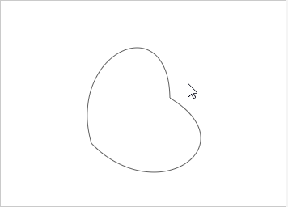

这一章，咱们来说鼠标如何选择变换后的图形。


## 一，物质不易的概念

物质不易法则：物质不变，空间不变；空间不变，时间不变。

### 1-楔子

在2029年末世之战的时候，终结者想干掉人类领袖大壮，可是大壮太强，而且其实力需要复杂运算才能知晓。

所以终结者就想回到1997年，在大壮实力弱小、且已知的情况下将其干掉。

这样，1997年的大壮没了，2029年末世之战中的人类领袖大壮也就不会存在。

接下来给大家解密终结者穿越时空的方法。

### 2-穿越时空的方法

1.终结者需要知道数据：

- 1997年大壮的初始属性，比如构成大壮轮廓的顶点集合；
- 大壮从1997到2029的变换信息，比如其大壮移动了多少、旋转了多少、长大了多少。

2.物质不易法则的运用

将物质不易法则逆推，依旧成立：物质改变，空间改变；空间改变，时间改变。

所以终结者想要回到1997 年，只要根据大壮的变换规则逆向变换自己的位置即可。

比如：

从1997年到2029年，大壮沿x 轴移动了100，沿y 轴移动了200，旋转了90度，变大了2倍。

终结者就要沿x 轴移动了-100，沿y 轴移动-200，旋转-90度，点位到当前原点的距离缩小2倍。

注意：终结者的变换顺序要和大壮的变换顺序一致；终结者改变的只是点位，点没有尺寸，其点位变换本质是基于坐标原点的位移。

当终结者穿梭到1997年的时候，就可以精准定位大壮。



接下来我们就在代码里走一下这个原理。


## 二，一次变换图形的选择

### 1-简单位移变换后的图形旋转

1.先画了一颗爱心，其所在的canvas 画布坐标系在x、y方向分别位移了(300,400)

```js
const poly=new Poly({
    position:new Vector2(300,400),
    stroke:true,
    close:true,
    crtPath:function(ctx){
        ctx.beginPath();
        ctx.moveTo(0,0);
        ctx.bezierCurveTo(-200,-50,-180,-300,0,-200);
        ctx.bezierCurveTo(180,-300,200,-50,0,0);
    }
});
poly.draw(ctx);
```



2.若我的鼠标想要选择这颗爱心，那它的位置就要基于爱心的变换信息反向变换：x、y方向分别位移(-300,-400)。

代码如下：

```js
const mousePos=getMousePos(event);
poly.crtPath(ctx);
const [nx,ny]=[
    mousePos.x-poly.position.x,
    mousePos.y-poly.position.y
];
const bool=ctx.isPointInPath(nx,ny);
```





图形变换中的位移说完了，那它的旋转、缩放也是同样道理，就是让鼠标位置基于图形的变换信息反向变换。


### 2-多种变换后的图形选择

1.对图形进行旋转、缩放。

```js
const poly=new Poly({
    position:new Vector2(400,500),
    rotation:Math.PI/4,
    scale:new Vector2(1.5,1.5),
    stroke:true,
    close:true,
    crtPath:function(ctx){
        ctx.beginPath();
        ctx.moveTo(0,0);
        ctx.bezierCurveTo(-200,-50,-180,-300,0,-200);
        ctx.bezierCurveTo(180,-300,200,-50,0,0);
    }
});
poly.draw(ctx);
```

2.把获取鼠标点在子级坐标系中的位置方法封装起来：

getMousePos(event,poly) ：

- event 鼠标事件
- canvas 画布
- obj 图形对象


```js
const getMousePos=function(event,canvas,obj=null){
    //获取鼠标位置
    const {clientX,clientY}=event;
    //获取canvas 边界位置
    const {top,left}=canvas.getBoundingClientRect();
    //计算鼠标在canvas 中的位置
    const x=clientX-left;
    const y=clientY-top;
    const mousePos=new Vector2(x,y);
    if(obj){
        const {position,scale,rotation}=obj;
        mousePos.sub(position);
        mousePos.rotate(-rotation);
        mousePos.divide(scale);
    }
    return mousePos;
};
```


上面，鼠标的位置mousePos、图形位置position、缩放信息scale 都是Vector2 对象，其中封装了关于向量的常用方法。如：

```js
export default class Vector2{
    constructor(x=0,y=0){
        this.x=x;
        this.y=y;
    }
    //减法
    sub(v){
        this.x -= v.x;
        this.y -= v.y;
        return this;
    }
    //基于原点旋转
    rotate(angle){
        const c = Math.cos( angle ), s = Math.sin( angle );
        const {x,y}=this;
        this.x = x * c - y * s;
        this.y = x * s + y * c;
        return this;
    }
    //向量除法
    divide ( v ) {
       this.x /= v.x;
       this.y /= v.y;
       return this;
    }
    //...
}
```


实际效果：




整体代码：

```html
<body>
    <canvas id="canvas"></canvas>
    <script type="module">
        import Vector2 from "./jsm/core/Vector2.js";
        import Poly from "./jsm/core/Poly.js";
        import {getMousePos} from "./jsm/utils/Tool.js";

        const canvas=document.getElementById('canvas');
        canvas.width=window.innerWidth;
        canvas.height=window.innerHeight;
        const ctx=canvas.getContext('2d');

        const poly=new Poly({
            position:new Vector2(400,500),
            rotation:Math.PI/4,
            scale:new Vector2(1.5,1.5),
            stroke:true,
            close:true,
            crtPath:function(ctx){
                ctx.beginPath();
                ctx.moveTo(0,0);
                ctx.bezierCurveTo(-200,-50,-180,-300,0,-200);
                ctx.bezierCurveTo(180,-300,200,-50,0,0);
            }
        });
        poly.draw(ctx);

        let hover=false;

        /*鼠标移动*/
        canvas.addEventListener('mousemove',mousemoveFn);
        function mousemoveFn(event){
            const {x,y}=getMousePos(event,canvas,poly);
            poly.crtPath(ctx);
            const bool=ctx.isPointInPath(x,y);
            if(hover!==bool){
                poly.fill=bool;
                ctx.clearRect(0,0,canvas.width,canvas.height);
                poly.draw(ctx);
                hover=bool;
            }
        }
    </script>
</body>
```


我们上面所说的图形，只是进行了一次变换。实际上，图形是可以进行多次变换的，接下来就给大家说一下多重变换后的图形选择。


## 三，多重变换图形的选择

先解释一下多重变换的应用场景：

图形A 在盒子B 中，盒子B 在盒子C 中。

当C 变换了，B 变换了，那么C 外的鼠标点在盒子B 中的点位是什么？我们只有知道了这个位置，才能正确的选择图形A。

### 1-变换走起

```js
const poly=new Poly({
    position:new Vector2(300,400),
    rotation:Math.PI/4,
    scale:new Vector2(0.7,0.7),
    stroke:true,
    close:true,
    crtPath:function(ctx){
        ctx.beginPath();
        ctx.moveTo(0,0);
        ctx.bezierCurveTo(-200,-50,-180,-300,0,-200);
        ctx.bezierCurveTo(180,-300,200,-50,0,0);
    }
});

const box=new Group({
    position:new Vector2(100,100),
    rotation:Math.PI/12,
    scale:new Vector2(0.8,0.8),
});
box.add(poly);

box.draw(ctx);
```


在上面，poly 自成一界，其中只有一颗爱心，贮藏着唯一的爱。

poly 被装进了一个box里，box 变了，poly 变了，唯我本心不变。


### 2-鼠标选择事件

鼠标选择事件还是和之前一样。

```js
/*鼠标移动*/
canvas.addEventListener('mousemove',mousemoveFn);
function mousemoveFn(event){
    const {x,y}=getMousePos(event,canvas,poly);
    poly.crtPath(ctx);
    const bool=ctx.isPointInPath(x,y);
    if(hover!==bool){
        poly.fill=bool;
        ctx.clearRect(0,0,canvas.width,canvas.height);
        poly.draw(ctx);
        hover=bool;
    }
}
```


### 3-鼠标选择的方法

getMousePos() 鼠标选择的方法已经大不一样，这是咱们这一章的核心。

```js
const getMousePos=function(event,canvas,obj=null){
    //获取鼠标位置
    const {clientX,clientY}=event;
    //获取canvas 边界位置
    const {top,left}=canvas.getBoundingClientRect();
    //计算鼠标在canvas 中的位置
    const x=clientX-left;
    const y=clientY-top;
    const mousePos=new Vector2(x,y);
    obj&&setPosInBottomObj(mousePos,obj);
    return mousePos;
};
/*将父级中的坐标点放入n级子坐标系*/
function setPosInBottomObj(p1,p2){
    const worlds=[p2];
    let {parent}=p2;
    while(parent){
        worlds.unshift(parent);
        parent=parent.parent;
    }
    worlds.forEach(p=>{
        setPosInSun(p1,p);
    })
    return p1;
}
/*将父级中的坐标点放入下一级坐标系*/
function setPosInSun(p1,p2){
    const {position,scale,rotation}=p2;
    p1.sub(position);
    p1.rotate(-rotation);
    p1.divide(scale);
    return p1;
}
```


上面代码的核心思想是：当图形发生了多重变换，我们就得让鼠标从图形最顶部，一层层下沉、变换，直到与图形所在的坐标系同级，这样才能对图形做出正确选择。

getMousePos() 方法中，先获取鼠标基于canvas 的位置，然后再用setPosInBottomObj() 方法计算鼠标点在一个子级坐标系中的位置，这个子级坐标系就是鼠标要选择的图形所在的坐标系

setPosInBottomObj() 方法中，先是用while 遍历图形顶层的所有父对象，将父对象用前置的方法放入worlds 集合中，一个父对象可以视之为一个world 世界，它们都有着独立的坐标系。

自顶向下遍历worlds 集合，改变鼠标点在每一层世界中的位置，直到进入和图形同级的世界，那么我们就可以判断鼠标点是否在图形中了。

setPosInSun() 便是设置鼠标点在下一级世界中的位置的方法，鼠标点进入一层世界，此方法便会执行一次。


好啦，关于多重变换后的图形选择我们就说到这。

其实图形图形选择的方法是有很多的，下一章我再跟大家说一个图形选择的方法：图形选择-网格选择


注：物质不易是我从修仙小说上看的，没有科学依据，只为辅助大家理解。

[源码地址](https://github.com/buglas/interview-01)


