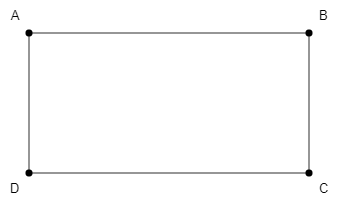
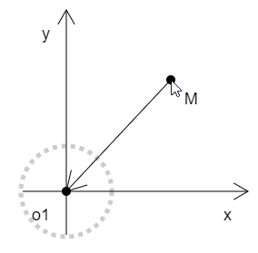
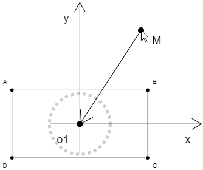

## 前言

canvas 的尺寸是有限的，比如ie和微信里的canvas宽高是限制在4096 像素的，因此我们在做东西的时候，尽量不要让canvas 超过4000。然而，我们在canvas 中画东西的时候，经常会超过这个尺寸，比如关系图。那我们就需要把canvas 当成一个相机视口，通过对相机的变换，实现对视野的缩放、位移和旋转。

效果如下：


### 课堂目标  

1. 理解视口变换的基本原理
2. 封装相机轨道控制器


### 知识点  

1. 向量的旋转、缩放和位移
2. 向量的多重变换


## 第一章 视口变换


### 1-向量的变换

我曾经写过向量的相关的文章，向量知识不足的同学需要点击下方链接，提前预习一下。

[点击进入向量文章](http://yxyy.name/blog/md.html?ossName=16075685641636504201598815276.md&title=%E6%BC%AB%E8%B0%88%E7%9B%B4%E7%BA%BF%E4%B9%8B%E5%90%91%E9%87%8F)。


### 2-搭建实验场景

实验场景的搭建，我是使用了一个我自己写的图形渲染引擎，点击下方链接可以查看源码。

[点击进入图形渲染引擎-interview-01](https://github.com/buglas/interview-01)

[点击进入实验场景](https://github.com/buglas/interview-01/blob/master/test/07-%E5%90%91%E9%87%8F%E5%BA%94%E7%94%A8/02-10-%E8%A7%86%E5%9B%BE%E5%8F%98%E6%8D%A2.html)


1.建立画布和画笔

```js
/*画布*/
const canvas=document.getElementById('canvas');
const [w,h]=[window.innerWidth,window.innerHeight];
canvas.width=w;
canvas.height=h;
/*画笔*/
const ctx=canvas.getContext('2d');
```


2.建立视图对象scene，用于承载所有用于实际展示的图形—矩形ABCD。

```js
/*视图对象*/
const scene=new Group({
    position:new Vector2(300,400),
    rotation:0,
    scale:new Vector2(0.7,0.7)
});
/*矩形*/
const rect=new Rect({
    position:new Vector2(-200,-100),
    size:new Vector2(400,200),
    stroke:true
});
rect.addModifier(new Lattice());
rect.addModifier(new Lattice({
    type:'Label',
    labels:['A','B','C','D'],
    fontSize:18
}));
scene.add(rect);
```


如下图：




3.建立界外对象outScene，在其中添加变换轨迹，其位置和旋转信息会与scene视图同步，缩放信息不会同步。

```js
/*界外对象*/
const outScene=new Group();
/*位移轨道*/
const moveOrbit=new Axis({
    position:scene.position,
    size:200,
    o:'o1'
})
moveOrbit.__defineGetter__('rotation',()=>scene.rotation);
outScene.add(moveOrbit);
/*旋转轨道*/
const rotateOrbit=new Ball({
    position:scene.position,
    r:50,
    stroke:true,
    lineDash:[5],
    lineWidth:5,
    strokeStyle:'rgba(0,0,0,0.2)'
});
outScene.add(rotateOrbit);

/*鼠标引导线*/
//鼠标点位
const mp=new Vector2();
//鼠标点弧度
let mr=0;
//引导线点位
const vertices=[mp,scene.position];
const mouseLine=new Poly({
    vertices,
    stroke:true,
});
mouseLine.addModifier(new Lattice());
mouseLine.addModifier(new Lattice({type:'Arrow'}));
mouseLine.addModifier(new Lattice({
    type:'Label',
    labels:[
        'M',
        ''
    ],
    fontSize:18
}));
outScene.add(mouseLine);
```

如下图：




4.渲染一下，便可看到效果。

```js
render();
/*渲染方法*/
function render(){
    outScene.update();
    scene.update();
    ctx.clearRect(0,0,canvas.width,canvas.height);
    outScene.draw(ctx);
    scene.draw(ctx);
}
```





### 3-鼠标交互

接下来，我们要用鼠标变换scene 视图，界外视图outScene 会随scene 视图位移和旋转。

1.建立三个用于交互判断的布尔对象：

```js
//鼠标是否在平移视图
let dragging=false;
//鼠标是否在旋转视图
let rotating=false;
//鼠标是否划上了旋转轨
let hoverRotateOrbit=false;
```


2.鼠标按下事件。

```js
/*鼠标按下事件
*   当鼠标滚轮按下时，开始拖拽
*   当鼠标左键按在旋转轨上时
*       开启旋转状态rotating
*       获取鼠标相对于视图位置的弧度mr
* */
canvas.addEventListener('mousedown',function(event){
    const {button}=event;
    if(button===1){
        dragging=true;
    }
    if(button===0&&hoverRotateOrbit){
        rotating=true;
        mr=mp.clone().sub(scene.position).angle();
    }
})
```


3.鼠标移动事件

```js
/*鼠标移动事件
*   获取鼠标在canvas 中的位置pos
*   更新旋转轨状态updateRotateOrbitStyle()
*       鼠标划上变红
*       鼠标离开变灰
*   当拖拽时，移动视图translate(pos)
*   当旋转时，旋转视图rotate(pos)
*   更新鼠标位置 mp
*   渲染render()
* */
canvas.addEventListener('mousemove',function(event){
    const pos=getMousePos(event,canvas);
    updateRotateOrbitStyle(pos)
    if(dragging){
        translate(pos);
    }
    if(rotating){
        rotate(pos);
    }
    mp.copy(pos);
    render();
})
```


接下来咱们分解一下上面涉及的方法：

- 更新旋转轨状态updateRotateOrbitStyle()

```js
/*更新旋转轨状态
*   获取鼠标到视图原点的距离mto
*   获取鼠标到旋转轨边界的距离subR
*   如果距离小于10，就激活旋转轨
*   否则，如果视图不处于旋转状态，置灰旋转轨
* */
function updateRotateOrbitStyle(pos){
    const mto=pos.clone().sub(scene.position);
    const subR=Math.abs(mto.length()-rotateOrbit.r);
    if(subR<10){
        actRotateOrbit();
    }else if(!rotating){
        unactRotateOrbit();
    }
}
/*激活旋转轨*/
function actRotateOrbit(){
    canvas.style.cursor='pointer';
    hoverRotateOrbit=true;
    rotateOrbit.strokeStyle='rgba(255,0,0,.3)';
}
/*置灰旋转轨*/
function unactRotateOrbit(){
    canvas.style.cursor='default';
    hoverRotateOrbit=true;
    rotateOrbit.strokeStyle='rgba(0,0,0,0.2)';
}
```


4.鼠标滚轮滚动事件

```js
/*鼠标滚轮滚动事件
*   获取鼠标在canvas 中的位置pos
*   更新旋转轨状态updateRotateOrbitStyle()
*   基于滚轮滚动方向设置缩放比例rate
*   缩放视图scale()
*   渲染render()
* */
canvas.addEventListener('mousewheel',function(event){
    const pos=getMousePos(event,canvas);
    updateRotateOrbitStyle(pos);
    const rate=event.wheelDelta>0?1.1:0.9;
    scale(mp,scene,rate);
    render();
})
/*缩放视图
*   获取鼠标到视图的距离delta
*   通过对delta进行数乘，更新视图在缩放后的位置position
*   通过rate 缩放比，缩放视图
* */
function scale(mousePos,scene,rate){
    const {position,scale}=scene;
    const delta=position.clone().sub(mousePos);
    position.copy(mousePos.clone().add(delta.multiplyScalar(rate)));
    scale.multiplyScalar(rate);
}
```


5.鼠标抬起事件

```js
/*鼠标抬起事件
*   当鼠标滚轮在拖拽状态下抬起时，取消拖拽
*   当鼠标左键在旋转状态下抬起时，取消旋转
* */
canvas.addEventListener('mouseup',function(event){
    const {button}=event;
    if(button===1&&dragging){
        dragging=false;
    }
    if(button===0&&hoverRotateOrbit){
        rotating=false;
    }
})
```


关于用相机变换视图的基本原理就是这样。其难点在于缩放时，对视图的位移，我们不仅要用数乘计算好视图的位移量，还要注意变换的顺序。我这里是先位移，再缩放的。具体原理可参考我写的[向量](https://github.com/buglas/interview-01/blob/master/test/07-%E5%90%91%E9%87%8F%E5%BA%94%E7%94%A8/02-10-%E8%A7%86%E5%9B%BE%E5%8F%98%E6%8D%A2.html)文章。


## 第二章 相机轨道的封装

相机轨道的原理搞定，我还需要将其封装到自己的图形渲染引擎里，后面会通过一个自己曾经在京东做过的仓储可视化项目检验其实用性。一个原理、一个算法、一个框架的诞生，至少要经历实战的考验的。


未完待续……

