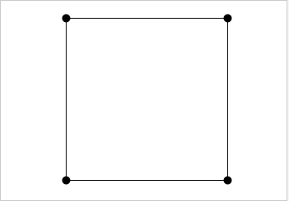
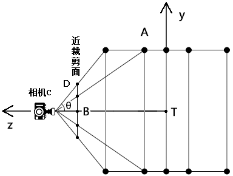

## 前言

有人说，只懂一维的世界，就看不懂二维的世界；只懂二维的世界，就不懂三维的世界。

在我看来却不然，一维世界是基础，以单轴为坐标系，其中的点位可以用一个实数表示，如点A(x)

二维世界以两个不共线的单轴为坐标系，其中的点位可以用两个实数表示，如点A(x,y)，这两实数就是二维世界的点位在两个一维世界里的投影。

二维世界以三个不共线的单轴为坐标系，其中的点位可以用三个实数表示，如点A(x,y,z)，这两实数就是三维世界的点位在三个一维世界里的投影。


## 第一章 从一个矩形说三维

以前我做影视后期的时候，在AE 写了一个发光的文字，让其沿y 轴的旋转，转得很平，就像被挤扁一样。旁边的哥们就跟我说，你把3d 图层打开就好看了。我在点开后，这个文字一下子就有了体感。

以此原理，我在这里就用一个矩形代表文字，让其转起来。

### 1-绘制矩形

已知：

- 矩形ABCD
- 点A(100,100,0)
- 点B(-100,100,0)
- 点C(-100,-100,0)
- 点D(100,-100,0)

求：让矩形ABCD沿y轴旋转β后的位置

解：

由已知条件可知：矩形ABCD沿y轴旋转时，所有点位的y值不变，变的只有x、z，所以接下来求x、z即可

做点A在平面xOz上的正射影为点AF(100,0,0)

设：

- 点AF到原点的距离为r
- 点AF与x轴正半轴的夹角为α

由三角函数和角公式

```js
cos(α+β)=cosα*cosβ-sinα*sinβ
sin(α+β)=cosβ*sinα+sinβ*cosα
```

得，矩形ABCD沿y轴旋转β后的A点位置(x,z)为：

```js
x=cos(α+β)*r
x=(cosα*cosβ-sinα*sinβ)*r
x=A.x*cosβ-A.z*sinβ
z=sin(α+β)*r
z=(cosβ*sinα+sinβ*cosα)*r
z=A.z*cosβ+A.x*sinβ
```

其余点位同理

在canvas 里，若不做其它操作，便可以实现如下效果：





### 2-代码实现

首先我们要形成两个概念：

- 场景：存储所有要显示在canvas 画布上是图形
- 渲染器：将场景里的对象显示在画布中

接下来走一下代码：

1.建立一个渲染器对象。

```js
class Renderer{
    constructor(attrs){
        Object.assign(this,attrs)
        this.update()
    }
    update(){
        const {canvas}=this
        this.ctx=canvas.getContext('2d')
        this.ctx.translate(canvas.width/2,canvas.height/2)
        this.ctx.scale(1,-1)
    }
    render(scene){
        const {ctx,canvas:{width,height}}=this
        ctx.clearRect(-width/2,-height/2,width,height);
        scene.children.forEach(({geometry,material,sin,cos})=>{
            const vertices=[]
            geometry.forEach(p=>{
                const x=p.x*cos-p.z*sin
                const z=p.z*cos+p.x*sin
                const y=p.y
                const v2=new Vector2(x,y)
                vertices.push(v2)
            })
            const poly=new Poly({
                vertices,
                ...material
            })
            poly.addModifier(new Lattice())
            poly.draw(ctx)
        })
    }
}
```

上面的代码对不对无所谓，但基本概念一定要有。后面我们可以再不断完善。

- update() ：对canvas 坐标系进行了变换。因为我喜欢webgl 画布的坐标系，所以我让其尽量的接近webgl 坐标系。我用translate() 方法将坐标系原点放在了画布中央，用scale() 方法让坐标系的y轴朝上。
- render() ：将场景中的对象渲染到画布中
  - 先清理画布
  - 遍历场景中所有对象的点位
  - 基于对象的正弦、余弦值对其中的所有点位进行变换
  - 基于x、y值建立二维顶点集合，这里要注意，这里的x、y值是canvas画布的x、y值，也是三维对象的顶点在二维画布上的正射影。
- Poly 对象是我自己写的多边形对象，使用canvas 路径的lineTo(x,y) 方法实现的，可以连点成面，可以用填充的方式显示，也可以用描边的方式显示。


2.建立场景

```js
/* 场景 */
class Scene{
    constructor(){
        this.children=[]
    }
    add(obj){
        this.children.push(obj)
    }
}
```

场景是一个集合，可以向其中添加对象。


3.获取html 里的canvas 画布，并设置其尺寸

```js
const canvas=document.getElementById('canvas');
const [w,h]=[window.innerWidth,window.innerHeight];
canvas.width=w;
canvas.height=h;
```


4.实例化渲染器和场景

```js
const renderer=new Renderer({canvas})
const scene=new Scene()
```


5.建立一个矩形对象，添加到场景中

```js
const A=new Vector3(100,100,0)
const B=new Vector3(-100,100,0)
const C=new Vector3(-100,-100,0)
const D=new Vector3(100,-100,0)
const rect={
    geometry:[A,B,C,D],
    material:{
        stroke:true,
        close:true
    }
}
scene.add(rect)
```


6.利用请求动画帧，制作矩形沿y旋转动画

```js
let angle=0
let sin=0
let cos=0
!(function ani(){
    angle+=0.05;
    rect.sin=Math.sin(angle)
    rect.cos=Math.cos(angle)
    renderer.render(scene)
    requestAnimationFrame(ani)
})()
```

其实，我们还可以更专业一些，引入矩阵的概念。


### 3-矩阵变换

1.建立一个简单的行主序的矩阵对象

```js
class Matrix{
  constructor({a=[0,0,0,0],b=[0,0,0,0],c=[0,0,0,0],d=[0,0,0,1]}={}){
    this.data=[a,b,c,d]
  }
  multiply(v){
    const [a,b,c,d]=this.data
    const {x=1,y=0,z=0,w=0}=v
    return {
      x:a[0]*x+a[1]*y+a[2]*z+a[3]*w,
      y:b[0]*x+b[1]*y+b[2]*z+b[3]*w,
      z:c[0]*x+c[1]*y+c[2]*z+c[3]*w,
      w:d[0]*x+d[1]*y+d[2]*z+d[3]*w
    }
  }
}
```

- multiply() 是矩阵和向量相乘的方法


2.给rect 对象开一个4维矩阵属性matrix，将用于旋转的sin和cos拼到矩阵里

```js
const sin=Math.sin(angle)
const cos=Math.cos(angle)
rect.matrix=Matrix({
    a:[cos,0,-sin,0],
    b:[0,1,0,0],
    c:[sin,0,cos,0],
})
```


3.在渲染器的渲染方法里，直接让矩阵和顶点相乘，便可得到顶点变换后的位置

```js
render(scene){
    const {ctx,canvas:{width,height}}=this
    ctx.clearRect(-width/2,-height/2,width,height);
    scene.children.forEach(({geometry,material,matrix})=>{
        const vertices=[]
        geometry.forEach(p=>{
            const {x,y}=matrix.multiply(p)
            vertices.push(new Vector2(x,y))
        })
        const poly=new Poly({
            vertices,
            ...material
        })
        poly.addModifier(new Lattice())
        poly.draw(ctx)
    })
}
```


当前的效果，就像我最初在AE里写下的那个文字，转得很平，就像被挤扁一样。接下来我给他打开3d图层。


## 第二章 相机

其实，一个图层是不是3d 图层，就像webgl 为什么就是三维的一样，其关键点有两个：

- 三维数据
- 相机

三维数据咱们之前写过了，就是顶点的x、y、z 数据，然而z 数据我们只是求出来了，并没有用上。

接下来，我就让三维数据在相机视口中做一个投影。这个投影的点位是二维的，然而这个二维的点位却让顶点三个维度的数据都派上了用场。


### 1-顶点在相机上的投影

我们先看一个左视图。



从上图中我们能看出：只要点位不是在相机视线上，相同y值、不同z值的点位在相机近裁剪面上的投影位置是不一样的，至于这个投影点位具体是多少，和点的位置及相机视线有关，接下来我们就重点说一下。

已知：

- 相机位置C(cx,cy,cz)
- 相机目标点位T(tx,ty)
- 摄像机视野角度的一半θ
- 相机到近裁剪面的距离为L
- 近裁剪面的尺寸是正方向
- 世界坐标系中的点A(ax,ay,az)


求：点A在相机近裁剪面上的投影的位置P(px,py)

解：

先求近裁剪面尺寸的一半|DB|

由余弦定理得：

```js
|CD|=L/cosθ
```

由正弦定理得：

```js
|DB|=sinθ*|CD|
```

再求一下投影点的py 值。

由勾股定理可得到|CT|、|CA|

由叉乘公式可得向量CA和相机视线TC 的夹角的正弦值：

```js
sin∠TCA=(CA^CT)/(|CT|*|CA|)
```

由反正弦方法可求得∠TCA

由三角函数可得：

```js
py=sin∠TCA*|CD|
```

同理可得px

投影点已经有了，接下来要把点位在canvas画布中画出来，还需要过一关。


### 2-相机近裁剪面和canvas画布的映射

已知：

- 近裁剪面的左上角点为(-L,L)
- 近裁剪面的右下角点为(L,-L)
- canvas画布的左上角点为(0,0)
- canvas画布的右下角点位(w,h)
- 近裁剪面上的点位P(px,py)

求：点P在canvas 画布上的映射点M(mx,my)

解：

可用点斜式计算两种坐标系的映射关系。

先计算x方向上的映射。

```js
k=(w-0)/(L+L)
k=w/2L
b=0-k*(-L)
b=k*L
mx=kx+b
```

同理可求my

其实，到了这一步，相机还差一点，因为我上面的原理只适用于相机视线和z轴共线的情况，这是后话，我们先用代码验证一下上面的原理。


## 第三章 相机代码实现

### 1-相机

1.建立相机类

```js
class Camera{
    constructor(fov=Math.PI/4,aspect=1,near=1){
        this.fov=fov
        this.near=near
        this.position=new Vector3()
        this.target=new Vector3()
        this.aspect=aspect
        this.update()
    }
    update(){
        const {fov,near,target,position}=this
        this.r=near/Math.cos(fov)
        this.h=Math.sin(fov)*this.r
        this.ct=target.clone().sub(position)
    }
}
```

- fov：摄像机视野角度的一半θ
- near：相机位到近裁剪面的距离
- position：相机位置
- target：相机目标点位
- aspect：裁剪面的宽高比
- r：相机位到近裁剪面顶部中心位的距离
- h：近裁剪面高度的一半
- ct：相机到目标点的距离


2.将相机实例化

```js
const camera=new Camera(Math.PI/3,w/h,40)
camera.position.set(0,0,160)
camera.update()
```


3.渲染的时候，将相机传到渲染方法里

```js
renderer.render(scene,camera);
```


### 2-渲染对象

渲染对象的整体代码

```js
class Renderer {
    constructor(attrs) {
        Object.assign(this, attrs);
        this.update();
    }
    update() {
        const { canvas } = this;
        this.ctx = canvas.getContext("2d");
    }
    render(scene,camera) {
        const {
            ctx,
            canvas: { width, height },
        } = this;
        const {h,aspect}=camera
        const xMap=Renderer.Mapping(-h,0,h,width)
        const yMap=Renderer.Mapping(h,0,-h,height)
        ctx.clearRect(0, 0, width, height)
        scene.children.forEach(({ geometry, material, matrix }) => {
            const vertices = [];
            geometry.forEach((p) => {
                const { x, y } = matrix.multiply(p)
                const mp = matrix.multiply(p)
                const p2=new Vector3(mp.x,mp.y,mp.z)
                const p3=Renderer.getProjection(p2,camera)
                const cx=xMap(p3.x/aspect)
                const cy=yMap(p3.y)
                vertices.push(new Vector2(cx,cy))
            });
            const poly = new Poly({
                vertices,
                ...material,
            });
            poly.addModifier(new Lattice());
            poly.draw(ctx);
        });
    }
    static getProjection(p,{position,fov,h,ct,ctLen,r}){
        const {x:x1,y:y1,z:z1}=ct
        const {x:x2,y:y2,z:z2}=p.clone().sub(position)
        const x=Renderer.sin(z2,x2,z1,x1)*r
        const y=Renderer.sin(z2,y2,z1,y1)*r
        return new Vector2(x,y)
    }
    static sin(x1,y1,x2,y2){
        const len1=Math.sqrt(x1*x1+y1*y1)
        const len2=Math.sqrt(x2*x2+y2*y2)
        const len=len1*len2
        const cross=x1*y2-x2*y1
        return cross / len
    }
    static Mapping(x1,y1,x2,y2){
        const [x,y]=[x2-x1,y2-y1]
        const k=y/x
        const b=y1-k*x1
        return function(x){
            return k*x+b
        }
    }
}
```


在render() 渲染方法里主要做了以下事情：

1.先获取相机裁剪面和canvas画布的映射关系

```js
const xMap=Renderer.Mapping(-h,0,h,width)
const yMap=Renderer.Mapping(h,0,-h,height)
```

映射原理，就是使用的点斜式：

```js
static Mapping(x1,y1,x2,y2){
    const [x,y]=[x2-x1,y2-y1]
    const k=y/x
    const b=y1-k*x1
    return function(x){
        return k*x+b
    }
}
```

接下来遍历所有顶点，对所有顶点做以下操作：


2.矩阵变换，然后获取变换后的点位

```
const mp = matrix.multiply(p)
const p2=new Vector3(mp.x,mp.y,mp.z)
```

3.计算p2点在相机裁剪面上的投影

```js
const p3=Renderer.getProjection(p2,camera)
```

```js
static getProjection(p,{position,fov,h,ct,ctLen,r}){
    const {x:x1,y:y1,z:z1}=ct
    const {x:x2,y:y2,z:z2}=p.clone().sub(position)
    const x=Renderer.sin(z2,x2,z1,x1)*r
    const y=Renderer.sin(z2,y2,z1,y1)*r
    return new Vector2(x,y)
}
```

sin() 方法是用于计算两个向量正弦值的，即在左视图和正视图中，由顶点到相机点再到相机目标点所构成的夹角的正弦值，由此正弦值可得两个相对于z轴的对边。

```js
static sin(x1,y1,x2,y2){
    const len1=Math.sqrt(x1*x1+y1*y1)
    const len2=Math.sqrt(x2*x2+y2*y2)
    const len=len1*len2
    const cross=x1*y2-x2*y1
    return cross / len
}
```


4.计算相机裁剪面上的点位在canvas画布中的位置

```js
const cx=xMap(p3.x/aspect)
const cy=yMap(p3.y)
```


最终效果如下，这就是我想要的感觉:


后面还有很多值得我们去深思的地方，比如我不想让图形只是简单的绕y轴旋转，我还想让它绕z轴旋转应该怎么办？我想移动相机的目标点能不能行？

这个我们会在后面进行深度探索。


未完待续，精彩不断……