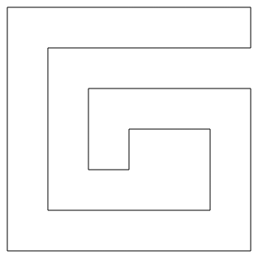
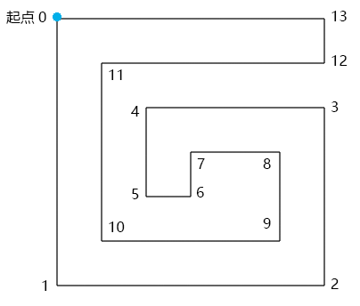
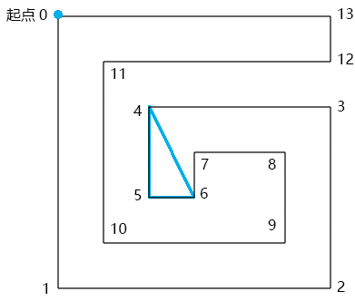

在说多边形网格化之前，我们先画个复杂点的多边形出来。

准备一组用于顺时针绘图的顶点：

```js
const points=[
    new Vector2(0,0),
    new Vector2(600,0),
    new Vector2(600,100),
    new Vector2(100,100),
    new Vector2(100,500),
    new Vector2(500,500),
    new Vector2(500,300),
    new Vector2(300,300),
    new Vector2(300,400),
    new Vector2(200,400),
    new Vector2(200,200),
    new Vector2(600,200),
    new Vector2(600,600),
    new Vector2(0,600),
];
```

基于这组顶点绘制一个多边形：

```js
const poly=new Poly({
    position:new Vector2(50,50),
    stroke:true,
    close:true,
    vertices:[...points]
});
poly.draw(ctx);
```



接下来，我们就说一下网格化思路：

1.先判断points 中的顶点数量，若等于3，那就直接将这三个点存储起来。否则，下一步。

2.把多边形里的第一个点作为起点



3.从起点连接下下个点，构成一个三角形，如▲012


4.对上面的三角形做两个判断：
- 三角形是否包含了其它顶点，如上图；
- 三角形是否为凹三角形，如下图：


若出现上面任何一种情况，就把起点的下一个点做为起点，执行第1步。

若上面的情况都不存在，如下图，那就把构成这个三角形的顶点存储起来，把下一个点从points 中删除，把下下个点做为起点，执行第1步。



到这里，网格化的思路就说完了，这是一个递归方法，最终效果如下：


接下来，咱们就说一下这整个逻辑中涉及的两个知识点：

1.三角形是否包含了其它顶点。

这个方法我们上一章说过，遍历其它顶点，逐一判断即可，在此便不再赘述。

2.判断三角形的凹凸。

首先我们在定点的时候要遵守一个规则，这里是顺时针定点。

这样我们在用叉乘的方法求三角形的面积的时候，面积为正，那就是凸三角形；面积为负，那就是凹三角形。

求三角形面积的方法：

```js
function triangleArea(p0,p1,p2){
    const [bx,by,cx,cy]=[
        p1.x-p0.x,
        p1.y-p0.y,
        p2.x-p0.x,
        p2.y-p0.y,
    ];
    return (bx*cy-cx*by)/2;
}
```

这个求面积方法用到的是一个叉乘算法。利用这个算法还可以计算任意边数的多边形面积，详情我写过的另一篇文章：[多边形面积](https://segmentfault.com/a/1190000020279115)

整体代码的实现步骤：

1.绘制多边形

```js
const points=[
    new Vector2(0,0),
    new Vector2(600,0),
    new Vector2(600,100),
    new Vector2(100,100),
    new Vector2(100,500),
    new Vector2(500,500),
    new Vector2(500,300),
    new Vector2(300,300),
    new Vector2(300,400),
    new Vector2(200,400),
    new Vector2(200,200),
    new Vector2(600,200),
    new Vector2(600,600),
    new Vector2(0,600),
];
const poly=new Poly({
    position:new Vector2(50,50),
    stroke:true,
    close:true,
    lineWidth:2,
    vertices:[...points]
});
poly.draw(ctx);
```

2.声明用于存储三角形的数组triangles[] 和起点

```js
const triangles=[];
let start=0;
```

3.建立网格

```js
crtMesh(start);

function crtMesh(start){
    const len=points.length;
    const [i0,i1,i2]=[
        start%len,
        (start+1)%len,
        (start+2)%len
    ];
    const [p0,p1,p2]=[
        points[i0],
        points[i1],
        points[i2],
    ];
    if(len===3){
        triangles.push([p0,p1,p2]);
    }else{
        const area=triangleArea(p0,p1,p2);
        if(area>0&&!hasOtherPointInTriangle(p0,p1,p2)){
            triangles.push([p0,p1,p2]);
            points.splice(i1,1);
        }
        crtMesh(i1);
    }
}
```

len 是points 顶点长度

i0,i1,i2 是通过取余的方法获取三角形顶点的索引，因为网格化可能会对points 循环遍历。

len===3 是如果points 长度为三，就直接将三角形顶点放到triangles 集合里，这也是个终止递归的条件，后面points 会不断删除三角形的第2个顶点，从而不断变小。

area>=0||hasOtherPointInTriangle(p0,p1,p2) 便是思路4中的两个情况：

- 若满足其中之一，就把下一个顶点作为参数，递归执行crtMesh(i1) 方法。
- 若都不满足，就存储三角形，冲points 中删除三角形的第二个顶点，将三角形的第二个顶点作为起点参数，执行crtMesh(i1) 方法。

好了，整个网格化的实现过程就是这样。

要选择多边形的话，那就遍历triangles里的三角形即可，鼠标点只要在一个三角形中，那也就在多边形中了。

```js
const triangles=[];
let start=0;
crtMesh(start);
triangles.forEach((ele,ind)=>{
    const poly=new Poly({
        position:new Vector2(50,50),
        stroke:true,
        close:true,
        vertices:ele
    });
    poly.draw(ctx);
});
```

最后我把上面的过程进行了封装，建立了一个Mesh 类：

```js
/*Mesh 网格对象
*   points 所有的顶点
*   triangles 三角形集合
*   tmpPoints 顶点的暂存区，用于做递归删除
*   update() 更新方法，建立网格
*   crtMesh(start) 建立网格的方法
*   hasOtherPointInTriangle(p0,p1,p2) 判断▲p0p1p2是否包含了其它顶点
*   triangleArea(p0,p1,p2) ▲p0p1p2的面积
*   inMesh(v) 点v是否在多边形中
* */
import Vector2 from "./Vector2.js";
import Poly from "./Poly.js";
/*Mesh 网格对象
*   points 所有的顶点
*   triangles 三角形集合
*   tmpPoints 顶点的暂存区，用于做递归删除
*   update() 更新方法，建立网格
*   crtMesh(start) 建立网格的方法
*   hasOtherPointInTriangle(p0,p1,p2) 判断▲p0p1p2是否包含了其它顶点
*   triangleArea(p0,p1,p2) ▲p0p1p2的面积
*   inMesh(v) 点v是否在多边形中
*   crtPolys() 根据三角形集合建立多边形集合
*   draw(ctx) 绘图
* */
export default class Mesh{
    constructor(points=[]) {
        this.points=points;
        this.triangles=[];
        this.tmpPoints=[];
        this.polys=[];
        this.update();
    }
    update(){
        this.tmpPoints=[...this.points];
        this.polys=[];
        this.crtMesh(0);
    }
    crtMesh(start){
        const points=this.tmpPoints;
        const len=points.length;

        const [i0,i1,i2]=[
            start%len,
            (start+1)%len,
            (start+2)%len
        ];
        const [p0,p1,p2]=[
            points[i0],
            points[i1],
            points[i2],
        ];
        if(points.length===3){
            this.triangles.push([p0,p1,p2]);
        }else{
            const area=this.triangleArea(p0,p1,p2);
            if(area>0&&!this.hasOtherPointInTriangle(p0,p1,p2)){
                this.triangles.push([p0,p1,p2]);
                points.splice(i1,1);
            }
            this.crtMesh(i1);
        }
    }
    hasOtherPointInTriangle(p0,p1,p2){
        for (let ele of this.tmpPoints){
            if(ele!==p0&&ele!==p1&&ele!==p2){
                if (ele.inTriangle(p0,p1,p2)){
                    return true;
                }
            }
        }
        return false;
    }
    triangleArea(p0,p1,p2){
        const [bx,by,cx,cy]=[
            p1.x-p0.x,
            p1.y-p0.y,
            p2.x-p0.x,
            p2.y-p0.y,
        ];
        return (bx*cy-cx*by)/2;
    }
    inMesh(v){
        const len=this.triangles.length;
        for(let ind=0;ind<len;ind++){
            const triangle=this.triangles[ind];
            if(v.inTriangle(...triangle)){
                return {ind,triangle};
            }
        }
        return null;
    }
    crtPolys(option){
        this.triangles.forEach((ele,ind)=>{
            option.vertices=ele;
            const poly=new Poly(option);
            this.polys.push(poly);
        });
    }
    draw(ctx){
        this.polys.forEach((poly,ind)=>{
            poly.draw(ctx);
        })
    }
}
```

网格实例化和绘制方法：

```js
const mesh=new Mesh(points);
mesh.triangles.forEach((ele,ind)=>{
    const poly=new Poly({
        position:new Vector2(50,50),
        stroke:true,
        close:true,
        vertices:ele
    });
    poly.draw(ctx);
});
```

图形选择方法：

```js
canvas.addEventListener('mousemove',mousemoveFn);
let hover=false;
function mousemoveFn(event){
    const mousePos=getMousePos(event,poly);
    const obj=mesh.inMesh(mousePos);
    const bool=!!obj;
    if(hover!==bool){
        poly.fill=bool;
        ctx.clearRect(0,0,canvas.width,canvas.height);
        poly.draw(ctx);
        hover=bool;
    }
}
```

注：这种将整体提分解后再选择的思路，不仅适用于多边形的选择，也适用于多面体的选择，只不过多面体里分解的不再是三角形，而是四面体，这些都是后话了，之后我会为大家打开三维世界的大门。

[源码地址](https://github.com/buglas/interview-01)


