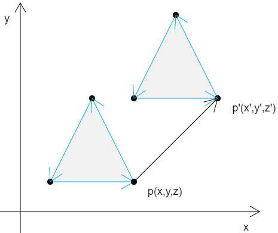
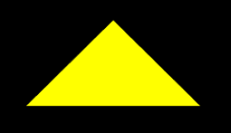

## 前言

变换有三种状态：平移、旋转、缩放。

当我们变换一个图形时，实际上就是在变换这个图形的所有顶点。


### 课堂目标  

1. 掌握图形变换的三种方式。
2. 可以对图像进行复合变换。


### 知识点  

1. 平移
2. 旋转
3. 缩放


## 第一章 平移

对图形的平移就是对图形顶点的平移。

### 1-举个例子

已知：

一个图形中只有一个顶点p(x,y,z)

在x、y、z 三个方向上，分别将点p 移动tx、ty、tz

求：点p 移动后的位置p'(x',y',z')

解：

x'=x+tx

y'=y+ty

z'=z+tz

如果这个图形中并非只有一个顶点，而是有三个，或者更多，那么所有的顶点也是按照同样原理进行位移。




### 2-向量加法

在实际代码中，我们要有一个向量的概念。

比如 (x,y,z) ，我们既可以说它是一个定点位置，也可以说它是一个向量。

至于 (x,y,z) 到底是什么，要看我们拿它做什么。

拿上面的例子继续举例子。

我们把(x,y,z) 作为点位时，那它就是点p(x,y,z)

我们把p 的移动距离tx、ty、tz 封装成一个对象pt(tx,ty,tz)，那么pt 就是一个向量，一个为点p 指明移动方向和距离的向量。

那么点p 的移动结果 p' 就可以这么写：

p'=p+pt

由上可知，顶点的位移就是向量的加法。


### 3-代码实现

#### 3-1-GLSL ES 语言里的向量运算

对于代码的实现，我们首先要知道，GLSL ES 语言里，可以直接进行向量运算。

```js
<script id="vertexShader" type="x-shader/x-vertex">
    attribute vec4 a_Position;
    uniform vec4 u_Translation;
    void main(){
        gl_Position = a_Position+u_Translation;
    }
</script>
```


上面的a_Position 是原始点位，属于attribute 变量；u_Translation 是位移向量，属于uniform 变量。

至于为什么a_Position 是attribute 变量，u_Translation 是uniform 变量，这是因为a_Position 是顶点的原始位置，除此之外的都是uniform 变量。

a_Position+u_Translation 便是在利用向量加法，对原始点位进行位移。

现在着色器程序已经完成，接下来用js 向着色器传参即可。


#### 3-2-js 向着色器传参

因为顶点着色器里有两个变量，所以我们js 要为这两个变量赋值。

1. 为attribute 变量赋值的方法和前面的课程里说的一样。

```js
const vertices=new Float32Array([
    0.0,  0.1,
    -0.1,-0.1,
    0.1, -0.1
])

const vertexBuffer=gl.createBuffer();
gl.bindBuffer(gl.ARRAY_BUFFER,vertexBuffer);
gl.bufferData(gl.ARRAY_BUFFER,vertices,gl.STATIC_DRAW);
const a_Position=gl.getAttribLocation(gl.program,'a_Position');
gl.vertexAttribPointer(a_Position,2,gl.FLOAT,false,0,0);
gl.enableVertexAttribArray(a_Position);
```


2.为uniform 变量赋值的方法比较简单。

```js
const u_Translation=gl.getUniformLocation(gl.program,'u_Translation');
gl.uniform4f(u_Translation,0.0,0.5,0.0,0.0);
```


整体代码：

```html
<canvas id="canvas"></canvas>
<script id="vertexShader" type="x-shader/x-vertex">
    attribute vec4 a_Position;
    uniform vec4 u_Translation;
    void main(){
        gl_Position = a_Position+u_Translation;
    }
</script>
<script id="fragmentShader" type="x-shader/x-fragment">
    void main(){
        gl_FragColor=vec4(1.0,1.0,0.0,1.0);
    }
</script>
<script type="module">
    import {initShaders} from '../jsm/Utils.js';

    const canvas = document.getElementById('canvas');
    canvas.width=window.innerWidth;
    canvas.height=window.innerHeight;
    const gl = canvas.getContext('webgl');

    const vsSource = document.getElementById('vertexShader').innerText;
    const fsSource = document.getElementById('fragmentShader').innerText;
    initShaders(gl, vsSource, fsSource);

    const vertices=new Float32Array([
        0.0,  0.1,
        -0.1,-0.1,
        0.1, -0.1
    ])

    const vertexBuffer=gl.createBuffer();
    gl.bindBuffer(gl.ARRAY_BUFFER,vertexBuffer);
    gl.bufferData(gl.ARRAY_BUFFER,vertices,gl.STATIC_DRAW);
    const a_Position=gl.getAttribLocation(gl.program,'a_Position');
    gl.vertexAttribPointer(a_Position,2,gl.FLOAT,false,0,0);
    gl.enableVertexAttribArray(a_Position);

    const u_Translation=gl.getUniformLocation(gl.program,'u_Translation');
    gl.uniform4f(u_Translation,0.0,0.5,0.0,0.0);

    gl.clearColor(0.0, 0.0, 0.0, 1.0);
    gl.clear(gl.COLOR_BUFFER_BIT);

    // gl.drawArrays(gl.POINTS, 0, 3);
    gl.drawArrays(gl.TRIANGLES, 0, 3);
    
</script>
```





### 4-扩展：面向对象的思想

webgl上下文对象的对象的编程过程是面向过程的，所以在开发实际项目时，我们要对其进行封装。

就比如我们要绘制一个三角形，那我们就把它当成三角形对象来画。

代码未动，思路先行：

1.对象属性：

- gl webgl上下文对象，默认null
- mode 绘图模式，默认'TRIANGLES'
- positionName 着色器中代表了顶点位置的变量名称，默认'a_Position'
- translationName 着色器中代表了位移的变量名称，默认'u_Translation'
- clearColor 背景色，默认{r:0.0,g:0.0,b:0.0,a:1.0}
- vertices 所有顶点分量的集合，默认[]
- size 每个顶点属性的组成数量，必须是1，2，3或4
- num 顶点数量
- position 图形位移量

2.对象方法：

- init()初始化方法
- updateNum()计算顶点数量
- updateVertexBuffers()更新顶点缓冲区
- setPosition()设置图形位移信息
- draw()绘图


整体代码：

```html
<canvas id="canvas"></canvas>
<script id="vertexShader" type="x-shader/x-vertex">
    attribute vec4 a_Position;
    uniform vec4 u_Translation;
    void main(){
        gl_Position = a_Position+u_Translation;
    }
</script>
<script id="fragmentShader" type="x-shader/x-fragment">
    void main(){
        gl_FragColor=vec4(1.0,1.0,0.0,1.0);
    }
</script>
<script type="module">
    import {initShaders} from '../jsm/Utils.js';

    const canvas = document.getElementById('canvas');
    canvas.width=window.innerWidth;
    canvas.height=window.innerHeight;
    const gl = canvas.getContext('webgl');

    const vsSource = document.getElementById('vertexShader').innerText;
    const fsSource = document.getElementById('fragmentShader').innerText;
    initShaders(gl, vsSource, fsSource);

    class Poly{
        static defAttr=()=>({
            gl:null,
            mode:'TRIANGLES',
            positionName:'a_Position',
            translationName:'u_Translation',
            clearColor:{r:0.0,g:0.0,b:0.0,a:1.0},
            vertices:[],
            size:3,
            num:0,
            position:{x:0.0,y:0.0,z:0.0},
        });
        constructor(attr){
            const attrs={...Poly.defAttr(),...attr};
            Object.assign(this,attrs);
            this.init();
        }
        init(){
            this.updateNum();
            this.updateVertexBuffers();
            this.setPosition();
        }
        updateNum(){
            const {vertices:{length},size}=this;
            this.num=length/size;
        }
        updateVertexBuffers(){
            const {vertices,size,gl,positionName}=this;
            const vertexBuffer=gl.createBuffer();
            gl.bindBuffer(gl.ARRAY_BUFFER,vertexBuffer);
            gl.bufferData(gl.ARRAY_BUFFER,vertices,gl.STATIC_DRAW);
            const a_Position=gl.getAttribLocation(gl.program,positionName);
            gl.vertexAttribPointer(a_Position,size,gl.FLOAT,false,0,0);
            gl.enableVertexAttribArray(a_Position);
        }
        setPosition(){
            const {gl,translationName,position:{x,y,z}}=this;
            const u_Translation=gl.getUniformLocation(gl.program,translationName);
            gl.uniform4f(u_Translation,x,y,z,0.0);
        }
        draw(){
            const {gl,clearColor:{r,g,b,a},num,mode}=this;
            gl.clearColor(r,g,b,a);
            gl.clear(gl.COLOR_BUFFER_BIT);
            gl.drawArrays(gl[mode], 0, num);
        }
    }

    const vertices=new Float32Array([
        0.0,  0.1,
        -0.1,-0.1,
        0.1, -0.1
    ])
    const poly=new Poly({
        gl,
        vertices,
        size:2
    })
    poly.draw();
</script>
```


上面的代码也可以画出三角形，但它肯定不是最完善的。

我们需要先有一个面向对象的思想和雏形。对于以后如何完善，需要我们在以后的不断学习中，用实战不断地打磨、优化。

接下来咱们说旋转。


## 第二章 旋转

### 1-如何旋转顶点


[源码地址](https://github.com/buglas/webgl-lesson)

未完待续，实时更新……