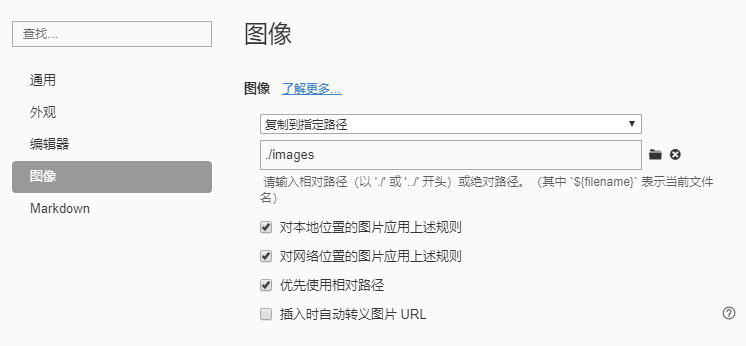
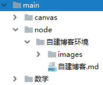

## 项目定位

前段时间，有朋友跟我说：你在思否写的博客已经半个月打不开了。

这个问题我是知道的，以前也遇到过，只是这次持续的时间太长，估计至少得20天了，这个不能忍。

对于这个问题的解决方式，我首先想到的是将文章迁移到掘金。只是想想掘金里那乱七八糟的广告，就打消了这个念头。而且，它万一也跟思否一样呢？那我又得重蹈覆辙。

所以，我决定自建博客。

对于自建博客，我首先想到的场景是：我在本地创建了md文件，然后一键上传，便可以发布到线上，然后我就可以通过相应网址看见相应的博客。

项目开发要求：简单、快速、省钱。

项目功能：我自己能用就好，发布到线上，能看见，先不考虑评论功能。

开发工具：

- nodejs：对本地文件进行增删改查和上传。
- 阿里云的oss：存储本地上传的博客和图片，供前端读取。oss 很便宜，我用了很久，一直没怎么花钱。


- Typora：md文件编辑器，在这里面，可以为图片指定一个相对的存放目录。

  




接下咱们就说一下整体的实现思路：


## 整体思路

一，博客书写规则

我会将所有博客写在一个固定的目录中。一个主题的博客会有一个独立的文件夹，这个文件夹里可能会有多个与此主题相关的md，同时还会有一个images文件夹，用于存放md里的所有静态资源。如：



二，项目结构

- build.js：编译、打包、上传本地博客
- mds.json：存储md 文件目录信息
- st.json：存储静态文件目录信息
- conf.json：项目配置文件
- main：所有博客都有写在这里面
- web：前端文件，也可以与项目分离
- dist：本地博客打包目录


三，项目实现逻辑

1.先建立两个目录信息文件mds.json和st.json，默认为空数组，用于在后面存储文件信息。

2.在main中，用Typora编辑器，按照一个文件夹一个主题的规则写博客，其中的图片链接可以自动指向同级的images文件夹。

3.在build.js中写node。

先获取main中的文件目录，与mds.json和st.json中的文件作对比，从而知道哪些文件是新的，哪些文件是已删除的。对新的文件要重新编译、打包和上传；对已删除的文件，要从本地的打包目录和oss端删除。

最后,根据文件类型，将main中的文件目录更新到mds.json和st.json中。


## node端的具体实现


实现项目功能的主要文件是build.js，所以我们终点讲解build.js里的各种功能逻辑。

一，基础数据的定义

```js
const fs=require('fs')
const tool=require('./utils/tool')
const conf=require('./conf')
const OSS = require('ali-oss')
const mdsOld=require('./mds')
const stOld=require('./st')
const menuOld={mds:mdsOld,st:stOld};
const menuNow=tool.getFiles(conf.enter);
const clients={
    st:new OSS(conf.bucketSt),
    mds:new OSS(conf.bucketMds)
}
```


- fs node内置文件系统

- tool 方法工具

  - getFiles() 获取目录中的所有文件信息，并根据文件类型，将其分为静态文件和md文件。其字段属性为：
    - path 文件路径
    - folder 文件所在的文件夹
    - name 文件名
    - type 文件类型
    - ossName 文件在oss中的线上名称
    - mtime 修改时间
    - ctime 创建时间，初始为修改时间

  - getRandom() 基于时间戳和随机数，获取一个基本不会重复的数值

```js
const tool={
    getFiles(path=''){
        const files={mds:[],st:[]};
        readFolder(path);
        files.mds.sort((a,b)=>{
            return a.ctime<b.ctime?1:-1;
        })
        return files;
        function readFolder(path,folder,name=''){
            let stat=fs.statSync(path);
            if (stat.isDirectory()){
                let files=fs.readdirSync(path);
                for (let ele of files){
                    readFolder(`${path}/${ele}`,path,ele);
                }
            }else{
                const type=path.split('.').pop();
                const mtime=stat.mtime.getTime();
                const file={
                    path,
                    folder,
                    name,
                    type,
                    ossName:tool.getRandom()+'.'+type,
                    mtime,
                    ctime:mtime
                }
                if(type==='md'){
                    files.mds.push(file);
                }else{
                    files.st.push(file);
                }
            }
        }
    },
    getRandom(){
        return stamp+Math.random().toString().split('.')[1];
    }
}
```


- conf 配置文件
  - enter 博客入口
  - out 博客出口，解析后的线上版md文件会发布到这里后，再上传到oss
  - menu 博客目录
    - st 静态资源目录
    - mds md文件目录
  - ossPathSt oss中存放静态资源的bucket路径
  - ossPathMds oss中存放md文件的bucket路径
  - bucketSt 存放静态资源的bucket配置参数，用于OSS用户端实例化
  - bucketMds 存放md文件的bucket配置参数，用于OSS用户端实例化

```json
{
  "enter": "./main",
  "out": "./dist",
  "menu": {
    "st":"./st.json",
    "mds":"./mds.json"
  },
  "ossPathSt": "https://blog-st.oss-cn-beijing.aliyuncs.com/",
  "ossPathMds": "https://blog-mds.oss-cn-beijing.aliyuncs.com/",
  "bucketSt": {
    "region": "********",
    "accessKeyId": "************",
    "accessKeySecret": "*****************",
    "endPoint": "*********",
    "bucket": "******"
  },
  "bucketMds": {
    "region": "********",
    "accessKeyId": "*********",
    "accessKeySecret": ""*****************",",
    "endPoint": "*******",
    "bucket": "*****"
  }
}
```


- OSS 阿里云的oss服务端接口对象

- mdsOld 上一次build生成的md文件目录

- stOld 上一次build生成的静态资源目录

- menuOld 整合上一次上一次build生成的目录

- menuNow 当前博客入口中的文件目录

- clients 基于bucket配置项，将存放两种资源的bucket实例化

  

二，更新博客入口中的文件

1. setFiles() 先将图片文件上传到oss，返回静态资源目录信息

2. setFiles() 再将md文件写入本地dist目录，在上传到oss，返回ms文件目录信息

3. writeMenu() 将静态目录信息和md目录信息分别写入相应本地json文件中，并上传到oss

```js
update();
async function update(){
    const st=await setFiles('st');
    const stMenu=st||stOld;
    const mds=await setFiles('mds',stMenu);
    writeMenu('st',st);
    writeMenu('mds',mds);
}
```


三，setFiles()对博客入口中的文件进行增加、修改、提交、删除操作

1. getFilesState() 对新旧两种目录进行对比，返回目录状态信息，如所有已删除的文件、新增的文件、修改过的文件
2. 若新旧目录一样，则返回null；否则：
3. updateFiles() 将新増和修改过的文件写入本地(仅限md文件)，并上传到oss
4. deleteFiles() 将已删除的文件从本地出口(只针对md文件)中删除，从oss中删除
5. 返回最新的目录

```js
async function setFiles(mold,st){
    const filesOld=menuOld[mold];
    const filesNow=menuNow[mold];
    const {df,nf,uf,cf,menu,change}=getFilesState(filesNow,filesOld);
    if(!change){return null}
    const client=clients[mold];
    console.log(`------------${mold}--------------`);
    cf.length&&console.log('cf-新增文件',cf);
    uf.length&&console.log('uf-修改文件',uf);
    df.length&&console.log('df-移除文件',df);
    await updateFiles(mold,client,nf,st);
    await deleteFiles(mold,client,df);
    return menu;
}
```


四，writeMenu() 将最新文件写入本地目录，上传oss。

```js
async function writeMenu(fileName='mds',data,ossFile=fileName+'.json'){
    if(data){
        if(fileName==='mds'){
            data.sort((a,b)=>{
                return a.ctime<b.ctime?1:-1;
            })
        }
        const localFile=conf.menu[fileName];
        writeFile(localFile,JSON.stringify(data),ossFile);
        try {
            await clients.mds.put(ossFile,localFile);
            console.log(`${ossFile} 文件oss上传成功！`);
        } catch (e) {
            console.error(`${ossFile} 文件oss上传失败:`,e);
        }
    }
}
```


五，updateFiles() 遍历文件目录，将新増和修改过的文件写入本地(仅限md文件)，并上传到oss

1. 如果是md文件
   *   readFileSync() 基于文件路径读取相应的md文件内容
   *   getUrls() 从md中获取所有图片文件的链接地址，并通过此链接获取此文件的oss端名称
   *   compileMd() 解析md文件，将此文件的本地地址替换成oss端地址
   *   writeFile() 将此文件发布到出口目录中
2. 如果是图片文件
   *   只获取文件的本地地址，以便后续操作
3. 使用oss实例对象将文件上传到oss

```js
async function updateFiles(mold,client,nf,st){
    for(let file of nf){
        let localPath='';
        if(mold==='mds'){
            const md=fs.readFileSync(file.path).toString();
            const urls=getUrls(md,file.folder,st);
            const mdOss=compileMd(md,urls);
            localPath=conf.out+'/'+file.ossName;
            writeFile(localPath,mdOss,file.name);
        }else{
            localPath=file.path;
        }
        try {
            await client.put(file.ossName,localPath);
            console.log(`${file.name} 文件oss上传成功！`);
        } catch (e) {
            console.error(`${file.name} 文件oss上传失败:`,e);
            return;
        }
    }
}
```


六，deleteFiles() 遍历文件目录，将已删除的文件从本地出口(只针对md文件)中删除，从oss中删除

1. 如果是md文件，将已删除的文件从本地出口中删除
2. 将文件从oss中删除

```js
async function deleteFiles(mold,client,df){
    for(let file of df){
        if(mold==='mds'){
            const localPath=conf.out+'/'+file.ossName;
            fs.unlink(localPath, function(e) {
                if (e) {
                    console.error(`${localPath} 文件本地删除失败：`,e);
                    return;
                }
                console.log(`${localPath} 文件本地删除成功！`);
            });
        }
        try {
            let result = await client.delete(file.ossName);
            console.log(`${file.name} 文件oss删除成功`);
        } catch (e) {
            console.error(`${file.name} 文件oss删除失败:`,e);
            return;
        }
    }
}
```


七，getFilesState() 获取文件状态

*   df:需删除的文件，旧文件里有，新文件里没有
*   cf:需新增的文件，旧文件里没有，新文件里有
*   uf:需更新的文件，新旧文件里都有，但是其发生了改变
*   nf：修改文件+新增文件
*   of：没有变化的文件
*   menu：最新目录

```js
function getFilesState(filesNow,filesOld){
    const df=[...filesOld];
    const cf=[];
    const uf=[];
    const of=[];
    let nf=[];
    let menu=[];
    for(let fileNow of filesNow) {
        const fileOld = getFile(fileNow.path, df);
        if(fileOld){
            const mtime=fileNow.mtime;
            if(fileOld.mtime!==mtime){
                Object.assign(fileNow,fileOld);
                fileNow.mtime=mtime;
                uf.push(fileNow);
            }else{
                of.push(fileOld);
            }
        }else{
            cf.push(fileNow)
        }
    }
    nf=[...uf,...cf];
    menu=[...of,...nf];
    return {
        uf,
        cf,
        df,
        of,
        nf,
        menu,
        change:uf.length||cf.length||df.length
    }
}
```


八，writeFile() 将文件写入本地

```js
function writeFile(file,data,sucTip=''){
    try {
        fs.writeFileSync(file, data);
        console.log(`${sucTip} 文件本地写入成功！`);
    }catch (e) {
        console.error(`${sucTip} 文件本地写入失败：`,e);
    }
}
```


九，compileMd() 解析md文件，将此文件的本地地址替换成oss端地址

```js
function compileMd(md,urls){
    urls.forEach(ele=>{
        const ossPath=conf.ossPathSt+ele.ossName;
        const reg=new RegExp(ele.url, 'gsm');
        md=md.replace(reg,ossPath);
    })
    return md;
}
```


十，getUrls() 查找所有的图片url。

如从' ]（images/img.jpg）'中提取'images/img.jpg'，并排除底层目录没有'.'的链接和html链接。

```js
function getUrls(md,folder,st){
    const reg = RegExp(/]\((.*?)\)/, 'gsm');
    const iterator=reg[Symbol.matchAll](md);
    const urlSet=new Set();
    for(let ele of iterator){
        const url=ele[1];
        const str=url.split('/').pop();
        const suffix=str.split('.').pop().replace(/\s+/g,'');
        const b1=str.includes('.')
        const b2=suffix!=='html';
        const b3=b1&&b2;
        if(b3){
            const path=folder+'/'+ele[1];
            const ossName=getOssName(path,st);
            urlSet.add({
                url,
                path,
                ossName
            })
        }
    }
    return [...urlSet];
}
```


十一，getOssName() 根据文件的本地路径，从相应目录中获取相应的oss路径

```js
function getOssName(path,st){
    for(let file of st){
        if(file.path===path){
            return file.ossName;
        }
    }
}
```


十二，getFile() 根据文件的本地路径，从相应目录中获取获取文件，并将此文件从目录中删除

```js
function getFile(path,files) {
    for(let i=0;i<files.length;i++){
        const file=files[i];
        if(file.path===path){
            files.splice(i,1)
            return file;
        }
    }
    return null;
}
```


## 前端的具体实现

一，首页的功能就是从oss中读取文件目录文件，然后显示到页面里。

1. 从oss中获取存储了目录的mds.json文件

```js
function getMds(){
    const url='https://blog-mds.oss-cn-beijing.aliyuncs.com/mds.json';
    return fetch(url)
        .then(res=>res.json())
        .then(mds=>{
            return mds.map(md=>{
                const name=md.name;
                md.title=name.slice(0,name.length-3);
                return md;
            })
    })
}
```


2.首页效果


3.标题在点击的时候会跳到详情页，并在链接中拼接上标题字符串和此文章的唯一标志。


二，在详情页中，根据首页传递的文章的唯一标志，从oss 端获取md文件，并解析成HTML，放到页面里。

```js
function getMd(){
    const url='https://blog-mds.oss-cn-beijing.aliyuncs.com/'+urlParam.ossName;
    return fetch(url)
        .then(res=>res.text())
        .then(data=>{
            return marked(data);
        })
}
```

- md 的解析工具有很多，比如marked

```
<script src="https://cdn.jsdelivr.net/npm/marked/marked.min.js"></script>
```

- 我们可以为md文件添加样式，我在这里用的是 github-markdown.css

```html
<link rel="stylesheet" type="text/css" href="./css/github-markdown.css">
```

```html
<article class="container markdown-body" v-html="md"></article>
```

上面的class中的“markdown-body” 便是对github-markdown.css 样式的调用，不要落了。

好了，到了这里我对于博客的基本需求就已经实现了。


## 后期计划

等以后不忙的时候我会再往里面添加评论功能，到时就需要使用数据库了。

对于后端，我会使用云开发，因为这个符合我最初“简单、快速、省钱”的开发需求，云开发不用自己搭建服务，很多平台还有一定的免费额度，比如腾讯云，使用起来还是很方便的。


[最终效果]( http://127.0.0.1:8080/web/menu.html )

[github源码](https://github.com/buglas/blog/tree/master)


