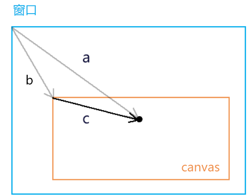
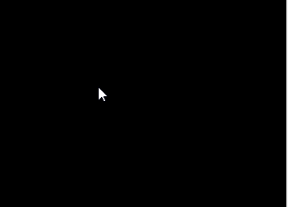
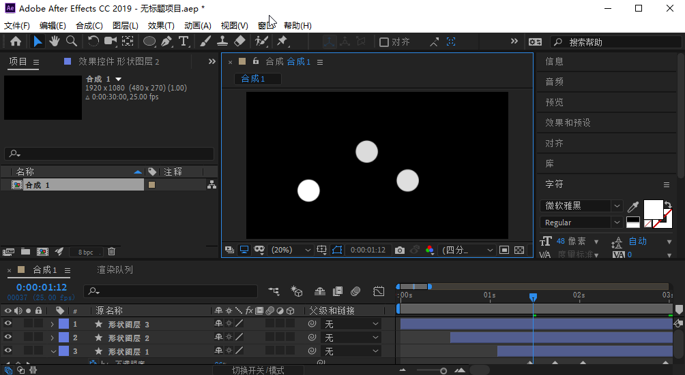

## 前言


### 课堂目标  

1. 使用js向着色器传递数据
2. 获取鼠标在canvas 中的webgl 坐标系位置


### 知识点  

1. attribute 变量
2. gl.vertextAttribute3f() 的同族函数
3. 鼠标在canvas 中的css 位置转webgl 坐标位
4. uniform 变量
5. gl.uniform4f() 的同族函数


## 第一章 用js控制一个点的位置


### 1-attribute 变量的概念。

回顾一下我们上一篇中点的定位：

```js
gl_Position = vec4(0,0,0,1);
```

这是一种将数据写死了的硬编码，缺乏可扩展性。

我们要让这个点位可以动态改变，那就得把它变成attribute变量。

attribute 变量是只有顶点着色器才能使用它的。

js 可以通过attribute 变量向顶点着色器传递与顶点相关的数据。


### 2-js向attribute 变量传参的步骤

1. 在顶点着色器中声明attribute 变量。

```html
<script id="vertexShader" type="x-shader/x-vertex">
    attribute vec4 a_Position;
    void main(){
        gl_Position = a_Position;
        gl_PointSize = 50.0;
    }
</script>
```


2. 在js中获取attribute 变量

```js
const a_Position=gl.getAttribLocation(gl.program,'a_Position');
```


3.   修改attribute 变量  

```js
gl.vertexAttrib3f(a_Position,0.0,0.5,0.0);
```


整体代码

```html
<canvas id="canvas"></canvas>
<script id="vertexShader" type="x-shader/x-vertex">
    attribute vec4 a_Position;
    void main(){
        gl_Position = a_Position;
        gl_PointSize = 50.0;
    }
</script>
<script id="fragmentShader" type="x-shader/x-fragment">
    void main() {
        gl_FragColor = vec4(1.0, 1.0, 0.0, 1.0);
    }
</script>
<script type="module">
    import {initShaders} from '../jsm/Utils.js';

    const canvas = document.getElementById('canvas');
    canvas.width=window.innerWidth;
    canvas.height=window.innerHeight;
    const gl = canvas.getContext('webgl');
    const vsSource = document.getElementById('vertexShader').innerText;
    const fsSource = document.getElementById('fragmentShader').innerText;
    initShaders(gl, vsSource, fsSource);
    const a_Position=gl.getAttribLocation(gl.program,'a_Position');
    gl.vertexAttrib3f(a_Position,0.0,0.0,0.0);
    gl.clearColor(0.0, 0.0, 0.0, 1.0);
    gl.clear(gl.COLOR_BUFFER_BIT);
    gl.drawArrays(gl.POINTS, 0, 1);
</script>
```

接下来详细解释一下。


### 3-js向attribute 变量传参的原理

#### 3-1-着色器中的attribute 变量

```js
attribute vec4 a_Position;
void main(){
    gl_Position = a_Position;
    gl_PointSize = 50.0;
}
```

- attribute 是存储限定符，是专门用于向外部导出与点位相关的对象的，这类似于es6模板语法中export 。
- vec4 是变量类型，vec4是4维矢量对象。
- a_Position 是变量名，之后在js中会根据这个变量名导入变量。这个变量名是一个指针，指向实际数据的存储位置。也是说，我们如果在着色器外部改变了a_Position所指向的实际数据，那么在着色器中a_Position 所对应的数据也会修改。

接下来，咱们说一下在js 里如何获取attribute 变量。


#### 3-2-在js中获取attribute 变量

我们在js 里不能直接写a_Position 来获取着色器中的变量。

因为着色器和js 是两个不同的语种，着色器无法通过window.a_Position 原理向全局暴露变量。

那我们要在js 里获取着色器暴露的变量，就需要找人来翻译，这个人就是程序对象。

```js
const a_Position=gl.getAttribLocation(gl.program,'a_Position');
```

- gl 是webgl 的上下文对象。
- gl.getAttribLocation() 是获取着色器中attribute 变量的方法。
- getAttribLocation() 方法的参数中：
  - gl.program 是初始化着色器时，在上下文对象上挂载的程序对象。
  - 'a_Position' 是着色器暴露出的变量名。

这个过程翻译过来就是：gl 上下文对象对program 程序对象说，你去顶点着色器里找一个名叫'a_Position'  的attribute变量。

现在a_Position变量有了，接下来就可以对它赋值了。


#### 3-3-在js中修改attribute 变量

attribute 变量即使在js中获取了，他也是一个只会说GLSL ES语言的人，他不认识js 语言，所以我们不能用js 的语法来修改attribute 变量的值：

```js
a_Position.a=1.0
```

我们得用特定的方法改变a_Position的值：

```js
gl.vertexAttrib3f(a_Position,0.0,0.5,0.0);
```

- gl.vertexAttrib3f() 是改变变量值的方法。

- gl.vertexAttrib3f() 方法的参数中：

  - a_Position 就是咱们之前获取的着色器变量。

  - 后面的3个参数是顶点的x、y、z位置

    

a_Position被修改后，我们就可以使用上下文对象绘制最新的点位了。

```js
gl.clearColor(0.0, 0.0, 0.0, 1.0);
gl.clear(gl.COLOR_BUFFER_BIT);
gl.drawArrays(gl.POINTS, 0, 1);
```


### 4-扩展

#### 4-1-vertexAttrib3f()的同族函数

gl.vertexAttrib3f(location,v0,v1,v2) 方法是一系列修改着色器中的attribute 变量的方法之一，它还有许多同族方法，如：

```js
gl.vertexAttrib1f(location,v0) 
gl.vertexAttrib2f(location,v0,v1)
gl.vertexAttrib3f(location,v0,v1,v2)
gl.vertexAttrib4f(location,v0,v1,v2,v3)
```

它们都可以改变attribute 变量的前n 个值。

比如 vertexAttrib1f() 方法自定一个矢量对象的v0值，v1、v2 则默认为0.0，v3默认为1.0，其数值类型为float 浮点型。


#### 4-2-webgl 函数的命名规律

GLSL ES里函数的命名结构是：<基础函数名><参数个数><参数类型>

以vertexAttrib3f(location,v0,v1,v2,v3) 为例：

- vertexAttrib：基础函数名
- 3：参数个数，这里的参数个数是要传给变量的参数个数，而不是当前函数的参数个数
- f：参数类型，f 代表float 浮点类型，除此之外还有i 代表整型，v代表数字……


关于用js 控制点位的方法咱们就说到这，接下咱们说一个用鼠标控制点位的例子。


## 第二章 用鼠标控制点位

我们要用鼠标控制一个点的位置，首先要知道鼠标点在webgl 坐标系中的位置，这样才能让一个点出现在我们鼠标点击的位置。

接下来咱们就说一下如何获取鼠标点在webgl 坐标系中的位置。

### 1-获取鼠标点在webgl 坐标系中的位置

对于鼠标点在webgl 坐标系中的位置，我们是无法直接获取的。所以我们得先获取鼠标在canvas 这个DOM元素中的位置。

#### 1-1-获取鼠标在canvas 画布中的css 位置

```js
canvas.addEventListener('click',function(event){
    const {clientX,clientY}=event;
    const {left,top}=canvas.getBoundingClientRect();
    const [cssX,cssY]=[
        clientX-left,
        clientY-top
    ];
})
```

对于cssX,cssY 的获取，大家应该都不陌生，这在canvas 2d 也会用到。

我们可以用向量减法来求解。



已知：向量a(clientX,clientY)，向量c(left,top)

求：向量c

解：

由向量的减法得：向量a减向量c，等于以向量c 的终点为起点，以向量a的终点为终点的向量c

所以：向量c=a-c=(clientX-left,clientY-top)

将向量c 视之为坐标点c，那点c 就是鼠标在canvas 画布中的css 位。

因为html 坐标系中的坐标原点和轴向与canvas 2d是一致的，所以在我们没有用css 改变画布大小，也没有对其坐标系做变换的情况下，鼠标点在canvas 画布中的css 位就是鼠标点在canvas 2d坐标系中的位置。


#### 2-2-canvas 坐标系转webgl 坐标系

咱们这里的变换思路就是解决差异，接着上面的代码来写。

1.解决坐标原点位置的差异。

```js
const [halfWidth,halfHeight]=[width/2,height/2];
const [xBaseCenter,yBaseCenter]=[cssX-halfWidth,cssY-halfHeight];
```

上面的[halfWidth,halfHeight]是canvas 画布中心的位置。

[xBaseCenter,yBaseCenter] 是用鼠标位减去canvas 画布的中心位，得到的就是鼠标基于画布中心的位置。

2.解决y 方向的差异。

```js
const yBaseCenterTop=-yBaseCenter;
```

因为webgl 里的y 轴和canvas 2d 里的y轴相反，所以咱们对yBaseCenter 值取一下反即可。

3.解决坐标基底的差异。

```js
const [x,y]=[xBaseCenter/halfWidth,yBaseCenterTop/halfHeight]
```

由于canvas 2d 的坐标基底中的两个分量分别是一个像素的宽高，而webgl的坐标基底的两个分量是画布的宽高，所以咱们得求个比值。

整体代码：

```js
canvas.addEventListener('click',function(event){
  const {clientX,clientY}=event;
  const {left,top,width,height}=canvas.getBoundingClientRect();
  const [cssX,cssY]=[
    clientX-left,
    clientY-top
  ];
  const [halfWidth,halfHeight]=[width/2,height/2];
  const [xBaseCenter,yBaseCenter]=[cssX-halfWidth,cssY-halfHeight];
  const yBaseCenterTop=-yBaseCenter;
  const [x,y]=[xBaseCenter/halfWidth,yBaseCenterTop/halfHeight];
})
```


关于获取鼠标点在webgl 坐标系中的位置的方法，我们就说到这，接下来咱们基于这个位置，修改着色器暴露出来的位置变量即可。


### 2-修改attribute 变量 

这个步骤和第一章的内容是差不多的：

1. 获取attribute 变量
2. 在获取鼠标在webgl 画布中的位置的时候，修改attribute 变量
3. 清理画布
4. 绘图

```js
import {initShaders} from '../jsm/Utils.js';

const canvas = document.getElementById('canvas');
canvas.width=window.innerWidth;
canvas.height=window.innerHeight;
const gl = canvas.getContext('webgl');
const vsSource = document.getElementById('vertexShader').innerText;
const fsSource = document.getElementById('fragmentShader').innerText;
initShaders(gl, vsSource, fsSource);
const a_Position=gl.getAttribLocation(gl.program,'a_Position');
gl.clearColor(0.0, 0.0, 0.0, 1.0);
gl.clear(gl.COLOR_BUFFER_BIT);

canvas.addEventListener('click',function(event){
  const {clientX,clientY}=event;
  const {left,top,width,height}=canvas.getBoundingClientRect();
  const [cssX,cssY]=[
    clientX-left,
    clientY-top
  ];
  const [halfWidth,halfHeight]=[width/2,height/2];
  const [xBaseCenter,yBaseCenter]=[cssX-halfWidth,cssY-halfHeight];
  const yBaseCenterTop=-yBaseCenter;
  const [x,y]=[xBaseCenter/halfWidth,yBaseCenterTop/halfHeight];
  gl.vertexAttrib2f(a_Position,x,y);
  gl.clear(gl.COLOR_BUFFER_BIT);
  gl.drawArrays(gl.POINTS, 0, 1);
})
```


在上面的例子中，大家每点击一次canvas 画布，都会画出一个点，而上一次画的点就会消失，我们无法连续画出多个点。


为何会如此呢？我们分析一下。


### 3-webgl 的同步绘图原理

具备canvas 2d可能会认为无法画出多点是gl.clear(gl.COLOR_BUFFER_BIT) 清理画布导致，因为我们在用canvas 2d 做动画时，其中就有一个ctx.clearRect() 清理画布的方法。

那咱们将gl.clear() 方法注释掉试试。


#### 3-1-用实践得真知

```js
gl.vertexAttrib2f(a_Position,x,y);
//gl.clear(gl.COLOR_BUFFER_BIT);
gl.drawArrays(gl.POINTS, 0, 1);
```


当我们鼠标点击画布时，画布中原本的黑色已经没有了，而且我们每次也只能画一个点。

我们分析一下。

gl.drawArrays(gl.POINTS, 0, 1) 方法和canvas 2d 里的ctx.draw() 方法是不一样的，ctx.draw() 真的像画画一样，一层一层的覆盖图像。

gl.drawArrays() 方法只会同步绘图，走完了js 主线程后，再次绘图时，就会从头再来。也就说，异步执行的drawArrays() 方法会把画布上的图像都刷掉。

举个栗子：

1.我先画两个点

```js
const a_Position=gl.getAttribLocation(gl.program,'a_Position');
gl.clearColor(0.0, 0.0, 0.0, 1.0);
gl.clear(gl.COLOR_BUFFER_BIT);
gl.vertexAttrib2f(a_Position,0.1,0);
gl.drawArrays(gl.POINTS, 0, 1);
gl.vertexAttrib2f(a_Position,-0.1,0);
gl.drawArrays(gl.POINTS, 0, 1);
```


好的，没问题。

2.我想一秒后，再画一个点。

```js
const a_Position=gl.getAttribLocation(gl.program,'a_Position');
gl.clearColor(0.0, 0.0, 0.0, 1.0);
gl.clear(gl.COLOR_BUFFER_BIT);
gl.vertexAttrib2f(a_Position,0.1,0);
gl.drawArrays(gl.POINTS, 0, 1);
gl.vertexAttrib2f(a_Position,-0.1,0);
gl.drawArrays(gl.POINTS, 0, 1);
setTimeout(()=>{
  gl.vertexAttrib2f(a_Position,0,0);
  gl.drawArrays(gl.POINTS, 0, 1);
},1000)
```


以前画好的两个点没了，黑色背景也没了。这就是咱们之前说过的webgl 同步绘图原理。

那这个问题如何解决呢？这就是一个简单的逻辑问题了。

3.我们可以用数组把一开始的那两个顶点存起来，在异步绘制第3个顶点的时候，把那两个顶点也一起画上。

```js
const a_Position=gl.getAttribLocation(gl.program,'a_Position');
gl.clearColor(0.0, 0.0, 0.0, 1.0);
gl.clear(gl.COLOR_BUFFER_BIT);
const g_points=[
  {x:0.1,y:0},
  {x:-0.1,y:0},
];
render();
setTimeout(()=>{
  g_points.push({x:0,y:0});
  render();
},1000)
function render(){
  gl.clear(gl.COLOR_BUFFER_BIT);
  g_points.forEach(({x,y})=>{
    gl.vertexAttrib2f(a_Position,x,y);
    gl.drawArrays(gl.POINTS, 0, 1);
  })
}    
```


这样就可以以叠加覆盖的方式画出第三个点了。

4.理解上面的原理后，那我们接下来就可以用鼠标绘制多个点了。

```js
const a_Position=gl.getAttribLocation(gl.program,'a_Position');
gl.clearColor(0.0, 0.0, 0.0, 1.0);
gl.clear(gl.COLOR_BUFFER_BIT);

const g_points=[];
canvas.addEventListener('click',function(event){
  const {clientX,clientY}=event;
  const {left,top,width,height}=canvas.getBoundingClientRect();
  const [cssX,cssY]=[
    clientX-left,
    clientY-top
  ];
  const [halfWidth,halfHeight]=[width/2,height/2];
  const [xBaseCenter,yBaseCenter]=[cssX-halfWidth,cssY-halfHeight];
  const yBaseCenterTop=-yBaseCenter;
  const [x,y]=[xBaseCenter/halfWidth,yBaseCenterTop/halfHeight];
  g_points.push({x,y});
  gl.clear(gl.COLOR_BUFFER_BIT);
  g_points.forEach(({x,y})=>{
    gl.vertexAttrib2f(a_Position,x,y);
    gl.drawArrays(gl.POINTS, 0, 1);
  })

})
```





关于用鼠标控制点位，并绘制多点的方法我们就说到这。咱们最后简单总结一下这个原理。


#### 3-2-webgl 同步绘图原理总结

webgl 的同步绘图的现象，其实是由webgl 底层内置的颜色缓冲区导致的。

“胸有成竹”大家知道吧？这个颜色缓冲区就是“胸有成竹”的胸，它在电脑里会占用一块内存。在我们使用webgl 绘图的时候，是先在颜色缓冲区中画出来，这样的图像还在胸中，所以外人看不见，只有webgl系统自己知道。

在我们想要将图像显示出来的时候，那就照着颜色缓冲区中的图像去画，这个步骤是webgl 内部自动完成的，我们只要执行绘图命令即可。

颜色缓冲区中存储的图像，只在当前线程有效。比如我们先在js 主线程中绘图，主线程结束后，会再去执行信息队列里的异步线程。在执行异步线程时，颜色缓冲区就会被webgl 系统重置，我们曾经在主线程里的“胸有成竹”也就没了，既然没了，也就画不出那时的图像了。

webgl 绘图原理我就说到这。接下来咱们用js控制顶点尺寸。


### 4-用js控制顶点尺寸

用js 控制顶点尺寸的方法和控制顶点位置的方法是一样的，所以咱们这里就不再另起一章了。

1.首先咱们还是要在着色器里暴露出一个可以控制顶点尺寸的attribute 变量。

```html
<script id="vertexShader" type="x-shader/x-vertex">
    attribute vec4 a_Position;
    attribute float a_PointSize;
    void main(){
        gl_Position = a_Position;
        gl_PointSize = a_PointSize;
    }
</script>
```

上面的a_PointSize 是一个浮点类型的变量。

2.在js 里获取attribute 变量

```js
const a_PointSize=gl.getAttribLocation(gl.program,'a_PointSize');
```

3.修改attribute 变量

```js
gl.vertexAttrib1f(a_PointSize,100.0);
```

整体代码：

```html
<canvas id="canvas"></canvas>
<script id="vertexShader" type="x-shader/x-vertex">
    attribute vec4 a_Position;
    attribute float a_PointSize;
    void main(){
        gl_Position = a_Position;
        gl_PointSize = a_PointSize;
    }
</script>
<script id="fragmentShader" type="x-shader/x-fragment">
    void main() {
        gl_FragColor = vec4(1.0, 1.0, 0.0, 1.0);
    }
</script>
<script type="module">
    import {initShaders} from '../jsm/Utils.js';

    const canvas = document.getElementById('canvas');
    canvas.width=window.innerWidth;
    canvas.height=window.innerHeight;
    const gl = canvas.getContext('webgl');
    const vsSource = document.getElementById('vertexShader').innerText;
    const fsSource = document.getElementById('fragmentShader').innerText;
    initShaders(gl, vsSource, fsSource);
    const a_Position=gl.getAttribLocation(gl.program,'a_Position');
    const a_PointSize=gl.getAttribLocation(gl.program,'a_PointSize');
    gl.vertexAttrib3f(a_Position,0.0,0.0,0.0);
    gl.vertexAttrib1f(a_PointSize,100.0);
    gl.clearColor(0.0, 0.0, 0.0, 1.0);
    gl.clear(gl.COLOR_BUFFER_BIT);
    gl.drawArrays(gl.POINTS, 0, 1);
</script>
```


后面我们也可以用鼠标随机改变顶点大小：

```js
const a_Position=gl.getAttribLocation(gl.program,'a_Position');
const a_PointSize=gl.getAttribLocation(gl.program,'a_PointSize');
gl.clearColor(0.0, 0.0, 0.0, 1.0);
gl.clear(gl.COLOR_BUFFER_BIT);
const g_points=[];
canvas.addEventListener('click',function(event){
  const {clientX,clientY}=event;
  const {left,top,width,height}=canvas.getBoundingClientRect();
  const [cssX,cssY]=[
    clientX-left,
    clientY-top
  ];
  const [halfWidth,halfHeight]=[width/2,height/2];
  const [xBaseCenter,yBaseCenter]=[cssX-halfWidth,cssY-halfHeight];
  const yBaseCenterTop=-yBaseCenter;
  const [x,y]=[xBaseCenter/halfWidth,yBaseCenterTop/halfHeight];
  g_points.push({x,y,z:Math.random()*50});
  gl.clear(gl.COLOR_BUFFER_BIT);
  g_points.forEach(({x,y,z})=>{
    gl.vertexAttrib2f(a_Position,x,y);
    gl.vertexAttrib1f(a_PointSize,z);
    gl.drawArrays(gl.POINTS, 0, 1);
  })
})
```


在我们上面的案例中，无论是控制点位的尺寸，还是控制点位的位置，实际上都是对attribute 变量的操控。

那我们如果想要再改变顶点的颜色呢？那就不能再用attribute 限定符了，因为attribute 限定符限定的就是顶点相关的数据。

接下来咱们就说一下如何用js 控制顶点的颜色。


## 第三章 用js 控制顶点的颜色

首先我们要知道，限定颜色变量的限定符叫uniform。

uniform 翻译过来是一致、统一的意思。

接下来咱们说一下用js 控制顶点颜色的步骤。

### 1-用js 控制顶点颜色的步骤

1.在片元着色器里把控制顶点颜色的变量暴露出来。

```js
<script id="fragmentShader" type="x-shader/x-fragment">
    precision mediump float;
    uniform vec4 u_FragColor;
    void main() {
        gl_FragColor = u_FragColor;
    }
</script>
```

上面的uniform 就是咱们刚才说过的限定符，vec4 是4维的变量类型，u_FragColor 就是变量名。

这里还要注意一下，第一行的precision mediump float 是对浮点数精度的定义，mediump 是中等精度的意思，这个必须要有，不然画不出东西来。


2.在js 中获取片元着色器暴露出的uniform 变量

```js
const u_FragColor=gl.getUniformLocation(gl.program,'u_FragColor');
```

上面的getUniformLocation() 方法就是用于获取片元着色器暴露出的uniform 变量的，其第一个参数是程序对象，第二个参数是变量名。这里的参数结构和获取attribute 变量的getAttributeLocation() 方法是一样的。


3.修改uniform 变量

```js
gl.uniform4f(u_FragColor,1.0,1.0,0.0,1.0);
```


用js 控制顶点的颜色的基本步骤就是这样，其整体思路和控制顶点点位是一样的。

下面咱们一起对比着看一下整体代码。

```js
<script id="vertexShader" type="x-shader/x-vertex">
    attribute vec4 a_Position;
    attribute float a_PointSize;
    void main(){
        gl_Position = a_Position;
        gl_PointSize = a_PointSize;
    }
</script>
<script id="fragmentShader" type="x-shader/x-fragment">
    precision mediump float;
    uniform vec4 u_FragColor;
    void main() {
        gl_FragColor = u_FragColor;
    }
</script>
<script type="module">
    import {initShaders} from '../jsm/Utils.js';

    const canvas = document.getElementById('canvas');
    canvas.width=window.innerWidth;
    canvas.height=window.innerHeight;
    const gl = canvas.getContext('webgl');
    const vsSource = document.getElementById('vertexShader').innerText;
    const fsSource = document.getElementById('fragmentShader').innerText;
    initShaders(gl, vsSource, fsSource);
    const a_Position=gl.getAttribLocation(gl.program,'a_Position');
    const a_PointSize=gl.getAttribLocation(gl.program,'a_PointSize');
    const u_FragColor=gl.getUniformLocation(gl.program,'u_FragColor');
    gl.vertexAttrib3f(a_Position,0.0,0.0,0.0);
    gl.vertexAttrib1f(a_PointSize,100.0);
    gl.uniform4f(u_FragColor,1.0,1.0,0.0,1.0);
    gl.clearColor(0.0, 0.0, 0.0, 1.0);
    gl.clear(gl.COLOR_BUFFER_BIT);
    gl.drawArrays(gl.POINTS, 0, 1);
</script>
```


知道了这个原理后，我们就可以用鼠标随机改变顶点的颜色。

```js
<script type="module">
    import {initShaders} from '../jsm/Utils.js';

    const canvas = document.getElementById('canvas');
    canvas.width=window.innerWidth;
    canvas.height=window.innerHeight;
    const gl = canvas.getContext('webgl');
    const vsSource = document.getElementById('vertexShader').innerText;
    const fsSource = document.getElementById('fragmentShader').innerText;
    initShaders(gl, vsSource, fsSource);
    const a_Position=gl.getAttribLocation(gl.program,'a_Position');
    const a_PointSize=gl.getAttribLocation(gl.program,'a_PointSize');
    const u_FragColor=gl.getUniformLocation(gl.program,'u_FragColor');
    gl.clearColor(0.0, 0.0, 0.0, 1.0);
    gl.clear(gl.COLOR_BUFFER_BIT);

    const arr=[];
    canvas.addEventListener('click',function(event){
        const {clientX,clientY}=event;
        const {left,top,width,height}=canvas.getBoundingClientRect();
        const [cssX,cssY]=[
            clientX-left,
            clientY-top
        ];
        const [halfWidth,halfHeight]=[width/2,height/2];
        const [xBaseCenter,yBaseCenter]=[cssX-halfWidth,cssY-halfHeight];
        const yBaseCenterTop=-yBaseCenter;
        const [x,y]=[xBaseCenter/halfWidth,yBaseCenterTop/halfHeight];
        const color=new Float32Array([
            Math.random(),
            Math.random(),
            Math.random(),
            1.0
        ])
        arr.push({x,y,z:Math.random()*50,color});
        gl.clear(gl.COLOR_BUFFER_BIT);
        arr.forEach(({x,y,z,color})=>{
            gl.vertexAttrib2f(a_Position,x,y);
            gl.vertexAttrib1f(a_PointSize,z);
            gl.uniform4fv(u_FragColor,color);
            gl.drawArrays(gl.POINTS, 0, 1);
        })
    })
</script>
```


在上面的代码中，我们使用uniform4fv() 修改的顶点颜色，类似的代码结构咱们之前提到过，在这里再给大家详细介绍一下。

### 

### 2-uniform4fv() 方法

我们在改变uniform 变量的时候，既可以用uniform4f() 方法一个个的写参数，也可以用uniform4fv() 方法传递类型数组。

- uniform4f 中，4 是有4个数据，f 是float 浮点类型，在我们上面的例子里就是r、g、b、a 这四个颜色数据。
- uniform4fv 中，4f 的意思和上面一样，v 是vector 矢量的意思，这在数学里就是向量的意思。由之前的4f 可知，这个向量由4个浮点类型的分量构成。

在上面呢的案例中，我们可以知道，在修改uniform变量的时候，这两种写法是一样的：

```js
gl.uniform4f(u_FragColor,1.0,1.0,0.0,1.0);
//等同于
const color=new Float32Array([1.0,1.0,0.0,1.0]);
gl.uniform4fv(u_FragColor,color);
```

uniform4f() 和uniform4fv() 也有着自己的同族方法，其中的4 可以变成1|2|3。

uniform4fv() 方法的第二个参数必须是Float32Array 数组，不要使用普通的Array 对象。

Float32Array 是一种32 位的浮点型数组，它在浏览器中的运行效率要比普通的Array 高很多。


## 案例-用鼠标绘制星空

### 1-用鼠标绘制圆形的顶点

星星的形状是圆形的，所以，我们需要绘制一个圆形的顶点。

```html
<script id="fragmentShader" type="x-shader/x-fragment">
    precision mediump float;
    uniform vec4 u_FragColor;
    void main() {
        float dist = distance(gl_PointCoord, vec2(0.5, 0.5));
        if(dist < 0.5) {
            gl_FragColor = u_FragColor;
        } else {
            discard;
        }
    }
</script>
```

- distance(p1,p2) 计算两个点位的距离
-  gl_PointCoord 片元在一个点中的位置，此位置是被归一化的
- discard 丢弃，即不会一个片元进行渲染

着色器语法参考地址：https://www.khronos.org/registry/OpenGL-Refpages/gl4/


### 2-绘制随机透明度的星星

首先我们可以先给canvas 一个星空背景

```css
#canvas {
    background: url("./images/sky.jpg");
    background-size: cover;
    background-position: right bottom;
}
```

刷底色的时候给一个透明的底色，这样才能看见canvas的css背景

```js
gl.clearColor(0, 0, 0, 0);
```

接下来图形的透明度作为变量：

```js
const arr = new Float32Array([0.87, 0.91, 1, a]);
gl.uniform4fv(u_FragColor, arr);
```

开启片元的颜色合成功能

```js
gl.enable(gl.BLEND)
```

设置片元的合成方式

```js
gl.blendFunc(gl.SRC_ALPHA, gl.ONE_MINUS_SRC_ALPHA)
```


### 3-制作闪烁的繁星

当星星会眨眼睛，会变得灵动而可爱，接下来我要让星星对你眨眼睛。

#### 3-1-建立补间动画的意识

在这里推荐大家玩一下AE，因为它可以让你对动画的运行原理和架构方式有一个具象的认知。

比如，我在AE里画一颗星星，加几个关键帧，让它眨一下眼睛。



在这里会涉及以下概念：

- 合成：多个时间轨的集合
- 时间轨：通过关键帧，对其中目标对象的状态进行插值计算
- 补间动画：通过两个关键帧，对一个对象在这两个关键帧之间的状态进行插值计算，从而实现这个对象在两个关键帧间的平滑过渡


#### 3-2-架构代码

1.建立合成对象

```js
export default class Compose{
    constructor(){
        this.parent=null
        this.children=[]
    }
    add(obj){
        obj.parent=this
        this.children.push(obj)
    }
    update(t){
        this.children.forEach(ele=>{
            ele.update(t)
        })
    }
}

```

属性

- parent 父对象，合成对象可以相互嵌套
- children 子对象集合，其集合元素可以是时间轨，也可以是合成对象

方法：

- add(obj) 添加子对象方法
- update(t) 基于当前时间更新子对象状态的方法


2.建立时间轨

```js
export default class Track{
    constructor(target){
        this.target=target
        this.parent=null
        this.start=0
        this.timeLen=5
        this.loop=false
        this.keyMap=new Map()
    }
    update(t){
        const {keyMap,timeLen,target,loop}=this
        let time=t-this.start
        if(loop){
            time=time%timeLen
        }
        for(const [key,fms] of keyMap.entries()){
            const last=fms.length-1
            if(time<fms[0][0]){
                target[key]=fms[0][1]
            }else if(time>fms[last][0]){
                target[key]=fms[last][1]
            }else{
                target[key]=getValBetweenFms(time,fms,last)
            }
        }
    }
}
```

属性

- target 时间轨上的目标对象
- parent 父对象，只能是合成对象
- start 起始时间，即时间轨的建立时间
- timeLen 时间轨总时长
- loop 是否循环
- keyMap 关键帧集合，结构如下：

```js
[
	[
		'对象属性1',
		[
			[时间1,属性值], //关键帧
			[时间2,属性值], //关键帧
		]
	],
	[
		'对象属性2',
		[
			[时间1,属性值], //关键帧
			[时间2,属性值], //关键帧
		]
	],
]
```


方法

- update(t) 基于当前时间更新目标对象的状态。

  先计算本地时间，即世界时间相对于时间轨起始时间的的时间。

  若时间轨循环播放，则本地时间基于时间轨长度取余。

  遍历关键帧集合：

  - 若本地时间小于第一个关键帧的时间，目标对象的状态等于第一个关键帧的状态
  - 若本地时间大于最后一个关键帧的时间，目标对象的状态等于最后一个关键帧的状态
  - 否则，计算本地时间在左右两个关键帧之间对应的补间状态


3.获取两个关键帧之间补间状态的方法

```js
function getValBetweenFms(time,fms,last){
    for(let i=0;i<last;i++){
        const fm1=fms[i]
        const fm2=fms[i+1]
        if(time>=fm1[0]&&time<=fm2[0]){
            const delta={
                x:fm2[0]-fm1[0],
                y:fm2[1]-fm1[1],
            }
            const k=delta.y/delta.x
            const b=fm1[1]-fm1[0]*k
            return k*time+b
        }
    }
}
```

- getValBetweenFms(time,fms,last)

  - time 本地时间
  - fms 某个属性的关键帧集合
  - last 最后一个关键帧的索引位置

  其实现思路如下：

  - 遍历所有关键帧
  - 判断当前时间在哪两个关键帧之间
  - 基于这两个关键帧的时间和状态，求点斜式
  - 基于点斜式求本地时间对应的状态


#### 3-3-使用合成对象和轨道对象制作补间动画

1. 建立动画相关的对象

```js
const compose=new Compose()
const stars=[]
canvas.addEventListener('click',function(event){
    const {x,y}=getPosByMouse(event,canvas)
    const a=1
    const s=Math.random()*5+2
    const obj={x,y,s,a}
    stars.push(obj)

    const track=new Track(obj)
    track.start=new Date()
    track.keyMap=new Map([
        ['a',[
            [500,a],
            [1000,0],
            [1500,a],
        ]]
    ])
    track.timeLen=2000
    track.loop=true
    compose.add(track)
})
```

- compose 合成对象的实例化
- stars 存储顶店数据的集合
- track 时间轨道对象的实例化

2.用请求动画帧驱动动画，连续更新数据，渲染视图。

```js
!(function ani(){
    compose.update(new Date())
    render()
    requestAnimationFrame(ani)
})()
```

渲染方法如下：

```js
function render(){
    gl.clear(gl.COLOR_BUFFER_BIT);
    stars.forEach(({x,y,s,a})=>{
        gl.vertexAttrib2f(a_Position,x,y);
        gl.vertexAttrib1f(a_PointSize,s);
        gl.uniform4fv(u_FragColor,new Float32Array([0.87,0.92,1,a]));
        gl.drawArrays(gl.POINTS, 0, 1);
    })
}
```


3.最后我们还可以配点应景的音乐，比如虫儿飞

```html
#audio{
    position: absolute;
    right: 20px;
    bottom: 20px;
    opacity: 10%;
    transition: opacity 200ms;
    z-index: 20;
}
#audio:hover{
	opacity: 90%;
}
<audio id="audio" controls loop autoplay>
    <source src="./audio/cef.mp3" type="audio/mpeg">
</audio>
```


## 总结

这一章我们学习了js 与着色器间的数据传输，从而去动态控制顶点的位置、大小和颜色，这是webgl 绘图的基础。在接下来的篇章里咱们会说更复杂的图形绘制。


