##  前言

变换有三种状态：平移、旋转、缩放。

当我们变换一个图形时，实际上就是在移动这个图形的所有顶点。


### 课堂目标  

1. 掌握图形变换的三种方式。
2. 可以对图像进行复合变换。


### 知识点  

1. 平移
2. 旋转
3. 缩放


## 第一章 平移

对图形的平移就是对图形所有顶点的平移。

### 1-举个例子

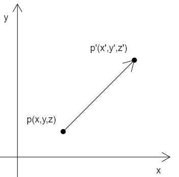

已知：

- 顶点p(x,y,z)
- 在x、y、z 三个方向上，分别将点p 移动tx、ty、tz

求：点p 移动后的位置p'(x',y',z')


解：

```
x'=x+tx
y'=y+ty
z'=z+tz
```

如果这个图形中并非只有一个顶点，而是有三个，或者更多，那么所有的顶点也是按照同样原理进行位移。

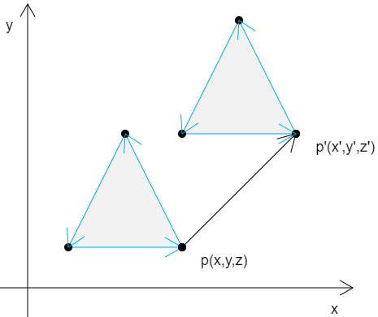


### 2-向量加法

在实际代码中，我们要有一个向量的概念。

比如 (x,y,z) ，我们既可以说它是一个顶点位置，也可以说它是一个向量。

至于 (x,y,z) 到底是什么，要看我们拿它做什么。

比如，把点p(x,y,z) 作为点位时，那它就是点p(x,y,z)

我们把p 的移动距离tx、ty、tz 封装成一个对象pt(tx,ty,tz)，那么pt 就是一个向量，一个为点p 指明移动方向和距离的向量。

因此：点p 的移动结果 p' 就可以这么写：

```
p'=p+pt
```

由上可知，顶点的位移就是向量的加法。


### 3-代码实现

#### 3-1-GLSL ES 语言里的向量运算

在GLSL ES 语言里，是可以直接进行向量运算。

下面的顶点着色器里的代码：

```js
attribute vec4 a_Position;
vec4 translation=vec4(0,0.2,0,0);
void main(){
    gl_Position = a_Position+translation;
}
```

- a_Position 是原始点位，属于attribute 变量
- translation 是顶点着色器里的私有变量，没有向外部暴露，属于4维向量
- a_Position+translation 便是着色器内的向量加法，这里是对原始点位进行位移

之后，我们也可以把translation 变量暴露出去，让js可以修改图形位置：

```html
<script id="vertexShader" type="x-shader/x-vertex">
    attribute vec4 a_Position;
    uniform vec4 u_Translation;
    void main(){
        gl_Position = a_Position+u_Translation;
    }
</script>
```

在js 中修改uniform 变量的方法，我们之前已经说过：

```
const u_Translation=gl.getUniformLocation(gl.program,'u_Translation');
gl.uniform4f(u_Translation,0,0.5,0,0);
```

整体代码：

```html
<canvas id="canvas"></canvas>
<script id="vertexShader" type="x-shader/x-vertex">
    attribute vec4 a_Position;
    uniform vec4 u_Translation;
    void main(){
        gl_Position = a_Position+u_Translation;
    }
</script>
<script id="fragmentShader" type="x-shader/x-fragment">
    void main(){
        gl_FragColor=vec4(1,1,0,1);
    }
</script>
<script type="module">
    import {initShaders} from '../jsm/Utils.js';

    const canvas = document.getElementById('canvas');
    canvas.width=window.innerWidth;
    canvas.height=window.innerHeight;
    const gl = canvas.getContext('webgl');

    const vsSource = document.getElementById('vertexShader').innerText;
    const fsSource = document.getElementById('fragmentShader').innerText;
    initShaders(gl, vsSource, fsSource);

    const vertices=new Float32Array([
        0,  0.1,
        -0.1,-0.1,
        0.1, -0.1
    ])

    const vertexBuffer=gl.createBuffer();
    gl.bindBuffer(gl.ARRAY_BUFFER,vertexBuffer);
    gl.bufferData(gl.ARRAY_BUFFER,vertices,gl.STATIC_DRAW);
    const a_Position=gl.getAttribLocation(gl.program,'a_Position');
    gl.vertexAttribPointer(a_Position,2,gl.FLOAT,false,0,0);
    gl.enableVertexAttribArray(a_Position);

    const u_Translation=gl.getUniformLocation(gl.program,'u_Translation');
    gl.uniform4f(u_Translation,0,0.5,0,0);

    gl.clearColor(0, 0, 0, 1);
    gl.clear(gl.COLOR_BUFFER_BIT);

    // gl.drawArrays(gl.POINTS, 0, 3);
    gl.drawArrays(gl.TRIANGLES, 0, 3);
    
</script>
```


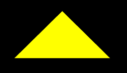


在最后面我们还可以加一段逐帧动画：

```js
let y=0;
!(function ani(){
    y+=0.02
    if(y>1){
        y=-1
    }
    gl.uniform4f(u_Translation,0,y,0,0);
    gl.clear(gl.COLOR_BUFFER_BIT);
    gl.drawArrays(gl.TRIANGLES, 0, 3);
    requestAnimationFrame(ani)
})()
```

效果如下：

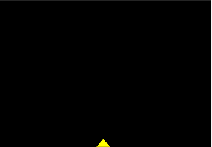

接下来咱们说旋转。


## 第二章 旋转

### 1-旋转的概念

三维物体的旋转要比位移复杂一点，因为三维物体的旋转需要知道以下条件：

- 旋转轴
- 旋转方向
- 旋转角度

我们可以想象一个场景：

一个小人站在旋转轴的起点进行旋转。

小人要往左转还是往右转，就是旋转的方向。

小人旋转的大小就是旋转角度。

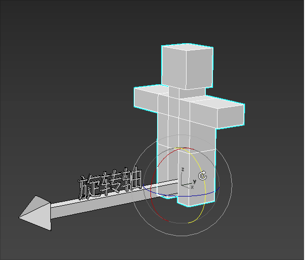


### 2-旋转方向的正负

物体的旋转方向是有正负之分的。

那何时为正，何时为负呢？

在webgl 中，除裁剪空间之外的大部分功能都使用了右手坐标系。

所以，在我们初学webgl 的时候，可以暂且将其当成右手坐标系，等讲到裁剪空间的时候，我再跟大家说左手坐标系。

下图就是右手坐标系：

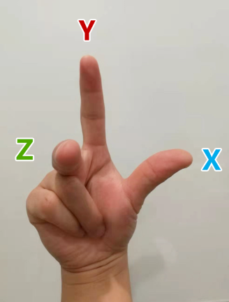

以上图为例：

- 当物体绕z 轴，从x轴正半轴向y轴正半轴逆时针旋转时，是正向旋转，反之为负。
- 当物体绕x 轴，从y轴正半轴向z轴正半轴逆时针旋转时，是正向旋转，反之为负。
- 当物体绕y 轴，从z轴正半轴向x轴正半轴逆时针旋转时，是正向旋转，反之为负。

如下图就是正向旋转：

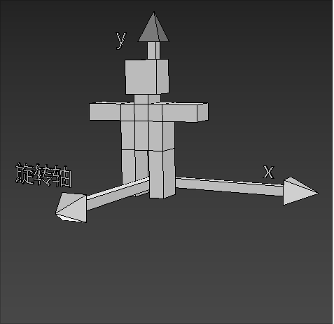


### 3-旋转公式

先举一个让顶点围绕z 轴旋转的例子。


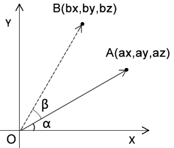

已知：

- 点A的位置是(ax,ay,az)
- 点A要围绕z轴旋转β度，转到点B的位置

求：点A旋转后的bx、by位置

解：

我们由结果逆推一下解题思路。

因为∠β是已知的，∠α 可以通过点A 得出。

所以我们可以得出：

```js
∠xOB=α+β
```

那我们通过三角函数就可以推出bx、by

设∠xOB=θ，则：

```js
bx=cosθ*|OA|
by=sinθ*|OA|
```

上面的|OA|是点O到点A的距离，可以直接用点A求出：

```js
|OA|=Math.sqrt(ax*ax+ay*ay
```

那我们接下来只需要知道cosθ和sinθ的值即可

因为：θ=α+β

所以，我们可以利用和角公式求cosθ和sinθ的值：

```js
cosθ=cos(α+β)
cosθ=cosα*cosβ-sinα*sinβ
```

```js
sinθ=sin(α+β)
sinθ=cosβ*sinα+sinβ*cosα
```

所以：

```js
bx=cosθ*|OA|
bx=(cosα*cosβ-sinα*sinβ)*|OA|
bx=cosα*cosβ*|OA|-sinα*sinβ*|OA|
```

```js
by=sinθ*|OA|
by=(cosβ*sinα+sinβ*cosα)*|OA|
by=cosβ*sinα*|OA|+sinβ*cosα*|OA|
```

因为：

```
cosα*|OA|=ax
sinα*|OA|=ay
```

所以我们可以简化bx、by的公式

```js
bx=ax*cosβ-ay*sinβ
by=ay*cosβ+ax*sinβ
```

上面的bx、by就是我们要求的答案。

那接下来咱们可以测试一下，如何让一个三角形绕z轴转起来


### 4-在着色器中旋转

我们可以直接在着色器里写旋转公式：

```html
<script id="vertexShader" type="x-shader/x-vertex">
    attribute vec4 a_Position;
    float angle=radians(80.0);
    float sinB=sin(angle);
    float cosB=cos(angle);
    void main(){
        gl_Position.x=a_Position.x*cosB-a_Position.y*sinB;
        gl_Position.y=a_Position.y*cosB+a_Position.x*sinB;
        gl_Position.z=a_Position.z;
        gl_Position.w=1.0;
    }
</script>
```

- radians(float degree) 将角度转弧度
- sin(float angle) 正弦
- cos(float angle) 余弦

我们也可以用js控制图形的旋转。


### 5-用js旋转图形

我们将顶点着色器里的正弦值和余弦值暴露给js，便可以用js旋转图形了。

```html
<script id="vertexShader" type="x-shader/x-vertex">
    attribute vec4 a_Position;
    uniform float u_SinB;
    uniform float u_CosB;
    void main(){
        gl_Position.x=a_Position.x*u_CosB-a_Position.y*u_SinB;
        gl_Position.y=a_Position.y*u_CosB+a_Position.x*u_SinB;
        gl_Position.z=a_Position.z;
        gl_Position.w=1.0;
    }
</script>
```

在js 中修改uniform 变量

```js
const u_SinB = gl.getUniformLocation(gl.program, 'u_SinB')
const u_CosB = gl.getUniformLocation(gl.program, 'u_CosB')
let angle = 0.3
gl.uniform1f(u_SinB, Math.sin(angle))
gl.uniform1f(u_CosB, Math.cos(angle))
```

之后也可以让图形转起来：

```js
!(function ani() {
    angle += 0.01
    gl.uniform1f(u_SinB, Math.sin(angle))
    gl.uniform1f(u_CosB, Math.cos(angle))
    gl.clear(gl.COLOR_BUFFER_BIT);
    gl.drawArrays(gl.TRIANGLES, 0, 3);
    requestAnimationFrame(ani)
})()
```


## 第三章 缩放

### 1-缩放的基本概念

缩放可以理解为对向量长度的改变，或者对向量坐标分量的同步缩放

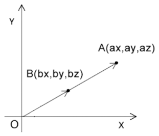

已知：

- 点A的位置是(ax,ay,az)
- 点A基于原点內缩了一半

求：点A內缩了一半后的bx、by、bz位置

解：

```js
bx=ax*0.5
by=ay*0.5
bz=az*0.5
```


### 2-在着色器中缩放

我可以对gl_Position 的x、y、z依次缩放。

```html
<script id="vertexShader" type="x-shader/x-vertex">
attribute vec4 a_Position;
float scale=1.2;
void main(){
	gl_Position.x= a_Position.x*scale;
	gl_Position.y= a_Position.y*scale;
	gl_Position.z= a_Position.z*scale;
	gl_Position.w=1.0;
}
</script>
```

也可以从a_Position中抽离出由x、y、z组成的三维向量，对其进行一次性缩放。

```html
<script id="vertexShader" type="x-shader/x-vertex">
attribute vec4 a_Position;
float scale=1.2;
void main(){
	gl_Position=vec4(vec3(a_Position)*scale,1.0);
}
</script>
```


### 3-用js缩放图形

同样的我们也可以把缩放系数暴露给js，通过js 缩放图形。

1.建立uniform变量

```html
<script id="vertexShader" type="x-shader/x-vertex">
    attribute vec4 a_Position;
    uniform float u_Scale;
    void main(){
        gl_Position=vec4(vec3(a_Position)*u_Scale,1.0);
    }
</script>
```


2.使用js获取并修改uniform 变量

```js
const u_Scale = gl.getUniformLocation(gl.program, 'u_Scale')
gl.uniform1f(u_Scale, 1.0)
```


3.继续来点动画

```js
let angle = 0
!(function ani() {
    angle += 0.05
    const scale = Math.sin(n) + 1
    gl.uniform1f(u_Scale, scale)
    gl.clear(gl.COLOR_BUFFER_BIT);
    gl.drawArrays(gl.TRIANGLES, 0, 3);
    requestAnimationFrame(ani)
})()
```


## 第四章 矩阵

矩阵（Matrix）是一个按照矩形纵横排列的复数集合。

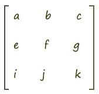

矩阵就像一个矩形的阵盘，通过其中纵横排列的元素，我们可以摆出不同功能的阵法，比如位移矩阵、旋转矩阵、缩放矩阵…… 


在矩阵中的每一行，或者每一列数字构成的集合，可以视之为向量。

所以咱们接下来要先从向量说起。


### 1-向量

向量，又叫矢量，它是一个用于表示方向和量的对象。

我另写了几篇可以从零基础认识向量的文章，大家可看一下，以便对向量有一个透彻的认知：

- [漫谈直线之向量](http://yxyy.name/blog/md.html?ossName=16075685641636504201598815276.md&title=漫谈直线之向量)
- [漫谈向量之坐标运算](http://yxyy.name/blog/md.html?ossName=16075685641637789800786968204.md&title=漫谈向量之坐标运算)
- [向量之点积](http://yxyy.name/blog/md.html?ossName=16084365052987382820580352247.md&title=向量之点积)
- [向量之叉乘](http://yxyy.name/blog/md.html?ossName=16094296463882267682718255064.md&title=向量之叉乘)

在webgl 里的向量有1维向量、2维向量、3维向量和4维向量。

- 1维向量中有1个数字，对应的是单轴坐标系里的点位。
- 2维向量中有2个数字，对应的是2维坐标系里的点位。
- 3维向量中有3个数字，对应的是3维坐标系里的点位。
- 4维向量中有4个数字，对应的是3维坐标系里的点位，外加一个附加数据，至于这个数据是什么，要看我们的项目需求。

向量咱们就说到这，接下来咱们再说一下矩阵和向量的乘法。

 


### 2-矩阵和向量的乘法

首先，咱先看一个矩阵和向量的乘法图：

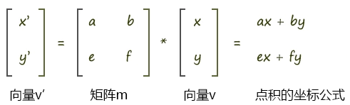


矩阵乘以向量时，向量是几维的，那矩阵中就应该有几个向量。

如上图向量v 是2维的，那么矩阵中就有2组向量，这两组向量可以是横着的两组向量，也可以是竖着的两组向量。

- 横着的两组向量是：向量(a,b)、向量(e,f)
- 竖着的两组向量是：向量(a,e)、向量(b,f)

用专业术语来说：

- 横着的两组遵循的规则是行主序，即将矩阵中的一行数据视之为一个向量。
- 竖着的两组遵循的规则是列主序，即将矩阵中的一列数据视之为一个向量。

至于我们是使用行主序，还是列主序，这就得看规则的定制者了。

在webgl 里，矩阵元素的排列规则是列主序。

数学中常用的写法是行主序，所以我们接下来就用行主序举例子了。

矩阵和向量相乘的规则就是让矩阵中的每个向量和向量v相乘。

向量和向量相乘，就是在求向量的点积，其结果是一个实数，而不再是向量。

比如上图中，向量(a,b)乘以向量v(x,y)的结果是：

```js
a*x+b*y
```

因为a、b、x、y都是实数，所以其结果也是实数。

上图中，矩阵m乘以向量v 会得到两个结果，即ax+by和ex+fy。

这两个结果会构成一个新的向量v'(x',y')

```
x'=a*x+b*y
y'=e*x+f*y
```

这时我们可以将其和数学里的旋转公式做一下比较。

点A(ax,ay)围绕z轴旋β度,其旋转后的位置是点B(bx,by)，则：

```js
bx=cosβ*ax-sinβ*ay
by=sinβ*ax+cosβ*ay
```

对比上面的两组公式，试想一下：

向量v是不是可以当成一个点位呢？

答案是可以的。

那我现在就让向量v代表的位置，就是点A的位置。

那么矩阵m乘以向量v，是不是可以让向量v代表的这个点位旋转β度呢？

如果可以，那么矩阵里的元素应该满足什么条件呢？

满足以下条件即可：

```js
a=cosβ
b=-sinβ
e=sinβ
f=cosβ
```

这样，用矩阵乘以向量的方法得到的旋转结果和用数学公式得到的结果就是一样的，即;

```js
a*x+b*y=cosβ*ax-sinβ*ay
e*x+f*y=sinβ*ax+cosβ*ay
```

最终我们就可以用矩阵乘以向量的方式让点p旋转β度

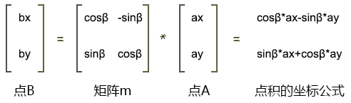

那我们知道了上面的这种关系之后，要干什么，能干什么呢？接下来就是重点啦！


### 3-在着色器中写矩阵

我们是可以直接在着色器中建立矩阵对象的。

```html
<script id="vertexShader" type="x-shader/x-vertex">
    attribute vec4 a_Position;
    float angle=radians(40.0);
    float sinB=sin(angle);
    float cosB=cos(angle);
    mat2 m2=mat2(
      cosB, sinB,
      -sinB,cosB
    );
    void main(){
      gl_Position = vec4(
        m2*vec2(a_Position),
        a_Position.z,a_Position.w
      );
    }
</script>
```

- mat2 是二维矩阵对象


### 4-用js建立矩阵对象并传递给着色器

1.在顶点着色器中建立uniform变量

```html
<script id="vertexShader" type="x-shader/x-vertex">
    attribute vec4 a_Position;
    uniform mat2 u_Matrix;
    void main(){
      gl_Position = vec4(
        u_Matrix*vec2(a_Position),
        a_Position.z,a_Position.w
      );
    }
</script>
```


2.获取并修改uniform 变量

```js
const u_Matrix = gl.getUniformLocation(gl.program, 'u_Matrix')
let angle = 0.2
const [sinB, cosB] = [Math.sin(angle), Math.cos(angle)]
const matrix = [
    cosB, sinB,
    -sinB, cosB
]
gl.uniformMatrix2fv(u_Matrix, false, matrix)
```


3.后面我们也可以在其中添加动画

```js
const u_Matrix = gl.getUniformLocation(gl.program, 'u_Matrix')
let angle = 0.2

!(function ani() {
    angle += 0.02
    const [sinB, cosB] = [Math.sin(angle), Math.cos(angle)]
    const matrix = [
        cosB, sinB,
        -sinB, cosB
    ]
    gl.uniformMatrix2fv(u_Matrix, false, matrix)

    gl.clear(gl.COLOR_BUFFER_BIT);
    gl.drawArrays(gl.TRIANGLES, 0, 3);
    requestAnimationFrame(ani)
})()
```


目前我们说的只是最简单的二维矩阵，我们可以直接给顶点着色器一个四维矩阵。


### 5-四维矩阵

四维矩阵在着色器里的应用原理和二维矩阵是一样的，只要理解了其运算原理就好。

```html
<script id="vertexShader" type="x-shader/x-vertex">
    attribute vec4 a_Position;
    float angle=radians(10.0);
    float cosB=cos(angle);
    float sinB=sin(angle);
    mat4 m4=mat4(
      cosB, sinB,0.0,0.0,
      -sinB,cosB,0.0,0.0,
      0.0,  0.0, 1.0,0.0,
      0.0,  0.0, 0.0,1.0
    );
    void main(){
      gl_Position = m4*a_Position;
    }
</script>
```


我们也可以用js向顶点着色器传递四维矩阵。

```js
const u_Matrix = gl.getUniformLocation(gl.program, 'u_Matrix')
let angle = 0.1
const [sinB, cosB] = [Math.sin(angle), Math.cos(angle)]
const matrix = [
    cosB, sinB, 0.0, 0.0,
    -sinB, cosB, 0.0, 0.0,
    0.0, 0.0, 1.0, 0.0,
    0.0, 0.0, 0.0, 1.0
]
gl.uniformMatrix4fv(u_Matrix, false, matrix)
```

矩阵不仅可以用于旋转，还可以平移和缩放。


### 6-矩阵平移

比如我要让顶点的x移动0.1，y移动0.2，z移动0.3

顶点着色可以这样写：

```html
<script id="vertexShader" type="x-shader/x-vertex">
    attribute vec4 a_Position;
    //列主序
    mat4 m4=mat4(
      1.0, 0.0, 0.0,0.0,
      0.0, 1.0, 0.0,0.0,
      0.0, 0.0, 1.0,0.0,
      0.1, 0.2, 0.3,1.0
    );
    void main(){
      gl_Position = m4*a_Position;
    }
</script>
```

对于js 建立矩阵对象，并传递给着色器的方法，我之前已经说过，就不再赘述了。


### 7-矩阵缩放

以同样的原理，我们也可以写缩放矩阵。

比如我要让顶点在x轴向缩放2，y轴向缩放3，轴向缩放4

顶点着色可以这样写：

```html
<script id="vertexShader" type="x-shader/x-vertex">
    attribute vec4 a_Position;
    //列主序
    mat4 m4=mat4(
      2.0, 0.0, 0.0,0.0,
      0.0, 3.0, 0.0,0.0,
      0.0, 0.0, 4.0,0.0,
      0.0, 0.0, 0.0,1.0
    );
    void main(){
      gl_Position = m4*a_Position;
    }
</script>
```


## 第五章 矩阵库

像我们之前那样手写矩阵，其实是很麻烦的，我们可以将其模块化。

现在市面上已经有许多开源的矩阵库了，比如《WebGL 编程指南》里的cuon-matrix.js，three.js 的Matrix3和Matrix4对象。

接下我们就简单说一下three.js的Matrix4对象的用法。

1.引入Matrix4对象

```js
import {Matrix4} from 'https://unpkg.com/three/build/three.module.js';
```

2.实例化矩阵对象，在其中写入旋转信息

```js
const matrix=new Matrix4()
matrix.makeRotationZ(Math.PI/6)
```

3.基于matrix 对象的elements 属性，修改uniform 变量

```js
const u_Matrix=gl.getUniformLocation(gl.program,'u_Matrix')
gl.uniformMatrix4fv(u_Matrix,false,matrix.elements)
```


## 总结

这一篇主要讲解了如何使用矩阵统一变换一个物体的多个顶点，下一篇我们会让矩阵包含多种变换信息，比如移动加旋转，旋转加缩放。

​               
