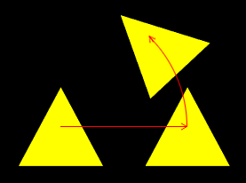
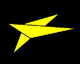
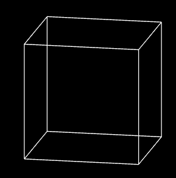
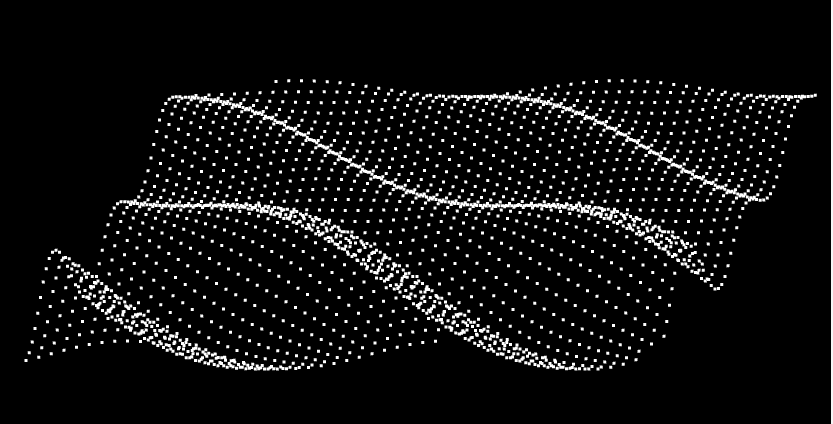
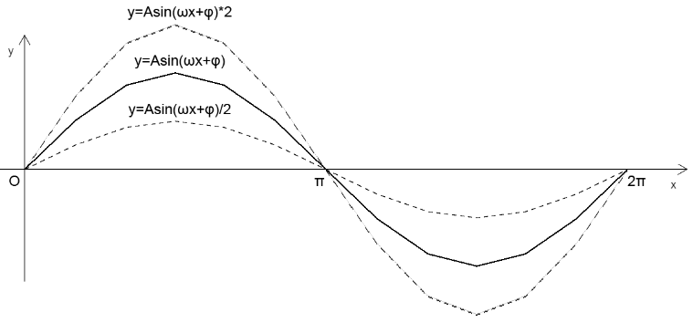
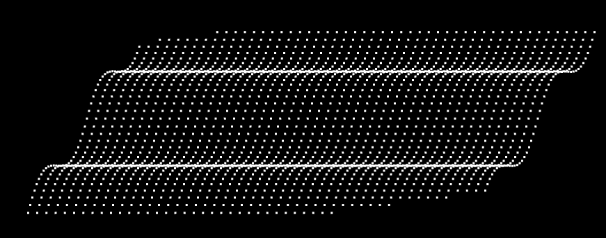
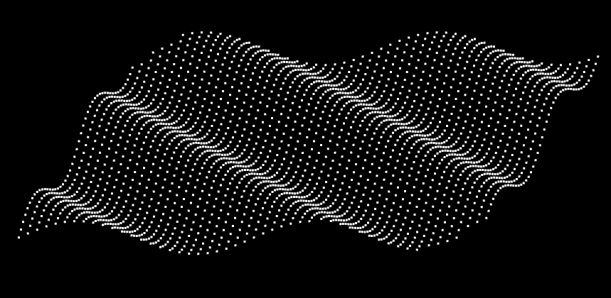
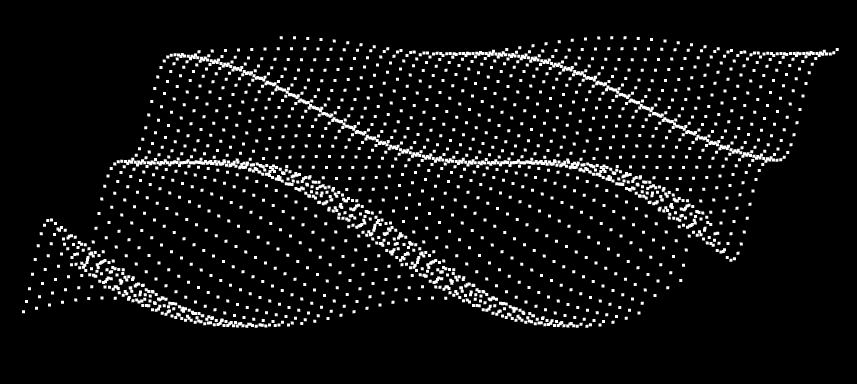

##  前言

变换有三种状态：平移、旋转、缩放。

在一个四维矩阵中，是可以包含所有的变换状态的。即，我们可以让图形进行一次性的平移、旋转和缩放，这样的变换就叫做复合变换。


### 课堂目标  

1. 理解复合变换的原理。
2. 可以得心应手的变换图形。


### 知识点  

1. 矩阵乘法
2. 不同变换顺序的差异


## 第一章 矩阵相乘

矩阵相乘可以实现复合变换，就比如先位移再旋转、先旋转在位移，或着连续位移。

接下来咱们先看一下两个矩阵是如何相乘的。

矩阵乘以矩阵的结果还是矩阵，我们可以通过矩阵库验证一下矩阵相乘的规律。

1.使用three.js的Matrix4 对象建立矩阵

```js
const a=new Matrix4().set(
    0, 1, 2, 3,
    4, 5, 6, 7,
    8, 9, 10,11,
    12,13,14,15
)
const b=new Matrix4().set(
    0,  10, 20, 30,
    40, 50, 60, 70,
    80, 90, 100,110,
    120,130,140,150
)

```

注：set()方法里输入的矩阵是行主序的，但elements 输出的矩阵是列主序的。

```js
const ca=a.elements
console.log(ca);

[
    0, 4, 8,  12, 
    1, 5, 9,  13, 
    2, 6, 10, 14, 
    3, 7, 11, 15
]
```

```js
const cb=b.elements
console.log(cb);

[
    0,  40, 80, 120, 
    10, 50, 90, 130, 
    20, 60, 100, 140, 
    30, 70, 110, 150
]
```


2.让矩阵a乘以矩阵b

```js
const c=a.multiply(b)
console.log(c.elements);

[
    560, 1520, 2480, 3440, 
    620, 1740, 2860, 3980, 
    680, 1960, 3240, 4520, 
    740, 2180, 3620, 5060
]
```

分析一下结果

```js
560=0*0 +1*40+2*80 +3*120
620=0*10+1*50+2*90 +3*130
680=0*20+1*60+2*100+3*140
740=0*30+1*70+2*110+3*150

1520=4*0 +5*40+6*80 +7*120
1740=4*10+5*50+6*90 +7*130
……
```

到此，我们应该能总结出矩阵a乘以矩阵b规律，以列主序的ca、cb为例：

先遍历ca的每一列，再遍历cb的每一行，将ca的每一列乘以cb的每一行，按照列主序排列后得到的结果。

或者，先遍历ca的每一行，再遍历cb的每一列，将ca的每一行乘以cb的每一列，按照行主序排列后得到的结果。

我们验证一下后者：

```js
const cc=[]
for(let y=0;y<16;y+=4){
    const [ax,ay,az,aw]=[ca[y],ca[y+1],ca[y+2],ca[y+3]]
    for (let x=0;x<4;x++){
        console.log(x);
        const [bx,by,bz,bw]=[cb[x],cb[x+4],cb[x+8],cb[x+12]]
        cc.push(ax*bx+ay*by+az*bz+aw*bw)
    }
}
console.log(cc);

[
    560, 1520, 2480, 3440, 
    620, 1740, 2860, 3980, 
    680, 1960, 3240, 4520, 
    740, 2180, 3620, 5060
]
```

其结果和矩阵库一致。


3.通过上面的规则可知

- 当两个矩阵的每个元素相互等比时

```j's
a*b=b*a
```

- 当两个矩阵的每个元素相互不等比时

```
a*b!=b*a
```


## 第二章 在实践中寻找复合变换的规律

通过实践，我们可以很容易的找到复合变换的规律。

接下咱们先写一个简单复合变换：位移加位移。


### 1-位移加位移

接下来我想让一个物体沿x 轴位移ax，沿y 轴位移ay后，再沿x 轴位移bx，沿y 轴位移by。

已知：

- 初始点位A(ax,ay,az,1.0)
- 初次位移：沿x 轴位移bx，沿y 轴位移by
- 第二次位移：沿x 轴位移cx，沿y 轴位移cy

求：变换后的位置F(fx,fy,fz,fw)

解：

1.设初次变换矩阵为bm(行主序)：

```js
[
	1.0,0.0,0.0,bx,
	0.0,1.0,0.0,by,
	0.0,0.0,1.0,0.0,
	0.0,0.0,0.0,1.0,
]
```

则初次变换后的点F为：

```js
F=bm*A
fx=(1.0,0.0,0.0,bx)*(ax,ay,az,1.0)=ax+bx
fy=(0.0,1.0,0.0,by)*(ax,ay,az,1.0)=ay+by
fz=(0.0,0.0,1.0,0.0)*(ax,ay,az,1.0)=az
fw=(0.0,0.0,0.0,1.0)*(ax,ay,az,1.0)=1.0
```


2.设第二次变换矩阵为cm(行主序)：

```js
[
	1.0,0.0,0.0,cx,
	0.0,1.0,0.0,cy,
	0.0,0.0,1.0,0.0,
	0.0,0.0,0.0,1.0,
]

```

则第二次变换后的点F为第二次变换矩阵乘以上一次变换后的点F：

```js
F=cm*F
fx=(1.0,0.0,0.0,cx)*(fx,fy,fz,1.0)=fx+cx
fy=(0.0,1.0,0.0,cy)*(fx,fy,fz,1.0)=fy+cy
fz=(0.0,0.0,1.0,0.0)*(fx,fy,fz,1.0)=fz
fw=(0.0,0.0,0.0,1.0)*(fx,fy,fz,1.0)=1.0

```


通过第一次的变换，我们也可以这么理解最终的点F：

```js
fx=ax+bx+cx
fy=ay+by+cy
fz=az
fw=1.0

```


到目前为止，我们已经通过两次矩阵乘以向量的方法得到了F 点，那我们说好的矩阵乘以矩阵呢？

上面的点F还可以这么理解：

```js
F=cm*bm*A

```

设cm*bm的结果为矩阵dm(行主序)，

参照dm中元素的索引位置：

```
[
    0, 1, 2,  3, 
    4, 5, 6,  7, 
    8, 9, 10, 11, 
    12,13,14, 15
]

```

则dm中的第一行元素为：

```js
dm[0]=(1.0,0.0,0.0,bx)*(1.0,0.0,0.0,0.0)=1.0
dm[1]=(1.0,0.0,0.0,bx)*(0.0,1.0,0.0,0.0)=0.0
dm[2]=(1.0,0.0,0.0,bx)*(0.0,0.0,1.0,0.0)=0.0
dm[3]=(1.0,0.0,0.0,bx)*(cx, cy, 0.0,1.0)=cx+bx

```

通过dm矩阵的第一行元素我们就可以得到点F的fx值了，我们验证一下：

```js
fx=(1.0,0.0,0.0,cx+bx)*(ax,ay,az,1.0)=ax+cx+bx

```

这和我们之前两次矩阵乘以向量得到的结果是一样的。


接下来咱们在把矩阵dm 的第二行元素写一下：

```js
dm[4]=(0.0,1.0,0.0,by)*(1.0,0.0,0.0,0.0)=0.0
dm[5]=(0.0,1.0,0.0,by)*(0.0,1.0,0.0,0.0)=1.0
dm[6]=(0.0,1.0,0.0,by)*(0.0,0.0,1.0,0.0)=0.0
dm[7]=(0.0,1.0,0.0,by)*(cx, cy, 0.0,1.0)=cy+by
```

验证一下：

```js
fy=(0.0,1.0,0.0,cy+by)*(ax,ay,az,1.0)=ay+cy+by
```


接下来咱们在把矩阵dm 的第三行元素写一下：

```js
dm[8] =(0.0,0.0,1.0,bz)*(1.0,0.0,0.0,0.0)=0.0
dm[9] =(0.0,0.0,1.0,bz)*(0.0,1.0,0.0,0.0)=0.0
dm[10]=(0.0,0.0,1.0,bz)*(0.0,0.0,1.0,0.0)=1.0
dm[11]=(0.0,0.0,1.0,bz)*(cx, cy, 0.0,1.0)=bz
```


### 2-先移动后旋转

代码如下：

```js
const mr=new Matrix4()
mr.makeRotationZ(Math.PI/4)

const mt=new Matrix4()
mt.makeTranslation(0.3,0,0)

const matrix=mr.multiply(mt)
const u_Matrix=gl.getUniformLocation(gl.program,'u_Matrix')
gl.uniformMatrix4fv(u_Matrix,false,matrix.elements)
```

mr 是旋转矩阵

mt 是位移矩阵

mr.multiply(mt) 便是先位移再旋转

效果如下：




### 2-先旋转后移动

基于之前的先移动后旋转的代码改一下即可

```js
const mr=new Matrix4()
mr.makeRotationZ(Math.PI/4)

const mt=new Matrix4()
mt.makeTranslation(0.3,0,0)

const matrix=mt.multiply(mr)
const u_Matrix=gl.getUniformLocation(gl.program,'u_Matrix')
gl.uniformMatrix4fv(u_Matrix,false,matrix.elements)
```

效果如下：


### 3-其它变换方式

矩阵相乘的性质决定了只要变换顺序不一样，那么变换结果就可能不一样。

我们再看一个旋转和缩放的例子。

#### 3-1-旋转和缩放

- 先旋转后缩放

```js
const mr=new Matrix4()
mr.makeRotationZ(Math.PI/4)

const ms=new Matrix4()
ms.makeScale(2,0.5,1)

const matrix=ms.multiply(mr)
const u_Matrix=gl.getUniformLocation(gl.program,'u_Matrix')
gl.uniformMatrix4fv(u_Matrix,false,matrix.elements)
```

makeScale() 是矩阵的缩放方法

- 先缩放后旋转

```js
const matrix=mr.multiply(ms)
```

下图是两种效果的对比：




在此要注意一个性质：当缩放因子一致时，旋转和缩放没有先后之分。

如下代码：

```js
const ms=new Matrix4()
ms.makeScale(2,2,2)
```

此是下面的两种变换结果都是一样的:

```
const matrix=ms.multiply(mr)
const matrix=mr.multiply(ms)
```


#### 3-2-综合变换

Matrix4还有一个compose综合变换方法，它可以将所有变换信息都写进去，其变换顺序就是先缩放，再旋转，最后位移。

示例代码：

```js
const matrix=new Matrix4()
const pos=new Vector3(0.3,0,0)
const rot=new Quaternion()
rot.setFromAxisAngle( new Vector3( 0, 0, 1 ), Math.PI / 4 )
const scale=new Vector3(2,0.5,1)
matrix.compose(pos,rot,scale)
const u_Matrix=gl.getUniformLocation(gl.program,'u_Matrix')
gl.uniformMatrix4fv(u_Matrix,false,matrix.elements)
```

compose ( position : Vector3, quaternion : Quaternion, scale : Vector3 )

- position 位置
- quaternion 用四元数存储的旋转数据
- scale 缩放

compose() 方法分解开来，就是这样的：

```js
const mt=new Matrix4()
mt.makeTranslation(0.3,0,0)

const mr=new Matrix4()
mr.makeRotationZ(Math.PI/4)

const ms=new Matrix4()
ms.makeScale(2,0.5,1)

const matrix=mt.multiply(mr).multiply(ms)
const u_Matrix=gl.getUniformLocation(gl.program,'u_Matrix')
gl.uniformMatrix4fv(u_Matrix,false,matrix.elements)
```

到目前为止，我们对矩阵所做的，还只是最基础的练手。

接下来咱们在矩阵中融入空间向量分解定理，使其具有空间感。


## 第三章 视图矩阵

### 1-视图矩阵的概念

视图矩阵可以让我们从我们所想要的角度观察物体。

我们在裁剪空间(webgl 画布)中绘图的时候，z轴数据是没有效果的，因为裁剪空间的z轴和canvas画布垂直，我们看不到顶点的深度差异。

因此，我们若想看到立体效果，从另一个角度来观察物体。

这个时候就需要视图矩阵了，视图矩阵可以为顶点提供一套新的坐标基底，并获取顶点在这套坐标基底中的点位，然后再将其显示在裁剪空间中。

大家若不理解我上面这句话，那就需要补一下高中数学了。

高中数学的知识并不难，不然它就叫大学数学了。

在高中数学里有一块空间向量的知识，叫做"空间向量分解定理"：

如果三个向量a、b、c不共面，那么对空间任一向量p，存在一个唯一有序实数组(x,y,z)，使

```js
p=xa+yb+zc
```

- a,b,c 可以视之为一个三维空间的坐标基底，高中数学里称其为基向量，可构成一个矩阵，一阵便可自成一界。
- x,y,z 可视之为顶点的原始点位。
- 点p 可理解为顶点的原始点位(x,y,z) 在矩阵[a,b,c]所架构出的新世界的中的点位。

由上式可知，只要我们知道了向量a、b、c，便可以从一个新的世界，新的视角来欣赏立体的事物。

若你只是想换一个角度观察裁剪空间中的物体，那么基向量还要满足以下条件：

- 基向量需要相互垂直。因为裁剪空间的坐标系是三维直角坐标系。
- 基向量的单位必须是1，也就是向量a、b、c 要做归一化，使其长度为1。因为裁剪空间里三个轴的单位就是1。

满足了上面的条件后，由矩阵[a,b,c]所架构出的新世界和裁剪空间就只会有旋转方向上的差异，这样新世界里的顶点也可以以另一个角度显示在裁剪空间里。

接下来的重点就是如何定义坐标基底a,b,c

在实际开发中，a,b,c 不适合凭空想象，我们需要更具象、更通俗易懂的参数来计算a,b,c

就目前我已知的矩阵库中，都是通过三个参数计算a,b,c：

- 视点 e
- 目标点 t
- 上方向 u

这三个参数是什么概念呢？

以我的脑袋为例，我脑袋的上下方向是y轴，左右方向是x轴，前后方向时z轴。

视点是我的眼睛位置，目标点是我的眼睛看的地方。视点和目标点可以决定我的脑袋绕y轴左右旋转的角度，以及x轴上的俯视、仰视。

上方向会决定我的脑袋绕z轴旋转的角度，发个表情，就是这样的：

  


大家可以自己转转脑袋，想象一下。

接下来，咱们再说一下如何通过视点、目标点、上方向来得到基向量。


### 2-视图矩阵的布阵思路

1.以视点e为终点，目标点t为起点，计算向量d(dx,dy,dz)

```js
d=e-t
```

注：向量d 和视点看向目标的方向正好相反。


2.将d 归一化

```js
d*=1/|d|
```

简单说一下归一化思路。

因为：归一化后的向量的长度为1

所以，我们可以找到向量归一后的长度和向量归一前的长度的比值：

```js
1/|d|
```

因为：向量的归一化只是改变了向量的长度，未改变向量的方向

所以：归一前的向量和归一后的向量共线且同向

所以：

```
dx*=1/|d|
dy*=1/|d|
dz*=1/|d|
```

简写一下就是之前的归一公式：

```
d*=1/|d|
```


2.求向量d和上方向的垂线 a(ax,ay,az)

```js
a=d^u
```

这里我使用的是空间向量的叉乘。

以前我们说二维向量的叉乘时说过，二维向量的叉乘结果可以直接理解为一个实数。

这是因为二维向量的叉乘是在x轴和y轴构成的平面里实现的。

其叉乘结果也可以理解为三维空间中z 轴上的一点。

因为z轴上的点的x,y 值都是0，可以先不考虑，所以我说二维向量的叉乘结果可以直接理解为一个实数。

严谨来说，两个向量的叉乘结果还是向量。

两个空间向量的叉乘结果必然和这两个向量构成的平面垂直。

其在右手规则下的坐标运算如下:

已知：向量a(ax,ay,az)，向量b(bx,by,bz)

求：a^b的结果c(cx,cy,cz)

解：

```js
cx=ay*bz-az*by
cy=az*bx-ax*bz
cz=ax*by-ay*bx
```


3.将向量a 归一化

```js
a*=1/|a|
```


4.求向量d和向量a的垂线b(bx,by,bz)

```js
b=d^a
```


5.将向量d取反，得向量c(cx,cy,cz)

```js
c=-d
```

上面的方法是为了将新世界的坐标系变成左手坐标系。

基向量a,b,c 分别对应着左手坐标系里的x,y,z。

在新世界的左手坐标系里，物体的z值越小，视点所看见的就越大。

裁剪空间里的z就是下图右手坐标系里的z。


到目前为止我们已经得到了基向量a,b,c，接下来就可以布阵了。


6.写一个列主序的视图矩阵matrix

```
matrix=[
	ax,bx,cx,0,
	ay,by,cy,0,
	az,bz,cz,0,
	0, 0, 0, 1
]
```

接下来将matrix传递给顶点着色器，让其和裁剪空间里的原始点位相乘，便可以从一个新的视角看见裁剪空间里的物体了。

思路已通，接下来我们在代码里手写一个。


### 3-视图矩阵的代码实现

1.基于视点、目标点、上方向生成视图矩阵的方法

```js
function lookAt(e, t, u) {
    const d = new Vector3().subVectors(e, t)
    d.normalize()
    const a = new Vector3().crossVectors(u, d)
    a.normalize()
    const b = new Vector3().crossVectors(d, a)
    b.normalize()
    const c = new Vector3(-d.x, -d.y, -d.z)
    return [
        a.x, b.x, c.x, 0,
        a.y, b.y, c.y, 0,
        a.z, b.z, c.z, 0,
        0, 0, 0, 1
    ]
}
```

lookAt 方法就是从一个新的角度去看某一个东西的意思

- e 视点
- t 目标点
- u 上方向

在其中我借助了Three.js 的Vector3 对象

- subVectors(e, t) 向量e减向量t
- normalize() 向量的归一化
- crossVectors(u, d) 向量u 和向量d的叉乘

这几个方法的实现原理和我之前说的数学原理是一致的，大家之后也可以去three.js 的文档里看一下。


2.顶点着色器

```html
<script id="vertexShader" type="x-shader/x-vertex">
    attribute vec4 a_Position;
    //视图矩阵
    uniform mat4 u_ViewMatrix;
    void main(){
      gl_Position = u_ViewMatrix*a_Position;
    }
</script>
```


3.建立视图矩阵，并传递给顶点着色器

```js
const u_ViewMatrix = gl.getUniformLocation(gl.program, 'u_ViewMatrix')
const viewMatrix = lookAt(
    new Vector3(0.2, 0.25, 1),
    new Vector3(0, 0, 0),
    new Vector3(0, 1, 0),
)
gl.uniformMatrix4fv(u_ViewMatrix, false, viewMatrix)
```


4.绘图方法

```js
gl.clearColor(0.0, 0.0, 0.0, 1.0);
gl.clear(gl.COLOR_BUFFER_BIT);
gl.drawArrays(gl.LINES, 0, indices.length);
```


效果如下：




#### 4-three.js 里的视图矩阵

我之前写的lookAt() 方法里，默认视线和上方向不平行。实际开发中，如果视线和上方向平行了，我们需要针对这样的特殊情况做一下处理。

处理方法可参考在three.js 的Matrix4 对象的lookAt() 方法。

three.js 里的lookAt() 也是一个建立视图矩阵的方法，我们可以试一下。

```js
const u_ViewMatrix = gl.getUniformLocation(gl.program, 'u_ViewMatrix')
const viewMatrix = new Matrix4().lookAt(
    new Vector3(0.5, 0.5, 1),
    new Vector3(0, 0, 0),
    new Vector3(0, 1, 0),
)
gl.uniformMatrix4fv(u_ViewMatrix, false, viewMatrix.elements)
```


## 第四章 模型矩阵

在我们给了物体一个视图矩阵后，我们还可以再给它一个模型矩阵。

模型矩阵可以对物体进行位移、旋转、缩放变换。

比如我们想让物体沿z 旋转。

1.在顶点着色器中添加一个模型矩阵

```html
<script id="vertexShader" type="x-shader/x-vertex">
    attribute vec4 a_Position;
    //模型矩阵
    uniform mat4 u_ModelMatrix;
    //视图矩阵
    uniform mat4 u_ViewMatrix;
    void main(){
      gl_Position = u_ViewMatrix*u_ModelMatrix*a_Position;
    }
</script>
```


2.在js中建立模型矩阵，并传递给顶点着色器

```js
const u_ModelMatrix = gl.getUniformLocation(gl.program, 'u_ModelMatrix')
const u_ViewMatrix = gl.getUniformLocation(gl.program, 'u_ViewMatrix')

const modelMatrix = new Matrix4()
const viewMatrix = new Matrix4().lookAt(
    new Vector3(0, 0.25, 1),
    new Vector3(0, 0, 0),
    new Vector3(0, 1, 0),
)

gl.uniformMatrix4fv(u_ModelMatrix, false, modelMatrix.elements)
gl.uniformMatrix4fv(u_ViewMatrix, false, viewMatrix.elements)
```


3.我们还可以添加一个旋转动画

```js
let angle = 0;
!(function ani() {
    angle += 0.02
    modelMatrix.makeRotationY(angle)
    gl.uniformMatrix4fv(u_ModelMatrix, false, modelMatrix.elements)

    gl.clear(gl.COLOR_BUFFER_BIT);
    gl.drawArrays(gl.LINES, 0, indices.length);
    requestAnimationFrame(ani)
})()
```


4.我们还可以来个弹性动画

```js
let angle = 0;

const minY = -0.70
const maxY = 0.7
let y = maxY
let vy = 0;
const ay = -0.001
const bounce = 1;

!(function ani() {
    angle += 0.01
    vy += ay;
    y += vy
    modelMatrix.makeRotationY(angle)
    modelMatrix.setPosition(0, y, 0)
    if (modelMatrix.elements[13] < minY) {
        y = minY
        vy *= -bounce
    }

    gl.uniformMatrix4fv(u_ModelMatrix, false, modelMatrix.elements)
    gl.clear(gl.COLOR_BUFFER_BIT);
    gl.drawArrays(gl.LINES, 0, indices.length);
    requestAnimationFrame(ani)
})()
```


## 扩展-在视图矩阵中释放三角函数的美丽

在视图矩阵中，我们可以将算法和艺术相融合，让它充满乐趣。

就像下面的顶点，就是我通过三角函数来实现的。

风乍起，吹皱一池春水。




接下来，咱们就说一下正弦型函数 。


### 1-正弦型函数 

1.正弦型函数公式

y=Asin(ωx+φ)


2.正弦型函数概念分析


已知：

- 圆O半径为A
- 点P1 在圆O上
- ∠xOP1=φ
- 点P1 围绕z轴旋转t 秒后，旋转到点P2的位置
- 点P1的旋转速度为ω/秒

可得：

- 点P1旋转的量就是ω*t
- 点P2基于x 正半轴的弧度就是∠xOP2=ω*t+φ

- 点P1 的转动周期T=周长/速度=2π/ω
- 点P1转动的频率f=1/T=ω/2π


3.正弦型函数的图像性质 y=Asin(ωx+φ)

- A 影响的是正弦曲线的波动幅度



- φ 影响的是正弦曲线的平移


- ω 影响的是正弦曲线的周期，ω 越大，周期越小


通过A、ω、φ我们可以实现正弦曲线的波浪衰减。


### 2-代码实现

#### 2-1-布点

1.准备好顶点着色器

```html
<script id="vertexShader" type="x-shader/x-vertex">
    attribute vec4 a_Position;
    uniform mat4 u_ViewMatrix;
    void main(){
      gl_Position = u_ViewMatrix*a_Position;
      gl_PointSize=3.0;
    }
</script>
```


2.着色器初始化，定义清理画布的底色。

```js
const canvas = document.getElementById('canvas');
canvas.width = window.innerWidth;
canvas.height = window.innerHeight;
const gl = canvas.getContext('webgl');

const vsSource = document.getElementById('vertexShader').innerText;
const fsSource = document.getElementById('fragmentShader').innerText;
initShaders(gl, vsSource, fsSource);
gl.clearColor(0.0, 0.0, 0.0, 1.0);
```


3.建立视图矩阵

```js
/* 视图矩阵 */
const viewMatrix = new Matrix4().lookAt(
    new Vector3(0.2, 0.3, 1),
    new Vector3(),
    new Vector3(0, 1, 0)
)
```


4.建立波浪对象

```js
const wave = new Poly({
  gl,
  vertices: crtVertices(),
  uniforms: {
    u_ViewMatrix: {
      type: 'uniformMatrix4fv',
      value: viewMatrix.elements
    },
  }
})
```


Poly 对象，我在之前"绘制三角形" 里说过，我这里又对其做了下调整，为其添加了uniforms 属性，用于获取和修改uniform 变量。

```js
updateUniform() {
    const {gl,uniforms}=this
    for (let [key, val] of Object.entries(uniforms)) {
        const { type, value } = val
        const u = gl.getUniformLocation(gl.program, key)
        if (type.includes('Matrix')) {
            gl[type](u,false,value)
        } else {
            gl[type](u,value)
        }
    }
}
```


crtVertices() 建立顶点集合

```js
/* 建立顶点集合 */
function crtVertices(offset = 0) {
    const vertices = []
    for (let z = minPosZ; z < maxPosZ; z += 0.04) {
        for (let x = minPosX; x < maxPosX; x += 0.03) {
            vertices.push(x, 0, z)
        }
    }
    return vertices
}
```


5.渲染

```js
gl.clear(gl.COLOR_BUFFER_BIT)
wave.draw()
```


效果如下：


#### 2-2-塑形

1.建立比例尺，将空间坐标和弧度相映射

```js
/* x,z 方向的空间坐标极值 */
const [minPosX, maxPosX, minPosZ, maxPosZ] = [
    -0.7, 0.8, -1, 1
]
/* x,z 方向的弧度极值 */
const [minAngX, maxAngX, minAngZ, maxAngZ] = [
    0, Math.PI * 4, 0, Math.PI * 2
]

/* 比例尺：将空间坐标和弧度相映射 */
const scalerX = ScaleLinear(
    minPosX, minAngX, 
    maxPosX, maxAngX
)
const scalerZ = ScaleLinear(minPosZ, minAngZ, maxPosZ, maxAngZ)
```


2.建立正弦型函数

```js
function SinFn(a, Omega, phi) {
    return function (x) {
        return a * Math.sin(Omega * x + phi);
    }
}
```

SinFn中的参数与正弦型函数公式相对应：

y=Asin(ωx+φ)

- y-顶点高度y
- A-a
- ω-Omega
- φ-phi


3.更新顶点高度

基于顶点的x,z 获取两个方向的弧度

将z方向的弧度作为正弦函数的参数

a, Omega, phi 先写死

```js
    function updateVertices(offset = 0) {
      const { vertices } = wave
      for (let i = 0; i < vertices.length; i += 3) {
        const [posX, posZ] = [vertices[i], vertices[i + 2]]
        const angZ = scalerZ(posZ)
        const Omega = 2
        const a = 0.05
        const phi = 0
        vertices[i + 1] = SinFn(a, Omega, phi)(angZ)
      }
    }
```

效果如下：




4.修改updateVertices()方法中的 phi 值，使其随顶点的x位置变化

```js
const phi = scalerX(posX)
```

- scalerX() 通过x轴上的空间坐标取弧度

效果如下：




5.修改修改updateVertices()方法中的 a值，使其随顶点的z向弧度变化

```js
const a = Math.sin(angZ) * 0.1 + 0.03
```

效果如下：




#### 2-3-风起

接下来我们可以基于正弦型函数的φ值，来一场动画，让它吹皱一池春水。

1.给updateVertices() 方法一个偏移值，让phi加上此值

```js
function updateVertices(offset = 0) {
    const { vertices } = wave
    for (let i = 0; i < vertices.length; i += 3) {
        const [posX, posZ] = [vertices[i], vertices[i + 2]]
        const angZ = scalerZ(posZ)
        const Omega = 2
        const a = Math.sin(angZ) * 0.1 + 0.03
        const phi = scalerX(posX) + offset
        vertices[i + 1] = SinFn(a, Omega, phi)(angZ)
    }
}
```


2.动画

```js
let offset = 0
!(function ani() {
    offset += 0.08
    updateVertices(offset)
    wave.updateBuffer()
    gl.clear(gl.COLOR_BUFFER_BIT)
    wave.draw()
    requestAnimationFrame(ani)
})()
```

效果如下：


## 总结

关于矩阵的复合变换我就先说到这，其实矩阵相关的知识还有很多，比如透视矩阵、逆转置矩阵等等，我们这还只是冰山一角。

不过我们也不能说太深，因为我想让大家先总览全局，然后再层层深入，最后用实战项目夯实基础。

我们通过这一篇最后的两个案例，分别在矩阵里玩了模型的线和点，我没敢玩面，因为还玩不了。

至于为什么玩不了，学了下一篇的“颜色和纹理”，你就知道了。


