##  前言

我们在项目开发中，只有图形是不够的，我们还得给它穿上衣服。

对于如何给图形穿上衣服，以及穿上什么样的衣服，这就要考虑如何将图形光栅化了。

图形光栅化的意思就是把图形转成片元。

其实，webgl 并不是一个三维引擎（三维是通过矩阵实现的），它就是一个光栅化引擎。

接下来，我们就详细说一下这个光栅化引擎。


### 课堂目标  

1. 理解片元着色的原理
2. 可以给webgl图形贴图


#### 知识点  

1. 多attribute变量
2. 光栅化原理
3. 贴图


## 第一章 多attribute变量

### 1-多attribute变量的概念

接下来我们先通过一个问题来引出多attribute变量的概念和作用。

问题：如何一次性绘制三个不同颜色的点。

我们之前说“js与着色器间的数据传输”的时候，说过js修改顶点颜色：

- 片元着色器

```html
<script id="fragmentShader" type="x-shader/x-fragment">
      precision mediump float;
      uniform vec4 u_FragColor;
      void main(){
          gl_FragColor=u_FragColor;
      }
</script>
```

- js


```js
const u_FragColor = gl.getUniformLocation(gl.program, "u_FragColor");
gl.uniform4f(u_FragColor, 1, 0, 1, 1);
```

这种方式只会绘制三个同样颜色的点。

那我们若想给这三个点不同的颜色，就需要再建立一个接收颜色数据的attribute 变量。


### 2-代码实现

1.在顶点着色器中，建立一个名为a_Color 的attribute 变量，并通过varying 变量将其全局化，之后可以在片着色器中拿到。

```html
<script id="vertexShader" type="x-shader/x-vertex">
    attribute vec4 a_Position;
    attribute vec4 a_Color;
    varying vec4 v_Color;
    void main(){
        gl_Position=a_Position;
        gl_PointSize=50.0;
        v_Color=a_Color;
    }
</script>
```


2.在片元着色器中获取顶点着色器中全局化的varying 变量，然后将其作为片元颜色。

```html
<script id="fragmentShader" type="x-shader/x-fragment">
    precision mediump float;
    varying vec4 v_Color;
    void main(){
        gl_FragColor=v_Color;
    }
</script>
```


3.在js中，将顶点数据批量传递给顶点着色器。

```js
//顶点数据
const vertices = new Float32Array([
    0, 0.2, 0,
    -0.2, -0.1, 0,
    0.2, -0.1, 0,
]);
//缓冲对象
const vertexBuffer = gl.createBuffer();
//绑定缓冲对象
gl.bindBuffer(gl.ARRAY_BUFFER, vertexBuffer);
//写入数据
gl.bufferData(gl.ARRAY_BUFFER, vertices, gl.STATIC_DRAW)
//获取attribute 变量
const a_Position = gl.getAttribLocation(gl.program, 'a_Position')
//修改attribute 变量
gl.vertexAttribPointer(a_Position, 3, gl.FLOAT, false, 0, 0)
//赋能-批处理
gl.enableVertexAttribArray(a_Position)
```

我们之前多点绘制里说过相关知识，我就不再多说了。


4.用同样原理将颜色数据批量传递给顶点着色器。

```js
//颜色数据
const colors = new Float32Array([
    1, 0, 0,
    0, 1, 0,
    0, 0, 1,
]);
//缓冲对象
const colorBuffer = gl.createBuffer();
//绑定缓冲对象
gl.bindBuffer(gl.ARRAY_BUFFER, colorBuffer);
//写入数据
gl.bufferData(gl.ARRAY_BUFFER, colors, gl.STATIC_DRAW)
//获取attribute 变量
const a_Color = gl.getAttribLocation(gl.program, 'a_Color')
//修改attribute 变量
gl.vertexAttribPointer(a_Color, 3, gl.FLOAT, false, 0, 0)
//赋能-批处理
gl.enableVertexAttribArray(a_Color)
```


5.绘制顶点

```js
//刷底色
gl.clear(gl.COLOR_BUFFER_BIT);
//绘制顶点
gl.drawArrays(gl.POINTS, 0, 3);
```

效果如下：

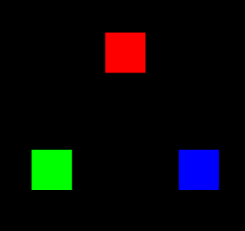


在上面的案例里，我们用js建立了两份attribute 数据，一份是顶点位置数据，一份是顶点颜色数据。

然后我们将两份attribute数据放进了了两个缓冲区对象里，后面绘图的时候，顶点着色器就会从这里面找数据。

其实，我们也可以把数据合一下，把点位数据和颜色数据放进一个集合里，然后让attribute 变量按照某种规律从其中寻找数据。


### 3-多attribute数据合一

这是我之前的两种数据：

```js
//顶点数据
const vertices = new Float32Array([
    0, 0.2, 0,
    -0.2, -0.1, 0,
    0.2, -0.1, 0,
]);

//颜色数据
const colors = new Float32Array([
    1, 0, 0, 1,
    0, 1, 0, 1,
    0, 0, 1, 1,
]);
```


将其合而为一：

```js
const source = new Float32Array([
    0, 0.2, 0,       1, 0, 0, 1,
    -0.2, -0.1, 0,   0, 1, 0, 1,
    0.2, -0.1, 0,    0, 0, 1, 1,
]);
```


对应上面的数据，我们要先有以下概念：

- 数据源：整个合而为一的数据source
- 元素字节数：32位浮点集合中每个元素的字节数
- 类目：一个顶点对应一个类目，也就是上面source中的每一行
- 系列：一个类目中所包含的每一种数据，比如顶点位置数据、顶点颜色数据
- 系列尺寸：一个系列所对应的向量的分量数目
- 类目尺寸：一个类目中所有系列尺寸的总和
- 类目字节数：一个类目的所有字节数量
- 系列元素索引位置：一个系列在一个类目中，以集合元素为单位的索引位置
- 系列字节索引位置：一个系列在一个类目中，以字节为单位的索引位置
- 顶点总数：数据源中的顶点总数

代码如下：

```js
//数据源
const source = new Float32Array([
    0, 0.2, 0, 1, 0, 0, 1,
    -0.2, -0.1, 0, 0, 1, 0, 1,
    0.2, -0.1, 0, 0, 0, 1, 1
]);
//元素字节数
const elementBytes = source.BYTES_PER_ELEMENT
//系列尺寸
const verticeSize = 3
const colorSize = 4
//类目尺寸
const categorySize = verticeSize + colorSize
//类目字节数
const categoryBytes = categorySize * elementBytes
//系列字节索引位置
const verticeByteIndex = 0
const colorByteIndex = verticeSize * elementBytes
//顶点总数
const sourseSize = source.length / categorySize
```


### 3-用vertexAttribPointer() 方法玩转数据源

我们以前在说vertexAttribPointer() 的时候，说过它的功能就是让gl修改attribute上下文对象的。

其实具体而言，它是在告诉顶点着色器中的attribute变量以怎样的方式从顶点着色器中寻找它所需要的数据。

比如，我想让顶点着色器中，名叫a_Position 的attribute 的变量从数据源中，寻找它所需要的数据。

1.把数据源装进绑定在webgl上下文对象上的缓冲区中

```js
//缓冲对象
const sourceBuffer = gl.createBuffer();
//绑定缓冲对象
gl.bindBuffer(gl.ARRAY_BUFFER, sourceBuffer);
//写入数据
gl.bufferData(gl.ARRAY_BUFFER, source, gl.STATIC_DRAW)
```


2.告诉顶点着色器中，名叫a_Position 的attribute 的变量，如何从数据源中，寻找它所需要的数据

```js
//获取attribute 变量
const a_Position = gl.getAttribLocation(gl.program, 'a_Position')
//修改attribute 变量
gl.vertexAttribPointer(
    a_Position,
    verticeSize,
    gl.FLOAT,
    false,
    categoryBytes,
    verticeByteIndex
)
```

对于vertexAttribPointer() 方法中，每个参数的意思，建议大家直接去MDN 里看文档：

void gl.vertexAttribPointer(index, size, type, normalized, stride, offset)

- index：attribute 变量，具体而言是指向存储attribute 变量的空间的指针
- size：系列尺寸
- type：元素的数据类型
- normalized：是否归一化
- stride：类目字节数
- offset：系列索引位置


3.同理，可以再修改名叫a_Color 的attribute 的变量

```js
//获取attribute 变量
const a_Color = gl.getAttribLocation(gl.program, 'a_Color')
//修改attribute 变量
gl.vertexAttribPointer(
    a_Color,
    colorSize,
    gl.FLOAT,
    false,
    categoryBytes,
    colorByteIndex
)
//赋能-批处理
gl.enableVertexAttribArray(a_Color)
```


绘图方法不变，效果和之前是一样的：


接下来，我们改变一下绘图方法，还可以画出彩色三角形。


## 第二章 彩色三角形

### 1-绘制彩色三角形

我们可以用独立三角形绘图。

```js
gl.drawArrays(gl.TRIANGLES, 0, sourseSize);
```

效果如下：

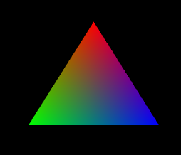


为什么会画出一个具有三种颜色的三角形呢？

这是因为我给三角形的三个顶点绑定了三种颜色。

那为什么这三种颜色可以平滑过渡呢？这其中的规律是什么？

我们通过下面这个图便可以很好的去理解，它就是在三个点之间做线性补间，将补间得出的颜色填充到三角形所围成的每个片元之中。


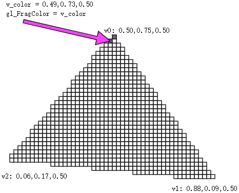


我们在知道了多点异色，以及片元着色的原理后，就可以尝试做一点好玩的东西，比如画一片春色：

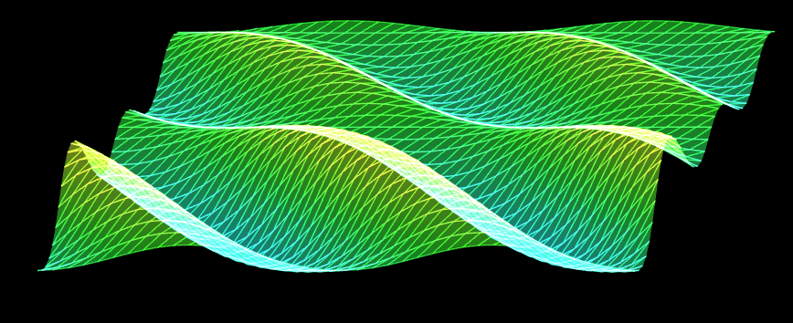


在画之前，我们需要先做一下代码架构。


### 2-多点异色的对象架构

现在我们知识量还不足，所以大家可以先知道多少架构多少，但这种架构的意识一定要有。

接下我在之前的Poly对象的基础上做一下修改。

1.定义Poly对象的默认属性

```js
const defAttr = () => ({
  gl:null,
  type:'POINTS',
  source:[],
  sourceSize:0,
  elementBytes:4,
  categorySize: 0,
  attributes: {},
  uniforms: {},
})
```

- source 数据源

- sourceSize 顶点数量，数据源尺寸

- elementBytes 元素字节数

- categorySize 类目尺寸

- attributes attribute属性集合，其数据结构如下：

  ```
  {
    a_Position: {
      size: 3,
      index:0
    }
  }
  ```

  - a_Position 对应attribute变量名
  - size 系列尺寸
  - index 系列的元素索引位置

- uniforms uniform变量集合，其数据结构如下：

  ```js
  {
    u_Color: {
      type: 'uniform1f',
      value:1
    }
  }
  ```

  - u_Color 对应uniform变量名
  - type uniform变量的修改方法
  - value uniform变量的值

  

2.Poly对象的构造函数和之前一样

```js
constructor(attr){
    Object.assign(this,defAttr(),attr)
    this.init()
}
```


3.初始化方法

```js
init(){
    if (!this.gl) { return }
    this.calculateSourceSize()
    this.updateAttribute();
    this.updateUniform();
}
```

- calculateSize() 基于数据源计算类目尺寸、类目字节数、顶点总数

  ```js
  calculateSourceSize() {
      const {attributes, elementBytes,source } = this
      let categorySize = 0
      Object.values(attributes).forEach(ele => {
          const { size, index } = ele
          categorySize += size
          ele.byteIndex=index*elementBytes
      })
      this.categorySize = categorySize
      this.categoryBytes=categorySize*elementBytes
      this.sourceSize = source.length / categorySize
  }
  ```

  

- updateAttribute() 更新attribute 变量

  ```js
  updateAttribute() {
      const { gl, attributes, categoryBytes, source } = this
      const sourceBuffer = gl.createBuffer();
      gl.bindBuffer(gl.ARRAY_BUFFER, sourceBuffer);
      gl.bufferData(gl.ARRAY_BUFFER, new Float32Array(source), gl.STATIC_DRAW)
      for (let [key, { size, byteIndex }] of Object.entries(attributes)) {
          const attr = gl.getAttribLocation(gl.program, key)
          gl.vertexAttribPointer(
              attr,
              size,
              gl.FLOAT,
              false,
              categoryBytes,
              byteIndex
          )
          gl.enableVertexAttribArray(attr)
      }
  }
  ```

  

- updateUniform() 更新uniform变量

```js
updateUniform() {
    const {gl,uniforms}=this
    for (let [key, val] of Object.entries(uniforms)) {
        const { type, value } = val
        const u = gl.getUniformLocation(gl.program, key)
        if (type.includes('Matrix')) {
            gl[type](u,false,value)
        } else {
            gl[type](u,value)
        }
    }
}
```


4.draw() 绘图方法

```js
draw(type = this.type) {
    const { gl, sourceSize } = this
    gl.drawArrays(gl[type],0,sourceSize);
}
```


接下来，咱们先来一抹绿意练练手。


### 3-一抹绿意

1.顶点着色器

```html
<script id="vertexShader" type="x-shader/x-vertex">
    attribute vec4 a_Position;
    attribute vec4 a_Color;
    uniform mat4 u_ViewMatrix;
    varying vec4 v_Color;
    void main(){
      gl_Position = u_ViewMatrix*a_Position;
      gl_PointSize=3.0;
      v_Color=a_Color;
    }
</script>
```


2.片元着色器

```html
<script id="fragmentShader" type="x-shader/x-fragment">
    precision mediump float;
    varying vec4 v_Color;
    void main(){
        gl_FragColor=v_Color;
    }
</script>
```


3.初始化着色器

```js
const canvas = document.getElementById('canvas');
canvas.width = window.innerWidth;
canvas.height = window.innerHeight;
const gl = canvas.getContext('webgl');

const vsSource = document.getElementById('vertexShader').innerText;
const fsSource = document.getElementById('fragmentShader').innerText;
initShaders(gl, vsSource, fsSource);
gl.clearColor(0.0, 0.0, 0.0, 1.0);

```


4.建立视图矩阵

```js
/* 视图矩阵 */
const viewMatrix = new Matrix4().lookAt(
    new Vector3(0.2, 0.3, 1),
    new Vector3(),
    new Vector3(0, 1, 0)
)
```


5.建立在x,z方向上的比例尺，将空间坐标和弧度相映射

```js
/* x,z 方向的空间坐标极值 */
const [minPosX, maxPosX, minPosZ, maxPosZ] = [
    -0.7, 0.8, -1, 1
]
/* x,z 方向的弧度极值 */
const [minAngX, maxAngX, minAngZ, maxAngZ] = [
    0, Math.PI * 4, 0, Math.PI * 2
]

/* 比例尺：将空间坐标和弧度相映射 */
const scalerX = ScaleLinear(minPosX, minAngX, maxPosX, maxAngX)
const scalerZ = ScaleLinear(minPosZ, minAngZ, maxPosZ, maxAngZ)
```


6.建立将y坐标和色相相映射的比例尺

```js
/* y 方向的坐标极值 */
const [a1, a2] = [0.1, 0.03]
const a12 = a1 + a2
const [minY, maxY] = [-a12, a12]
/* 色相极值 */
const [minH, maxH] = [0.15, 0.5]
/* 比例尺：将y坐标和色相相映射 */
const scalerC = ScaleLinear(minY, minH, maxY, maxH)
```


7.建立颜色对象，可通过HSL获取颜色

```js
const color = new Color()
```


8.建立波浪对象

```js
/* 波浪对象的行数和列数 */
const [rows, cols] = [50, 50]

/* 波浪对象的两个attribute变量，分别是位置和颜色 */
const a_Position = { size: 3, index: 0 }
const a_Color = { size: 4, index: 3 }

/* 类目尺寸 */
const categorySize = a_Position.size + a_Color.size

/* 波浪对象 */
const wave = new Poly({
    gl,
    source: getSource(
        cols, rows,
        minPosX, maxPosX, minPosZ, maxPosZ
    ),
    uniforms: {
        u_ViewMatrix: {
            type: 'uniformMatrix4fv',
            value: viewMatrix.elements
        },
    },
    attributes: {
        a_Position,
        a_Color,
    }
})
```

- getSource() 方法是基于行列数和坐标极值获取数据源的方法

  ```js
  /* 建立顶点集合 */
  function getSource(cols, rows, minPosX, maxPosX, minPosZ, maxPosZ) {
      const source = []
      const spaceZ = (maxPosZ - minPosZ) / rows
      const spaceX = (maxPosX - minPosX) / cols
      for (let z = 0; z < rows; z++) {
          for (let x = 0; x < cols; x++) {
              const px = x * spaceX + minPosX
              const pz = z * spaceZ + minPosZ
              source.push(px, 0, pz, 1, 1, 1, 1)
          }
      }
      return source
  }
  ```

  

9.渲染

```js
render()
/* 渲染 */
function render() {
    gl.clear(gl.COLOR_BUFFER_BIT);
    wave.draw()
}
```

效果如下：

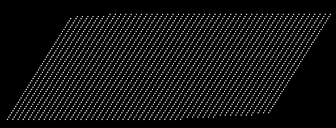


10.制作定点起伏动画，并添加颜色

```js
/* 动画:偏移phi */
let offset = 0
!(function ani() {
    offset += 0.08
    updateVertices(offset)
    wave.updateAttribute()
    render()
    requestAnimationFrame(ani)
})()

/* 更新顶点高度和颜色 */
function updateVertices(offset = 0) {
    const { source, categorySize } = wave
    for (let i = 0; i < source.length; i += categorySize) {
        const [posX, posZ] = [source[i], source[i + 2]]
        const angZ = scalerZ(posZ)
        const Omega = 2
        const a = Math.sin(angZ) * a1 + a2
        const phi = scalerX(posX) + offset
        const y = SinFn(a, Omega, phi)(angZ)
        source[i + 1] = y
        const h = scalerC(y)
        const { r, g, b } = color.setHSL(h, 1, 0.6)
        source[i + 3] = r
        source[i + 4] = g
        source[i + 5] = b
    }
}
```

效果如下：

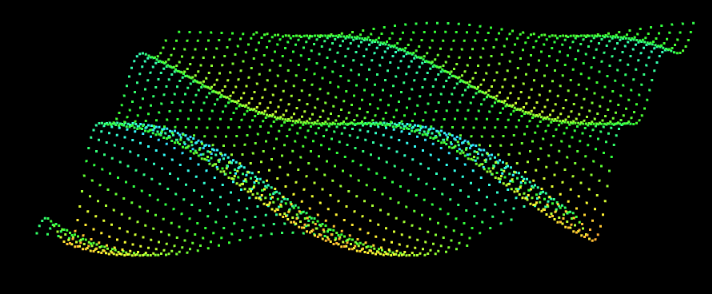


现在一抹绿意已有，我们接下来可以连点成面，画出一片春色。


### 4-一片春色

在连点成面的时候，我们首先要有一个思路。

#### 4-1-思路

1.准备一份顶点，如下图：

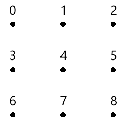

顶点的存储形式如下：

```
[
    x,y,z, x,y,z, x,y,z,
    x,y,z, x,y,z, x,y,z,
    x,y,z, x,y,z, x,y,z,
]
```


2.基于顶点的索引位置，建立独立三角形集合

上面顶点的索引位置如下：

```js
[
    0,1,2,
	4,5,6,
	7,8,9
]
```

按照独立三角形的绘制规则，建立三角形顶点集合。

四个点构成两个三角形：

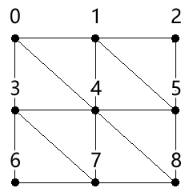

其数据结构如下：

```js
[
	0,3,4, 0,4,1, 1,4,5, 1,5,2,
	3,6,7, 3,7,4, 4,7,8, 4,8,5
]
```


3.绘图

```js
gl.drawArrays(gl.TRANGLES,0,3*8);
```

原理就这么简单，接下来咱们走一下代码。


#### 4-2-代码

我们这里的代码是在“一抹绿意” 的基础上改的，所以我就直说重点了。

1.开启透明度合成

```js
gl.enable(gl.BLEND);
gl.blendFunc(gl.SRC_ALPHA, gl.ONE);
```


2.建立基于行列获取顶点索引的方法

```js
const getInd = GetIndexInGrid(cols, categorySize)
function GetIndexInGrid(w, size) {
  return function (x, y) {
    return (y * w + x) * size
  }
}
```


3.获取顶点阵列和三角形的顶点索引集合

```js
const { vertices, indexes } = crtBaseData(
    cols, rows,
    minPosX, maxPosX, minPosZ, maxPosZ
);
```

crtBaseData() 是基于行列数和空间极值获取顶点阵列和三角形的顶点索引集合的方法。

- vertices 顶点阵列
- indexes 三角形的顶点索引集合

```js
function crtBaseData(cols, rows, minPosX, maxPosX, minPosZ, maxPosZ) {
    const vertices = []
    const indexes = []
    const spaceZ = (maxPosZ - minPosZ) / rows
    const spaceX = (maxPosX - minPosX) / cols
    for (let z = 0; z < rows; z++) {
        for (let x = 0; x < cols; x++) {
            const px = x * spaceX + minPosX
            const pz = z * spaceZ + minPosZ
            vertices.push(px, 0, pz, 1, 1, 1, 0.5)
            if (z && x) {
                const [x0, z0] = [x - 1, z - 1]
                indexes.push(
                    getInd(x0, z0),
                    getInd(x, z0),
                    getInd(x, z),
                    getInd(x0, z0),
                    getInd(x, z),
                    getInd(x0, z),
                )
            }
        }
    }
    return { vertices, indexes }
}
```


4.建立波浪对象

```js
const wave = new Poly({
    gl,
    source: getSource(indexes, vertices, categorySize),
    uniforms: {
        u_ViewMatrix: {
            type: 'uniformMatrix4fv',
            value: viewMatrix.elements
        },
    },
    attributes: {
        a_Position,
        a_Color,
    }
})
```

getSource() 是通过顶点阵列和三角形的顶点索引集合获取数据源的方法。

```js
function getSource(vertices, indexes, categorySize) {
    const arr = []
    indexes.forEach(i => {
        arr.push(...vertices.slice(i, i + categorySize))
    })
    return arr
}
```


5.渲染

```js
function render() {
    gl.clear(gl.COLOR_BUFFER_BIT);
    // wave.draw()
    wave.draw('LINES')
    wave.draw('TRIANGLES')
}
```

效果如下：


关于颜色的知识我们就先说到这，接下来咱们再说一下纹理。


## 第三章 纹理

纹理，通常指的就是二维的栅格图像，我们可以将其作为webgl图形的贴图。

而在webgl 里，还有一个纹理对象的概念，它是对图像又做了一层封装，这个我们后面会详解。

接下来，我们要先建立几个基础概念，以便于理解webgl的贴图流程。


### 1-基础概念

#### 1-1-栅格系统

我们在说图像的时候，往往都是指点阵图、栅格图、位图。

而与其相对应的是图形，也做矢量图。

我接下来说的纹理，就是属于图像，其图像的建立和显示会遵循栅格系统里的规范。

比如，所有图像都是由像素组成的，在webgl里我们把像素称为片元，像素是按照相互垂直的行列排列的。

如下图：


将其放大后就可以看见其中的栅格：

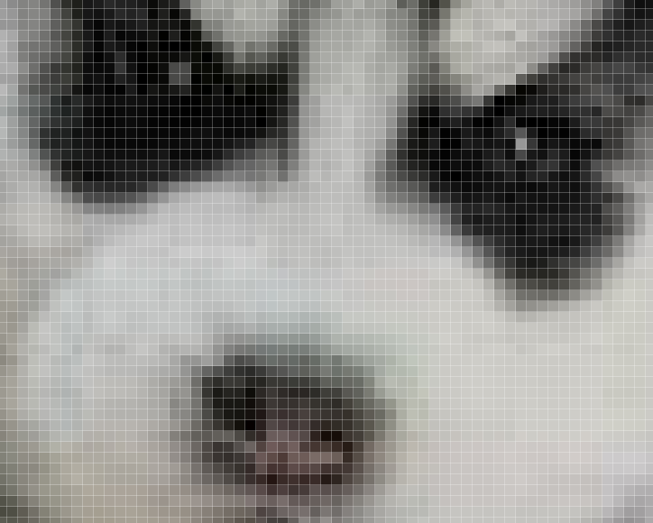


图像中的每个像素都可以通过行数y和列数x来找到，由(x,y) 构成的点位，就是图像的像素坐标。

因为canvas画布也是一张图像，所以图像的栅格坐标系和我们之前说过的canvas2d的坐标系是一样的，我们可以简单回顾一下：

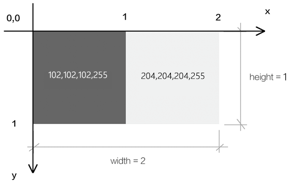

栅格坐标系的原点在左上角。

栅格坐标系的y 轴方向是朝下的。

栅格坐标系的坐标基底由两个分量组成，分别是一个像素的宽和一个像素的高。


#### 1-2-图钉

图钉是我自己写的概念，源自于photoshop中图像的操控变形功能，这种称呼很形象。

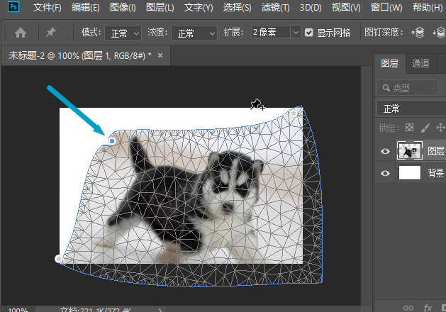


webgl中，图钉的位置是通过uv坐标来控制的，图钉的uv坐标和顶点的webgl坐标是两种不同的坐标系统，之后我们会其相互映射，从而将图像特定的一块区域贴到webgl图形中。

比如我将其映射到下面的蓝色三角形中：


注：我们在webgl里打图钉的时候不会发生边界线的扭曲，上图重在示意。


#### 1-3-uv坐标系

我们在webgl里打图钉的时候，要考虑图钉在图像中的定位。

说到定位，大家不要先想位置，而是要先想坐标系，咱们接下来说一下图钉使用的uv坐标系。


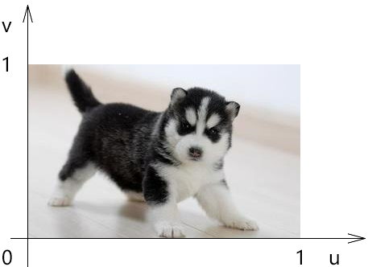


uv坐标系，也叫st坐标系，大家以后见到了知道是一回事即可。

uv坐标系的坐标原点在图像的左下角，u轴在右，v轴在上。

u轴上的1个单位是图像的宽；

v轴上的一个单位是图像的高。


#### 1-4-采样器

采样器是按照图钉位置从图像中获取片元的方式。

我们在图像中所打的图钉位置，并不是图像中某一个片元的位置，因为片元位置走的是栅格坐标系。

所以我们需要一个采样器去对图钉的uv坐标系和像素的栅格坐标系做映射，从而去采集图像中图钉所对应的片元。

着色器基于一张图像可以建立一个，或多个采样器，不同的采样器可以定义不同的规则去获取图像中的片元。

采样器在着色器中是一种变量类型，写做sampler2D，它就像我们之前写过的vec4 类型一样，可以在片元着色器中通过uniform变量暴露给js，让js对其进行修改。

既然js可以对采样器进行修改了，那js必然会以某种方式向着色器传递其建立采样器所需的数据。

接下来咱们就先说一下这种的数据。


#### 1-5-纹理对象 

着色器使用一个纹理对象，就可以建立一个采样器。

纹理对象的建立需要一个图像源，比如Image 对象。

同是，我们还需要设置纹理对象和图钉进行数据映射的方式。

纹理对象是通过js 来建立的，js并不能直接将纹理对象传递给着色器。因为纹理对象说的是js 语言，说glsl es语言的着色器是不认识这种语言的。

所以，webgl 在浏览器底层为纹理对象建立了一块缓冲区，缓存区可以理解为用于存放纹理对象的磁盘空间，这块空间可以将纹理对象翻译成着色器可以读懂的数据。

之后我们会把这个空间的索引位置传给着色器，让着色器基于这个空间的索引位置，找到这个空间，然后再从空间中找到纹理对象，最后通过纹理对象建立采样器。

接下来咱们就说一下这个用于存储纹理对象的空间-纹理单元。


#### 1-6-纹理单元

纹理单元是一种专门用来存放纹理对象的缓冲区，就像我们之前用createBuffer()方法建立的用于存储数据源的缓冲区一样。

纹理单元是由webgl提前建立好的，只有固定的几个，如TEXTURE0|1|2|3|4|5|6|7|8，这就像我们实际中住的楼房单元一样，已经被webgl提前在浏览器中建立起来了，数量有限。

纹理单元虽然无需我们自己建立，但需要我们自己激活，让其进入使用状态。

基本概念咱们就说到这，接下来咱们看一下整体的代码实现。


### 2-整体代码

1.顶点着色器

```html
<script id="vertexShader" type="x-shader/x-vertex">
    attribute vec4 a_Position;
    attribute vec2 a_Pin;
    varying vec2 v_Pin;
    void main(){
      gl_Position = a_Position;
      v_Pin=a_Pin;
    }
</script>
```

- a_Pin 图钉位置


2.片元着色器

```html
<script id="fragmentShader" type="x-shader/x-fragment">
    precision mediump float;
    uniform sampler2D u_Sampler;
    varying vec2 v_Pin;
    void main(){
      gl_FragColor=texture2D(u_Sampler,v_Pin);
    }
</script>
```

- sampler2D 是uniform 变量的类型，叫做二维取样器
- texture2D() 基于图钉从取样器中获取片元颜色


3.初始化着色器

```js
const canvas = document.getElementById('canvas');
canvas.width = window.innerWidth;
canvas.height = window.innerHeight;
const gl = canvas.getContext('webgl');

const vsSource = document.getElementById('vertexShader').innerText;
const fsSource = document.getElementById('fragmentShader').innerText;
initShaders(gl, vsSource, fsSource);
gl.clearColor(0.0, 0.0, 0.0, 1.0);
```


4.建立数据源，并计算相应尺寸

```js
//数据源
const source = new Float32Array([
    -0.5, 0.5, 0.0, 1.0,
    -0.5, -0.5, 0.0, 0.0,
    0.5, 0.5, 1.0, 1.0,
    0.5, -0.5, 1.0, 0.0,
]);
const FSIZE = source.BYTES_PER_ELEMENT;
//元素字节数
const elementBytes = source.BYTES_PER_ELEMENT
//系列尺寸
const posSize = 2
const PinSize = 2
//类目尺寸
const categorySize = posSize + PinSize
//类目字节数
const categoryBytes = categorySize * elementBytes
//系列字节索引位置
const posByteIndex = 0
const pinByteIndex = posSize * elementBytes
//顶点总数
const sourceSize = source.length / categorySize
```

数据源中有两个系列，分别是顶点位置系列和图钉位置系列。


5.将数据源写入到缓冲区，让attribute变量从其中寻找数据。

```js
const sourceBuffer = gl.createBuffer();
gl.bindBuffer(gl.ARRAY_BUFFER, sourceBuffer);
gl.bufferData(gl.ARRAY_BUFFER, source, gl.STATIC_DRAW);

const a_Position = gl.getAttribLocation(gl.program, 'a_Position');
gl.vertexAttribPointer(
    a_Position, 
    posSize, 
    gl.FLOAT, 
    false, 
    categoryBytes, 
    posByteIndex
);
gl.enableVertexAttribArray(a_Position);

const a_Pin = gl.getAttribLocation(gl.program, 'a_Pin');
gl.vertexAttribPointer(
    a_Pin, 
    pinSize, 
    gl.FLOAT, 
    false, 
    categoryBytes, 
    pinByteIndex
);
gl.enableVertexAttribArray(a_Pin);
```


6.建立Image 图像作为图像源，当图像源加载成功后再贴图。

```js
//对纹理图像垂直翻转
gl.pixelStorei(gl.UNPACK_FLIP_Y_WEBGL, 1);

//纹理单元
gl.activeTexture(gl.TEXTURE0);

//纹理对象
const texture = gl.createTexture();
//把纹理对象装进纹理单元里
gl.bindTexture(gl.TEXTURE_2D, texture);

//image 对象
const image = new Image();
image.src = './images/erha2.jpg';
image.onload = function () {
    showMap()
}

//贴图
function showMap() {
    //配置纹理图像
    gl.texImage2D(
        gl.TEXTURE_2D,
        0,
        gl.RGB,
        gl.RGB,
        gl.UNSIGNED_BYTE,
        image
    );

    //配置纹理参数
    gl.texParameteri(
        gl.TEXTURE_2D,
        gl.TEXTURE_MIN_FILTER,
        gl.LINEAR
    );

    //获取u_Sampler 
    const u_Sampler = gl.getUniformLocation(gl.program, 'u_Sampler');
    //将0号纹理分配给着色器，0 是纹理单元编号
    gl.uniform1i(u_Sampler, 0);

    //渲染
    render()
}

function render() {
    gl.clear(gl.COLOR_BUFFER_BIT);
    gl.drawArrays(gl.TRIANGLE_STRIP, 0, sourceSize);
}

```

接下来咱们重点解释上面的这部分代码。


### 3-贴图详解

1.准备三个角色

- Image 图像
- 纹理对象
- 纹理单元


```js
//纹理单元
gl.activeTexture(gl.TEXTURE0);

//纹理对象
const texture = gl.createTexture();

//image 对象
const image = new Image();
image.src = './images/erha.jpg';
```

- activeTexture(gl.TEXTURE0) 激活0号单元
- createTexture() 创建纹理对象


2.把纹理对象装进当前已被激活的纹理单元里

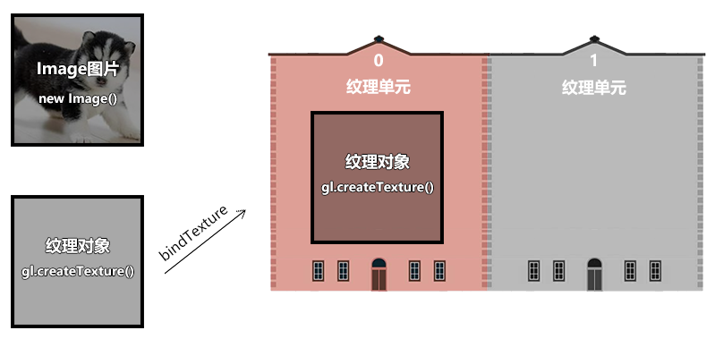

```js
const texture = gl.createTexture();
gl.bindTexture(gl.TEXTURE_2D, texture);
```

- TEXTURE_2D 纹理对象的类型


3.当Image 图像加载成功后，把图像装进当前纹理单元的纹理对象里。

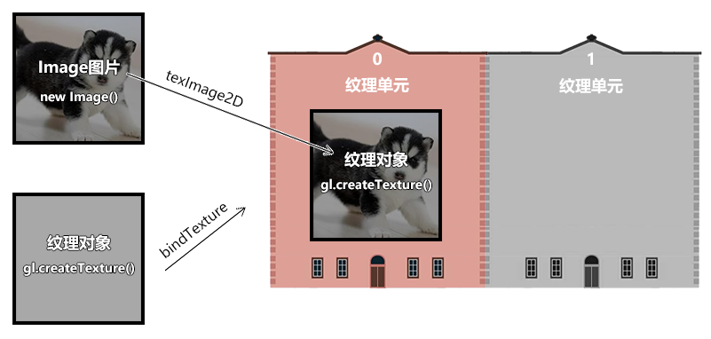

```js
gl.texImage2D(
    gl.TEXTURE_2D,
    0,
    gl.RGB,
    gl.RGB,
    gl.UNSIGNED_BYTE,
    image
);
```

texImage2D(type, level, internalformat, format, type, pixels)

- type 纹理类型
- level   基本图像等级
- internalformat  纹理中的颜色组件 
- format 纹理数据格式，必须和internalformat  一样
- type  纹理数据的数据类型
  - UNSIGNED_BYTE 无符号字节
- pixels 图像源


4.纹理对象还有一些相应参数需要设置一下

```js
gl.texParameteri(
    gl.TEXTURE_2D,
    gl.TEXTURE_MIN_FILTER,
    gl.LINEAR
);
```

texParameteri(type, pname, param)

- type 纹理类型
  -  TEXTURE_2D 二维纹理
- pname 纹理参数的名称
  -  TEXTURE_MIN_FILTER  纹理缩小滤波器 
- param  与pname相对应的纹理参数值
  -  gl.LINEAR 线性


5.在js 中获取采样器对应的Uniform变量,告诉片元着色器中的采样器，纹理对象在哪个单元里。之后采样器便会根据单元号去单元对象中寻找纹理对象。

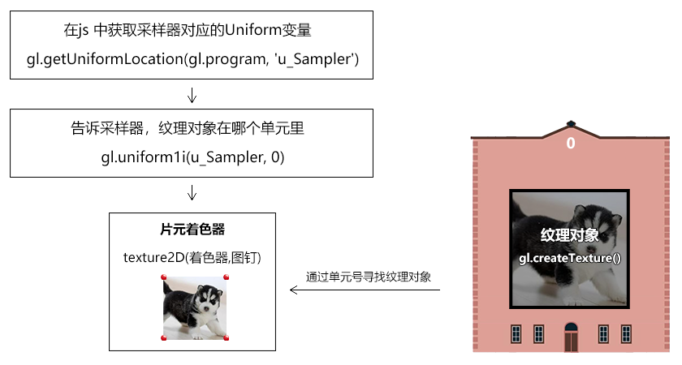

```js
const u_Sampler = gl.getUniformLocation(gl.program, 'u_Sampler');
gl.uniform1i(u_Sampler, 0);
```


5.渲染

```js
render()
function render() {
    gl.clear(gl.COLOR_BUFFER_BIT);
    gl.drawArrays(gl.TRIANGLE_STRIP, 0, sourceSize);
}
```

效果如下：


这时候的图像是倒立的，这是由于Image对象遵守的是栅格坐标系，栅格坐标系的y轴朝下，而uv坐标系的y朝上，两者相反，所以画出的图形反了。


6.对图像进行预处理，将图像垂直翻转

```js
gl.pixelStorei(gl.UNPACK_FLIP_Y_WEBGL, 1);
```

pixelStorei(pname, param) 图像预处理

- pname 参数名
  - gl.UNPACK_FLIP_Y_WEBGL 是否垂直翻，布尔值，1|0
- param 参数值


关于纹理贴图的基本流程和思路就是这样，接下来我们还要对其中的几个知识点进行详细讲解，不然以后遇到问题了会找不到解决方案。


### 4-纹理容器

我们之前在贴图的时候，默认图像源的尺寸只能是2的n次方，比如2、4、8、16、……、256、512等。

如果我们把图像的尺寸改成非2次幂尺寸，如300*300，那贴图就无法显示。

我们要想解决这种问题，就得设置一下纹理的容器。

我们在图像上打图钉的时候，形成一块uv区域，这块区域可以理解为纹理容器。

纹理容器可以定义图钉区域的纹理如何显示在webgl图形中。

通过对纹理容器的设置，我们可以实现以下功能：

- 非二次幂图像源的显示
- 纹理的复制
- 纹理的镜像


#### 4-1-非二次幂图像源的显示

```js
gl.texParameteri(
    gl.TEXTURE_2D,
    gl.TEXTURE_WRAP_S,
    gl.CLAMP_TO_EDGE
)
gl.texParameteri(
    gl.TEXTURE_2D,
    gl.TEXTURE_WRAP_T,
    gl.CLAMP_TO_EDGE
)
```

TEXTURE_WRAP_S和TEXTURE_WRAP_T 就是纹理容器在s方向和t方向的尺寸，这里的s、t就是st坐标系里的s、t，st坐标系和uv坐标系是一回事。

CLAMP_TO_EDGE 翻译过来就是边缘夹紧的意思，可以理解为任意尺寸的图像源都可以被宽高为1的uv尺寸夹紧。

注：只有CLAMP_TO_EDGE 才能实现非二次幂图像源的显示，其它的参数都不可以。


#### 4-2-纹理的复制

我们之前说过，uv坐标系的坐标基底分别是1个图片的宽和1个图片的高，可是如果我们将2个图片的宽高映射到了图形上会是什么结果呢？

默认是这样的：


这是由纹理容器的默认值决定的：

```js
gl.texParameteri(
    gl.TEXTURE_2D,
    gl.TEXTURE_WRAP_S,
    gl.REPEAT
)
gl.texParameteri(
    gl.TEXTURE_2D,
    gl.TEXTURE_WRAP_T,
    gl.REPEAT
) 
```

REPEAT 就是纹理重复的意思。


#### 4-3-纹理的镜像复制

纹理的镜像复制可以实现纹理的水平、垂直翻转和复制。

效果如下：

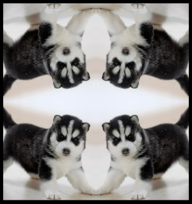

代码如下：

```js
gl.texParameteri(
    gl.TEXTURE_2D,
    gl.TEXTURE_WRAP_S,
    gl.MIRRORED_REPEAT
)
gl.texParameteri(
    gl.TEXTURE_2D,
    gl.TEXTURE_WRAP_T,
    gl.MIRRORED_REPEAT
)
```

MIRRORED_REPEAT 就是镜像复制的意思。

我们也可以通过使用CLAMP_TO_EDGE 只对某一个方向纹理镜像复制。

```js
gl.texParameteri(
    gl.TEXTURE_2D,
    gl.TEXTURE_WRAP_S,
    gl.MIRRORED_REPEAT
)
gl.texParameteri(
    gl.TEXTURE_2D,
    gl.TEXTURE_WRAP_T,
    gl.CLAMP_TO_EDGE
)
```

效果如下：

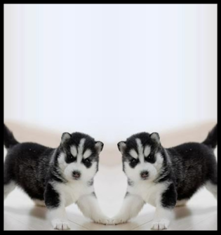


### 5-分子贴图

分子贴图mipmap 是一种纹理映射技术。

比如：

webgl中有一个正方形，它在canvas画布中显示的时候，占据了2\*2个像素，我们要将一个8\*8的图像源贴上去。

正方形中肯定不能显示图像源中的所有像素，因为它只有2\*2=4个像素。

在Photoshop 中，会将图像源切割成2行、2列的色块，然后将每个色块的均值交个正方形。

在webgl 中也有类似的方法，并且它还有一层渲染性能的优化（Photoshop底层是否有这层优化我尚且不知）。

接下来咱们就说一下这层优化优化的是什么。

先想象一个场景，我要把1024\*1024的图像源映射到canvas画布上2\*2的正方形中，若把图像源分割求均值会产生庞大的数据运算，我们需要想办法把和正方形相映射的图像源的尺寸降到最小，比如就是2*2的。

因此，我们就需要[分子贴图](https://baike.baidu.com/item/Mipmap/3722136?fr=aladdin)了。

分子贴图是一个基于分辨率等比排列的图像集合，集合中每一项的宽高与其前一项宽高的比值都是1/2。

如下图：

 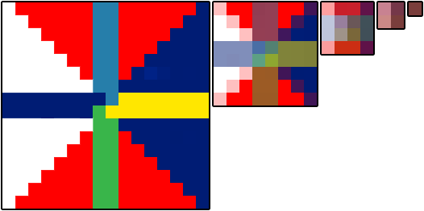    


在webgl 中，我们可以使用gl.generateMipmap() 方法为图像源创建分子贴图，

有了分子贴图后，之前2\*2的正方形便会从分子集合中寻找与其分辨率最接近的分子图像。

在找到分子图像后，就需要基于webgl图形的片元尺寸对其分割取色了。

对于取色的方法，咱们之前说一个均值算法，其实还有其它算法。

我们看一下webgl 给提供的方法。

```js
//创建分子贴图
gl.generateMipmap(gl.TEXTURE_2D);
//定义从分子图像中取色的方法
gl.texParameteri(
    gl.TEXTURE_2D,
    gl.TEXTURE_MAG_FILTER,
    gl.LINEAR
)
gl.texParameteri(
    gl.TEXTURE_2D,
    gl.TEXTURE_MIN_FILTER,
    gl.LINEAR
)
```


gl.texParameteri()方法中的第2个参数和第3个参数是键值对的关系。

TEXTURE_MAG_FILTER和TEXTURE_MIN_FILTER，对应的是纹理在webgl图形中的缩放情况。

- TEXTURE_MAG_FILTER  纹理放大滤波器，是纹理在webgl图形中被放大的情况。
- TEXTURE_MIN_FILTER   纹理缩小滤波器，是纹理在webgl图形中被缩小的情况。

TEXTURE_MAG_FILTER 具备以下参数：

- LINEAR (默认值) ，线性滤镜， 获取纹理坐标点附近4个像素的加权平均值，效果平滑 
- NEAREST 最近滤镜， 获得最靠近纹理坐标点的像素 ，效果锐利

TEXTURE_MIN_FILTER  具备以下参数：

- LINEAR 线性滤镜，获取纹理坐标点附近4个像素的加权平均值，效果平滑 
- NEAREST 最近滤镜， 获得最靠近纹理坐标点的像素，效果锐利
- NEAREST_MIPMAP_NEAREST  Select the nearest mip level and  perform nearest neighbor filtering . 
- NEAREST_MIPMAP_LINEAR (默认值) Perform a linear interpolation  between mip levels and perform  nearest neighbor filtering within  each .  
- LINEAR_MIPMAP_NEAREST Select the nearest mip level and  perform linear filtering within it .
- LINEAR_MIPMAP_LINEAR  Perform a linear interpolation  between mip levels and perform  linear filtering : also called trilinear  filtering .  

注：后面这4个与分子贴图相关的参数适合比较大的贴图，若是比较小的贴图，使用LINEAR 或NEAREST 就好。

注：缩小滤波器的默认值取色方法是NEAREST_MIPMAP_LINEAR ，这个方法会从分子贴图里找分子图像，然后从其中取色，然而当我们没有使用gl.generateMipmap()方法建立分子贴图的时候，就得给它一个不需要从分子贴图中去色的方法，如LINEAR或NEAREST。


### 6-多纹理模型

在我们实际开发中，经常会遇到一个模型，多个纹理的的情况。

比如这个魔方：

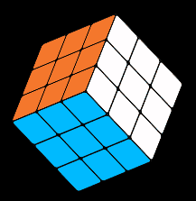


有时候我们会很自然的想到一个面给它一个贴图，而实际上，最高效的方式是一个物体给它一个贴图，如下图：


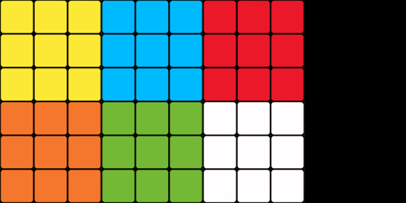


这样我们只需要加载一次图片，建立一个纹理对象，做一次纹理和顶点数据的映射就可以了。

这里面没有涉及任何新的知识点，但这是一种很重要的项目开发经验。

整体代码如下：

```html
<script id="vertexShader" type="x-shader/x-vertex">
    attribute vec4 a_Position;
    attribute vec2 a_Pin;
    uniform mat4 u_ModelMatrix;
    varying vec2 v_Pin;
    void main(){
      gl_Position = u_ModelMatrix*a_Position;
      v_Pin=a_Pin;
    }
</script>
<script id="fragmentShader" type="x-shader/x-fragment">
    precision mediump float;
    uniform sampler2D u_Sampler;
    varying vec2 v_Pin;
    void main(){
      gl_FragColor=texture2D(u_Sampler,v_Pin);
    }
</script>
<script type="module">
    import { initShaders } from '../jsm/Utils.js';
    import { Matrix4, Vector3, Quaternion } from 'https://unpkg.com/three/build/three.module.js';

    const canvas = document.getElementById('canvas');
    canvas.width = window.innerWidth;
    canvas.height = window.innerHeight;
    const gl = canvas.getContext('webgl');

    const vsSource = document.getElementById('vertexShader').innerText;
    const fsSource = document.getElementById('fragmentShader').innerText;
    initShaders(gl, vsSource, fsSource);
    gl.clearColor(0.0, 0.0, 0.0, 1.0);
    gl.enable(gl.CULL_FACE);
    gl.enable(gl.DEPTH_TEST);

    //数据源
    const source = new Float32Array([
        -0.5, -0.5, -0.5, 0, 0,
        -0.5, 0.5, -0.5, 0, 0.5,
        0.5, -0.5, -0.5, 0.25, 0,
        -0.5, 0.5, -0.5, 0, 0.5,
        0.5, 0.5, -0.5, 0.25, 0.5,
        0.5, -0.5, -0.5, 0.25, 0,

        -0.5, -0.5, 0.5, 0.25, 0,
        0.5, -0.5, 0.5, 0.5, 0,
        -0.5, 0.5, 0.5, 0.25, 0.5,
        -0.5, 0.5, 0.5, 0.25, 0.5,
        0.5, -0.5, 0.5, 0.5, 0,
        0.5, 0.5, 0.5, 0.5, 0.5,

        -0.5, 0.5, -0.5, 0.5, 0,
        -0.5, 0.5, 0.5, 0.5, 0.5,
        0.5, 0.5, -0.5, 0.75, 0,
        -0.5, 0.5, 0.5, 0.5, 0.5,
        0.5, 0.5, 0.5, 0.75, 0.5,
        0.5, 0.5, -0.5, 0.75, 0,

        -0.5, -0.5, -0.5, 0, 0.5,
        0.5, -0.5, -0.5, 0.25, 0.5,
        -0.5, -0.5, 0.5, 0, 1,
        -0.5, -0.5, 0.5, 0, 1,
        0.5, -0.5, -0.5, 0.25, 0.5,
        0.5, -0.5, 0.5, 0.25, 1,

        -0.5, -0.5, -0.5, 0.25, 0.5,
        -0.5, -0.5, 0.5, 0.25, 1,
        -0.5, 0.5, -0.5, 0.5, 0.5,
        -0.5, -0.5, 0.5, 0.25, 1,
        -0.5, 0.5, 0.5, 0.5, 1,
        -0.5, 0.5, -0.5, 0.5, 0.5,

        0.5, -0.5, -0.5, 0.5, 0.5,
        0.5, 0.5, -0.5, 0.75, 0.5,
        0.5, -0.5, 0.5, 0.5, 1,
        0.5, -0.5, 0.5, 0.5, 1,
        0.5, 0.5, -0.5, 0.75, 0.5,
        0.5, 0.5, 0.5, 0.75, 1,
    ]);
    const FSIZE = source.BYTES_PER_ELEMENT;
    //元素字节数
    const elementBytes = source.BYTES_PER_ELEMENT
    //系列尺寸
    const posSize = 3
    const pinSize = 2
    //类目尺寸
    const categorySize = posSize + pinSize
    //类目字节数
    const categoryBytes = categorySize * elementBytes
    //系列字节索引位置
    const posByteIndex = 0
    const pinByteIndex = posSize * elementBytes
    //顶点总数
    const sourceSize = source.length / categorySize


    const sourceBuffer = gl.createBuffer();
    gl.bindBuffer(gl.ARRAY_BUFFER, sourceBuffer);
    gl.bufferData(gl.ARRAY_BUFFER, source, gl.STATIC_DRAW);

    const a_Position = gl.getAttribLocation(gl.program, 'a_Position');
    gl.vertexAttribPointer(
        a_Position,
        posSize,
        gl.FLOAT,
        false,
        categoryBytes,
        posByteIndex
    );
    gl.enableVertexAttribArray(a_Position);

    const a_Pin = gl.getAttribLocation(gl.program, 'a_Pin');
    gl.vertexAttribPointer(
        a_Pin,
        pinSize,
        gl.FLOAT,
        false,
        categoryBytes,
        pinByteIndex
    );
    gl.enableVertexAttribArray(a_Pin);


    //模型矩阵
    const modelMatrix = new Matrix4()
    const mx = new Matrix4().makeRotationX(0.02)
    const my = new Matrix4().makeRotationY(0.02)
    modelMatrix.multiply(mx)
    const u_ModelMatrix = gl.getUniformLocation(gl.program, 'u_ModelMatrix')
    gl.uniformMatrix4fv(u_ModelMatrix, false, modelMatrix.elements)

    /* 图像预处理 */
    gl.pixelStorei(gl.UNPACK_FLIP_Y_WEBGL, 1)


    /* 准备三个角色 */
    gl.activeTexture(gl.TEXTURE0)
    const texture = gl.createTexture()
    gl.bindTexture(gl.TEXTURE_2D, texture)
    const image = new Image()
    image.src = './images/mf.jpg'
    image.onload = function () {
        gl.texImage2D(
            gl.TEXTURE_2D,
            0,
            gl.RGBA,
            gl.RGBA,
            gl.UNSIGNED_BYTE,
            image
        )

        gl.texParameteri(
            gl.TEXTURE_2D,
            gl.TEXTURE_WRAP_S,
            gl.CLAMP_TO_EDGE
        );
        gl.texParameteri(
            gl.TEXTURE_2D,
            gl.TEXTURE_WRAP_T,
            gl.CLAMP_TO_EDGE
        );
        gl.texParameteri(
            gl.TEXTURE_2D,
            gl.TEXTURE_MIN_FILTER,
            gl.LINEAR
        );

        const u_Sampler = gl.getUniformLocation(gl.program, 'u_Sampler')
        gl.uniform1i(u_Sampler, 0)

        render()
    }

    //渲染
    function render() {
        gl.clear(gl.COLOR_BUFFER_BIT);
        gl.drawArrays(gl.TRIANGLES, 0, sourceSize);
    }

    // 连续渲染
    !(function ani() {
        modelMatrix.multiply(my).multiply(mx)
        gl.uniformMatrix4fv(u_ModelMatrix, false, modelMatrix.elements)
        render()
        requestAnimationFrame(ani)
    })()
</script>
```


关于纹理的基础知识，咱们就说到这，接下来咱们再说一些高级点的纹理知识。


## 第四章 纹理模块化

在three.js 里有一个专门的纹理对象Texture，建议大家在其官方文档看一下，将其属性和我之前所学过的纹理知识相互对照一下。

我接下来，就不再单独建立一个纹理对象了。

我直接将其合到我们之前写过的Poly对象里：

1.建立maps 贴图集合

```js
const defAttr = () => ({
  ……,
  maps: {}
})
```

maps 中的数据结构如下：

```js
{
  u_Sampler:{
    image,
    format= gl.RGB,
    wrapS,
    wrapT,
    magFilter,
    minFilter
  },
  ……
}
```

- image 图形源
- format 数据类型，默认gl.RGB
- wrapS 对应纹理对象的TEXTURE_WRAP_S 属性
- wrapT 对应纹理对象的TEXTURE_WRAP_T 属性
- magFilter 对应纹理对象的TEXTURE_MAG_FILTER 属性
- minFilter对应纹理对象的TEXTURE_MIN_FILTER属性


2.建立更新贴图的方法

```js
updateMaps() {
    const { gl, maps } = this
    Object.entries(maps).forEach(([key, val], ind) => {
        const {
            format = gl.RGB,
            image,
            wrapS,
            wrapT,
            magFilter,
            minFilter
        } = val

        gl.pixelStorei(gl.UNPACK_FLIP_Y_WEBGL, 1)
        gl.activeTexture(gl[`TEXTURE${ind}`])
        
        const texture = gl.createTexture()
        gl.bindTexture(gl.TEXTURE_2D, texture)

        gl.texImage2D(
            gl.TEXTURE_2D,
            0,
            format,
            format,
            gl.UNSIGNED_BYTE,
            image
        )

        wrapS&&gl.texParameteri(
            gl.TEXTURE_2D,
            gl.TEXTURE_WRAP_S,
            wrapS
        )
        wrapT&&gl.texParameteri(
            gl.TEXTURE_2D,
            gl.TEXTURE_WRAP_T,
            wrapT
        )

        magFilter&&gl.texParameteri(
            gl.TEXTURE_2D,
            gl.TEXTURE_MAG_FILTER,
            magFilter
        )

        if (!minFilter || minFilter > 9729) {
            gl.generateMipmap(gl.TEXTURE_2D)
        }

        minFilter&&gl.texParameteri(
            gl.TEXTURE_2D,
            gl.TEXTURE_MIN_FILTER,
            minFilter
        )

        const u = gl.getUniformLocation(gl.program, key)
        gl.uniform1i(u, ind)
    })
}
```


3.其用法如下

```js
const source = new Float32Array([
    -0.5, 0.5, 0, 1,
    -0.5, -0.5, 0, 0.0,
    0.5, 0.5, 1.0, 1,
    0.5, -0.5, 1.0, 0.0,
]);

const rect = new Poly({
    gl,
    source,
    type: 'TRIANGLE_STRIP',
    attributes: {
        a_Position: {
            size: 2,
            index: 0
        },
        a_Pin: {
            size: 2,
            index: 2
        },
    }
})

const image = new Image()
image.src = './images/erha.jpg'
image.onload = function () {
    rect.maps = {
        u_Sampler: { image },
    }
    rect.updateMaps()
    render()
}

function render() {
    gl.clear(gl.COLOR_BUFFER_BIT);
    rect.draw()
}
```


## 第五章 纹理合成

纹理合成就是按照某种规则将多张图片合在一起。

比如这样：

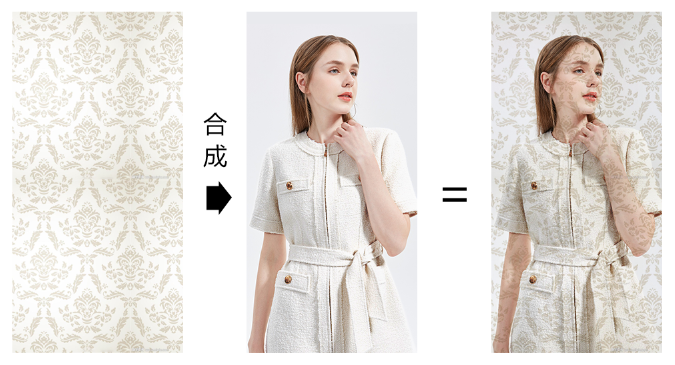


 或者这样：

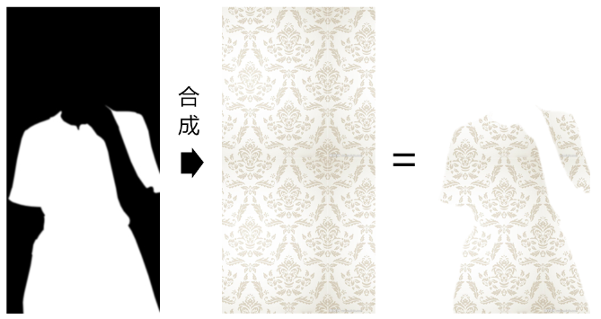


亦或者，这样：

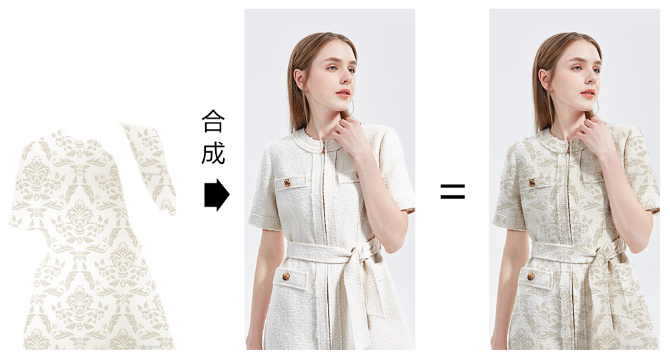


这就像在photoshop 里批图一样，接下来咱们就在webgl 里批一下。


### 4-1-多图加载

纹理合成是需要多张图像源的，因此我们需要多张图像源都加载成功后，再去合成纹理。

我接下来就要使用Promise.all() 来实现这个逻辑。

1.将图像的加载方法封装进一个Promise 中，等图像加载成功后，再resolve。

```js
function imgPromise(img){
  return new Promise((resolve)=>{
    img.onload=function(){
        resolve(img);
    }
  });
}
```


2.建立多个Image 对象

```js
const originImg = new Image()
originImg.src = './images/dress.jpg'

const pattern = new Image()
pattern.src = './images/pattern1.jpg'
```


3.利用Promise.all 监听所有图片的记载成功

```js
Promise.all([
    imgPromise(originImg),
    imgPromise(pattern),
]).then(() => {
    rect.maps = {
        u_Sampler: { image: originImg },
        u_Pattern: { image: pattern },
    }
    rect.updateMaps()
    render()
})
```

等所有的图片都加载成功后，我们会往rect的maps 集合里写入贴图，然后对其更新和渲染。

接下来，我看一下纹理合成最核心的地方，片元着色器。


### 4-2-在片元着色器中合成纹理

片元着色器：

```html
<script id="fragmentShader" type="x-shader/x-fragment">
    precision mediump float;
    uniform sampler2D u_Sampler;
    uniform sampler2D u_Pattern;
    varying vec2 v_Pin;
    void main(){
      vec4 o=texture2D(u_Sampler,v_Pin);
      vec4 p=texture2D(u_Pattern,v_Pin);
      gl_FragColor=p*o;
    }
</script>
```

- u_Sampler 是原始图片采样器，对应下图：

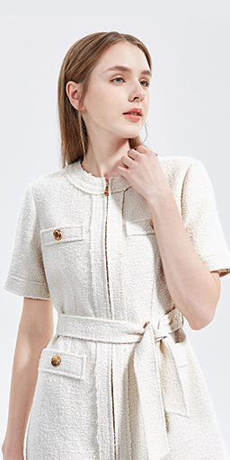


- u_Pattern 是纹理图案采样器，对应下图：

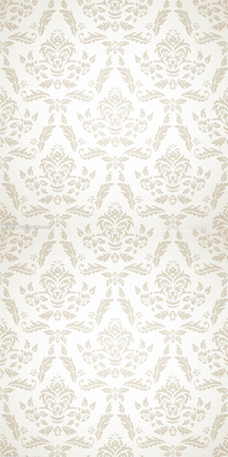


之后，我通过采样器找到原始图片和纹理图案的片元后，便可以对其进行运算；

```js
vec4 o=texture2D(u_Sampler,v_Pin);
vec4 p=texture2D(u_Pattern,v_Pin);
gl_FragColor=p*o;
```

上面的p*o便是在对片元做分量相乘的运算，这种算法会让原始图片的亮度变暗，有点类似于ps里的正片叠底。


举个例子说一下片元相乘的逻辑。

已知：

- 原始图像片元 o(ox,oy,oz,ow)
- 纹理图案片元 p(px,py,pz,pw)

求：p*o

解：

```js
p*o=(px*ox,py*oy,pz*oz,pw*ow)
```

通过此例可知：因为片元分量的值域为[0,1]，所以p*o 的亮度小于等于p和o 

- 当p=(1,1,1,1) 时，p*o=o

```js
p*o=(1*ox,1*oy,1*oz,1*ow)
p*o=(ox,oy,oz,ow)
```

- 当p=(0,0,0,0) 时，p*o=(0,0,0,0) 

关于片元相乘的方法我就说到这，接下来咱们再看几个常见的纹理合成方法。


### 4-3-纹理混合

纹理混合就是按照一定比例，将第一张图像合到另一张图像上，这类似于ps 里的透明度合成。

我们直接看一下纹理在片元着色里的合成方法。

```html
<script id="fragmentShader" type="x-shader/x-fragment">
    precision mediump float;
    uniform sampler2D u_Sampler;
    uniform sampler2D u_Pattern;
    varying vec2 v_Pin;
    void main(){
      vec4 o=texture2D(u_Sampler,v_Pin);
      vec4 p=texture2D(u_Pattern,v_Pin);
      gl_FragColor=mix(o,p,1.0);
    }
</script>
```


上面的mix() 方法便是按照比例对两个纹理的合成方法。

mix() 方法的返回数据类型会因其合成对象的不同而不同。

其规则如下：

```js
mix(m,n,a)=m+(n-m)*a
```

举个例子：

已知：

- m=3
- n=5
- a=0.5

求：mix(m,n,a)

解：

```js
mix(m,n,a)=3+(5-3)*0.5
mix(m,n,a)=3+2*0.5
mix(m,n,a)=4
```


再举个例子：

已知：

- m=(1,2,3)
- n=(3,4,5)
- a=0.5

求：mix(m,n,a)

解：

```js
mix(m,n,a)=(1+(3-1)*0.5,2+(4-2)*0.5,3+(5-3)*0.5)
mix(m,n,a)=(2,3,4)
```


简单总结一下mix(m,n,a) 方法的特性：

- 当a=0时，mix(m,n,a)=m
- 当a=1时，mix(m,n,a)=n

参考地址：https://www.khronos.org/registry/OpenGL-Refpages/gl4/

利用纹理混合，我们可以实现转场动画。


### 4-4-转场动画

转场动画就是场景的淡入、淡出。

我们可以将一个纹理理解为一个场景，利用转场动画实现淡入、淡出效果。

1.在片元着色器中，将mix()方法中的比值设置为uniform 变量。

```html
<script id="fragmentShader" type="x-shader/x-fragment">
    precision mediump float;
    uniform sampler2D u_Sampler;
    uniform sampler2D u_Pattern;
    uniform float u_Ratio;
    varying vec2 v_Pin;
    void main(){
      vec4 o=texture2D(u_Sampler,v_Pin);
      vec4 p=texture2D(u_Pattern,v_Pin);
      gl_FragColor=mix(o,p,u_Ratio);
    }
</script>
```


2.声明基础数据

```js
let n = 0
let len = 5
const obj = { ratio: 0 }
let track = null
```

- n 当前显示的图片
- len 图片数量
- obj 混合比例的存储对象
- track 时间轨，我们在讲星空的时候讲过


3.建立矩形面

```js
const rect = new Poly({
    gl,
    source,
    type: 'TRIANGLE_STRIP',
    uniforms: {
        u_Ratio: {
            type: 'uniform1f',
            value: obj.ratio
        }
    },
    attributes: {
        a_Position: {
            size: 2,
            index: 0
        },
        a_Pin: {
            size: 2,
            index: 2
        },
    }
})
```


4.加载图片

```js
loadImg()

function loadImg() {
    n++;
    const i1 = n % len
    const i2 = (n + 1) % len

    const originImg = new Image()
    originImg.src = `./images/pattern${i1}.jpg`

    const pattern = new Image()
    pattern.src = `./images/pattern${i2}.jpg`

    Promise.all([
        imgPromise(originImg),
        imgPromise(pattern),
    ]).then(() => {
        changeImg(originImg, pattern)
        ani()
    })
}
```


5.当图片加载完成后，会先更新图片，并连续渲染。

```js
function changeImg(...imgs) {
    obj.ratio = 0
    rect.maps = {
        u_Sampler: { image: imgs[0] },
        u_Pattern: { image: imgs[1] },
    }
    rect.updateMaps()
    track = new Track(obj);
    track.start = new Date();
    track.timeLen = 1500;
    track.onEnd = loadImg
    track.keyMap = new Map([
        [
            "ratio",
            [
                [0, 0],
                [700, 1]
            ],
        ],
    ]);
}
```


6.changeImg()  方法所做的事情如下：

- 将ratio 归0

```js
obj.ratio = 0
```

- 重置矩形面的贴图集合

```js
rect.maps = {
    u_Sampler: { image: imgs[0] },
    u_Pattern: { image: imgs[1] },
}
rect.updateMaps()
```

- 建立轨道对象

```js
track = new Track(obj);
track.start = new Date();
track.timeLen = 1500;
track.onEnd = loadImg
track.keyMap = new Map([
    [
        "ratio",
        [
            [0, 0],
            [700, 1]
        ],
    ],
]);
```

轨道对象的时长timeLen 是1500，到时间结束后，会再去loadImg 加载新的图像。

轨道对象会在700毫秒内完成淡入效果。


7.ani() 是连续渲染的方法

```js
function ani() {
    track.update(new Date())
    rect.uniforms.u_Ratio.value = obj.ratio;
    rect.updateUniform()
    render()
    requestAnimationFrame(ani)
}
```

我们当前的转场还只是通过单一的比值统一转场。

其实，我们还可以使用蒙版进行花样转场。


### 4-5-使用蒙版实现花样转场

蒙版是一种为图像的提供合成数据辅助图像。

蒙版通常是黑白的，若是彩色，还需要将其转灰。

蒙版中的片元数据是一种插值，并不是一种具备特定功能的数据。

比如，我们可以将蒙版中的片元数据做为两张图像的亮度合成插值、饱和度合成插值、透明度合成插值等等。

大家通常会将蒙版和遮罩混为一谈，其实那也无可厚非，蒙版和遮罩的底层原理都是一样的。

只是，遮罩一般会被当成透明度合成的数据，它遵守黑透白不透的规律。


接下来，我就通过蒙版来实现纹理的花样转场。

1.再建立一个蒙版图像，用作图案淡入的辅助数据

```js
loadImg()

function loadImg() {
    n++;
    const i1 = n % len
    const i2 = (n + 1) % len
    const i3 = Math.round(Math.random() * 4)

    const originImg = new Image()
    originImg.src = `./images/pattern${i1}.jpg`

    const pattern = new Image()
    pattern.src = `./images/pattern${i2}.jpg`

    const gradient = new Image()
    gradient.src = `./images/mask${i3}.jpg`

    Promise.all([
        imgPromise(originImg),
        imgPromise(pattern),
    ]).then(() => {
        changeImg(originImg, pattern, gradient)
        ani()
    })
}
function changeImg(...imgs) {
    obj.ratio = 0
    rect.maps = {
        u_Sampler: { image: imgs[0] },
        u_Pattern: { image: imgs[1] },
        u_Gradient: { image: imgs[2] },
    }
    rect.updateMaps()
    track = new Track(obj);
    track.start = new Date();
    track.timeLen = 2000;
    track.onEnd = loadImg
    track.keyMap = new Map([
        [
            "ratio",
            [
                [0, 0],
                [1000, 1]
            ],
        ],
    ]);
}

```

gradient 便是蒙版图像，效果如下：


之后图像在显示的时候，白色区域会先显示，黑色区域会根据合成比值渐渐显示。


2.在片元着色器里，使用蒙版合成图像。

```html
<script id="fragmentShader" type="x-shader/x-fragment">
    precision mediump float;
    uniform sampler2D u_Sampler;
    uniform sampler2D u_Pattern;
    uniform sampler2D u_Gradient;
    uniform float u_Ratio;
    varying vec2 v_Pin;
    void main(){
      vec4 o=texture2D(u_Sampler,v_Pin);
      vec4 p=texture2D(u_Pattern,v_Pin);
      vec4 g=texture2D(u_Gradient,v_Pin);
      float f=clamp((g.r + u_Ratio), 0.0, 1.0);
      gl_FragColor=mix(o,p,f);
    }
</script>
```

我们重点看上面的浮点数 f。

g.r + u_Ratio 是让蒙版的亮度加上混合比值。

在灰度图像里，片元的r,g,b 数据都可以表示亮度。

clamp(n,min,max) 方法是用于限定数据极值的：

- 当n 小于min的时候返回min
- 当n 大于max的时候返回max
- 否则，返回n

clamp(-1,0,1) =0

clamp(2,0,1) =1

clamp(0.5,0,1) =0.5


关于蒙版的基本原理我就说到这，我们利用这个原理还可以做一个换装达人。


### 4-6-换装达人

我们先说一下换装达人的实现原理。

1.用一张黑白遮罩图对两个纹理图案进行裁剪，裁出裙子的区域。

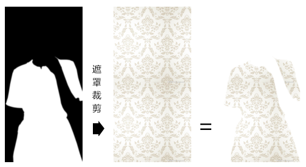

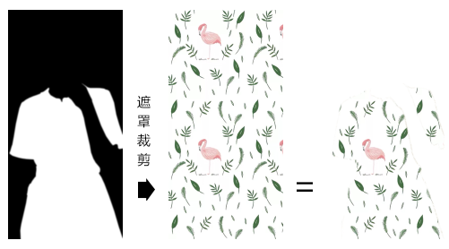


2.对裙子区域的图案进行纹理混合

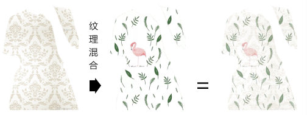


3.将纹理混合后的图案与原始图像进行正片叠底

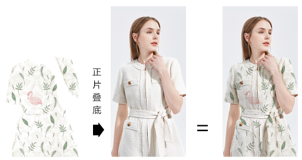


接下来咱们再看一下代码实现。

1.建立矩形面

```js
const rect = new Poly({
    gl,
    source,
    type: 'TRIANGLE_STRIP',
    uniforms: {
        u_Ratio: {
            type: 'uniform1f',
            value: obj.ratio
        }
    },
    attributes: {
        a_Position: {
            size: 2,
            index: 0
        },
        a_Pin: {
            size: 2,
            index: 2
        },
    }
})
```


2.建立原始图像和遮罩图像，在它们载成功后，将其写入到矩形面的贴图集合中，并再加载两个纹理图像。

```js
const originImg = new Image()
originImg.src = `./images/dress.jpg`

const mask = new Image()
mask.src = './images/mask-dress.jpg'

Promise.all([
    imgPromise(originImg),
    imgPromise(mask),
]).then(() => {
    rect.maps = {
        u_Sampler: { image: originImg },
        u_Mask: { image: mask },
    }
    loadImg()
})
```


3.加载纹理图案

```js
function loadImg() {
    n++;
    const i1 = n % len
    const i2 = (n + 1) % len

    const pattern1 = new Image()
    pattern1.src = `./images/pattern${i1}.jpg`

    const pattern2 = new Image()
    pattern2.src = `./images/pattern${i2}.jpg`

    Promise.all([
        imgPromise(pattern1),
        imgPromise(pattern2),
    ]).then(() => {
        changeImg(pattern1, pattern2)
        ani()
    })
}
```


4.将纹理图案写入到矩形面的贴图集合中，并建立轨道对象。

```js
function changeImg(...imgs) {
      obj.ratio = 0
      rect.maps.u_Pattern1 = { image: imgs[0] }
      rect.maps.u_Pattern2 = { image: imgs[1] }
      rect.updateMaps()
      track = new Track(obj);
      track.start = new Date();
      track.timeLen = 1500;
      track.onEnd = loadImg
      track.keyMap = new Map([
        [
          "ratio",
          [
            [0, 0],
            [700, 1]
          ],
        ],
      ]);
}
```


5.连续渲染

```js
/* 动画 */
function ani() {
    track.update(new Date())
    rect.uniforms.u_Ratio.value = obj.ratio;
    rect.updateUniform()
    render()
    requestAnimationFrame(ani)
}
```


6.在片元着色器里进行纹理合成，

```html
<script id="fragmentShader" type="x-shader/x-fragment">
    precision mediump float;
    uniform sampler2D u_Sampler;
    uniform sampler2D u_Pattern1;
    uniform sampler2D u_Pattern2;
    uniform sampler2D u_Mask;
    uniform float u_Ratio;
    varying vec2 v_Pin;
    void main(){
      vec4 o=texture2D(u_Sampler,v_Pin);
      vec4 p1=texture2D(u_Pattern1,v_Pin);
      vec4 p2=texture2D(u_Pattern2,v_Pin);
      vec4 m=texture2D(u_Mask,v_Pin);
      vec4 p3=vec4(1,1,1,1);
      if(m.x>0.5){
        p3=mix(p1,p2,u_Ratio);
      }
      gl_FragColor=p3*o;
    }
</script>
```


- o 原始图像
- p1 第1张纹理图案
- p2 第二张纹理图案
- m 蒙版图像

我通过m.x 来判断蒙版的黑白区域，m.y、m.z，或者m.r、m.g、m.b也可以。

p3片元默认为白色vec4(1,1,1,1)。

当m.x>0.5 时，p3为p1,p2的混合片元；

最终的gl_FragColor颜色便是p3和原始片元o的正片叠底。

关于纹理合成的应用，我暂时就说到这。

纹理合成的方式还有很多很多，大家可以参考一下Photoshop里的图像合成：

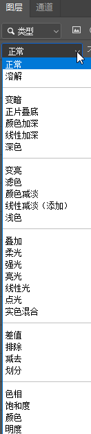


还有canvas的[`globalCompositeOperation`](https://developer.mozilla.org/zh-CN/docs/Web/API/Canvas_API/Tutorial/Compositing#globalcompositeoperation)属性：


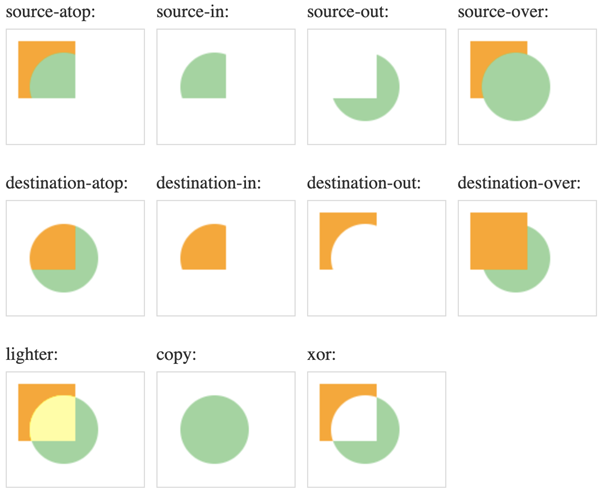


## 第六章 用跨域图像做贴图

我这里要说的跨域图像问题，并不单是webgl 问题，也是canvas 2d 里的问题。

为了更好的说清楚这个问题的来龙去脉，我这里就先从最简单的img标签说起。

### 1-img标签与跨域图像

我们用img 标签显示跨域图像的时候，我们只能将图像展示给用户，但并不能获取图像中的数据。

```js
 
```

效果如下：

 ![img](data:image/png;base64,iVBORw0KGgoAAAANSUhEUgAAAaQAAAB+CAYAAABrnmXIAAAgAElEQVR4Xu2dC5gcVZn3/291TwIBJAnp6kkAE1iRmzcQXEFQwQ92FVl3Zc0CIdPVgQDLfty/sLiukAU/EZW7XGKA6Z4QwAgKgnyyChFBPtdHkIsRuecCyXRPAgSWJHPpevc53TPT0+muqu6a6pmG/M8DD6TrvO8551eV/vc5dc77CrxKZ34vQOfAkiOguh8gOwPYBMErUDwOYBkc+zee9rxAAiRAAiRAAg0QkKq6i3NJtOEKQI4HNBbg63cQWYCU/VgDbbIqCZAACZAACVQRqBSkTO4zAH4KINEAKwVwJ/r7L8D83V5rwI5VSYAESIAESGCYQFmQbs0dCgu/ArB9SD7vAvodaPL7SMuWkD5oRgIkQAIksI0SKAnSresSsKw/AbBHzUHwKhA7H6lpZqbFQgIkQAIkQAJ1ESgJUjafgWqqLou6K1kPAdbZcHZZUbcJK5IACZAACWyzBARd3XtArRegGm8ChQGI3Ij4hIsxZ/KbTfBPlyRAAiRAAu8TAoJM/huAfivEeNZBsMHTztW9IDKxdF3XQ+Wb2OGRxZg9uxCirfeEyaI/oG1T/6xdVQf6zzvktbUQmA0fLCRAAiRAAnUQEGRzD0FxZB11K6uInImU/QNPu0zOLNXtt5XRUwDOfr+dX/rBr3bdZWBi/BIF5gAw57WMCL8uwHVvDay+YuERGGiYLw1IgARIYBsjIMjkugEkGx53KEECIGJmDctQiC3AvF3WNNxuixlcu3zX3Qrx+CMA9qzVNRH55VtTdvjywv1X9LVY19kdEiABEmgpAmbJrg/QtoZ7FVaQyg1tAnA53uj7Hs7bfXPD7beIwVW/+eAjEPmsX3cEcvk5h6+8sEW6zG6QAAmQQEsSMDOkcO85Ri9IQ0BWDkZ7uKslCfl06prHZx7qFvDboH6LYFP/TlvsBR/PvRtUl9dJgARIYFsl0AqCVGIvshwx92yc1P7se+VmXPXozG8AqG9DiIUvnPuZVQ+/V8bGfpIACZDAWBNoHUEqidIAFIsw0HsRTtn9jbGG0Wh7Vz8287uqWFCXneC4cw9b9ZNi3UzO/PcfPO10whSkp7xVl99Wq7T0zZno71vp2S2Rm5Gy57dat9kfEiCB8SfQWoJU5rEBgouwvb0Is6Vlt4lf/djM/62K6+q5jSruwecdtuYPFCQKUj3PC+uQwLZIoFUFaehePAO1zkY68etWvDlXLZ81C3H3RUD8DxULVm381ao9Fy6ES0GiILXis8w+kUArEGh1QRraJn4X+gcW4JQZq1oB2sg+XPXozCsAnOfVLzGHY1X/6ZzDV/94uA6X7Lhk12oPMvtDAi1AoPUFqQxpMxTfxQ725ZgtLbNNfOFyxCfHZ92i0I6q+6laUMtacN5hK6+quEZBoiC1wF9+doEEWo1AawiS4L+hUkc0AzVRENYAsgCOvayVYF75yO5Hi2U5xegUgn4R/N5VveG8w1ZXB5elIFGQWunhZV9IoEUItIIgLUWvncZp0u/LpKt7PtRaBNXBHE7yayhORdp+sUVY1t8NChIFqf6nhTVJYJshMN6CdAVS9oLBcELe0LP5L0L1ZwC23jzwLhQnIZ28p8q4q9uGWp+Eoh0o/mtDdAfA2h6qJgnhBADvQvQdwFoL6HOw5CnMTTzf8N3P5O6FeGxscPEs0nZllIawgtSV/xIU/xLcP+sqpKaZZIv+pfPV7YAdDoaln4ZiOkSmwtXJEGyCyAZA1gN4Am78sbq3oQdt+4augVhPA9oHxSaobIClr8PFy4hN/CM6Jr8a1O2q67dt+AAGBj49eJ/boUhCsCPEJJuU7aGYCLibAesdCHLFez2AZ3Gy/QxQDGXFQgIk0AIExkuQegGcCyd5YyCDrrUHwY0/DOhOHnULED0OqfZ7K6535udB9JZA/9UVXimmcZe2a5Gaurou+0zOxKmrHX5J9RGk2z9f4SeMIHWu3wfi/g4oLlt6F5E/4NUVh2DhEd5LoNnc/4LK2YAeBZgv66BS3Hr/W1i4HB32A761AwUpqC2sg8jPYaELc+1HA2ubCl3rj4RbeKiuuhWVZC0gP4M7cB3mTf9z4/a0IAESiJLAeAjSSljW19CRKJ3J8StdPQfBdf8TwBT/ivIO2iZ8AnMmGzEplfCCNOhA+iFYDHEvQEe7f8ifZgvSkvyHUMByQHfzFyNshrR9Ch1TTfbf6nLbGx/FQH8GwIFB6D2vi/x/xGKzcdIur9WsM3pBKrs1baFwDlLTf+//nIQVpGGvLiDLMGG7M3HiB8yskIUESGAcCIydIBWjfOtSxCeeVVeyvs71B0MKRowm18VF9AGk2o+JTpCGPa1AwToaJyfWevajmYJUFGW9B9BdAziY7eUnId1+e816mfxZgF4OYLu6ePpVEjGzmL+r+aMiSkEyfTDRO4D/g5R9jWeXQs+Qqjy+jgnxv8GJzHI86meEDkggBIGxESTFKkBOR9r+RV197MwdBZEfBy5Pbe1M5ECk7D8WPx71DGmkc3kOBflrnJx4p/aXfTOW7CZvRDZ/KlSvBiRYRCz5Fjrsb3r07yIA/1EX+/or5SEDByO1a+WyZtSCNNQfkbOQsmtHxYhOkExrtcdVPxfWJAESCEmg2YJklpiugKVXBC57DQ2gK38yXNwYLiWGdSVSifN9BMm8wO4FZAKgVkPMRG5Fyj55TARJ5HAoLgW08t2TZ4flajj2uTUvd+W+Chcmkvrg7sTAUfcBEgM0Flhz61mpMQgWJPP+0LyTmhTov6KC9KOgB+Pk5NNVdt6CtGVw80pj9xryKBzbN6VIY31nbRIggXoINFGQ8mdhwsDtOHFGfWvyCzWOWfnLissz4ctTcJIHFM2z+cOgeiQEz8Ky/gx34nq8+sTG4st+s3X8zvXT0acfB/BlqM4F4LVpYqg3LgQHIJV8pqp7US/ZoZj6vE4Bkcvg2P9WE1nnm5MhfX8JTMAouBeQRYhv/h3mzHyzyGfJxllw+44F1OwQnO6thXI4UvZjw9eDBGkouOotPTtBCvtBrCMgegqAvwq87SIPImX/bQ1B2heueyKAZ4HYCrh9efS3vzV8lMDsuBzARxATY5uGYlpgWxaOQ0eyFAyXhQRIYEwINE+QGun+ra/vDqvtDkA/04hZjbqb4CR3aNjH4lwSbZIBtPrLbqQzE4k8nTx9DASpniFshsoZSNtmk0Ltku35JtS9xMfZAGKWg7mJpZ51zJe5K2a324dr15E74dgnNCxII50tVAszey6A6KU1tvZX3gGx9kEq8UI9gGrWMUIYd6+HwvwI8S6Ch5FKfiF0OzQkARJomMD4C1L27V2gm58DkGi497UM3n57O5y1l1kWaqws0jZMyP0SIp/zMeyGk6yeLUQ/Q/Lvu8jzcHE80vZTnhXNLCfbs8Z/M4R8E44dnM/p1nWfg2XVDnBromy4mxJI72GWx4KX7PzST2RzZ0BxfcCN+1c4ye82dnO3rm3Y5G+DwsyqvEoBumka0nu8N9OAjA4QrUlgXAiMvyCZYXf1nA7VG8pRGEKzKGDSIxMxe3a4lBVLevZGwTXnUbzfOYi1d9Uv9LEXpE6k7Hm+lDq7P43itmnPkofaM5GWkpAElUzOHFidVbOaeec1tGxX75KdV3uZ3OMADvHpzj1wkt65pILGMXT95jVTEZ9ggvXu6C3q8sW6N+LU2y7rkQAJeBJoDUEy3QteXgq+jaKrkGqv/aU50nqZxrBjVdSHUo2e/ANQHOnZmGWZ7c73VVwfa0EyjSsuQjpplrhql66e8+G63/f+svVYfvQUivx9gH65tiDpOUi1l7Zlj1aQsvkUVL2XIaF/gdO+b/DDMFjDLAd+yuPQcr7nJkBN/EGPImfDsa+tuy1WJAESGBWBMRQkE4MuIExLNrekGAoobBHcgVSychmma/2+UPcfoO6hEPkIIFOgxagPdW4a2KozlnUqOhKLx12QjCRZ1leqxHGoY9n8Ymhxs4DXl+21iFnL60btuudAtfZypsh1SNlnRSJIS9/aE/29L/v0eyMcu/bZtOzrH4TGvwbFoQA+UQyFBP2A74zXD4DKt5G2TZp6FhIggTEg0HxBWq5xrMobkbgAlvUDdCRu8hzXtToRO/csh6rfko3Pd5V8DSnbbHEGTHQDF9dA9YuhxadmS3oenPat00lEGzqo1G43YEL2+B6I7YHKx5C2u6u6msmZED9m7GNR7oKT/FokgtSp20HyfulF+uAkK8MdFTelwNwT0wf/ZImN0FC9Bun2cxoxYV0SIIHwBJonSJncXwGSBuCM+FLtBazPwEk84dlls+TT1/c0BP4x27Z2IHgVW+y9i1t9Mz3HFKNCBMV9C8dtAZxk5VJY1Et2IpdjS/wybF/4BFz3Yf93WvJjpOzZ1YKUfwTQsTpL80s4yaMjEaRlOgGbe7b4vE/cAidpguOWSlf3X8O1fgLojHC3089KfwCn/czo/dIjCZBALQLNFCRzXuejNRp9CQXrQM+oB8Yg0zMHcG9r6JbF8I+Ym7wbpZBDjwAm0nNTSvMFqWB9YJhPJndlMRCtXxEchVSyMrp3NveQ77uwSNHIcjh26b3bqN8hFZfd/DID5+AkTfR2I0Z7wMXvAQk+VxRqvBSkUNhoRAIhCYyHIJm3N0uQSlZnWB05iGzuJ1DUu5vqh3CSpxV/VWfzTxbfH/iXF4o70FTXQ1EZFduSWSbluI/52AqSWcKyep6Eqt+L/CfhJD9Z0edM7qcA/t5nHGbXXPVSX6gHSZ8YnkmMVpAy+c8Can5Q1C6Kp5FOlu5vNncvFH8X0OV1gDwOaB4iZmm1XFSNkM3xtqcghXocaEQCIQmMjyCZzop8CSn7/3n2u3PdLIhltmAHzXTuwCR7LmZLAZkNRwMDD/p8wWwB5CQ4ybs96yzZcBQKAyaoq1cZW0EqfvEWo04EpGKwvgInYXJGlUrQzKqeHwVhHqrRClJX/lK4+u8+Td8BJ3kiTDoOy/2zz9KeC5GzsX3ixuKzUat0dn8UItWRN4brUpDCPAK0IYGwBMZRkLAKovv7xrjrzC2E4OKagytFgb4YqcRlw7v3MvmrAPV5CS3fguMRgHSokVYUpJIo/RyqX/K80YLHkUqWI11kcuaXv9+y5xZYOhMd7fmwD09Nu9EIktmOvzm/Aoq9Pfukei7S7Vcj030uIGY506NoJ5x2/7NamQ37AwO1U3UUvVKQIn026IwEAgiMnyAVOxYgECbMS8xdCWBq5ThkDSR+IlJTyzHUTIXO3D0QfMX7S9s6FqnE/b5MWlWQbl17IKyYySHlvV1d5YDh6A1Leqaj4K4B4B0k1bKWoiMRfpt9LZCjEaTO3OkQE1jXpwwdTO7svhYi3hsOXJ2Pee03+/q6bcN+GBhY4SNq3NTAr1ASGEMC4ytIJoW1FfswUtNe9xxzNncxFAvL1+U+SF8aqd02VNlkc7+A4m+8+cXOgDPN/wuvVQXJDCqTvwvQ43yej5vgJP95+Ho2/wuo+vAo/iioL3xQvQ9lWEHq7Pk8xDU/FrxjEY6cBWZzP4Rivk+3LoGTrD27HjIyZ9Tcgk+mWM6Q6r3trEcCURAYX0Eqfh9iMVLJUz0Hs/StKejvfan4RaXWhUgnrvasm8mZJSqfl9TyAqztD0fHTt7LVC0tSOu/ABQqd9NVwtiA3jXTcdpB/cWPs+uOgFpm27h/MbmnJsg5OMEnCWGQj6HrjQpSV/cO0NgZcF2zPBuQkmLEe7JM/tuAft2nW92wJh6Kjslm80btUkwLXzBxFD0KBane2856JBAFgfEXJGgfJL6n/yxp/a6Ix+KYM8VvOzCQ6f53QLzD6RSJyVsQNaF/VgJW6Yt7ZFH3QwD8dgCO/aaGof6ZXYRd+VehmOl58y05Bh22ORRbKpnuHwFSfU6peuB9ELkbovfDlf/CJHtl5WYAk5JifTsG9OMQHFY8tOskqmcgQYIEmASK90BkEqD7DG5ND0r9YTbB3I+UfWx5XDlzj7IBfwk2QeQ+KF6CSI2Au5qAqs85IwpSFF8y9EEC9RJoAUEqzpKuRCpZSqw3mpJ942PQ/uoEbqPxWW07foJk+pLNXQJF7cywRb3FIqRGpMgozTD/C8BeDWIwW6Q3QrCpmOROMaUi/bmZVdU6kBssSA12o7gj8yW0DRxSkVvr9renoW/L2lCJHOvuAQWpblSsSAIREGgNQTKzlt6EPZxQbTQD68zdDcFXR+MiwHZ8Balr7b5wYz7vPbAaTrJyBlU8QCoPAdgjMi5jJkjyHPrdYzC/vXrpLWhr+6gHS0EaNUI6IIEGCLSIIJngOIX90DHDZz2/zlGV4pqZL9/967RotNr4CpLpbSa3DkApWkGtorF9kZ5mMsWWy63rErCsRUDdh439uTRfkBSQWzEpfj5mT91YszPm/ZMrZnmySSGSKEiN/uVgfRIYDYHWESSVDyNtvziawQzblpL+XVk8BAv1zm0UrrEWEKSA90JizUcqUXvLcym9g0nKt1u44Q9aNU+QeiHWMli4GnMTJuqGf1m0dhImxv8vgH+JfvmOghSEn9dJIEoCrSJI67DS3g0LxY1ycCgtbx0PwAT+NDOm4JfnwR0Yf0HKrj8DWvDJrCqdcHwS+C1cHses/cx5LbNF/PDiO6JGi8iPkLIN28rSyDskhYmm8DoEr0DwNAq6HJjwa6SnNJ6l9ea1M9EWP37w8PBHqs+uNTpAU5+CFIYabUggLIHwggQxcdDe9GxY3T0hUpkmwKuy3y/6sCOrsjM71HIJ9FkfgEnPJ+J9YNSvzX73NcxP5iqqmPMsltQ+sNrftwnp6eZwb7lk3/ggBCZPT+3yypQ/+4rz9fkdsVPcJxGh9a7vdueRrZZi5R0E6CEws1RxZ0CtHSHaBnNODNY7ELwD1Y2A+wrE+gsK+jxW2ytr9tGkgt/+Te9IC4UtA7B0E9p22oT4mrcxe//K+HJR3W8zSy5s3hmxth2hhbZQbl0rj3m7mMPFLCRAAmNAYBSCFEnvFNCL4LSbJSQWEiABEiCBbZjAeArSBqiVRnqrdODb8M3g0EmABEhgWyYwToIkjyIeOxEn7fLatgyfYycBEiABEigTMIJkomaHe5/SMEkpwMJl2C6x0DMlQMM+aUACJEACJPB+IGAEaT2AXZo+GJF1UGsunGnmjBALCZAACZAACVQQEGRzv4Xi0CZz+U9Yk+b6BjVtcgfongRIgARIoLUJGEH6DhT/2pxuSj8EF6EjcTlEtDlt0CsJkAAJkMD7gYARpI8B8pRPKuiw41yNGE7A3OTjYR3QjgRIgARIYNshUDrMmcnfD+gxEQ77HrRNnIc5k70PzkbY2PveVTZ/IRQmLUZzixZuQ3r6r6saMankLTl4+HPVAfQWTsBpM0wk8FJZqBZm5fzyE9Xf9153EU6bYd5thi+ljLnfC+8ABTjJ1CjsaUoCJNAggZIgdeb3gqVPQrFjg/aV1VV7YVkLkLKvG5UfGlcSGJv3fICFf0ZH8qYq/F3rvwq3cHfl51tl3zURGibmo4m6YMX2Q8e00QXaXdKzNwpuZYDZhp4r6YdjNx5SqaE2WJkESGAkgXK4m0zeJHG7HdBwW8BFXgBwPFK2ScDGEiWB8RakZcti2PQ5c3/3HDGsF5Cy9xl+N1gtSIViPqViEQvQyZVIZCOgpo4pJsZgObxPLUHqzLdDdEVdWNU6DnGsoyDVRYuVSKBlCFTGX8vkTPpvEyV6uwZ7uBST5HTMtv+7QTtWr4dAZ94BdPeKqhZ2h2L+iM82QHGNrzuRwwE9akQdMyu+Z/jPUngAzownavrI5s+GamX6eLGORSpxf7F+tSA9Cyf5seK123NJ9MHEPiyXmLUP5iaeL36QyT04GAC3dL2WIN3RMwO97uv14EIsfjTgrq4QJJEz0T9gMgUD8diNAL446OtFDBRKTNriF0F1XulzzpDqYs1KJBAhgeqAoNn8AVA1yzafCm5HTF6ec+DYy4LrskakBLK5k6BYUhYTPIhU8m9928jkvw7ot8t1AqKCj3R2S89OiOnqipmO4GGkkl8oVvMTpNLsxjwrUQrSswCeGXRosuGWn9dagqR6AtLtdxbrZ3J3AThu0HYFnKSJDm6Wrq+G6NkUpEifVDojgboJ1I5QrSpYkj8arjgQHAlVe8SX2LsAfguTD8eddhvSsqXu1lgxOgLZ/HegOmK7vvV9OIkFDQpSBo6drrtTnT2fh7gfrKg/074dR8hAtSDpFqC4jGtKHMB+FXaC56HoHfzMZLItpwapb4Z0CZzkxYMCY9Jo3DDsvxFBEvwJqeRHKUh1PwWsSAJNI1BbkLZubulbU1DYMhkS24KTpnXzTFHT7kf9jrP5nw/m/hn8QS8OUna2IUESySJlO/U36lOz2ZsaqpfsyoLUlTsdLswyXKk0IkhAeWmRM6RIHgU6IYGwBOoTpLDeadc8Apm8WT4rv1dyrU9iXkCG1eoluy44dvDW5s784RAcUDUYcVch1X5v8fOtBUmwHpClxWuKHQA9ZSv7OyBSOhag7rGAlMfS6AypM3c6hILUvIeNnklgbAhQkMaGc7StdL45GVb/GyMOMxeg9o6By6dbC5JgCVLJjsDOZXJXAji3qp7iQaQH31s1+g5JY/siPa20LTuT+xWA0rsoUybE9sWJg9eGPvObIWV7ToO65e3qjc2QnoGT/HixGc6QAh8FViCBZhKgIDWTbrN8Z/OHQfXRsnv5Cxx738DmqgXpNqSSc4PtQgiSOQYg1t8XfbtuAtBHKtoRPRYSfxkFdw8I7gR06B2Si7aJ06oOVfsKUu40KMIJksjTSNmfoCAFPgWsQAJNJ0BBajriJjSQyVW+xDcbTFK2OUfmX6qW7LAUTvKkIDNke74MdQ8HYHbxlbZym+I/Qwp061Hhp3CSX6265idImZ5TAXfRsE0jMyTB00glKUhh7xbtSCBCAhSkCGE2xVUmb84FjTyQapTAnBMbeVasF5DNwe1X2fUBUg7/YxyIXIlU4tKavrL5xdAR74KiFiTBg4hPPKFmyClfQcqdat5ihRIk4Ck4yQNwrU7EzvmHR0S+fxdOcnSRS4JvCGuQAAmMIEBBavXHIZN/AVBzzmaMil4Gp/3fGhak4lGB9Z+taacyGVooH8AtVUrBslYV/89VRduE1zBn8iueg/TdZdczH677Q19BAt4BhreZm+XBiYP1TYLKtwBMGvx38GNZDsc+coygsxkSIAHze5gUWpzAe0GQFq2dhIltR3iStLAzXLe0465czgCs1Z42qWkPVBwv8BOkzu75EAkSpEZu9CaIewRS03/fiBHrkgAJjI4ABWl0/JpvfXP+Q7AK5SCfsdjUyg0NGIDqgdDhuHDefRKrAzIy95X8HG7hggqDuKxHR3u+phOvJbulb+2J/t6XI4UxyZ6I2VIO1uq/y+4UqLs4YIb0IoANAX0slA7zFq6AM72+uHmRDprOSGDbJkBBeq/d/0z+s5U71uQ5OHZlFASvMWW6zwXEbOEuFcHtSCVN/ML6SssKUvcpUPEXpJGhg+obLWuRAAmMMQEK0hgDH3VznbkzILi+LCp17rAzBs0SpGUrJuCdad7bzi1rCsRdXjF2xXFw4T2rOtl+BhiRZdh3U0P+ZEBNUOBSCdplN+qbQAckQALNIEBBagbVZvrM5q+H6hnlJqyL4SQuqavJZgnSUOOL1k7DhFg5Np7gFTjJu3HrOwlYm7ZaBnQ/UlwWM0FiXUwvi4negI52Ey+xsvgKUvfJgFCQ6noIWIkEWpcABal1703tnmVyvwFgzgQNlX8sfunXU5otSMWcWvqj4a4ovod08gJfQerMZSAohy8S60ikEpWzKePQ9x1Sfh5UbymLWo30E1yyq+cJYR0SGFcCFKRxxR+i8UzOvJifOmwp1t5IJYaiavs7bL4gXQPoWSNmb1+Bk/hZgCBVxqET+TpS9ncamiF15udBKEghniaakEBLEaAgtdTtCOjM1rMEwWZsb++E2TKUeXVsBQl4Ak7yoOFGM/k/APrJwT8regs2Tpux3n/Jrph/68kRs6p7kU6WQg6NLP7vkL4B6LdGiPSRkLaVcHvL55oU/4F0cuF76XazrySwrRGgIL2X7ngmdzQAk111qPwRTvLAuocw6hlS7nooRry/KkZ2eADAymIfVE8zWwpK/Rmx+8/vHdLC5XHM2s8cTN1h0K4bjl1+pzQ0uGpB+hMgfxqMWmGyvw4ddC0gZu2O3ab1YFVPHtApg35dQJ+BDB+ODcYWn/BPmDOldHiXhQRIoOkEKEhNRxxhA9me86DuFeWZQJ3RuocMRitInd3HQ+SOukYkWIxU0oT0ge8MyVzP5Ezg1XKUB3X3QHp6SeS8Bal2NxSXI528sHixVtr1ujpfrPQynOSH6q/OmiRAAqMlQEEaLcGxtM/kzbJUOYiq6pVIJ8tRroP60pk3GYDLYYFE7kMqcX6QWcX1rvylUD0dKuX3WEMVxET+UPOPC2AenGRX8dLNG6ci3vu7Cj8xfAlz7ZcGheNCKOYNX7diZ6Jjl5EzQZMawqRBN2nLaxWFIAeRmzA3cUNFhIeuvAO3mJZ81wYjk9wwnJG2IUCsTAIkEJYABSksOdqRAAmQAAlESoCCFClOOiMBEiABEghLgIIUlhztSIAESIAEIiVAQYoUJ52RAAmQAAmEJUBBCkuOdiRAAiRAApESoCBFipPOSIAESIAEwhKgIIUlRzsSIAESIIFICVCQIsVJZyRAAiRAAmEJUJDCkqMdCZAACZBApAQoSJHipDMSIAESIIGwBChIYcnRjgRIgARIIFICFKRIcdIZCZAACZBAWAIUpLDkaEcCJEACJBApAQpSpDjpjARIgARIICwBClJYcrQjARIgARKIlAAFKVKcdEYCJEACJBCWAAUpLDnakQAJkAAJREqAghQpTjojARIgARIIS4CCFJYc7UiABEiABCIlQEGKFCedkQAJkAAJhCVAQQpLjnYkQAIkQAKREqAgRYqTzkiABEiABNj0LgcAAAFXSURBVMISoCCFJUc7EiABEiCBSAlQkCLFSWckQAIkQAJhCVCQwpKjHQmQAAmQQKQEKEiR4qQzEiABEiCBsAQoSGHJ0Y4ESIAESCBSAhSkSHHSGQmQAAmQQFgCFKSw5GhHAiRAAiQQKQEKUqQ46YwESIAESCAsAQpSWHK0IwESIAESiJQABSlSnHRGAiRAAiQQlgAFKSw52pEACZAACURKgIIUKU46IwESIAESCEuAghSWHO1IgARIgAQiJUBBihQnnZEACZAACYQlQEEKS452JEACJEACkRKgIEWKk85IgARIgATCEqAghSVHOxIgARIggUgJUJAixUlnJEACJEACYQlQkMKSox0JkAAJkECkBChIkeKkMxIgARIggbAEKEhhydGOBEiABEggUgIUpEhx0hkJkAAJkEBYAhSksORoRwIkQAIkECkBClKkOOmMBEiABEggLIH/AbXNkELvhg7yAAAAAElFTkSuQmCC) 

我们不能通过img标签获取图像数据，是浏览器出于安全考虑的，因为有的图像里可能会含有验证码、签名、或者其它不可告人的东东，这种数据是不能随意被别人获取的。

这时候，我们可能会想到通过canvas 2d获取图像数据。


### 2-获取图像数据

若图像是同域的，下面的方法是没问题的。

```js
const canvas=document.getElementById('canvas');
const ctx=canvas.getContext('2d');

const img=new Image();
img.src='https://img.kaikeba.com/70350130700202jusm.png';

img.onload=function(){
    const {width,height}=canvas
    ctx.drawImage(img,0,0)
    ctx.getImageData(0,0,width,height)
}
```


若图像是跨域的，那就会报错：

```js
Failed to execute 'getImageData' on 'CanvasRenderingContext2D': The canvas has been tainted by cross-origin data.
```


其实不仅canvas 2d 是这样的，我们用webgl 获取跨域图像数据时，也会报错。

```js
const image = new Image()
image.src = 'http://img.yxyy.name/erha.jpg'
image.onload = function () {
    gl.texImage2D(
        gl.TEXTURE_2D,
        0,
        gl.RGB,
        gl.RGB,
        gl.UNSIGNED_BYTE,
        image
    )

    gl.texParameteri(
        gl.TEXTURE_2D,
        gl.TEXTURE_MIN_FILTER,
        gl.LINEAR
    )

    const u_Sampler = gl.getUniformLocation(gl.program, 'u_Sampler')
    gl.uniform1i(u_Sampler, 0)

    render()
}
```


错误信息：

```js
Failed to execute 'texImage2D' on 'WebGLRenderingContext': The image element contains cross-origin data, and may not be loaded.
```


由错误信息可知，代码跑到texImage2D()方法时卡住了，因为我们在这里面引用跨域图像了。

接下来我们可以使用CORS 跨域解决此问题。


### 3-CORS 跨域

CORS 是Cross Origin Resource Sharing的简写，译作跨域资源共享。

CORS 是一种网页向图像服务器请求使用图像许可的方式。

CORS 的实现过程如下：

1.先让服务器向其它域名放权，比如 Apache 服务器需要这样设置：

```
Header set Access-Control-Allow-Origin "*"
```

上面代码的意思就是允许其它域名的网页跨域获取自己服务端的资源。

上面的* 是允许所有域名获取其服务端资源。

我们也可以写具体的域名，从而允许特定域名获取其服务端资源。


2.在网页里，通过特定的方法告诉服务端，我需要跨域获取你的资源。

其代码如下：

```js
const image = new Image()
image.src = 'http://img.yxyy.name/erha.jpg'
image.setAttribute("crossOrigin", 'Anonymous')
```

有了上面crossOrigin 属性的设置，无论是在canvas 2d里使用此图像源，还是在webgl里使用此图像源，都不会报错。

crossOrigin 接收的值有三种：

- undefined 是默认值，表示不需要向其它域名的服务器请求资源共享
- anonymous  向其它域名的服务器请求资源共享，但不需要向其发送任何信息
- use-credentials  向其它域名的服务器请求资源共享，并发送 cookies 等信息，服务器会通过这些信息决定是否授权


## 第七章 视频贴图

我们之前使用texImage2D 方法将Image 图像源装进了纹理对象里：

```js
gl.texImage2D(
    gl.TEXTURE_2D,
    0,
    gl.RGB,
    gl.RGB,
    gl.UNSIGNED_BYTE,
    image
)
```

我们也可以把上面的image 换成video 对象。

1.正常建立纹理对象，并设置其相关属性。

```js
gl.activeTexture(gl.TEXTURE0)
const texture = gl.createTexture()
gl.bindTexture(gl.TEXTURE_2D, texture)
gl.texParameteri(
    gl.TEXTURE_2D,
    gl.TEXTURE_MIN_FILTER,
    gl.LINEAR
)
gl.texParameteri(
    gl.TEXTURE_2D,
    gl.TEXTURE_WRAP_S,
    gl.CLAMP_TO_EDGE
)
gl.texParameteri(
    gl.TEXTURE_2D,
    gl.TEXTURE_WRAP_T,
    gl.CLAMP_TO_EDGE
)
```


2.获取采样器对应的uniform 变量，并将纹理单元号赋给它。

```js
const u_Sampler = gl.getUniformLocation(gl.program, 'u_Sampler')
gl.uniform1i(u_Sampler, 0)
```


3.建立video 对象，并播放

```js
const video = document.createElement('video');
video.src = 'http://img.yxyy.name/ripples.mp4';
video.autoplay = true;
video.muted = true;
video.loop = true;
video.setAttribute("crossOrigin", 'Anonymous');
video.play()
video.addEventListener('playing', () => {
    ani()
})
```


4.在video 对象播放时，向纹理对象连续写入video

```js
function render() {
    gl.texImage2D(
        gl.TEXTURE_2D,
        0,
        gl.RGB,
        gl.RGB,
        gl.UNSIGNED_BYTE,
        video
    )
    gl.clear(gl.COLOR_BUFFER_BIT);
    gl.drawArrays(gl.TRIANGLE_STRIP, 0, sourceSize);
    requestAnimationFrame(render)
}
```


关于纹理方面的知识，我们就先说到这，等我们后面学习了投影矩阵之后，我们还会在对纹理做进一步延伸。

下一篇咱们休息一下大脑，先不去考虑webgl 实战，咱们熟悉一下GLSL  ES 语言。


