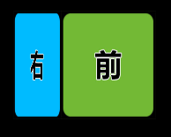
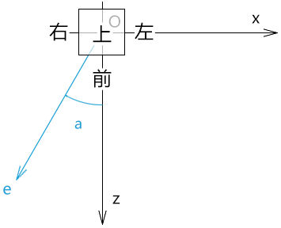
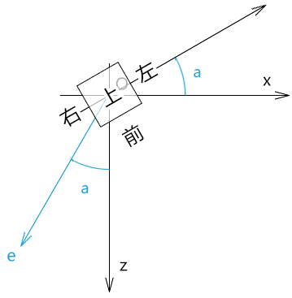
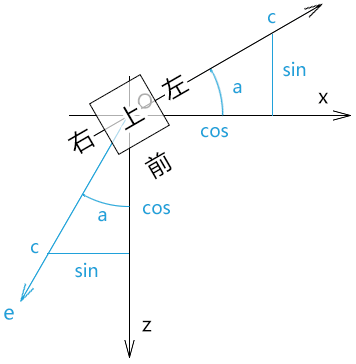

##  前言

之前我们在讲视图矩阵的时候有点不好理解，接下来咱们说一下视图矩阵的本质。


### 课堂目标  

1. 理解视图矩阵的本质

2. 可以灵活架构视图矩阵

   

### 知识点  

1. 模型矩阵
2. 视图矩阵


## 第一章 视图矩阵的本质

我们之前说过，视图矩阵可以让我们从另一个角度观察物体。

那我们能不能在没有视图矩阵的情况下，看见物体的另一个角度呢？

答案肯定是可以，我们自己用模型矩阵把物体转一下就可以了。

因此，视图矩阵的本质是对物体的旋转变换。

而物体变换的本质则是对物体顶点的位移。

所以，接下来咱们就通过模型矩阵的旋转变换来理解视图矩阵。

1.我在webgl 画一个立方体


2.默认我们只能看见这个立方体的正面。


3.我想看看立方体右侧长啥样。




我们要实现第3步，可以构建一个矩阵，让它对立方体的顶点进行变换。

这个矩阵的构建思路有两条：

- 构建一个从左前方看物体的视图矩阵
- 构建一个让立方体向左旋转的模型矩阵

上面的两个矩阵最终的因子形态都是一样的。

接下来我就按照上面的两个思路建立两个矩阵，然后对这两个矩阵的因子做一下对比，若它们都是一样的，那大家也就可以理解视图矩阵的本质了。


## 第二章 构建矩阵

首先咱们先准备一个场景。

我们通过俯视图来解释这个场景。



已知：

- 视点为e
- 目标点t=原点O
- 上方向u(0,1,0)

求：视点e所见的物体的形态

接下来我们先以模型矩阵求解。


### 2-1-构建模型矩阵

基于视线和z轴的夹角，将立方体向左旋转a即可。



想象一下，现在我们站在z轴上看见的立方体的形态，就相当于我们之前视点在e上算看见的立方体的形态。

1.建立视线，目标点和上方向

```js
e=(-0.5, 0, 1)
t=(0, 0, 0)
u=(0, 1, 0)
```


2.用目标点减视点得视线c

```js
c=e-t
c=(-0.5, 0, 1)
```


3.将c 归一化后，可得角a 的正弦值和余弦值



```js
|c|=sqrt(c.x*c.x+c.y*c.y+c.z*c.z)

c.x=c.x*(1/|c|)
c.y=0
c.z=c.z*(1/|c|)
         
cos = c.z
sin = c.x
```


4.上面的cos和sin 便可以作为立方体向左旋转的模型矩阵(列主序)的旋转因子

```js
const modelMatrix = [
    cos,  0, sin, 0,
    0,    1, 0,   0,
    -sin, 0, cos, 0,
    0,    0, 0,   1
]
```


接下来将模型矩阵传给顶点着色器，让其与顶点相乘即可，其原理我们在说模型矩阵的时候都说过，我就不再多说了。

效果如下：


代码如下：

```js
const e = new Vector3(-0.5, 0, 1)
const t = new Vector3(0, 0, 0)
const u = new Vector3(0, 1, 0)

const c = new Vector3().subVectors(e, t)
c.normalize()

const cos = c.z
const sin = c.x

const modelMatrix = [
    cos, 0, sin, 0,
    0, 1, 0, 0,
    -sin, 0, cos, 0,
    0, 0, 0, 1
]
```


接下来我们再看看视图矩阵的构建。


### 2-2-构建视图矩阵

我们要构建视图矩阵，就得构建新的坐标系[O;a,b,c]。


1.新坐标系的z 轴，视线c 的归一化。

```
c=(sin,0,cos)
```


2.新坐标系的x轴，可视之为上方向u(0,1,0)和视线c(sin,1,cos)构成的平面的垂线的归一化a

a的坐标值可由垂直向量的叉乘定理得出：

```js
a=u^c
a=(0,1,0)^(sin,1,cos)

a.x=u.y*c.z-u.z*c.y
a.x=1*cos-0*1
a.x=cos

a.y=u.z*c.x-u.x*c.z
a.y=0*sin-0*cos
a.y=0

a.z=u.x*c.y-u.y*c.x
a.z=0*1-1*sin
a.z=-sin
```


因为：向量a是由两个相互垂直的归一化向量的叉乘得出

所以：

```
|a|=|u|*|c|*sin90°
|a|=1*1*1
|a|=1
```

所以：向量a 无需再做归一化处理


3.新坐标系的y轴，可视之为视线c(sin,0,cos)和向量a(cos,0,-sin)构成的平面的垂线的归一化b

```js
b=c^a
b=(sin,0,cos)^(cos,0,-sin)

b.x=c.y*a.z-c.z*a.y
b.x=0*-sin-cos*0
b.x=0

b.y=c.z*a.x-c.x*a.z
b.y=cos*cos+sin*sin
b.y=1

b.z=c.x*a.y-c.y*a.x
b.z=sin*0-0*cos
b.z=0
```

向量b无需归一，原理同上


4.综上所述，新坐标系的三个基向量分别为：

```
a(cos,0,-sin)
b(0,1,0)
c(sin,0,cos)
```


5.根据三个基向量构建视图矩阵(列主序)

```js
const viewMatrix = [
    cos,  0, sin, 0,
    0,    1, 0,   0,
    -sin, 0, cos, 0,
    0,    0, 0,   1
]
```


将视图矩阵viewMatrix和模型矩阵modelMatrix对比一下，会发现，它们是一样的。

所以：视图矩阵的本质是对物体的旋转变换。

代码实现：

```js 
const e = new Vector3(-0.5, 0, 1)
const t = new Vector3(0, 0, 0)
const u = new Vector3(0, 1, 0)

const c = new Vector3().subVectors(e, t)
c.normalize()
const a = new Vector3().crossVectors(u, c)
a.normalize()
const b = new Vector3().crossVectors(c, a)
b.normalize()

const viewMatrix = [
    a.x, b.x, c.x, 0,
    a.y, b.y, c.y, 0,
    a.z, b.z, c.z, 0,
    0, 0, 0, 1
]
```


### 扩展

在我们理解了视图矩阵的基本原理后，还可以对其做一些加工。

比如我之前在讲视图矩阵的时候还对c 轴取反了，three.js里还对视图矩阵转置了，这个就要看我们之后的具体项目需求了。

当前大家先理解视图矩阵的本质就好。

之后我们还会说投影矩阵，到时我还会对矩阵进行深入讲解。

