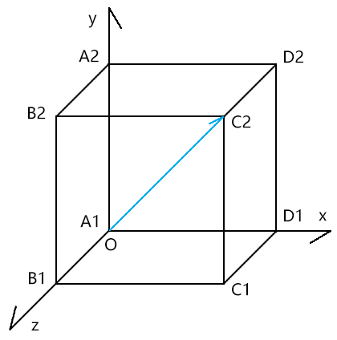
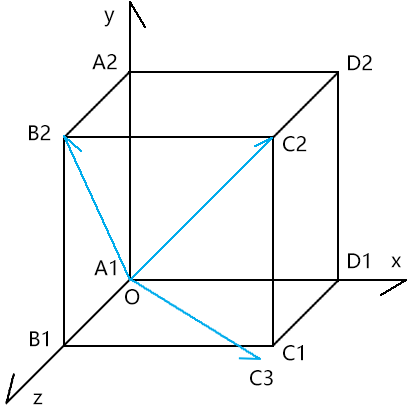

##  前言

佛曰：一花一叶一世界，一草一木一浮生。

在webgl的三维世界里亦是如此，因为它本身就是对真实世界的映射。

当我们对向量的各种运算得心应手的时候，我们便可以在一个世界里自由变换。

当我们对矩阵的各种运算得心应手的时候，我们便可以看见那一花一叶里的世界，望穿那天外的星罗万象。

我们前几章所说的知识，大部分都是二维的。

虽然在说矩阵的时候，给大家说过模型矩阵和视图矩阵，但那是从矩阵算法的角度来看三维世界的。

接下来这一篇，我们就真正的进入三维世界。


### 课堂目标  

1. 自由变换三维物体
2. 以用户视角进入三维世界
3. 控制三维可视空间
4. 处理物体的前后关系
5. 绘制三维物体


### 知识点  

1. 世界坐标系
2. 本地坐标系
3. 欧拉旋转
4. 四元数旋转
5. 模型矩阵
6. 视图矩阵
7. 投影矩阵


## 第一章 世界坐标系和本地坐标系

### 1-基本概念

我们既然要进入三维世界，必须要先有坐标系的概念，而不要只想着如何让物体飞天遁地。

坐标系按照层级分为：

- 世界坐标系
- 本地坐标系

当然，坐标系还可以按照类型来分，比如：直角坐标系、极坐标系等，这不是我们这篇要说的重点。

接下来，我们重点来说世界坐标系和本地坐标系。

我通过一个神的传说，给大家引出世界坐标系和本地坐标系的概念。

天地混沌之时，宇宙只是一个蛋。

这个蛋之所在，就是世界坐标系的原点所在。

十万八千年后，盘古一斧将蛋劈开，这个蛋没了，宇宙也变得无穷无尽了，其中万物初生，世界坐标系里的坐标轴也应运而生，以此定位万物。

然则，宇宙之中，无论是日月星辰，还是花鸟鱼虫，它们皆可自成一界，在这一界中，它们都有着自己的坐标系。

比如：

北京在东经116°20′、北纬39°56′ 上，这个位置就是北京在地球的本地坐标系里的位置。

那北京在宇宙里的世界坐标位是什么呢？这需要知道宇宙的坐标原点在哪里。

至于宇宙的坐标原点在哪里，我就不再做深度探讨了，不然能扯到释迦摩尼的缘起性空和爱因斯坦的相对论上去。

接下来拿变换举例子。


### 2-认识世界坐标系、本地坐标系中的点位关系

已知：

- 世界坐标系[O1;i1,j1,k1]
- 点P
- 点P所处的本地坐标系是[O2;i2,j2,k2]
- 世界坐标系[O1;i1,j1,k1]∋本地坐标系[O2;i2,j2,k2]

解释一下：

[O;i,j,k]中：

- O 是坐标原点
- i,j,k 是坐标向量   

这是空间直角坐标系的书写方式，大家可在高中数学的空间几何部分找到。

初学three.js 的同学，往往很难玩转其中矩阵变换、欧拉、四元数、世界坐标位、本地坐标位等。

若大家把我当前所说的这块搞懂了，可以攻克一个很重要的难点。

接下我们继续围绕点P 来说事。

提问1：

我说点P 的坐标位是(x,y,z)，可否找到点P？

答：不可。

因为我没说(x,y,z) 是在世界坐标系[O1;i1,j1,k1]里的位置，还是在本地坐标系是[O2;i2,j2,k2]里的位置。

提问2：

点P 的世界坐标位是(x,y,z)，可否找到点P？

答：可

接下来我们说重点啦。

提问3：

点P 的本地坐标位是(x,y,z)，可否找到点P？若可以，求点P的世界位。

答：可

解点P的世界位：

根据空间向量分解定理。

由世界坐标系[O1;i1,j1,k1]可解析出四维矩阵m1：

```
[
	i1.x,j1.x,k1.x,0,
	i1.y,j1.y,k1.y,0,
	i1.z,j1.z,k1.z,0,
	O1.x,O1.y,O1.z,1
]
```

同理，由本地坐标系[O2;i2,j2,k2]可解析出四维矩阵m2：

```js
[
	i2.x,j2.x,k2.x,0,
	i2.y,j2.y,k2.y,0,
	i2.z,j2.z,k2.z,0,
	O2.x,O2.y,O2.z,1
]
```

点P的世界位是：

```
m1*m2*(x,y,z)
```

对于我上面的说法对不对，大家一定要保持怀疑的态度，用批判否定的眼光看问题，不唯上，不唯书，只为实。


## 第二章 深入认知三维世界

接下来，我们借助three.js 来验证我们的推理。

若我们之前的推理和three.js  里的一致，那就基本没问题了，毕竟这种底层原理，在three.js  里一般是不会错的。


### 1-用位移矩阵做实验

#### 1-1-示例

已知：

- 宇宙universe
- 宇宙的本地坐标系是[O1;i1,j1,k1]
  - O1(0,0,0)
  - i1(1,0,0)
  - j1(0,1,0)
  - k1(0,0,1)
- 宇宙包含万物，其本地坐标系就是万物的世界坐标系
- 银河系galaxy
- 银河系的本地坐标系是[O2;i2,j2,k2]
  - O2(1,2,3)
  - i2(1,0,0)
  - j2(0,1,0)
  - k2(0,0,1)
- 太阳sun
- 太阳在银河系内的本地坐标位是P2(4,5,6)
- 太阳∈银河系∈宇宙

求：太阳的世界位P1

解：

由宇宙坐标系[O1;i1,j1,k1]解矩阵m1：

```js
[
	1,0,0,0,
	0,1,0,0,
	0,0,1,0,
	0,0,0,1
]
```

由银河系[O2;i2,j2,k2]解矩阵m2:

```js
[
	1,0,0,0,
	0,1,0,0,
	0,0,1,0,
	1,2,3,1
]
```

点P的世界坐标位是：

```js
P1=m1*m2*(4,5,6)
P1=(1+4,2+5,3+6)
P1=(5,7,9)
```

接下来我们拿three.js验证一下


#### 1-2-验证

1.从three.js 中引入我们要用到的方法

```js
import { Group, Matrix4, Object3D,Scene, Vector3, } from 'https://unpkg.com/three/build/three.module.js';
```


2.基于世界坐标系和本地坐标系构建矩阵

```js
//世界坐标系-宇宙
const m1 = new Matrix4()
m1.elements = [
    1, 0, 0, 0,
    0, 1, 0, 0,
    0, 0, 1, 0,
    0, 0, 0, 1
]

//本地坐标系-银河系
const m2 = new Matrix4()
m2.elements = [
    1, 0, 0, 0,
    0, 1, 0, 0,
    0, 0, 1, 0,
    1, 2, 3, 1
] 
```


3.声明太阳在银河系内本地坐标P2

```js
//本地坐标位-太阳
const P2 = new Vector3(4, 5, 6)
```


4.创造一个宇宙

```js
const universe = new Scene()
universe.applyMatrix4(m1)
```

applyMatrix4() 通过四维矩阵赋予对象坐标系


5.同理，创造银河系

```js
//银河系
const galaxy = new Group()
galaxy.applyMatrix4(m2)
```


6.创造太阳

```js
const sun = new Object3D()
sun.position.copy(P2)
```

太阳的position属性便是其在银河系中的相对位


7.宇宙、银河系和太阳的包含关系：太阳∈银河系∈宇宙

```js
galaxy.add(sun)
universe.add(galaxy)
```


8.计算太阳的在宇宙中的世界位

```js
const P1 = new Vector3()
sun.getWorldPosition(P1)
console.log(P1);
//{x:5,y:7,z:9}
```

这个结果和我们之前推理的是一样的。

接下来咱们借此深度探究一下位移的法则。


### 2-位移法则

如果我们不想求太阳的位置，而是想求太阳系内的地球的位置，那是否还可以按照我们之前的思路来求解？

答案是肯定的。

#### 2-1-示例

调整一下之前的已知条件。

- 把太阳改成太阳系solar
- 太阳系的本地坐标系是[O3;i3,j3,k3]
  - O3(4,5,6)
  - i3(1,0,0)
  - j3(0,1,0)
  - k3(0,0,1)

- 地球earth
- 地球在太阳系内的本地坐标位是P3(7,8,9)
- 地球∈太阳系∈银河系∈宇宙

求：地球的世界坐标位P1

解：

由太阳系的本地坐标系可得矩阵m3：

```js
[
	1, 0, 0, 0,
    0, 1, 0, 0,
    0, 0, 1, 0,
    4, 5, 6, 1
]
```

求地球的世界坐标位P1：

```js
P1=m1*m2*m3*(7,8,9)
P1=(1+4+7,2+5+8,3+6+9)
P1=(12,15,18)
```


#### 2-2-验证

按照之前的原理用three.js验证一番：

```js
import { Group, Matrix4, Object3D, Scene, Vector3, } from 'https://unpkg.com/three/build/three.module.js';

//世界坐标系-宇宙
const m1 = new Matrix4()
m1.elements = [
    1, 0, 0, 0,
    0, 1, 0, 0,
    0, 0, 1, 0,
    0, 0, 0, 1
]

//本地坐标系-银河系
const m2 = new Matrix4()
m2.elements = [
    1, 0, 0, 0,
    0, 1, 0, 0,
    0, 0, 1, 0,
    1, 2, 3, 1
]

//本地坐标系-太阳系
const m3 = new Matrix4()
m3.elements = [
    1, 0, 0, 0,
    0, 1, 0, 0,
    0, 0, 1, 0,
    4, 5, 6, 1
]

//本地坐标位-地球
const P3 = new Vector3(7, 8, 9)


//宇宙(世界坐标系是宇宙的本地坐标系)
const universe = new Scene()
universe.applyMatrix4(m1)
console.log(universe.position)
console.log(universe.matrix)

//银河系
const galaxy = new Group()
galaxy.applyMatrix4(m2)

//太阳系
const solar = new Group()
solar.applyMatrix4(m3)

//地球
const earth = new Object3D()
earth.position.copy(P3)

//包含关系
solar.add(earth)
galaxy.add(solar)
universe.add(galaxy)

//点P的世界位
const P1 = new Vector3()
earth.getWorldPosition(P1)
console.log(P1);
//{x: 12, y: 15, z: 18}
```


#### 2-3-推理

我们可以从上面的结论中得到一个规律：

当一点P和宇宙之间存在n层嵌套

点P的本地坐标位是Pn

第n层世界的本地坐标系所对应的矩阵是mn

则点P的世界位P1是：

```js
P1=m1*m2*……*mn*pn
```

上面的公式，我们就暂且叫它“**本地坐标转世界坐标公式**”了，我不知其有没有学名，就先这么叫着了。

接下来，我们再思考一个问题。

之前我们对所有坐标系只是进行了位移操作，那如果我们对其做了缩放和旋转操作，上式是否成立呢？


### 3-缩放法则

#### 3-1-示例

修改之前已知条件：

- 在银河系的本地坐标系[O2;i2,j2,k2]中，让j2是单位向量的2倍：
  - O2(1,2,3)
  - i2(1,0,0)
  - j2(0,2,0)
  - k2(0,0,1)

- 在太阳系的本地坐标系[O3;i3,j3,k3]，让k3是单位向量的3倍：
  - O3(4,5,6)
  - i3(1,0,0)
  - j3(0,1,0)
  - k3(0,0,3)

求：地球的世界坐标位P1

解：

由银河系的本地坐标系可得矩阵m2：

```js
[
	1, 0, 0, 0,
    0, 2, 0, 0,
    0, 0, 1, 0,
    1, 2, 3, 1
]
```

由太阳系的本地坐标系可得矩阵m3：

```js
[
	1, 0, 0, 0,
    0, 1, 0, 0,
    0, 0, 3, 0,
    4, 5, 6, 1
]
```

求地球的世界坐标位P1：

```js
P1=m1*m2*m3*(7,8,9)
m1*m2*m3=[
    1,  0,    0,  0,
    0,  2,    0,  0
    0,  0,    3,  0
    4+1,2*5+2,6+3,1
]
m1*m2*m3=[
    1,0, 0,0,
    0,2, 0,0,
    0,0, 3,0,
    5,12,9,1
]
P1=(7+5,16+12,27+9)
P1=(12,28,36)
```


#### 3-2-测试

基于“位移法则”的three.js代码改改：

```js
//本地坐标系-银河系
const m2 = new Matrix4()
m2.elements = [
    1, 0, 0, 0,
    0, 2, 0, 0,
    0, 0, 1, 0,
    1, 2, 3, 1
]

//本地坐标系-太阳系
const m3 = new Matrix4()
m3.elements = [
    1, 0, 0, 0,
    0, 1, 0, 0,
    0, 0, 3, 0,
    4, 5, 6, 1
]
```

运行代码，可得到和我们刚才计算的一样的结果。

由此可见，当坐标系发生缩放时，本地坐标转世界坐标公式依旧成立

接下咱们再说旋转。


### 4-旋转法则

#### 4-1-示例

修改之前已知条件：

- 让银河系的本地坐标系[O2;i2,j2,k2]绕j2轴逆时针旋转20°。

  设：c2=cos(-20°)，s2=sin(-20°)

  则：

  - O2(1,2,3)
  - i2(c2,0,-s2)
  - j2(0,1,0)
  - k2(s2,0,c2)

- 让太阳系的本地坐标系[O3;i3,j3,k3]绕k3轴逆时针旋转30°

  设：c3=cos(30°)，s3=sin(30°)

  则：

  - O3(4,5,6)
  - i3(c3,-s3,0)
  - j3(s3,c3,0)
  - k3(0,0,1)

求：地球的世界坐标位P1

解：

由银河系的本地坐标系可得矩阵m2：

```js
[
	c2, 0, s2, 0,
    0,  1, 0,  0,
    -s2,0, c2, 0,
    1,  2, 3,  1
]
```

由太阳系的本地坐标系可得矩阵m3：

```js
[
	c3,  s3, 0, 0,
    -s3, c3, 0, 0,
    0,   0,  1, 0,
    4,   5,  6, 1
]
```

求地球的世界坐标位P1：

```js
P1=m1*m2*m3*(7,8,9)
m1*m2*m3=[
    c2*c3,      s3,   s2*c3,      0,
    -c2*s3,     c3,   -s2*s3,     0,
    -s2,        0,    c2,         0,
    c2*4-s2*6+1,5+2,s2*4+c2*6+3,1
]
P1=(11.826885919330648,17.428203230275507,15.02200238270646)
```

注，上式很难像之前那样心算，可以直接用计算机算：

```js
//让银河系的本地坐标系[O2;i2,j2,k2]绕j2轴逆时针旋转20°
const ang2 = -20 * Math.PI / 180
const c2 = Math.cos(ang2)
const s2 = Math.sin(ang2)

//让太阳系的本地坐标系[O3;i3,j3,k3]绕k3轴逆时针旋转30°
const ang3 = 30 * Math.PI / 180
const c3 = Math.cos(ang3)
const s3 = Math.sin(ang3)


const m=new Matrix4()
m.elements = [
    c2 * c3, s3, s2 * c3, 0,
    -c2 * s3, c3, -s2 * s3, 0,
    -s2, 0, c2, 0,
    c2 * 4 - s2 * 6 + 1, 5 + 2, s2 * 4 + c2 * 6 + 3, 1
]
const P1 = P3.applyMatrix4(m)
console.log(P1);
```


#### 4-2-验证

基于“位移法则”的three.js代码改改：

```js
//本地坐标系-银河系
const ang2 = 20 * Math.PI / 180
const m2 = new Matrix4()
m2.makeRotationY(ang2)
m2.setPosition(1, 2, 3)

//本地坐标系-太阳系
const ang3 = 30 * Math.PI / 180
const m3 = new Matrix4()
m3.makeRotationZ(ang3)
m3.setPosition(4, 5, 6)
```

运行代码，可得到和我们刚才计算的一样的结果。

由此可见，当坐标系发生旋转时，本地坐标转世界坐标公式依旧成立

然而，细心的同学可能会发现一个问题：

我在旋转矩阵的时候，只是在让矩阵绕xyz轴的某一个坐标向量进行旋转。

那我能不能让矩阵绕任意向量旋转呢？

亦或者，能不能先绕x旋转angX度，再绕y轴旋转angY度？

这肯定是可以的，接下来我们就对旋转法则进行深度探索。


## 第二章 旋转法则之深度探索

受先我们要知道，物体旋转的复杂程度是位移和缩放的n多倍。

我们以前在旋转物体时，只是让其旋转坐标轴x|y|z 旋转。

然而，在实际项目开发中，我们会有其它的旋转需求。

比如：

- 欧拉Euler：让物体基于世界坐标系绕x轴旋转a°，然后绕本地坐标系y轴旋转b°，最后绕本地坐标系z轴旋转c°。

- 四元数Quaternion：让物体绕任意一轴旋转a°。


我先简单说一下单轴逆时针旋转。


### 1-顶点绕单轴逆时针旋转

在右手坐标系的逆时针旋转里，绕y轴逆时针旋转有点特别。

绕y轴旋转时，x轴正半轴是起始轴，即x轴的弧度为0

一顶点绕y轴逆时针旋转时，旋转量越大，弧度值越小。

而绕其它两个轴旋转时，则与其相反：

一顶点绕x轴或z轴逆时针旋转时，旋转量越大，弧度值越大。

这就是为什么我让银河系的本地坐标系[O2;i2,j2,k2]绕j2轴逆时针旋转20°时，是通过-20°取的sin值和cos值。

这个推理，我们可以通过three.js的Matrix4对象的makeRotationX()、makeRotationY()、makeRotationZ() 来核对一下，这三个方法分别是绕x、y、z逆时针旋转方法。

```js
//绕x轴逆时针旋转30°
{
    const ang = 30 * Math.PI / 180
    const m = new Matrix4()
    m.makeRotationX(ang)
    console.log(...m.elements);

    const c = Math.cos(ang)
    const s = Math.sin(ang)
    console.log(
        1, 0, 0, 0,
        0, c, s, 0,
        0, -s, c, 0,
        0, 0, 0, 1,
    );
}

//绕y轴逆时针旋转30°
{
    const ang = 30 * Math.PI / 180
    const m = new Matrix4()
    m.makeRotationY(ang)
    console.log(...m.elements);

    const c = Math.cos(-ang)
    const s = Math.sin(-ang)
    console.log(
        c, 0, s, 0,
        0, 1, 0, 0,
        -s, 0, c, 0,
        0, 0, 0, 1,
    );
}

//绕z轴逆时针旋转30°
{
    const ang = 30 * Math.PI / 180
    const m = new Matrix4()
    m.makeRotationZ(ang)
    console.log(...m.elements);

    const c = Math.cos(ang)
    const s = Math.sin(ang)
    console.log(
        c, s, 0, 0,
        -s, c, 0, 0,
        0, 0, 1, 0,
        0, 0, 0, 1,
    );
}
```


扩展

大家要可以刻意锻炼一下自己的空间想象能力，在自己的识海里植入一个三维坐标系。

一般大家喜欢通过画图来推演三维算法，但那终究是二维的。

我们的眼睛决定了我们无法720° 无死角的观察三维场景，就像修真小说那样，放开神识，可以看见你身周方圆百里之内的一切事物。

不过，我们可以在自己的识海中搭建三维场景，你的识海越巩固，场景就可以越清晰、越复杂，这样比我们自己在纸上画图方便得多。


### 2-欧拉旋转

欧拉旋转就是绕单轴多次逆时针旋转，第一次是绕世界坐标系的单轴逆时针旋转，之后则是绕本地坐标系的单轴逆时针旋转。

#### 2-1-示例

已知：

世界坐标系m1

点P 在世界坐标系内

点P 的世界坐标位P1(x,y,z)

求：

点P绕世界坐标系的x轴逆时针旋转angX度，

绕本地坐标系的y轴逆时针旋转angY度。

绕本地坐标系的z轴逆时针旋转angZ度后的世界位P2

解：

分别基于angX,angY,angZ 建立三个矩阵mx,my,mz

点P的世界位是：

```js
P2=mx*my*mz*P1
```


#### 2-3-验证

我可以在three.js 里验证一下。

```js
import { Group, Matrix4, Object3D, Scene, Vector3, Euler } from 'https://unpkg.com/three/build/three.module.js';

const [angX, angY, angZ] = [1, 2, 3]
const P1 = new Vector3(1, 1, 1)

//用矩阵乘法实现顶点绕单轴多次逆时针旋转
{
    const mx = new Matrix4().makeRotationX(angX)
    const my = new Matrix4().makeRotationY(angY)
    const mz = new Matrix4().makeRotationZ(angZ)
    //P2=mx*my*mz*P1
    const P2 = P1.clone()
    P2.applyMatrix4(mx.multiply(my).multiply(mz))
    console.log(P2);
}

//用欧拉实现顶点绕单轴多次逆时针旋转
{
    const euler = new Euler(angX, angY, angZ)
    const m = new Matrix4()
    m.makeRotationFromEuler(euler)
    const P2 = P1.clone().applyMatrix4(m)
    console.log(P2);
}
```

上面P2 的两个输出结果都是一样的。


#### 2-4-讲个故事理解欧拉

通过之前的代码，大家可以发现欧拉旋转和咱们之前说过的世界坐标系、本地坐标系的呼应规律。

我们可以即此编一个关于王者荣耀故事：

- 宇宙，宇宙的本地坐标系是万物的世界坐标系，此坐标系为单位矩阵
- mx：银河系的本地坐标系
- my：太阳系的本地坐标系
- mz：凡间界的本地坐标系
- P1：瑶在欧拉旋转前的世界位 （瑶是王者荣耀里的角色）
- 宇宙∋银河系∋太阳系∋凡间界∋瑶

求：瑶欧拉旋转(angX,angY,angZ) 后的世界位P2，旋转顺序为xyz

解：

1. 让瑶坠落凡间界。

   当前宇宙万界的本地坐标系都是单位矩阵，所以瑶的世界坐标位P1，也是瑶在万界中的本地坐标位。

   下面的P1也就可以理解为瑶在凡间界的本地坐标位。

   ```
   const P1 = new Vector3(1, 1, 1)
   ```

   

2. 将银河系、太阳系、凡间界分别沿x轴、y轴、z轴旋转angX、angY、angZ度。

   ```
   const mx = new Matrix4().makeRotationX(angX)
   const my = new Matrix4().makeRotationY(angY)
   const mz = new Matrix4().makeRotationZ(angZ)
   ```

   

3. 让瑶跳出三界之外，求其世界位

   ```js
   //P2=mx*my*mz*P1
   const P2 = P1.clone()
   P2.applyMatrix4(mx.multiply(my).multiply(mz))
   ```

   

关于欧拉的旋转概念，我就先说到这，接下咱们再说一下四元数。


### 3-四元数

四元数Quaternion：让物体绕任意一轴旋转a°。

我们对四元数的深度理解，也可以让我们脑海中的三维空间意识更加牢固。

我们通过一个例子来说明四元数旋转的实现过程。



已知：

- 轴OC2
- 弧度ang
- 点P1(x,y,z)

求：带点P1绕axis旋转ang度后的位置P2

解：

我接下来要把OC2转得与z轴同向。

1. 计算绕z轴旋转ang度的矩阵mz

```
const mz = new Matrix4().makeRotationZ(ang)
```


2. 计算绕x轴把OC2旋转到平面Ozx上的旋转矩阵mx1。

   旋转的度数是OC2在平面Oyz上的正射影OB2与z轴的夹角，即∠B2OB1。

   



```js
const B2OB1 = Math.atan2(OC2.y, OC2.z)
const mx1 = new Matrix4().makeRotationX(B2OB1)
```


3. 顺便再求出绕x轴反向旋转∠B2OB1的矩阵mx2，以备后用。

```js
const mx2 = new Matrix4().makeRotationX(-B2OB1)
```


4. 基于矩阵mx1旋转OC2，旋转到OC3的位置。

```js
const OC3 = OC2.clone()
OC3.applyMatrix4(mx1)
```


5. 计算绕y轴把OC3旋转到z轴上的旋转矩阵my1。

   旋转的度数是OC3与z轴的夹角，即∠C3OB1。

```
const C3OB1 = Math.atan2(OC3.x, OC3.z)
const my1 = new Matrix4().makeRotationY(C3OB1)
```

​	至于旋转后OC3在哪里，就不重要了，我们只要知道了其旋转了多少度，以及其最后会和z轴同向就够了。


​	6.顺便再求出绕y轴反向旋转∠C3OB1的矩阵my2，以备后用。

```js
const my2 = new Matrix4().makeRotationY(-C3OB1)
```


7. 在OC2转到z轴上的时候，也让点P1做等量的旋转，得P2点

```js
const P2 = P1.clone()
P2.applyMatrix4(mx1)
P2.applyMatrix4(my2)
```


8. 让点P2绕z轴旋转ang 度

```js
P2.applyMatrix4(mz)
```


6. 让点P2按照之前OC2的旋转量再逆向转回去。

```js
P2.applyMatrix4(my1)
P2.applyMatrix4(mx2)
```


扩展：

我们可以把所有的矩阵合一下，再乘以P2

```js
const P2 = P1.clone()
const m = mx2.multiply(my1)
.multiply(mz)
.multiply(my2)
.multiply(mx1)
P2.applyMatrix4(m)
```


总结一下四元数旋转的实现原理：

1. 将旋转轴带着顶点一起旋转，让旋转轴与xyz中的某一个轴同向，比如z轴。

2. 让顶点绕z轴旋转相应的度数。

3. 让顶点按照之前旋转轴的旋转量逆向转回去。


## 第三章 三维空间里的三大矩阵

三维空间里有三大矩阵：

- 模型矩阵：控制物体自身的变换，即位移、旋转和缩放。
- 视图矩阵：以用户视角观察物体，实际上就是对物体的旋转。
- 投影矩阵：将用户所看见的物体按照某种规则投射到画布中，本质上是对物体的位移和缩放。

模型矩阵和视图矩阵我们之前在说矩阵变换的时候说过，而且也详细分析过二者的差异，所以我就重点说投影矩阵了。


投影矩阵有两种：

- 正交投影矩阵 orthographic projection：可整体控制物体的位移和缩放，物体和物体之间不具备近大远小的透视规则
- 透视投影矩阵 perspective projection：可整体控制物体的位移和缩放，物体和物体之间具备近大远小的透视规则

我们先说正交投影。


### 1-正交投影矩阵

正交投影矩阵的建立需要以下已知条件：

-  left : 左边界

- right : 右边界

- top : 上边界

- bottom : 下边界

- near : 近裁剪面相对于相机的距离

- far : 远裁剪面相对于相机的距离


对于正交投影的建立，我们可以参考three.js 里的Matrix4对象的makeOrthographic() 方法

```js
makeOrthographic( left, right, top, bottom, near, far ) {

    const te = this.elements;
    const w = 1.0 / ( right - left );
    const h = 1.0 / ( top - bottom );
    const p = 1.0 / ( far - near );

    const x = ( right + left ) * w;
    const y = ( top + bottom ) * h;
    const z = ( far + near ) * p;

    te[ 0 ] = 2 * w;	te[ 4 ] = 0;	te[ 8 ] = 0;	te[ 12 ] = - x;
    te[ 1 ] = 0;	te[ 5 ] = 2 * h;	te[ 9 ] = 0;	te[ 13 ] = - y;
    te[ 2 ] = 0;	te[ 6 ] = 0;	te[ 10 ] = - 2 * p;	te[ 14 ] = - z;
    te[ 3 ] = 0;	te[ 7 ] = 0;	te[ 11 ] = 0;	te[ 15 ] = 1;

    return this;

}
```


