## 前言

给webgl 画布添加背景的方法有很多，vr 也是其中一种。

所以，咱们这一篇就整体说一下给webgl画布添加背景的方法有哪些。


## 知识点

- css 背景
- 使用threejs绘制背景
- 纹理适配视口
- 天空盒
- 在VR 中添加标记点


## 1-css 背景

css 背景比较简单，直接给canvas 一个background 即可：

```html
<!DOCTYPE html>
<html lang="en">
<head>
    <meta charset="UTF-8">
    <title>vr</title>
    <style>
        html, body {margin: 0;height: 100%;}
        #canvas{
            width: 100%;
            height: 100%;
            background: url(./images/01.jpg) no-repeat center center;
            background-size: cover;
        }
    </style>
</head>
<body>
<canvas id="canvas"></canvas>
</body>
</html>
```

效果就是一幅风景：

 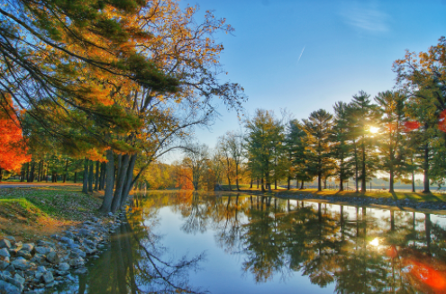


然而，我们说到这还不算完。因为还有一块webgl 只是需要知晓。

在我们实际开发项目的时候，为了提高性能，常常会将canvas 画布的透明度设置为false。

代码如下：

```js
/*画布*/
const canvas=document.querySelector('#canvas')
/*二维画笔*/
const ctx=canvas.getContext('2d',{alpha:false})
/*三维画笔*/
const gl=canvas.getContext('webgl',{alpha:false})
```

二维画布和三维画布对alpha 透明度的设置原理都是一样的。

如果是使用threejs的话，就在渲染器里配置：

```js
/*threejs*/
const render=new WebGLRenderer({
    canvas,
    alpha:false
})
```

其效果就是画布全黑，即使我们为canvas设置css背景色，那也看不见。

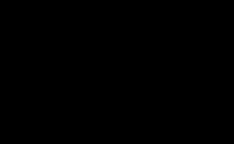


为了解决这个问题，也为以后的后处理，我们可以直接使用threejs绘制背景。


## 2-使用threejs绘制背景

在threejs 中给视图一个贴图即可：

```html
<div id="main">
    <canvas id="canvas"></canvas>
</div>

<script type="module">
import {ArrowHelper, AxesHelper, BoxBufferGeometry, BufferAttribute, BufferGeometry, DirectionalLight, DirectionalLightHelper, Geometry, MeshBasicMaterial, Mesh, MeshLambertMaterial, MeshPhongMaterial, Line, LineBasicMaterial, LineLoop, OrthographicCamera, PerspectiveCamera, PlaneBufferGeometry, Points, PointsMaterial, Scene, SpotLight, SpotLightHelper, TextureLoader, Vector3, WebGLRenderer, } from '../build/three.module.js'

/*画布*/
const canvas = document.querySelector('#canvas')
/*渲染器*/
const renderer = new WebGLRenderer({canvas,alpha:false})
/*相机*/
const camera = new PerspectiveCamera(45, 1, 0.01, 10)
camera.position.set(0,0,1)
/*场景*/
const scene = new Scene()
/*纹理加载器*/
const loader = new TextureLoader()
/*纹理背景*/
const bgTexture = loader.load('../images/01.jpg',render);
/*设置场景背景*/
scene.background = bgTexture

/*根据容器尺寸，重置canvas 尺寸和相机的像素比*/
const resize=Resize('#main',renderer,camera)
resize()
/*响应窗口变化*/
window.onresize=function () {
    resize()
    render()
};
/*设置渲染器尺寸*/
function Resize(id,renderer,camera){
    const wrapper=document.querySelector(id)
    return function(){
        const {clientWidth,clientHeight}=wrapper
        renderer.setSize(clientWidth, clientHeight)
        camera.aspect = clientWidth / clientHeight
        camera.updateProjectionMatrix()
    }
}
/*渲染方法*/
function render(){
    renderer.render(scene, camera);
}
</script>
```

TextureLoader 是一个纹理加载器。

loader.load() 方法会创建一个Texture 纹理对象。

scene.background 会设置场景的背景。

其内部原理就是绘制了一个具备特性材质的矩形，可产看源码里的WebGLBackground.js

```js
planeMesh = new Mesh(
    new PlaneBufferGeometry( 2, 2 ),
    new ShaderMaterial( {
        type: 'BackgroundMaterial',
        uniforms: cloneUniforms( ShaderLib.background.uniforms ),
        vertexShader: ShaderLib.background.vertexShader,
        fragmentShader: ShaderLib.background.fragmentShader,
        side: FrontSide,
        depthTest: false,
        depthWrite: false,
        fog: false
    } )
);
```

只是这样还有个问题，背景图会有拉伸。

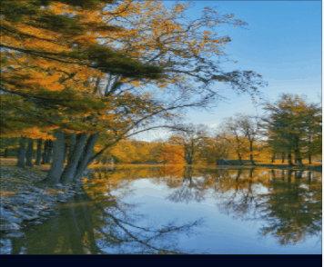


接下来我们要让图片大小和视口做适配。


## 3-纹理适配视口

首先我们要了解纹理坐标系的规则。

默认图片会以拉伸的方式充满画布，如下图：

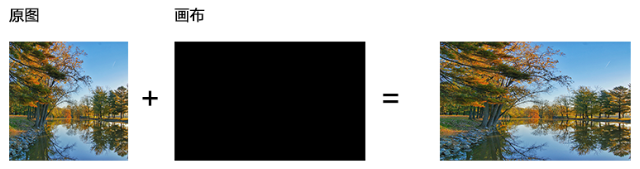

而我的理想状态是这样：让纹理等比缩放，充满画布。

这需要考虑两种情况：

- 图片的宽高比大于画布的宽高比时，图片等比缩放，充满画布时，左右必然会有一部分被隐藏。

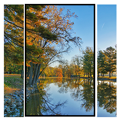

- 图片的宽高比小于画布的宽高比时，图片等比缩放，充满画布时，上下必然会有一部分被隐藏。

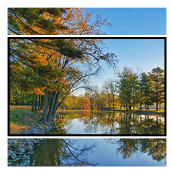


接下来咱们说一下具体的代码实现：

1.获取画布的宽高比

```js
const {clientWidth, clientHeight}=wrapper
const canvasAspect=clientWidth / clientHeight
```


2.获取图片的宽高比

```js
const {width,height}=bgTexture.image
const imageAspect=width/height
```


3.基于宽高比，判断图片是否比画布宽

```js
const aspect = imageAspect / canvasAspect;
```

如果aspect大于1，则图片比画布宽；否则，图片比画布窄。


4.让图片等比缩放充满画布。

```js
bgTexture.repeat.x = aspect > 1 ? 1 / aspect : 1;
bgTexture.repeat.y = aspect > 1 ? 1 : aspect;
```

图片是通过重复属性repeat控制纹理大小的，可用理解为要在当前画布的x、y方向里重复绘制多少个纹理。

我们分成两种情况考虑：

- 图片的宽高比大于画布的宽高比时：
  - 纹理在x方向上重复1/aspect个，这是一个小数值，1代表y方向的重复数，1/aspect是在让纹理在y方向不变的前提下，在x方向上做缩放，且让图片按照原本的宽高比显示。
  - 纹理在y方向上重复1个，即在y方向是充满画布

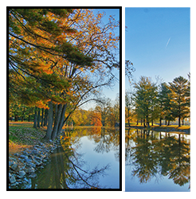

- 图片的宽高比小于画布的宽高比时：
  - 纹理在x方向上重复1个，即在x方向是充满画布
  - 纹理在y方向上重复1/aspect个，这是一个小数值，1代表x方向的重复数，1/aspect是在让纹理在x方向不变的前提下，在y方向上做缩放，且让图片按照原本的宽高比显示。

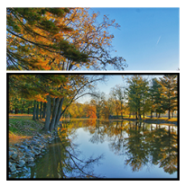


5.让图片居中

```js
bgTexture.offset.x = aspect > 1 ? (1 - 1 / aspect) / 2 : 0
bgTexture.offset.y = aspect > 1 ? 0 : (1 - aspect) / 2
```

图片用offset 控制位置，其位移的坐标分量是画布的宽、高。

- 图片的宽高比大于画布的宽高比时：
  - 图片在x方向上左移其多出画布的宽度的一半
  - 图片在y方向上保存不变


- 图片的宽高比小于画布的宽高比时：
  - 图片在x方向上保存不变
  - 图片在x方向上下移其多出画布的宽度的一半


整体代码：

```js
/*画布*/
const canvas = document.querySelector('#canvas')
/*渲染器*/
const renderer = new WebGLRenderer({canvas, alpha:false})

/*相机*/
const camera = new PerspectiveCamera(45,  1,  0.01,  10)
camera.position.set(0, 0, 1)

/*场景*/
const scene = new Scene()
/*纹理加载器*/
const loader = new TextureLoader()
/*纹理背景*/
const bgTexture = loader.load('../images/01.jpg', ()=>{
    resize()
    render()
});
/*设置场景背景*/
scene.background = bgTexture

/*根据容器尺寸，重置canvas 尺寸和相机的像素比*/
const resize=Resize('#main', renderer, camera,bgTexture)

/*响应窗口变化*/
window.onresize=function () {
    resize()
    render()
};

/*设置渲染器尺寸和相机像素比*/
function Resize(id, renderer, camera,bgTexture){
    const wrapper=document.querySelector(id)
    return function(){
        const {clientWidth, clientHeight}=wrapper
        const canvasAspect=clientWidth / clientHeight
        renderer.setSize(clientWidth,  clientHeight)

        camera.aspect = canvasAspect
        camera.updateProjectionMatrix()

        const {width,height}=bgTexture.image
        const imageAspect=width/height
        const aspect = imageAspect / canvasAspect
        bgTexture.repeat.x = aspect > 1 ? 1 / aspect : 1
        bgTexture.repeat.y = aspect > 1 ? 1 : aspect
        bgTexture.offset.x = aspect > 1 ? (1 - 1 / aspect) / 2 : 0
        bgTexture.offset.y = aspect > 1 ? 0 : (1 - aspect) / 2
    }
}

/*渲染方法*/
function render(){
    renderer.render(scene,  camera);
}
```


其实，多数情况下，在3d场景中，我们并想要静态背景，而是vr背景。


## 4-天空盒

### 4-1-天空盒的建立

天空盒就是一个盒子，在盒子的六个面贴上贴图，然后将相机放在盒子里。 如下图：


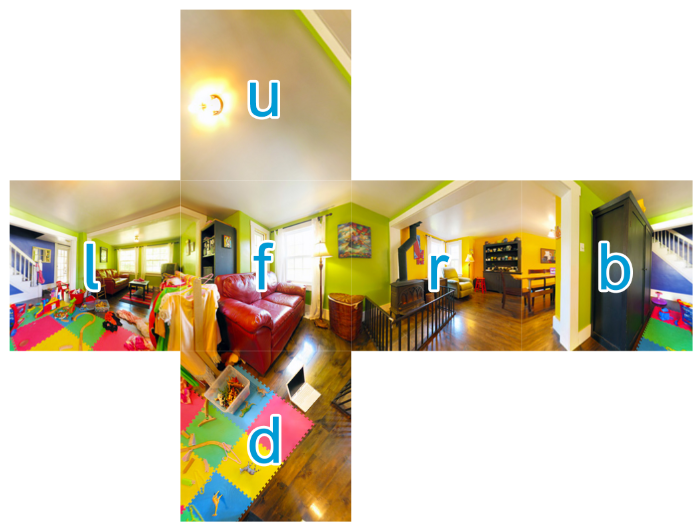


在threejs 里已经有了一个 CubeTexture 盒子贴图，所以我们只要用相应的图片建立CubeTexture 对象，然后赋值给  scene.background 即可。

接下来我们走一下代码。

1.为视图背景添加盒子贴图

```js
/*场景*/
const scene = new Scene()
const loader = new CubeTextureLoader();
const texture = loader.load([
    './images/map_r.jpg',
    './images/map_l.jpg',
    './images/map_u.jpg',
    './images/map_d.jpg',
    './images/map_f.jpg',
    './images/map_b.jpg',
],function(){
    resize()
    render();
});
/*设置场景背景*/
scene.background = texture
```

- CubeTextureLoader 盒子材质加载器
- loader.load(arr,fn) 方法里的第一个参数就是一个数组，这个数组里有6个图片，对应盒子的6个面，图片顺序是[右r，左l，上u，下d，前f，后b]


2.添加轨道控制器，这样就可以让场景转起来

```js
const orbitCtrl = new OrbitControls(camera, canvas);
orbitCtrl.addEventListener('change',function(){
    render();
})
```


### 4-2-天空盒材质的建立

这时候，大家可能会疑惑，我刚才构成天空盒那六张贴图是怎么来的。

制作这种贴图的的方法有很多，在这里我就跟大家分享我常用的一种。

1. 要有一个全景相机，天猫搜一下能找到很多。只要能拍出下面这样的全景图即可：

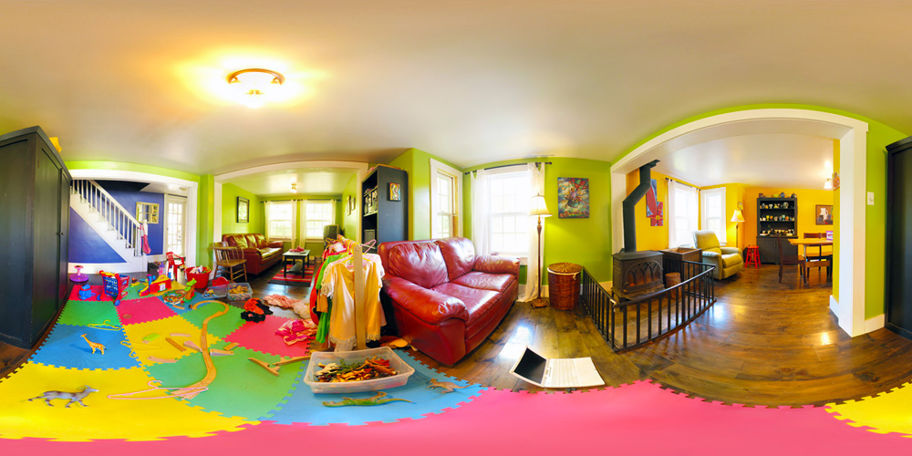

我们从网上也可以找到一些全景图片：[点击链接进入](https://hdrihaven.com/hdri/?h=sunny_vondelpark)。


2. 下载一个叫[flexify](http://www.flamingpear.com/free-trials.html)的Photoshop 滤镜。将其中的8bf文件复制粘贴到Photoshop 安装目录的Plug-ins 里即可

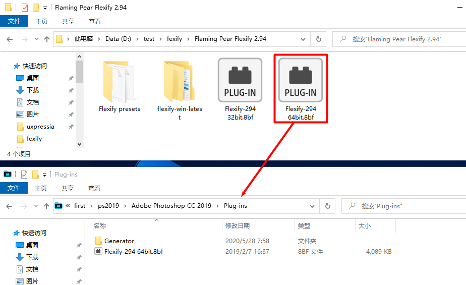


3.用Photoshop，打开全景图。在滤镜中点开flexify。

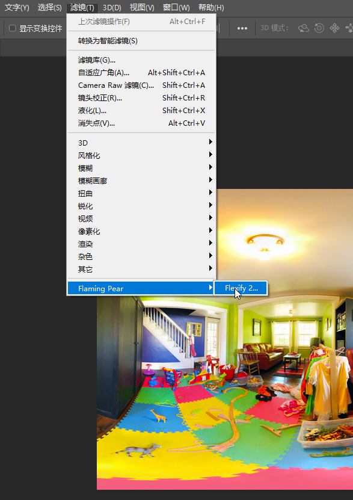


4. 直接点击面板左下角的按钮，就可以输出6个ps文件，我们再依次打开，输出图片即可。

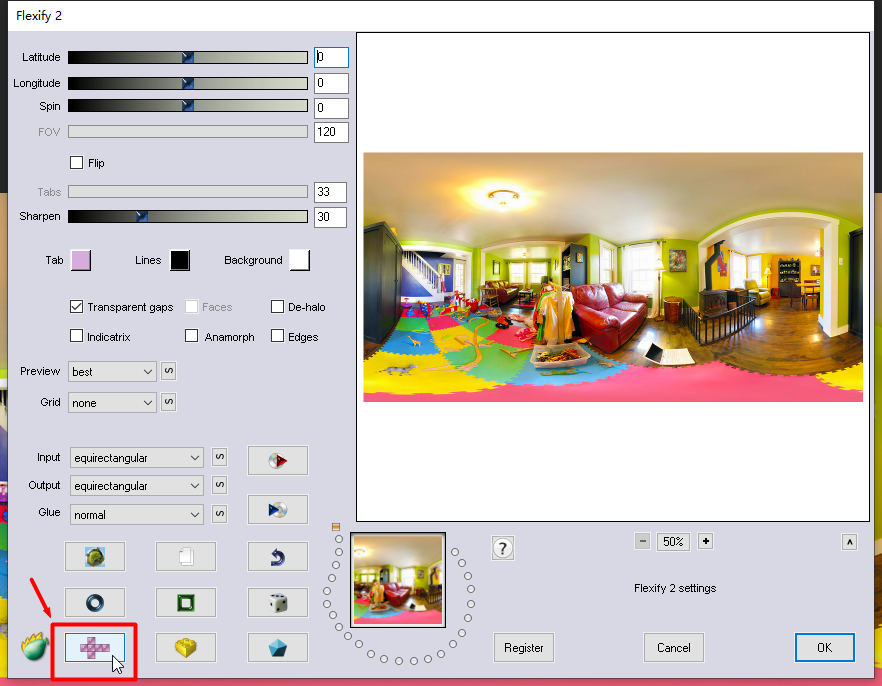


这么做，大家可能觉得有点麻烦。其实我们也可以直接在threejs 直接将全景图转盒子贴图。


### 4-3-在threejs 直接将全景图转盒子贴图

我可以利用WebGLCubeRenderTarget 对象将全景图转化为等角矩形贴图，这个贴图也叫盒子贴图，或cubemap。

我们可以直接将cubemap 赋给scene.background。

代码如下：

```js
/*场景*/
const scene = new Scene()
/*贴图加载器*/
const loader = new TextureLoader();
const texture = loader.load('./images/sunny.jpg',function(){
    /*立方体渲染目标*/
    const rt = new WebGLCubeRenderTarget(texture.image.height)
    /*将全景图转成等角矩形贴图*/
    rt.fromEquirectangularTexture(renderer, texture)
    /*设置场景背景*/
    scene.background = rt

    resize()
    render()
});
```

- WebGLCubeRenderTarget(size) 立方体渲染目标
  - szie 立方体尺寸，这个尺寸一般就是贴图的高度。
- fromEquirectangularTexture(renderer, texture) 将全景图转成等角矩形贴图
  - renderer 渲染器
  - texture 贴图


关于VR 全景我就说到这，然而这距离项目落地，还远远不够。

比如产品跟你说，我要给你卧室的门做个标记，点击这个标记，可以进入卧室。

这就是我们下一篇的内容


