## 前言

在用echarts 绘制图表的时候，我们可能会想要绘制这样的一种图：

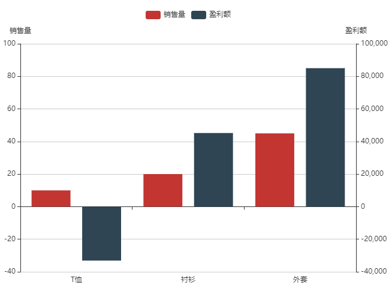


在这个图里展示了T恤、衬衫、外套的销售量和盈利额。

在图中我们不难看出T恤卖赔了。至于原因嘛，那可能是赔本甩卖了。

我们这里说的多坐标轴就是两个y轴，左侧y轴是销售量，右侧y轴是盈利额。

至于为什么是两个y轴，是因为两个系列的极值差距太大了。

上图是一个理想的效果，若直接把数据交给echarts 去显示的话，会比较乱，如下图：

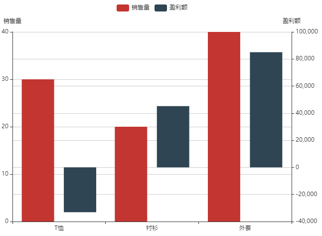


接下来咱们就说一下如何优雅的绘制多坐标轴。


## 一，统一行高

我们先不考虑负数，给左右两个y 轴相同的行数。让其看起来不是太乱，如下图：

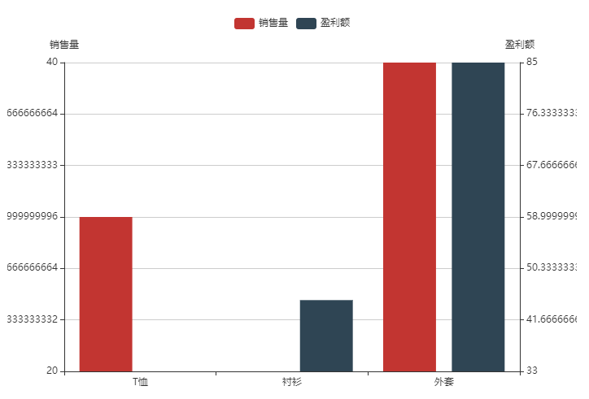

1.建立不带负数的模拟数据。

```js
/*图表数据
* dataA 销售量数据
* dataB 盈利额数据
* */
const dataA=[30,20,40];
const dataB=[33,45,85];
```


2.期望将两个y轴统一为多少行。

```js
//行数
const rowNum=6;
```


3.获取核心属性，即作用两个y轴的极值和行高。

```js
/*核心属性
* minL 左侧轴的极小值
* maxL 左侧轴的极大值
* hL 左侧轴的行高
* minR 右侧轴的极小值
* maxR 右侧轴的极大值
* hR 右侧轴的行高
* */
let [minL,minR]=[
    Math.min(...dataA),
    Math.min(...dataB),
];
let [maxL,maxR]=[
    Math.max(...dataA),
    Math.max(...dataB),
]
let hL=(maxL-minL)/rowNum;
let hR=(maxR-minR)/rowNum;

```


4.将极值和行高交给echarts 配置项里的两个y轴，绘制图表。

```js
/*初始化echarts实例*/
const myChart = echarts.init(document.getElementById('main'));

/*指定图表的配置项和数据*/
const option = {
    /*图例*/
    legend:{},
    /*提示*/
    tooltip:{},
    /*x 轴*/
    xAxis:{
        data:['T恤','衬衫','外套']
    },

    /*y 轴
    *   name 坐标轴名称
    *   min 刻度最小值
    *   max 刻度最大值
    * */
    yAxis:[
        {name:'销售量',type:'value',min:minL,max:maxL,interval:hL},
        {name:'盈利额',type:'value',min:minR,max:maxR,interval:hR},
    ],

    /*系列列表 series
    *   yAxisIndex 当前系列对应的y 轴的索引位置
    * */
    series:[
        {
            name:'销售量',
            type:'bar',
            data:dataA,
            yAxisIndex:0
        },
        {
            name:'盈利额',
            type:'bar',
            data:dataB,
            yAxisIndex:1
        }
    ]
};

// 基于配置项显示图表。
myChart.setOption(option);
```


效果就是咱们刚才看过的图：


当前效果里还存在两个问题：

- 两个y轴的起始基点不统一
- 行高不是整数

接下来咱们就一一解决一下。


## 二，统一基点

在获取两个轴的极小值的时候，将极小值取到0

```js
let [minL,minR]=[
    Math.min(0,...dataA),
    Math.min(0,...dataB),
];
```

效果如下：

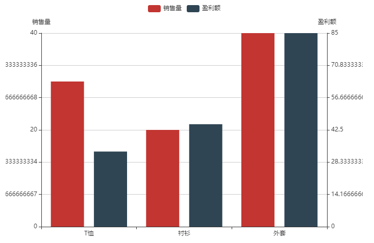


## 三，行高取整

1.在基于极值和行数算出行高后，对行高进行上舍取整。

```js
/*行高上舍取整*/
hL=Math.ceil(hL);
hR=Math.ceil(hR);
```


2.行高发生了改变后，极大值也要进行更新。

```js
/*基于行高更新极大值*/
[maxL,maxR]=[
    hL*rowNum,
    hR*rowNum,
]
```


效果如下：

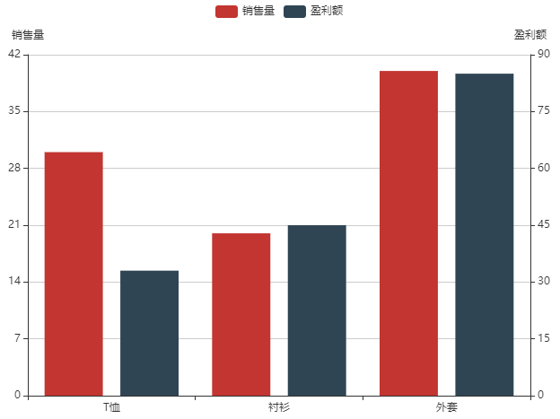


当前的行高虽然已经是整数了，但我们还可以再做进一步优化。


3.整数优化

我可以在行高的中间加个小数点，对其上舍取整后，再用0还原原本的位数。

如行高是123456，那就可以这样取整：123456 > 123.456 > 124 > 124000

代码实现如下：

```js
/*行高切一半，上舍取整*/
hL=parseInt2(hL);
hR=parseInt2(hR);

function parseInt2(size){
    const len=size.toString().length;
    const index=Math.ceil(len/2);
    const power=Math.pow(10,index);
    const flNum=size/power;
    const intNum=Math.ceil(flNum);
    const c=intNum*power;
    return Math.max(c,1);
}
```

效果如下：

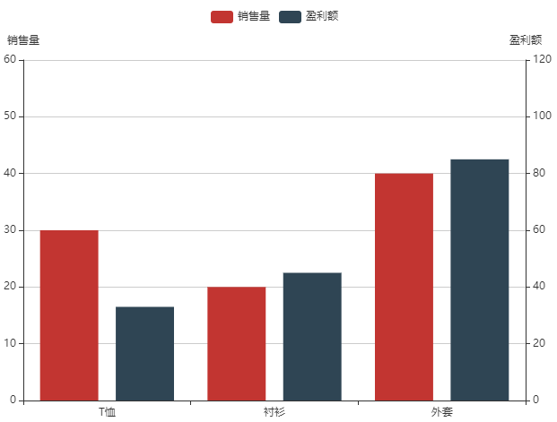

整数没问题，可是最顶上还多了一行，所以咱们在更新了行高之后，还得再更新一下行数。


4.更新行数

```js 
rowNum=Math.max(
    Math.ceil(maxL/hL),
    Math.ceil(maxR/hR),
)
```

效果如下：

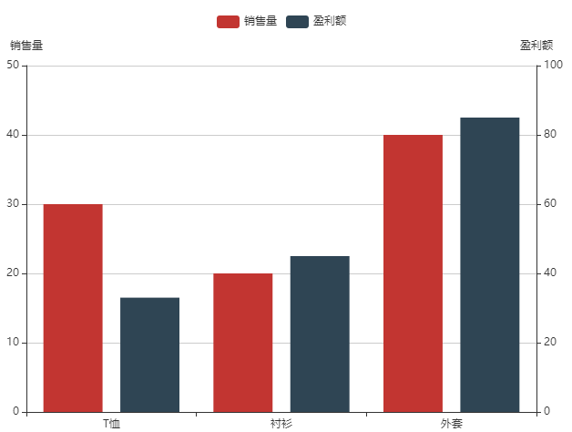


关于不考虑负数的情况下，优雅的绘制多坐标轴的方法就是这样。

接下来，咱们会说一下有负数的情况。


## 四，负数的坑

1.把T恤的盈利额变成负数。

```js
const dataB=[-33,45,85];
```

看一下效果：

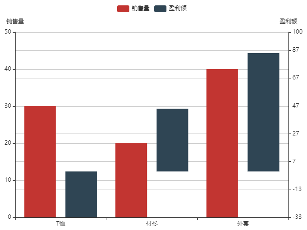


效果又乱了，仿佛瞬间回到解放前。

其实，我们接下来见招拆招就可以了。

先分析一下问题和解决思路：

- y轴基点不统一，应该把基点统一在x轴上，也就是y轴刻度为0的位置。
- 行数和行高不统一，左侧5行，右侧7行，需统一一下。

接下来，咱们就逐一解决上面的问题。


## 五，统一基点

在这里先走一个思路。

要统一基点，我们就要将两个系列的极值比找平，也就是让左右两个y轴的极小值比极大值相等。

用简单数据举例子：

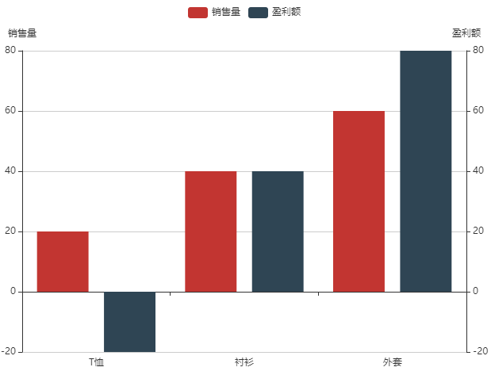

```js
const dataA=[20,40,60];
const dataB=[-20,40,80];
```

从上面的数据中，很容易看出：

- 销售量的极值是[0,60]
- 盈利额的极值是[-20,80]

从图中我们可以看出：

- 销售量极小值不足，所以得基于盈利额中极小值在极大值用的占比，把销售量的极小值补上。

我们可以计算一下两个系列的极值比：

- 销售量的极值比是 0/60=0
- 盈利额的极值比是 -20/80=-1/4

因为极小值小于等于0，所以极值比越小，说明极小值所占的比重就越大。

所以我们记下来找到极值比最大的那个系列，基于另一个系列的极值比，把它的极小值的量不补足即可。

所以销售量的极小值等于 60*(-1/4)=-15

至于上图中销售量的极值为什么不是[-15,60]，而是[-20,80]，是因为我们基于当前极值对行高上舍取整后，又更新了一遍极值。

接下来，咱们说一下代码实现。

1.计算极值比

```js
//极小值比极大值
const ratL=minL/maxL;
const ratR=minR/maxR;
```

2.找平极小值

```js
if(ratL>ratR){
    minL=maxL*ratR;
}else{
    minR=maxR*ratL;
}
```

效果如下：

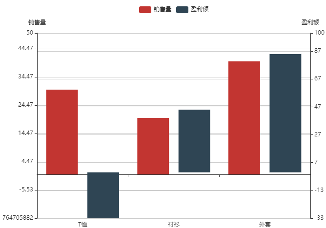


从上图可以看出，x轴基线已经统一。

但刻度线比较乱，x轴和刻度线还不吻合。

接下来咱们再统一一下行数即可。


## 五，统一行数

首先咱们还是先走一个思路。

行数要基于x轴分成上下两部分。

左右两侧的y轴在x轴上面的行数要相同，且为整数。

左右两侧的y轴在x轴下面的行数要相同，且为整数。

接下来，咱们说一下代码实现。

1.将左右两侧的y轴的极大值除以行高，取最大的那个比值，然后上舍取整。

```js
const topRowNum=Math.ceil(
    Math.max(maxL/hL,maxR/hR)
);
```


2.将左右两侧的y轴的极小值除以行高，取最小的那个比值，然后下舍取整。

```js
const bottomRowNum=Math.floor(
    Math.min(minL/hL,minR/hR)
);
```


3.基于x轴上下两部分的行数，更新极值。

```js
maxL=hL*topRowNum;
maxR=hR*topRowNum;
minL=hL*bottomRowNum;
minR=hR*bottomRowNum;
```


4.整体代码

```js
<!DOCTYPE html>
<html lang="en">
<head>
    <meta charset="UTF-8">
    <title>多坐标轴</title>
    <style>
        #main{
            margin: 20px;
            width: 700px;
            height: 500px;
        }
    </style>
</head>
<body>
<!--建立dom 容器-->
<div id="main"></div>
<!--引入echarts-->
<script src="https://lib.baomitu.com/echarts/4.7.0/echarts.min.js"></script>
<script>
    /*图表数据*/
    // const dataA=[30,20,40];
    // const dataB=[-33,45,85];
    // const dataB=[-33116,45221,85033];
    const dataA=[2,4,6];
    const dataB=[-2,4,8];


    //行数
    // const rowNum=6;
    let rowNum=6;

    /*核心属性
    * minL 左侧轴的极小值
    * maxL 左侧轴的极大值
    * hL 左侧轴的行高
    * minR 右侧轴的极小值
    * maxR 右侧轴的极大值
    * hR 右侧轴的行高
    * */
    let [minL,minR]=[
        Math.min(0,...dataA),
        Math.min(0,...dataB),
    ];
    let [maxL,maxR]=[
        Math.max(...dataA),
        Math.max(...dataB),
    ]

    /*找平两个y轴的极值比*/
    //极小值比极大值
    const ratL=minL/maxL;
    const ratR=minR/maxR;
    //找到极值比最大的那个系列，基于另一个系列的极值比，把它的极小值的量不补足
    if(ratL>ratR){
        minL=maxL*ratR;
    }else{
        minR=maxR*ratL;
    }

    /*行高上舍取整*/
    let hL=(maxL-minL)/rowNum;
    let hR=(maxR-minR)/rowNum;
    hL=Math.ceil(hL);
    hR=Math.ceil(hR);

    /*行高切一半，上舍取整*/
    hL=parseInt2(hL);
    hR=parseInt2(hR);
    console.log(hL,hR);

    function parseInt2(size){
        const len=size.toString().length;
        let type=size>10?'ceil':'floor';
        const index=Math[type](len/2);
        const power=Math.pow(10,index);
        const flNum=size/power;
        const intNum=Math.ceil(flNum);
        const c=intNum*power;
        return Math.max(c,1);
    }

    /*更新行数*/
    /*rowNum=Math.max(
        Math.ceil(maxL/hL),
        Math.ceil(maxR/hR),
    );*/

    /*计算x轴上面和下面的行数，各区左右最多的行数*/
    const topRowNum=Math.ceil(
        Math.max(maxL/hL,maxR/hR)
    );
    const bottomRowNum=Math.floor(
        Math.min(minL/hL,minR/hR)
    );

    /*基于行高更新极大值*/
    /*[maxL,maxR]=[
        hL*rowNum,
        hR*rowNum,
    ];*/

    /*重新计算极值*/
    maxL=hL*topRowNum;
    maxR=hR*topRowNum;
    minL=hL*bottomRowNum;
    minR=hR*bottomRowNum;


    /*初始化echarts实例*/
    const myChart = echarts.init(document.getElementById('main'));

    /*指定图表的配置项和数据*/
    const option = {
        /*图例*/
        legend:{},
        /*提示*/
        tooltip:{},
        /*x 轴*/
        xAxis:{
            data:['T恤','衬衫','外套']
        },

        /*y 轴
        *   name 坐标轴名称
        *   min 刻度最小值
        *   max 刻度最大值
        * */
        yAxis:[
            {name:'销售量',type:'value',min:minL,max:maxL,interval:hL},
            {name:'盈利额',type:'value',min:minR,max:maxR,interval:hR},
        ],

        /*系列列表 series
        *   yAxisIndex 当前系列对应的y 轴的索引位置
        * */
        series:[
            {
                name:'销售量',
                type:'bar',
                data:dataA,
                yAxisIndex:0
            },
            {
                name:'盈利额',
                type:'bar',
                data:dataB,
                yAxisIndex:1
            }
        ]
    };

    // 基于配置项显示图表。
    myChart.setOption(option);
</script>
</body>
</html>

```


效果如下：

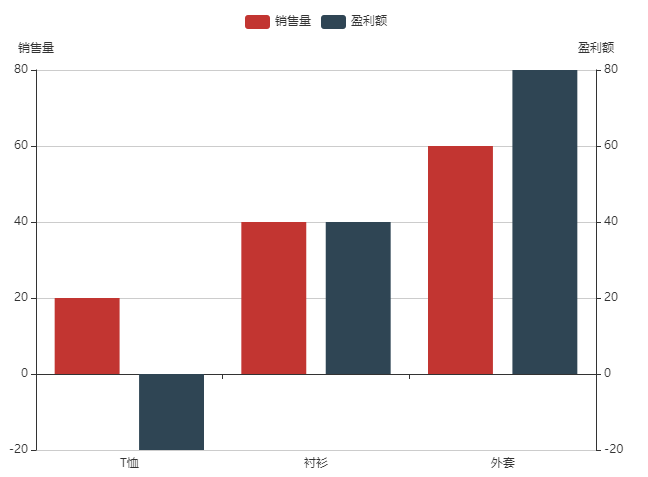


多测试几组数据：


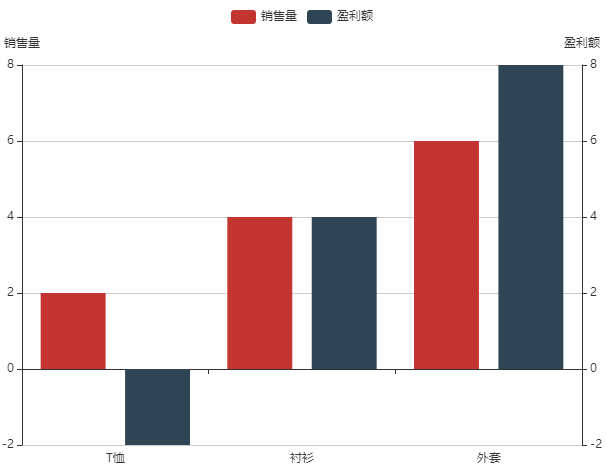


哈哈，应该没问题了，但也不能绝对保证没问题。

大家也帮忙试试有木有坑，要是有坑，微信联系。

文章下方有我微信。

[源码地址](https://github.com/buglas/interview-01/tree/master/test/09-echarts)