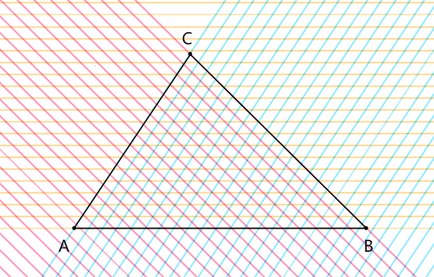
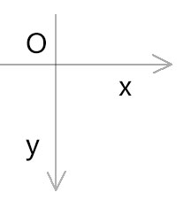
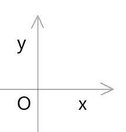

## canvas 中的绘图方向

回顾canvas 中的arc(x,y,r,begin,end,false) 圆弧方法，arc() 方法中的最后一个参数就是绘图的方向，这方向默认是false，是非逆时针的意思，即其默认是顺时针绘制图形的。

那我们由此做一下思考，canvas 是不是在推荐我们用顺时针的方向绘图呢？就比如使用moveTo(x,y) > lineTo(x,y) > lineTo(x,y) 绘制多边形时，是不是也要顺时针呢？如果是，那又是为什么？

首先，如果canvas 推荐我们用顺时针的方法绘图，那它就是在统一一种规则，那这种规则的统一有什么好处呢？这个答案，就在我们学过的高数里。

在高数里，有一块知识是讲二元一次不等式(组)与简单的线性规划问题。先回顾一下其中的基本定义：

1. 二元一次不等式的一般形式：

   Ax+By+C<0

   Ax+By+C>0

2. 不等式的图像

   已知直线l：Ax+By+C=0

   开半平面：直线l 将坐标平面分成两部分，每一部分就是一个开半平面。

   闭半平面：开半平面与直线l 的并集。

   不等式表示的区域：以不等式的解(x,y) 为坐标构成的集合，也叫不等式的图像。

3. 直线两侧的点集与直线的关系

   将开半平面中的坐标点(x,y)代入Ax+By+C 中，其值都具有相同的符号，即要么为正，要么为负。

   两个开半平面对应的值的符号互为相反数。

   两个开板平面中的坐标点对应的Ax+By+C的值的符号相反

由上可知，我们可以通过Ax+By+C 的值是否大于0 来判断一个坐标点在直线的哪一侧。

那么，我们能不能判断坐标点在向量的哪一侧呢？这个答案是肯定的，因为向量的基线就是直线。

比如，已知向量a(2,3)，则其基线就是3x-2y=0

那么，我们说的这一堆和绘图的顺序有什么关系呢？您且细听分说：

若我们统一规则顺时针绘图规则，绘制凸多变形。

那么这个图形的每条边里，不仅长度已知，其方向也是已知的，那这样的边就可以视之为向量。

若有一人随此边前行，则其左手为阳为正，右手为阴为负。

即：多边形每条边在多边形一侧的开半图像的符号皆为负，反之则为正。

根据二元一次不等式的性质可知，凸多边形中的点集便是其每条边所对应的符号为负开半平面的并集。

因此，一个坐标点若在凸多边形所有边的负开半平面中，那这个坐标点就在凸多边形中。如下图：

若凸多边形是逆时针绘制的，则其边在凸多边形一侧的符号为正。

由上可知，统一了绘图方向，可以更好的判断坐标点和多边形中每条边对应的不等式图像的关系，从而判断一个点是否在凸多边形中。

以上方法只适用于凸多边形，若凸多边形有凹有凸，则无法统一获取开半平面的并集。

> 以后我们在判断一个点位是否在多边形中时，若不知道这个多边形的凹凸，那就把这个多边形变成多个三角形，然后再用二元一次不等式判断坐标点是否在三角形中。
>

至于我们为什么在canvas 中将绘图的方向统一为顺时针，而不是逆时针，这是根据更底层的一个规则来的。接下来，咱们根据webgl 里的绘图方向归纳一下这个更底层的规则。

## webgl 中的绘图方向

首先，我们要知道，webgl 里的绘图方向是逆时针的，这和上面所说的canvas 2d是不一样的，这是为什么呢？

我们在考虑这个问题的时候，要在脑海里脑补出两张画布，这两张画布不是铺在画板上的，而是铺在电脑屏幕上的，它们都是平的、矩形的，因此他们的坐标系就是二维直角坐标系。

那说了这么多，这两张画布有什么不一样呢？

这两张画布的坐标基底和y 轴方向不一样。

因为咱们这里是说绘图方向的，和坐标基底没关系，所以咱们就重点来说y 轴方向。

y 轴朝下的画布，是canvas 2d画布，它是用于绘制二维图形的，它对应的画笔就是canvas.getContext('2d')。如：

y 轴朝上的画布，是webgl画布，它是用于绘制三维图形的，它对应的画笔就是canvas.getContext('webgl')。如：

这里要注意一下，虽然webgl 可以用三维算法绘制三维图形，但其最终还是要把三维的点位映射到二维的canvas 画布上的，这就是webgl 画布的坐标系是二维坐标系的原因。

由上可知，canvas和webgl 的绘图方向具有同一个特性：

以直角坐标系里的第一象限为例，以x轴的正方向为起始弧度，向着y 轴的正方向绘图。

在canvas 2d画布的坐标系中，这种绘图的方向是顺时针。

在webgl 画布的坐标系中，这种绘图的方向是逆时针。

综上所述，坐标不同，其势不同。

以时针论势并不严谨，应以轴论势。

x 轴正半轴向y轴正半轴旋转的方向是为顺势，反之为逆势。

canvas 和webgl 皆以顺势绘图。

