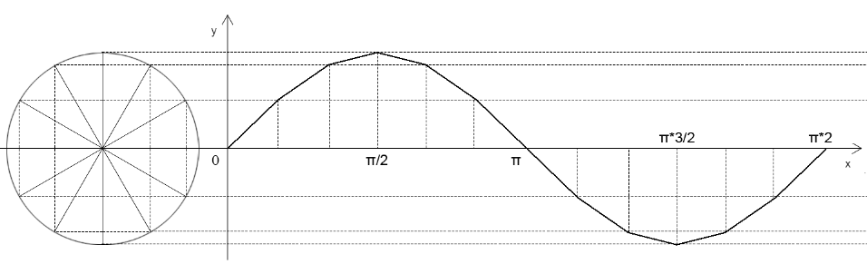
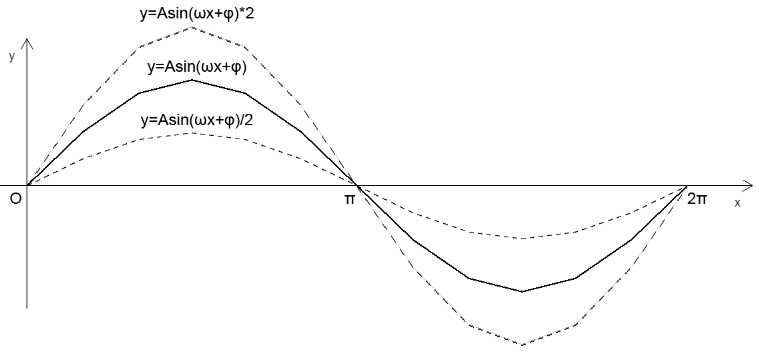
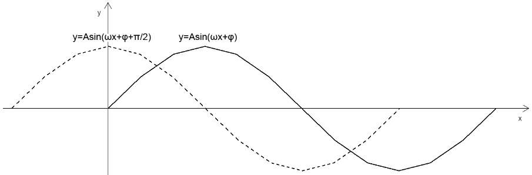
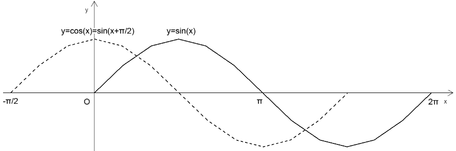
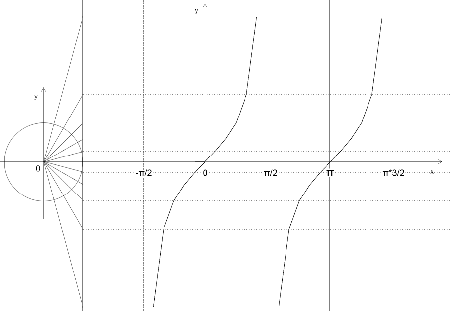
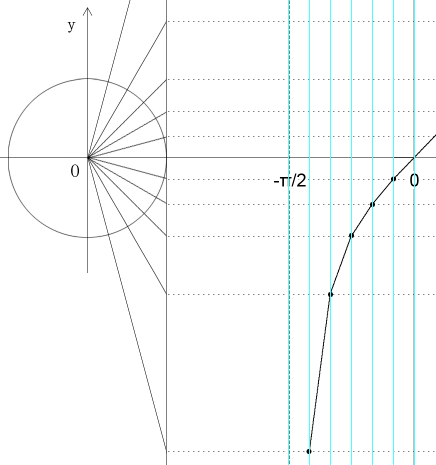

## 第一章 正弦函数的图像与性质   

### 1-正弦函数的图像  



正弦曲线：

```
y=sin(x)，(x∈R)
```

因为：

```
sin(x+k*2π)=sin(x)，(k∈Z)
```

所以：

```
y=sin(x)，x∈[0,2π] 
```

就可以确定正弦函数的图像形状。

我们在绘制正弦函数的图像时，可以用五点法绘图。

五点法：基于正弦曲线5个关键点作图的方法。

正弦曲线的5个关键点是：0、π/2、π、π*3/2、2π


### 2-正弦函数的性质

1.正弦函数的值域是：|sin(x)|≤1，即[-1,1]

- 正弦函数最大值=1，其定义域为x=2kπ+π/2

- 正弦函数最小值=-1，其定义域为x=2kπ-π/2


2.周期性

由诱导公式 sin(x+2kπ)=sin(x) ，(k∈Z) 得：

正弦曲线中的自变量x 每增减一个2π 的整数倍，其因变量y 就会重复出现

因为：正弦函数的定义域是实数

所以：正弦曲线是连续不断无限延伸的

以上的性质就是三角函数的周期性

周期函数的定义：

```js
f(x±T)=f(x)，T≠0
```

- T：函数的周期

- 最小正周期：周期函数的所有正周期中最小的数


注：在高数中所说的周期如果不加特殊说明，都是指最小正周期


3.奇偶性

由诱导公式sin(-x)=-sin(x) 得：

- 正弦函数是奇函数
- 正弦曲线基于原点对称


4.单调性

正弦函数中增函数所在的区间：[-π/2+2kπ,π/2+2kπ] (k∈Z)

正弦函数中减函数所在的区间：[π/2+2kπ,π*3/2+2kπ] (k∈Z)


### 3-正弦型函数 y=Asin(ωx+φ)   

1.正弦型函数概念分析


在上图中：

- 圆O半径为A
- 点OP的旋转速度为ω/秒
- 点P0的初始位置是点P1(x1,y1)
- ∠xOP1=φ
- 当点P1 围绕圆心旋转t 秒后，旋转到点P2(x2,y2)的位置
- 点P1旋转的量就是ω\*t
- 点P2基于x 正半轴的弧度就是∠xOP1=φ+ω\*t

由正弦函数的定义y=Asin(φ+ω*t) 可得：

- 点P1 的转动周期T

  T=周长/速度=2π/ω (秒)

- 点P1下一秒转动的周数，也就是点P1 转动的频率f：

  f=1/T=ω/2π

通过上例，我们可以找到两个概念：

- 初相：起点基于x 轴正半轴的弧度
- 正弦型函数：像y=Asin(ωx+φ) 一样的函数


2.正弦型函数的图像性质 y=Asin(ωx+φ)

- A 影响的是正弦曲线的波动幅度   




- φ 影响的是正弦曲线的平移   

  




- ω 影响的是正弦曲线的周期，ω 越大，周期越小   


> 扩展

在P1点的旋转量较小的前提小，我们可以让A值在P1点每次运动的时候变小一点点，从而实现弹性衰减效果。


上面的曲线便可以作为弹性动画的插值算法，实现以下效果：


## 第二章 余弦函数、正切函数的图像与性质   

### 1-余弦函数的图像



因为：

```js 
y=cos(x)=sin(x+π/2)，x∈R
```

所以：余弦曲线的图像实际上就是正弦曲线平移了π/2


### 2-余弦函数的重要性质：

- 定义域：实数

- 值域：[-1,1]

- 当自变量x=2kπ，(k∈Z) 时，余弦函数取最大值1

- 当自变量x=2kπ+π，(k∈Z) 时，余弦函数取最小值-1

- 周期：2π

- 奇偶性：偶函数，因为cos(-x)=cos(x)

- 单调性：
  - 减函数：自变量x 在闭区间[2kπ,(2k+1)π] (k∈Z) 中，从1到-1递减
  - 増函数：自变量x 在闭区间[(2k+1)π,2(2k+1)π] (k∈Z) 中，从-1到1递増


### 3-正切函数的图像   





由正切函数

```js
tan(x+π)=tan(x)，x≠kπ+π/2，k∈Z
```

可得正切函数的性质：

- 定义域：{x|x≠kπ+π/2，k∈Z}

- 值域：R

- 周期：π

- 单调性：增函数

  

> 扩展

上面的图我是以点连线的方式画出来的。

上图中的射线从-π/2 到π/2 将一个半圆分成了12 份。

所以，我在其右侧的x轴上也将-π/2 到π/2 的线段分成了12 份。

接下，找到每个角度对应的交点，连点成线即可。

如下图是-π/2 到0 的部分，共分成了六段：




## 第三章 已知三角函数值求角   

我们通过一个角，可以求出三角函数值。

我们通过三角函数值，也可以求出一个角。

然则，此角可能非彼角。

至于具体为何，您且细听分说。


### 1-已知正弦值求角

已知正弦值求角的方法叫反正弦。

其写法是：

```js
x=arcsin(y)
```

因为:

```js
sin(x)=sin(π-x)
```

所以：

我们根据一个正弦值，在定义域[0,2π]中，可以得到两个角，即x和π-x

而在js 中，反正弦的值只有一个，是值域在[-π/2,π/2] 的角。

如下例：

```
Math.asin(-1) // -1.5707963267948966
Math.asin(0)  //  0
Math.asin(1)  //  1.5707963267948966
```


### 2-已知余弦值求角   

已知余弦值求角的方法叫反余弦。

其写法是：

```js
x=arccos(y)
```

因为:

```js
cos(x)=cos(-x)
```

所以：

我们根据一个余弦值，在定义域[0,2π]中，可以得到两个角，即x和-x

而在js 中，反余弦的值只有一个，是值域在[0,π] 的角。

如下例：

```
Math.acos(1) // 0
Math.asin(0)  //  1.5707963267948966
Math.asin(-1)  // 3.141592653589793
```


### 3-已知正切值求角   

已知正切值求角的方法叫反正切。

其写法是：

```js
x=arctan(y)
```

因为:

```js
tan(x)=tan(x+π)
```

所以：

我们根据一个正切值，在定义域[0,2π]中，可以得到两个角，即x和x+π

而在js 中，反正切的值只有一个，是值域在[-π/2,π/2] 的角。

如下例：

```js
Math.atan(-Infinity) // -1.5707963267948966
Math.atan(-1)  //  -0.7853981633974483
Math.atan(0)  // 0
Math.atan(1)  //  0.7853981633974483
Math.atan(Infinity) // 1.5707963267948966
```


> 扩展

在js 方法里，还有个反正切的第二套方法，叫Math.atan2(y,x)。

Math.atan2(y,x) 里的y、x 也可以理解为用来求正切值的对边和临边。

只不过这里的y、x 不再是单纯量的概念，它还有方向。

有量、有方向就是向量。

因此，Math.atan2 是基于向量获取弧度的。

向量中包含的信息比正切值更多。

向量可以指明我们想要的弧度是直角坐标系中哪个象限的。

如下例：

```js
Math.atan2(0,1)  //0
Math.atan2(1,1)  //0.7853981633974483
Math.atan2(1,0)  //1.5707963267948966
Math.atan2(1,-1) //2.356194490192345
Math.atan2(0,-1) //3.141592653589793
Math.atan2(-1,-1)//-2.356194490192345
Math.atan2(-1,0) //-1.5707963267948966
Math.atan2(-1,1) //-0.7853981633974483
Math.atan2(0,1)  //0
```
