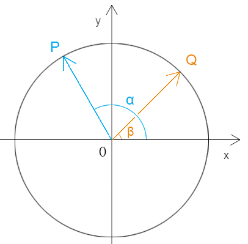

## 第一章 两角和与差的恒等变换

### 1- 两角和与差的余弦  

两角之和的余弦定理：

```js
cos(α+β)=cosα*cosβ-sinα*sinβ
```

两角之差的余弦定理：

```js
cos(α-β)=cosα*cosβ+sinα*sinβ
```

接下来，咱们证明一下上面的两个定理：




已知：

- 圆O 是单位圆
- ∠xOP=α
- ∠xOQ=β

求证：两角和与差的余弦定理

证：

由单位圆得：

```js
|OP|=|OQ|=1
```

由三角函数得：

```js
向量 OP=(cosα,sinα)
向量 OQ=(cosβ,sinβ)
```

由向量OP乘以向量OQ 的坐标运算得：

```
OP*OQ=(cosα,sinα)*(cosβ,sinβ)
     =cosα*cosβ+sinα*sinβ
```

由向量OP乘以向量OQ 的內积公式得：

```
OP*OQ=|OP|*|OQ|*cos(α-β)
	 =cos(α-β)
```

所以：

```
cos(α-β)=cosα*cosβ+sinα*sinβ
```


同理，可求两角之和的余弦定理。

因为：

```js
cos(α +β)=cos(α-(-β))
cos(-α)=cos(α)
sin(-α)=-sin(α)
```

所以：

```js
cos(α-(-β))=cosα*cos(-β)+sinα*sin(-β)
cos(α +β)=cosα*cosβ-sinα*sinβ
```


### 2-两角和与差的正弦 

两角之和的正弦定理：

```js
sin(α+β)=sinα*cosβ+cosα*sinβ
```

两角之差的正弦定理：

```js
sin(α-β)=sinα*cosβ-cosα*sinβ
```

接下来，咱们先证明一下两角之和的正弦定理。

由三角函数和π/2 的关系得：   

```js
sin(α+β)=cos(-(α+β)+π/2)
        =cos((-α+π/2)-β)
        =cos((-α+π/2)-β)
        =cos(-α+π/2)*cosβ+sin(-α+π/2)*sinβ
        =sinα*cosβ+cosα*sinβ   
```

知道了两角之和的正弦定理，那就可以顺势推出两角之差的正弦定理：

```
sin(α-β)=sin(α+(-β))
        =sinα*cosβ-cosα*sinβ   
```


### 3-两角和与差的正切   

两角之和的正切定理：

```js
tan(α+β)=(tanα+tanβ)/(1-tanα*tanβ)
```

两角之差的正切定理：

```js
tan(α-β)=(tanα-tanβ)/(1+tanα*tanβ)
```

接下来，咱们先证明一下两角之和的正切定理。

利用三角函数将正切分解为正弦和余弦：

```js
tan(α+β)=sin(α+β)/cos(α+β)
```

利用两角之和的正弦和余弦定理将两角分解出来：

```js
sin(α+β)/cos(α+β)=(sinα*cosβ+cosα*sinβ)/(cosα*cosβ-sinα*sinβ)
```

尝试将分解出来的两角的正弦和余弦再转成正切。

将上式中，等号两侧的分子、分母都除以cosα*cosβ，得：

```js
(sinα*cosβ)/(cosα*cosβ)=sinα/cosα=tanα
(cosα*sinβ)/(cosα*cosβ)=sinβ/cosβ=tanβ
(cosα*cosβ)/(cosα*cosβ)=1
(sinα*sinβ)/(cosα*cosβ)=(sinα/cosα)*(sinβ/cosβ)=tanα*tanβ
```

再将上式中等号右侧的结果整合在一起，得：

```js
tan(α+β)=(tanα+tanβ)/(1-tanα*tanβ)
```

知道了两角之和的正切定理，那就可以顺势推出两角之差的正切定理：

```js
tan(α-β)=(tanα+tan(-β))/(1-tanα*tan(-β))
		=(tanα-tanβ)/(1+tanα*tanβ)
```


## 第二章 倍角公式和半角公式

### 1-余弦倍角公式

```js
cos2α=2*cos²α-1
cos2α=1-2*sin²α
```

证明：

之前我们已经论证了两角之和的余弦定理：

```js
cos(α+β)=cosα*cosβ-sinα*sinβ
```

将上式的β变成α可得公式1：

```js
cos2α=cosα*cosα-sinα*sinα
```

接下来统一一下等号右侧的变量。

由单位圆的三角函数关系可知：

```js
1=cosα*cosα+sinα*sinα
```

所以：

```js
cosα*cosα=1-sinα*sinα
sinα*sinα=1-cosα*cosα
```

将上面的两式分别代入公式1中。

约掉余弦可得：

```js
cos2α=1-sinα*sinα-sinα*sinα
	 =1-2*sin²α
```

约掉正弦可得：

```js
cos2α=cosα*cosα-1+cosα*cosα
	 =2*cos²α-1
```


### 2-正弦倍角公式

```js
sin(α+α)=2*sinα*cosα
```

证明：

之前我们已经论证了两角之和的正弦定理：

```js
sin(α+β)=sinα*cosβ+cosα*sinβ
```

将上式的β变成α可得：

```js
cos2α=sinα*cosα+cosα*sinα
	 =2*sinα*cosα
```


### 3-正切倍角公式

```js
tan2α=2*tanα/(1-tan²α)  
```

证明：

之前我们已经论证了两角之和的正切定理：

```js
tan(α+β)=(tanα+tanβ)/(1-tanα*tanβ)
```

将上式的β变成α可得：

```js
tan(α+β)=(tanα+tanα)/(1-tanα*tanα)
		=2*tanα/(1-tan²α)
```


### 4-正弦和余弦的半角公式

```
cos(α/2)=±sqrt((cosα+1)/2)
sin(α/2)=±sqrt((1-cosα)/2)
```

证明：

之前我们已经论证了余弦的倍角公式：

因为：

```js
cos2α=2*cos²α-1
```

将上式的α变成α/2可得：

```js
cosα=cos(2*(α/2))
cosα=2*cos²(α/2)-1
cosα=1-2*sin²(α/2)
```

变换公式可得：

```js
cos²(α/2)=(cosα+1)/2
sin²(α/2)=(1-cosα)/2
```

将等号两侧开方，即可得到余弦和正弦的半角公式：

```
cos(α/2)=±sqrt((cosα+1)/2)
sin(α/2)=±sqrt((1-cosα)/2)
```


### 5-正切的半角公式

```js
tan(α/2)=±sqrt((1-cosα)/(1+cosα))
```

由三角函数定理可得：

```
tan²(α/2)=sin²(α/2)/cos²(α/2)
```

有正弦和余弦的半角公式可得：

```js
tan²(α/2)=((1-cosα)/2)/((cosα+1)/2)
		 =(1-cosα)/(cosα+1)
```

将等号两侧开方，即可得到正切的半角公式：

```
tan(α/2)=±sqrt((1-cosα)/(1+cosα))
```


## 第三章 三角函数的积化和差与和差化积

### 1-积化和差

```
cosa*cosb=(cos(a+b)+cos(a-b))/2
sina*sinb=-(cos(a+b)-cos(a-b))/2
sina*cosb=(sin(a+b)+sin(a-b))/2
cosa*sinb=(sin(a+b)-sin(a-b))/2
```

证明：

和角公式：

```
cos(a+b)=cosa*cosb-sina*sinb   ①
cos(a-b)=cosa*cosb+sina*sinb   ②
sin(a+b)=sina*cosb+cosa*sinb   ③
sin(a-b)=sina*cosb-cosa*sinb   ④
```

由 ① 得：

```
cosa*cosb=cos(a+b)+sina*sinb   ⑤
```

由 ② 得：

```
sina*sinb=cos(a-b)- cosa*cosb   ⑥
```

将 ② 的因变量代入 ①：

```
cosa*cosb=cos(a+b)+cos(a-b)-cosa*cosb
2*cosa*cosb=cos(a+b)+cos(a-b)
cosa*cosb=(cos(a+b)+cos(a-b))/2*
```

同理，相互代入，可得：

```
sina*sinb=-(cos(a+b)-cos(a-b))/2
sina*cosb=(sin(a+b)+sin(a-b))/2
cosa*sinb=(sin(a+b)-sin(a-b))/2
```


### 2-和差化积

和差化积将积化和差反之即可

```
cos(a+b)+cos(a-b)=2*cosa*cosb
cos(a+b)-cos(a-b)=-2*sina*sinb
sin(a+b)+sin(a-b)=2*sina*cosb
sin(a+b)-sin(a-b)=2*cosa*sinb
```


未完待续……