## 第一章 向量的基本概念

向量是有大小和方向的量。

向量就像一种阵法，古有九宫八卦，而此有矩阵，领悟其中的法则，便可以主宰八荒六合 。

在图形的世界中，无论物体如何变换，都是对顶点的一种位移。其位移有量有方向，此量此向即为向量。

接下来，咱们就先从基础说起，  说一下向量的直观形象。

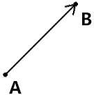

已知点A，点A 要位移到点B，那么这种行为就产生了两种点位：

- 始点：位移起始的位置，即点A。

- 终点：位移结束的位置，即点B。

点A和点B可以构成一条线段，这条线段还是有方向的，那么这样的线段就叫有向线段。

有向线段就是向量的直观形象。

- 有向线段的方向就是向量的方向。

- 有向线段的长度就是向量的长度。

向量和向量之间存在一种向量相等的关系。

向量相等的条件：两个向量同向、等长。

向量中还存在两个特殊的向量：

- 零向量：长度为零的向量  。

- 位置向量：向量终点相对于始点的位置，其直观表现就是向量的长度和方向不变，始点归零。

这里我们要简单强调一下位置向量。

因为位置向量的始点为零，所以这样的向量也可以表示一个坐标点位，这便是位置向量名字的由来。

在做多向量运算的时候，为了方便运算，常常会把所有向量统一为位置向量。如下图：

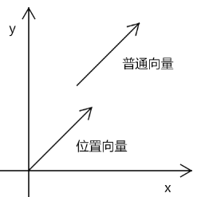

关于向量的基本概念，我们就说到这。

接下来，咱们说一下向量的运算。

## 第二章 向量的运算

在实际的项目开发中，我们还会遇到这样的问题：

- 点A向着点B的方向移动100 后的位置是什么？
- 点A向着点B的方向移动一半的距离后的位置是什么？
- 点A绕着点B旋转30°后的位置在哪里？

要解决上面的问题，就需要用到向量的运算了，向量也是可以加、减、乘、除的，只有对这些运算有了透彻的领悟，你才能更好的操控图形。

### 1-向量求和

接下来咱们直接拿例子说事。

#### 1-1-三角形解法

已知：向量a、b

求：向量a、b的和

解：在平面上任取一点A，做向量AB=a，向量BC=b

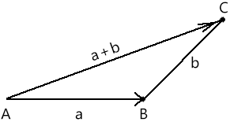

则向量a、b的和，就等于点A移动到点B，再移动到点C 后的向量AC。

我们除了可以用三角形求向量之和，也可以用平行四边形来求解。

#### 1-2-平行四边形解法

我们可以在平面上任取一点A，做向量AB=a，向量AD=b。

则向量a、b之和将等于以AB、AC 为临边的平行四边形的对角线AD。 

上面的两种解法是数学中的解法，接下来咱们说一下向量求和在实际坐标点位中的解法。

#### 1-3-坐标点位解法

已知：向量a、b

a 的始点是aS(100,200)

a 的终点是aE(200,300)

b 的始点是aS(100,300)

b 的终点是aE(400,300)

求：向量a、b的和

解：先将向量a、b 简化为位置向量

位置向量a=aE-aS=(200-100,300-200)=(100,100)

位置向量b=bE-bS=(400-100,300-300)=(300,0)

a+b=(100+300,100+0)=(400,300)

我们之前运算都是对两个向量做求和运算，那么如果是多个向量求和呢？这里就需要探索向量求和中的结合律了。

#### 1-4-结合律   

咱们先举个加法的例子。

已知：a=1，b=2，c=3

则：

a+b+c=1+2+3=6

b+a+c=2+1+3=0

a+b=b+a

上面的算法就是加法的结合律。

那么，如果我们把a、b、c 看成向量，那么是不是也可以这么算呢？其返回结果又是什么？

首先，咱们先给出答案，后面再去论证。

向量的加法也遵循加法的结合律，其返回结果是向量。

举个例子：

已知：向量a、b、c

求：a+b+c

解：

将向量a、b、c 首尾相连。

则：a+b+c 的结果就是以a 的起点为起点，以c的终点为终点的向量。

向量加法的结合律可以通过向量求和的三角解法来论证。

如下图：

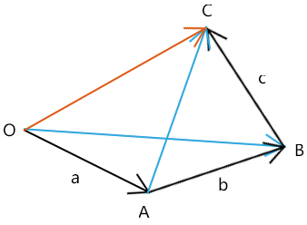

由图可知：

a+b=OB

OB+c=OC

所以：

a+b+c=OC

关于向量求和，我们就说到这，接下来咱们说一下向量减法。

### 2-向量减法

在数字的运算中减法是加法的逆运算，向量也是同样原理。

#### 2-1-向量减法求解

用栗子说事。

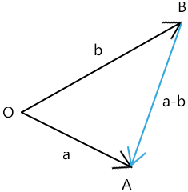

已知：向量a，b

求：a-b

解：先将这两个向量的起点拼在一起

a-b 等于以减向量b 的终点为起点，以被减向量a 的终点为终点的向量BA。

b-a 等于以减向量a 的终点为起点，以被减向量b 的终点为终点的向量AB。

向量的减法就是这么简单，接下来咱们说几个特殊的向量减法。

#### 2-2-特殊的向量减法

- 位置向量：向量终点减向量起点。比如，一个向量BA 等于它的终点相对于原点O 的位置向量OA，减去它的起点相对应原点O 的向量OB
- 反向量：向量方向相反的向量，其直观表现就是坐标分量互为相反数。如向量(x,y)的反向量就是(-x,-y)。
- 垂直向量：向量方向垂直的向量，与某一向量垂直的向量有两个，这两个向量在一条基线上，它们互为相反数。如向量(x,y) 的垂直向量有(y,x)和(-y,-x)。

对于向量的减法，咱们就说到这。

我们先对向量的加减简单总结一下。

向量的加减和图形全等、平行有有着密切联系。

比如：方向相同或相反的两条向量的基线平行；方向相同或相反，且长度一样的两条线段相等。

接下来咱们说一下，向量的乘法。

向量的乘法有两玩法，一种是让向量乘以一个数字，名曰数乘；还有一种是两个向量相乘，名曰点积、内积或向量乘积。

咱们先说数乘。

### 3-数乘

数乘和图形的相似性、缩放有着密切关联。

还是先拿栗子说事。

#### 3-1-数乘的概念

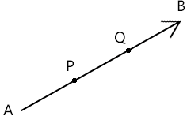

已知：向量AB，AB被3等分，分割点位P、Q

则：

AP=1/3*AB 

AQ=2/3*AB  

由此可以引出数乘的定义：

实数λ和向量a 的乘积是一个向量，记做λa

#### 3-2-数乘的特性

向量λa 的长度：|λa|=|λ|*|a|

如果|λa|=1，则λa 叫做单位向量。

a≠0 时，λa 会出现的几种情况：

- λ>0 时，λa 与a 同方向

- λ<0 时，λa 与a 反方向

- λ=0 时，λa 为零向量

向量数乘的常见规律：

- (λ+μ)a=λa+μa
- λ(μa)=(λμ)a
- λ(a+b)=λa+λb

向量的基线：向量所在的直线。

平行向量基本定理：如果a=λb，则a、b平行；反之，若a、b平行(b≠0)，则必然存在一个实数λ，使a=λb

设向量a 的单位向量为a0，由向量的数乘可知：

a=|a|*a0

a0=a/|a|

其实直角坐标系里的坐标轴也是向量，接下来咱们就用向量解释一下直角坐标系，这有助于我们将向量运算分解为坐标运算。

### 4-坐标轴上向量坐标运算

轴：规定了方向和向量长度单位的直线。

在轴l 上，给定一个向量e，在轴上取任意向量a，那必然纯在唯一实数x，使a=xe，用e 可以生成与其平行的所有向量的集合{xe|e∈R }

e：轴l 的基向量

x：a在l 上的坐标，或数量

x 的绝对值等于|a|

a与e 同向时，x 为正；反之，x 为负。

轴上两个向量相等的条件是它们的坐标相等。

两个向量和的坐标等于两个向量坐标的和。

轴上向量的坐标等于向量终点的坐标减去向量起点的坐标。

我们之前说了那么多，都是基础，挺枯燥的，接下咱们说个好玩的栗子。

## 第三章 视图变换

百度地图，大家应该都不陌生吧。我们可以对地图进行缩放、平移，并对不同区域进行选择。接下来，咱们用向量说一下这个的实现原理。

### 1-缩放

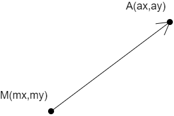

已知：

视图中一点 A(ax,ay)

鼠标在视图中的位置 M(mx,my)

项目需求：当鼠标滑动滑动滚轮时，对视图进行缩放

解：

将向量均分成3段

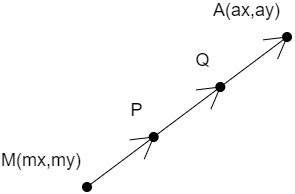

当缩小视图时，就让向量a 的长度缩小1/3，这样点P1 就会移动到点Q 的位置。

因此，我们求出点Q 的位置，然后将点P1 放到这里，就可以实现视图的缩放了。

由向量数乘公式得：

MQ=2/3*MA

将向量分解为坐标点：

MQ=(2/3\*(mx-ax),2/3\*(my-ay))

当视图放大时也是同理，我们将乘数变成4/3 即可。

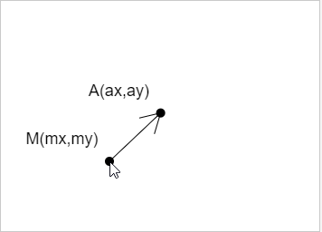

关于只有一个点的视图缩放我们就说到这，如果是多点的缩放，也是同样的道理，我就不再多说了。

我们说完缩放，大家应该还会想到平移，平移的实现，那就是向量加减了，这要比向量的缩放容易，咱们在这里还是说一下。

### 2-平移

已知：同上

项目需求：当鼠标按住滚轮移动时，对视图进行平移

设：

鼠标移动之前的点位为M1

鼠标移动之后的点位为M2

解：

鼠标每次移动时：

记录鼠标的位移向量：M1M2=M2-M1

让点A 加上鼠标的位移向量：A=A+M1M2

这时的点A 就是视图平移后的结果。

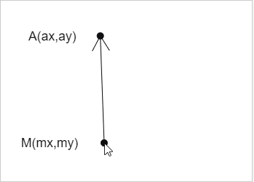

现在，我们演示了变换的缩放和位移。其实，我们还可以对视图进行旋转。

### 3-旋转

已知：点A，视口中心点O，视图旋转弧度α

项目需求：点A基于点O旋转α 弧度后的位置A2

解：

向量OA=A-O

利用反正切可得：

向量OA 的弧度β=atan(OA.y/OA.x)                                                                                                                                                                                                                                                                                                                                                                                                                                                                                                                                                                                                                                                                                                                                                                                                                                                                                                                                                                                                                                                                                                                                                                                                                                                                                                                                                                                                                                                                                                                                                                                                                                                                                                                                                                                                                                                                                                                                                                                                                                                                                                                                                                                                                                                                                                                                                                                                                                                                                                                                                                                                                                                                                                                                                                                                                                                                                                                                                                                                                                                                                                                                                                                                                                                                                          

利用勾股定理可得向量OA的长度|OA|=sqrt(OA.x\*OA.x+OA.y\*OA.y)

因此，旋转后：

向量OA  的弧度 θ=β+α

利用三角函数可得，旋转后:

向量OA 的终点A3=(cosβ\*|OA|,sinsβ\*|OA|)

A3 还得再加上一个偏移量，才是A2的位置：

A2=A3+O

最终效果如下：

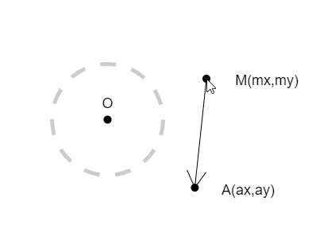

实际上，在对视图进行变换操作的时候，并没有这么简单，因为项目中往往，还会存在一个图形树的概念。

图形树就像我们的DOM 树一样，一种具备父子关系的树状结构，这是一块知识量不小，也是一块难点，咱们另起一章细说。

## 第四章 图形树的变换

### 1-楔子

举个例子：

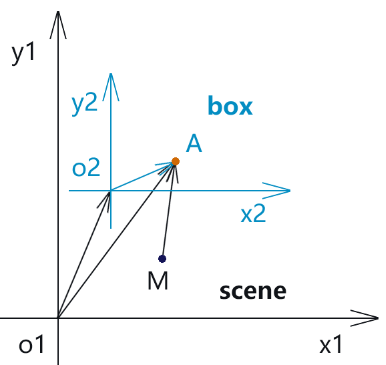

我把点A 装进了一个盒子里，我只知道点A在这个盒子B里的位置，那么我在盒子外面用鼠标变换视图时，点A 相对于鼠标的位置是什么？

我在问这个问题的时候，应该很多人都是懵的，因为我这个问题本身就不明确。

我们要计算一个点位，首先要有一个前提条件，那就是坐标系已知。

而我们在计算图形树中，两个节点里的顶点关系时，坐标系本身也变成了一个变量。

就像上面，我在问盒子B 外的鼠标点和盒子B内的点A 的相对关系时，我首先要知道这个这个相对关系要用那种坐标系来计算，也就是统一坐标系。

对于统一坐标系的方案，我们可以考虑以下几种：

1. 盒子B 内的坐标系：鼠标点需要进行坐标转化，从盒子外部转入盒子内部
2. 鼠标所在的视图坐标系：点A需要进行坐标转化，从盒子内部转入盒子外部
3. 自定义坐标系：鼠标点和点A都需要进行坐标转化，比如到转化到图形树最顶层从坐标系中

至于我们要使用哪一种方案，这需要用实践来检验和推理。

比如：把盒子B里的点A换成三角形，我们要用盒子外的鼠标选择这个三角形。

这样方案1 就比较合适，因为方案1 只需要对鼠标点进行坐标转换；方案2 会对三角形的三个顶点进行转换；方案3 会对所有点位进行转换

然而，有的时候，我们还考虑操作的便捷性。

比如：

方案1和方案2 里的坐标系都是变量，而且还是两个，分别是起始坐标系和结束坐标系，并且坐标系的转化还有方向，比如是向下转换，还是向下转化。

前两个方案，一共需要四个已知条件：目标点位、起始坐标系、结束坐标系、转换方向

而如果是方案3，我们使用图形树最顶层的坐标系，我们只需要知道要把一个点位从哪个坐标系移到顶层即可。

方案3只需要知道两个条件：目标点位、起始坐标系。

方案3无疑是操作最便捷的，性能也是最差的。

至于我们是选择操作的便捷性，还是选择性能，这还得看我们自己的取舍，以及具体情况，具体对待。

整理一下上面的内容，我们详细说一下顶点穿梭图形树的基本原理。

### 1-顶点穿梭图形树的基本原理

已知：

视图scene 为最外层坐标系

鼠标点M 在视图scene 中

盒子box 在视图scene 中

点A(ax,ay) 在box 中

求：当鼠标变换视图scene 时，点A也进行同步变换，效果如下：

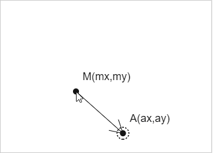

解：

坐标系变换的形态有三种：位移、旋转、缩放。

暂且不考虑旋转和缩放，假设box 只进行了位移变换。

1. 将点A向上变换，从box 坐标系变换到scene 坐标系

   向量o1A=o1o2+o2A

2. 鼠标操作视图时，因为鼠标点M 和o1A同级，所以，可以基于鼠标的变换信息，让向量o1A 的终点随鼠标变换。

3. 在上面，大家要注意向量o1A 的终点和向量o2A  的终点是两个不一样的A，一个是A在scene 坐标系的点位，一个是A在 box 坐标系的点位。

4. 向量o1A的终点可以理解为盒子内的点A 的虚拟代理，它只是用于点位计算。

5. 当鼠标改变了向量o1A的终点位置后，我们就可以把这个点放进盒子里，也就是对o1A 进行逆向变换，将逆向变换结果赋值给box 里的点A 。

   o2A=o1A-o1o2

由上可知，这就是一个简单的把大象从冰箱拿出来又放进去的问题，用到的也只是一个向量的加减法。

接下来咱们把变换里的旋转和缩放加到上面的例子中。

### 2-顶点穿梭多重变换的图形树

#### 2-1-图形变换的顺序

在这里，首先要对多重变换有一个顺序的概念，因为一个图形先旋转再位移和先位移再旋转是不一样的。

也就是说，一个图形先旋转再位移和先位移再旋转是不一样的。

我这么说，大家看了应该是会迷惑的，因为这个图形的还缺少一个坐标系的定义。

比如，还是之前的已知条件，咱们拿box 说事。。

已知：

点A在盒子B里，盒子B在场景scene 中。

设盒子B在scene 中的点位为o2。

场景scene 的原点为o1。

box 内部有自己的坐标系，当box 在scene 坐标系中变换的时候，变换的是box 自身坐标系在scene中的基点位置、旋转角度和大小，点A在box 坐标系中的位置位置数据不会改变。

box 在scene 中的变换行为，可以理解为对向量o1o2 的操作，o1 是scene 的坐标基点，o2 是box 的坐标基点。

我们对box 的不同变换，会改变box坐标系的不同状态：

- 位移：对向量o1o2中的终点o2 的移动，会改变box 坐标系的位置
- 旋转：对向量o1o2的旋转，会改变box 坐标系的位置和旋转角度
- 缩放：对向量o1o2的长度的改变，会改变box 坐标系的位置

在以上三种变换里：

一般，缩放都是基于向量总长度的百分比缩放。

不考虑向量o1o2为零向量的情况。

位移、缩放、缩放的执行顺序不同，变换结果不同。

旋转和缩放的执行顺序不同，变换结果不同；

旋转和位移的执行顺序不同，变换结果不同；

我们举几个例子看看：

对box 坐标系位移200，放大2倍。

对box 坐标系放大2倍，位移200。

对box 坐标系旋转45°，放大2倍。

未完待续，备课中……

