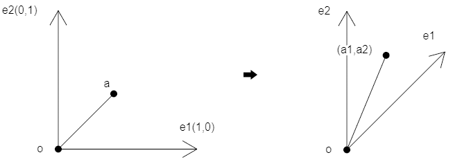
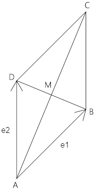
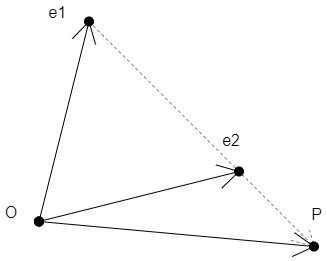

## 第一章 向量在二维坐标系里的姿态

### 1-平面向量基本定理

平面内任何向量都能用两个不平行向量表示。

设：

- 平面内存在一个向量a
- 平面内存在e1、e2 两个不平行的向量

那么：

- 该平面内存在唯一一对实数a1、a2，使：a=a1e1+a2e2

### 2-平面向量的特性

在a=a1e1+a2e2 中：

 e1,e2 ：二维坐标系里的两个基底，记做{e1,e2}。 

a1e1+a2e2 ：向量a关于基底{e1,e2} 的分解式。

当e1,e2垂直时，如e1(0,1)、e2(1,0) ，其对应的坐标系就是直角坐标系。

以此原理，我们可以建立两个坐标系的概念。

- 点a在二维直角坐标系中。

- (a1,a2) 可以视之为一个点位，它处于以{e1,e2} 为基底的坐标系中。

  

我们可以举个例子，加深一下理解。

### 3-示例

已知：

- 平行四边形ABCD
- 向量AB=e1
- 向量AD=e2

求：向量AM

解：

AC=AB+AD=e1+e2

DB=AB-AD

AM=AC/2

AM=(e1+e2)/2

AM=e1/2+e2/2

利用向量的基本定理我们还可以推导出一个向量的参数表达式。

### 4-向量的参数方程式

向量的参数方程式：

OP=(1-t)\*OA+t\*OB  ①

上式中，t 叫做参变量，简称参数。

由 ① 变换可得：

OP=OA-t\*OA+t\*OB

OP=OA+(OB-OA)*t ②

这个方程式，实际上就是二分法，我们用它可以做缓动跟随。

比如，求e1点向e2点移动e1e2长度的t 倍后的点位P，P 就等于 (1-t)\*OA+t\*OB

我们可以论证一下上例：

e1P=t(e1e2)=t(e2-e1)

OP=e1+e1P

​	=e1+t(e2-e1)

​	=e1+te2-te1

​	=(1-t)*e1+te2

未完待续……

